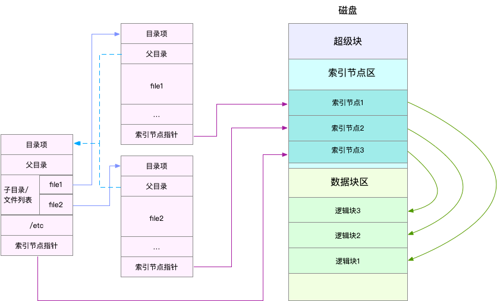
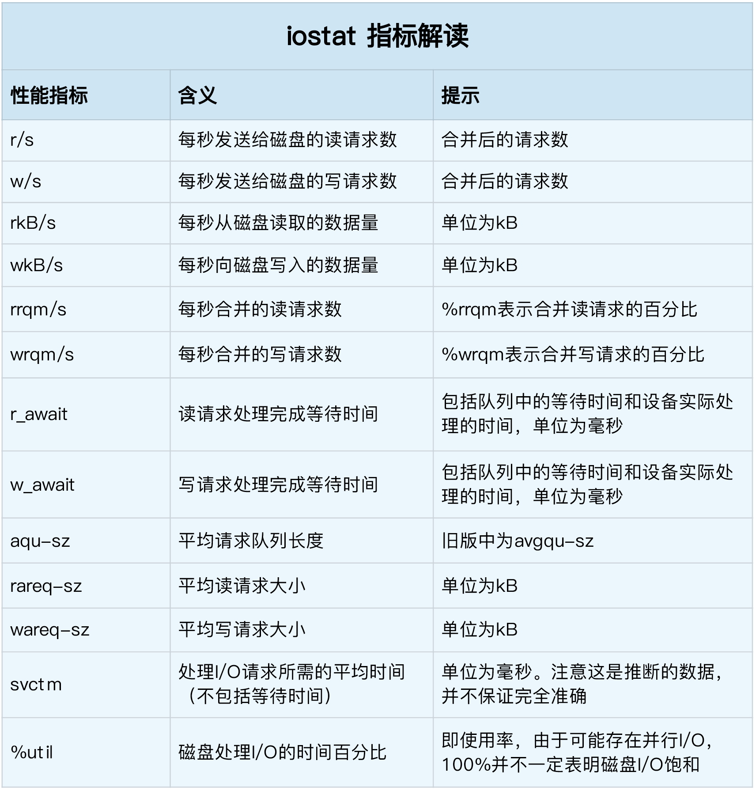

<!-- START doctoc generated TOC please keep comment here to allow auto update -->
<!-- DON'T EDIT THIS SECTION, INSTEAD RE-RUN doctoc TO UPDATE -->
**Table of Contents**  *generated with [DocToc](https://github.com/thlorenz/doctoc)*

- [Linux的文件系统](#linux%E7%9A%84%E6%96%87%E4%BB%B6%E7%B3%BB%E7%BB%9F)
  - [文件系统的特点](#%E6%96%87%E4%BB%B6%E7%B3%BB%E7%BB%9F%E7%9A%84%E7%89%B9%E7%82%B9)
  - [I/O输入输出分类](#io%E8%BE%93%E5%85%A5%E8%BE%93%E5%87%BA%E5%88%86%E7%B1%BB)
  - [文件的I/O操作](#%E6%96%87%E4%BB%B6%E7%9A%84io%E6%93%8D%E4%BD%9C)
  - [整个 Unix 体系结构](#%E6%95%B4%E4%B8%AA-unix-%E4%BD%93%E7%B3%BB%E7%BB%93%E6%9E%84)
  - [fd文件描述符](#fd%E6%96%87%E4%BB%B6%E6%8F%8F%E8%BF%B0%E7%AC%A6)
  - [标准库中对IO封装](#%E6%A0%87%E5%87%86%E5%BA%93%E4%B8%AD%E5%AF%B9io%E5%B0%81%E8%A3%85)
    - [IO 接口描述（语义）](#io-%E6%8E%A5%E5%8F%A3%E6%8F%8F%E8%BF%B0%E8%AF%AD%E4%B9%89)
    - [分类](#%E5%88%86%E7%B1%BB)
  - [磁盘性能指标](#%E7%A3%81%E7%9B%98%E6%80%A7%E8%83%BD%E6%8C%87%E6%A0%87)
    - [磁盘 I/O 观测](#%E7%A3%81%E7%9B%98-io-%E8%A7%82%E6%B5%8B)
    - [进程 I/O 观测](#%E8%BF%9B%E7%A8%8B-io-%E8%A7%82%E6%B5%8B)
  - [源码分析](#%E6%BA%90%E7%A0%81%E5%88%86%E6%9E%90)
    - [数据结构](#%E6%95%B0%E6%8D%AE%E7%BB%93%E6%9E%84)

<!-- END doctoc generated TOC please keep comment here to allow auto update -->

# Linux的文件系统


文件系统，本身是对存储设备上的文件，进行组织管理的机制。组织方式不同，就会形成不同的文件系统

Linux 文件系统为每个文件都分配两个数据结构，索引节点（index node）和目录项（directory entry）。它们主要用来记录文件的元信息和目录结构

- 索引节点，简称为 inode，用来记录文件的元数据，比如 inode 编号、文件大小、访问权限、修改日期、数据的位置等。索引节点和文件一一对应，它跟文件内容一样，都会被持久化存储到磁盘中。所以记住，索引节点同样占用磁盘空间
- 目录项，简称为 dentry，用来记录文件的名字、索引节点指针以及与其他目录项的关联关系。多个关联的目录项，就构成了文件系统的目录结构。不过，不同于索引节点，目录项是由内核维护的一个内存数据结构，所以通常也被叫做目录项缓存。

索引节点是每个文件的唯一标志，而目录项维护的正是文件系统的树状结构。目录项和索引节点的关系是多对一，你可以简单理解为，一个文件可以有多个别名。

举个例子，通过硬链接为文件创建的别名，就会对应不同的目录项，不过这些目录项本质上还是链接同一个文件，所以，它们的索引节点相同



## 文件系统的特点
1. 文件系统要有严格的组织形式，使得文件能够以块为单位进行存储。

2. 文件系统中也要有索引区，用来方便查找一个文件分成的多个块都存放在了什么位置。

3. 如果文件系统中有的文件是热点文件，近期经常被读取和写入，文件系统应该有缓存层。

4. 文件应该用文件夹的形式组织起来，方便管理和查询。

5. Linux内核要在自己的内存里面维护一套数据结构，来保存哪些文件被哪些进程打开和使用。


## I/O输入输出分类
IO 分为网络和存储 IO 两种类型（其实网络 IO 和磁盘 IO 在 Go 里面有着根本性区别 ）
1. 网络 IO 对应的是网络数据传输过程，网络是分布式系统的基石，通过网络把离散的物理节点连接起来，形成一个有机的系统
2. 存储 IO 对应的就是数据存储到物理介质的过程，通常我们物理介质对应的是磁盘，磁盘上一般会分个区，然后在上面格式化个文件系统出来

其实适合 Go 的程序类型准确的来讲是：网络 IO 密集型的程序。

其中差异就在于：
- 网络 fd 可以用 epoll 池来管理事件，实现异步 IO；
- 文件 fd 不能用 epoll 池来管理事件，只能同步 IO；

题外话：文件要实现异步 IO 当前在 Linux 下有两种方式：

- Linux 系统提供的 AIO ：但 Go 没封装实现，因为这个有不少坑；
- Linux 系统提供的 io_uring ：但内核版本要求高，线上没普及；  
一句话，Go 语言级别把网络 IO 做了异步化，但是文件 IO 还是同步的调用。

在 Golang 里可以归类出两种读写文件的方式：

- 标准库封装：操作对象 File;
- 系统调用 ：操作对象 fd;

## 文件的I/O操作
根据是否使用内存做缓存，我们可以把文件的I/O操作分为两种类型。

第一种类型是缓存I/O。大多数文件系统的默认I/O操作都是缓存I/O。对于读操作来讲，操作系统会先检查，内核的缓冲区有没有需要的数据。如果已经缓存了，那就直接从缓存中返回；否则从磁盘中读取，然后缓存在操作系统的缓存中。对于写操作来讲，操作系统会先将数据从用户空间复制到内核空间的缓存中。这时对用户程序来说，写操作就已经完成。至于什么时候再写到磁盘中由操作系统决定，除非显式地调用了sync同步命令。

第二种类型是直接IO，就是应用程序直接访问磁盘数据，而不经过内核缓冲区，从而减少了在内核缓存和用户程序之间数据复制。

```C
ssize_t
generic_file_read_iter(struct kiocb *iocb, struct iov_iter *iter)
{
......
    if (iocb->ki_flags & IOCB_DIRECT) {
......
        struct address_space *mapping = file->f_mapping;
......
        retval = mapping->a_ops->direct_IO(iocb, iter);
    }
......
    retval = generic_file_buffered_read(iocb, iter, retval);
}

ssize_t __generic_file_write_iter(struct kiocb *iocb, struct iov_iter *from)
{
......
    if (iocb->ki_flags & IOCB_DIRECT) {
......
        written = generic_file_direct_write(iocb, from);
......
    } else {
......
        written = generic_perform_write(file, from, iocb->ki_pos);
......
    }
}
```
如果在写的逻辑__generic_file_write_iter里面，发现设置了IOCB_DIRECT，则调用generic_file_direct_write，
里面同样会调用address_space的direct_IO的函数， 将数据直接写入硬盘

## 整个 Unix 体系结构


* 内核是最核心的实现，包括了和 IO 设备，硬件交互等功能。与内核紧密的一层是内核提供给外部调用的系统调用，系统调用提供了用户态到内核态调用的一个通道；

* 对于系统调用，各个语言的标准库会有一些封装，比如 C 语言的 libc 库，Go 语言的 os ，syscall 库都是类似的地位，这个就是所谓的公共库。
这层封装的作用最主要是简化普通程序员使用效率，并且屏蔽系统细节，为跨平台提供基础（同样的，为了跨平台的特性，可能会阉割很多不兼容的功能，所以才会有直接调用系统掉调用的需求）；

* 当然，我们右上角还看到一个缺口，应用程序除了可以使用公共函数库，其实是可以直接调用系统调用的，但是由此带来的复杂性又应用自己承担。这种需求也是很常见的，
标准库封装了通用的东西，同样割舍了很多系统调用的功能，这种情况下，只能通过系统调用来获取;
  
## fd文件描述符
文件描述符File descriptor是一个非负整数，本质上是一个索引值（这句话非常重要）。

什么时候拿到的 fd ？

当打开一个文件时，内核向进程返回一个文件描述符（ open 系统调用得到 ），后续 read、write 这个文件时，则只需要用这个文件描述符来标识该文件，将其作为参数传入 read、write 。
fd 的值范围是什么？

在 POSIX 语义中，0，1，2 这三个 fd 值已经被赋予特殊含义，分别是标准输入（ STDIN_FILENO ），标准输出（ STDOUT_FILENO ），标准错误（ STDERR_FILENO ）。
ulimit 命令查看当前系统的配置文件描述符

```shell
ulimit -n
#我的mac os系统上进程默认最多打开 256 文件
```
## 标准库中对IO封装


- io：基础的IO库，提供了Reader和Writer接口。其中的os包、net包、string包、bytes包以及bufio包都实现了io中的Reader或Writer接口。
- os：提供了访问底层操作系统资源的能力，如文件读写、进程控制等。
- net：提供了网络相关的IO功能，如TCP、UDP通信、HTTP请求等。
- string.Reader：提供了string的读取。因为string不能写，所以只有Reader。
- bytes.Buffer和Reader：提供了对字节内容的读写。
- bufio：提供带缓存的I/O操作，解决频繁、少量读取场景下的性能问题。这里利用了计算机的局部性原理。
- ioutil：提供了一些方便的文件读写函数，如ReadFile和WriteFile


操作选择：
- 如果只是简单的文件读写，可以使用ioutil库；
- 如果需要处理大量数据，则应该选择bufio库；
- 如果需要访问底层操作系统功能，则可以使用os库；
- 如果涉及到网络通信，则选择net库

###  IO 接口描述（语义）
包括四个接口: Reader/Writer/Closer/Seeker,分别对应io的读写关闭和偏移.
1. Reader
```go
type Reader interface {
	
    Read(p []byte) (n int, err error)
}

```
Read方法说明:

- 读数据到切片p,长度最多是len(p)
   - 返回值是具体读到的字节数,或任何错误
   - 如果要读的数据长度不足len(p),会返回实际长度，不会等待


- 不管是读中出错,还是遇到文件尾,第一个返回值n会返回实际已读字节数
   - 对于第二个返回值err就有些不同了
      - 可能会返回EOF,也可能返回non-nil
      - 再次调用Read的返回值是确定的: 0,EOF

- 调用者正确的处理返回值姿势应该是这样的
   - 先判断n是否大于0,再判断err
   
- 对于实现
   - 除非len(p)是0,否则不推荐返回 0,nil
   - 因为0,nil表示什么都没发生
   - 实际处理中，EOF就是EOF，不能用0,nil来代替

Note：额外说明,Read方法的参数是切片,是引用,所以是可以在内部修改值的. 当然是有前提的:实现类型的指针方法集匹配Reader. 值方法集实现Reader接口是没有意义的

2. Writer 
```go
type Writer interface {
    Write(p []byte) (n int, err error)
}
```
- 将切片数据p写道相关的流中,写的字节数是len(p)
   - 返回值n表示实际写的字节数，如果n小于len(p),err就是non-nil
- 方法是不会改变切片p的数据，临时性的也不行
- 在实现上
   - 要确保不会修改切片p

Note: 额外说明,对Writer的实现,最好是通过值方法集来匹配, 如果非要用指针方法集来匹配,那就一定要注意不能修改切片数据


3. Closer接口
```go
type Closer interface {
  Close() error
}

```

4. Seeker接口
```go
type Seeker interface {
  Seek(offset int64, whence int) (int64, error)
}
```
- 这个偏移是针对下次读或下次写
- 参数offset和whence确定了具体的偏移地址
   - whence定义了三个值(SeekStart/SeekCurrent/SeekEnd)
   - 第一个返回值是基于文档头的偏移量

### 分类
io 库的内容，如果按照接口的定义维度大致可以分为 3 大类：
1. 基础类型
   - Reader、Writer、Closer、ReaderAt、WriterAt、Seeker、ByteReader、ByteWriter、RuneReader、StringWriter
2. 组合类型
   - ReaderCloser、WriteCloser、WriteSeeker
```go
type ReadWriter interface {
    Reader
    Writer
}
```
3. 进阶类型
   - TeeReader: 这是一个分流器的实现，如果把数据比作一个水流，那么通过 TeeReader 之后，将会分叉出一个新的数据流
   - LimitReader: 则是给 Reader 加了一个边界期限
   - MultiReader:则是把多个数据流合成一股
   - SectionReader、MultiWriter、PipeReader、PipeWriter 等
   
## 磁盘性能指标
- 使用率，是指磁盘处理 I/O 的时间百分比。过高的使用率（比如超过 80%），通常意味着磁盘 I/O 存在性能瓶颈。
- 饱和度，是指磁盘处理 I/O 的繁忙程度。过高的饱和度，意味着磁盘存在严重的性能瓶颈。当饱和度为 100% 时，磁盘无法接受新的 I/O 请求。
- IOPS（Input/Output Per Second），是指每秒的 I/O 请求数。
- 吞吐量，是指每秒的 I/O 请求大小。
- 响应时间，是指 I/O 请求从发出到收到响应的间隔时间

举个例子，在数据库、大量小文件等这类随机读写比较多的场景中，IOPS 更能反映系统的整体性能；而在多媒体等顺序读写较多的场景中，吞吐量才更能反映系统的整体性能

### 磁盘 I/O 观测

iostat 是最常用的磁盘 I/O 性能观测工具，它提供了每个磁盘的使用率、IOPS、吞吐量等各种常见的性能指标，当然，这些指标实际上来自 /proc/diskstats。

```shell
root@VM-16-12-ubuntu:~# iostat -d -x 1 
Linux 5.4.0-121-generic (VM-16-12-ubuntu)       10/12/2022      _x86_64_        (2 CPU)

Device            r/s     rkB/s   rrqm/s  %rrqm r_await rareq-sz     w/s     wkB/s   wrqm/s  %wrqm w_await wareq-sz     d/s     dkB/s   drqm/s  %drqm d_await dareq-sz  aqu-sz  %util
scd0             0.00      0.00     0.00   0.00    0.30    35.09    0.00      0.00     0.00   0.00    0.00     0.00    0.00      0.00     0.00   0.00    0.00     0.00    0.00   0.00
vda             98.34   6907.69    16.96  14.71    7.94    70.24    5.29     67.09     5.29  49.99    3.55    12.68    0.00      0.00     0.00   0.00    0.00     0.00    0.60   6.71


Device            r/s     rkB/s   rrqm/s  %rrqm r_await rareq-sz     w/s     wkB/s   wrqm/s  %wrqm w_await wareq-sz     d/s     dkB/s   drqm/s  %drqm d_await dareq-sz  aqu-sz  %util
scd0             0.00      0.00     0.00   0.00    0.00     0.00    0.00      0.00     0.00   0.00    0.00     0.00    0.00      0.00     0.00   0.00    0.00     0.00    0.00   0.00
vda              0.00      0.00     0.00   0.00    0.00     0.00    2.00     60.00    13.00  86.67    1.50    30.00    0.00      0.00     0.00   0.00    0.00     0.00    0.00   0.80
```


- %util ，就是我们前面提到的磁盘 I/O 使用率；
- r/s+ w/s ，就是 IOPS；
- rkB/s+wkB/s ，就是吞吐量；
- r_await+w_await ，就是响应时间。


### 进程 I/O 观测

iostat 只提供磁盘整体的 I/O 性能数据，缺点在于，并不能知道具体是哪些进程在进行磁盘读写。要观察进程的 I/O 情况，你还可以使用 pidstat 和 iotop 这两个工具


```shell
root@VM-16-12-ubuntu:~# iotop
Total DISK READ:         0.00 B/s | Total DISK WRITE:        79.93 K/s
Current DISK READ:       0.00 B/s | Current DISK WRITE:      61.76 K/s
    TID  PRIO  USER     DISK READ  DISK WRITE  SWAPIN     IO>    COMMAND                                                                                                                                                        
    288 be/3 root        0.00 B/s   50.86 K/s  0.00 %  0.35 % [jbd2/vda2-8]
 300605 be/4 root        0.00 B/s    0.00 B/s  0.00 %  0.02 % [kworker/u4:0-events_power_efficient]
 137648 be/4 root        0.00 B/s   10.90 K/s  0.00 %  0.00 % dockerd -H fd:// --containerd=/run/containerd/containerd.sock
 137937 be/4 root        0.00 B/s    7.27 K/s  0.00 %  0.00 % dockerd -H fd:// --containerd=/run/containerd/containerd.sock
```


## 源码分析

### 数据结构
```go
// /Users/python/go/go1.16/src/os/types.go
// File represents an open file descriptor.
type File struct {
    *file // os specific
}
```
```go
// /Users/python/go/go1.16/src/os/file_unix.go
type file struct {
	pfd         poll.FD  // 文件描述符
	name        string
	dirinfo     *dirInfo // nil unless directory being read
	nonblock    bool     // whether we set nonblocking mode
	stdoutOrErr bool     // whether this is stdout or stderr
	appendMode  bool     // whether file is opened for appending
}
```
```go
type FD struct {
	// Lock sysfd and serialize access to Read and Write methods.
	fdmu fdMutex

	// 系统文件描述符，不可变直到关闭
	Sysfd int

	// I/O poller.
	pd pollDesc

	// Writev cache.
	iovecs *[]syscall.Iovec

	// Semaphore signaled when file is closed.
	csema uint32

	// Non-zero if this file has been set to blocking mode.
	isBlocking uint32

	// Whether this is a streaming descriptor, as opposed to a
	// packet-based descriptor like a UDP socket. Immutable.
	IsStream bool

	// Whether a zero byte read indicates EOF. This is false for a
	// message based socket connection.
	ZeroReadIsEOF bool

	// Whether this is a file rather than a network socket.
	isFile bool
}
```