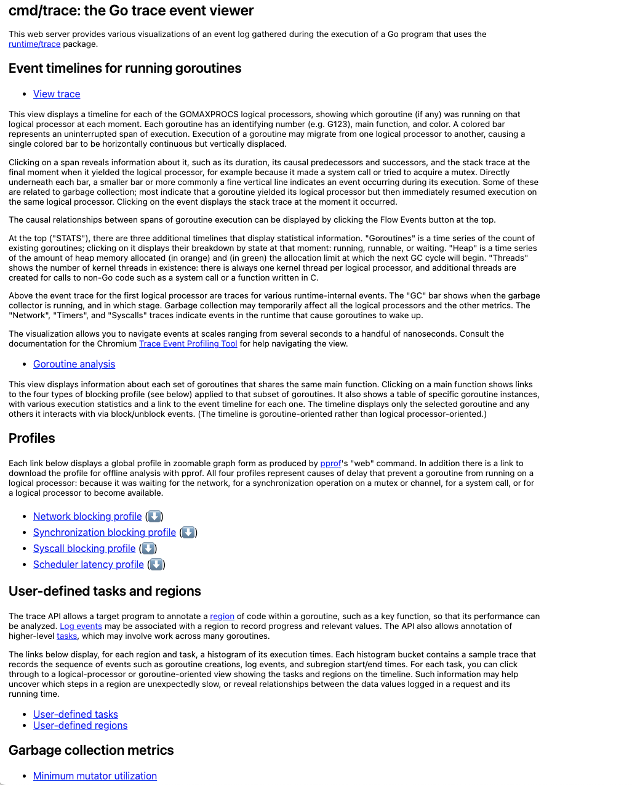
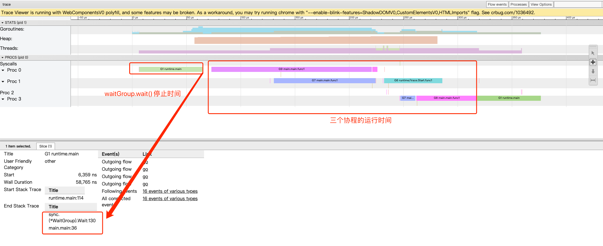
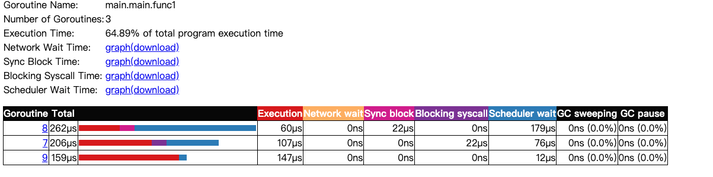

<!-- START doctoc generated TOC please keep comment here to allow auto update -->
<!-- DON'T EDIT THIS SECTION, INSTEAD RE-RUN doctoc TO UPDATE -->
**Table of Contents**  *generated with [DocToc](https://github.com/thlorenz/doctoc)*

- [Trace 可视化分析goroutine的调度](#trace-%E5%8F%AF%E8%A7%86%E5%8C%96%E5%88%86%E6%9E%90goroutine%E7%9A%84%E8%B0%83%E5%BA%A6)
  - [2种方式查看一个程序的GMP的数据](#2%E7%A7%8D%E6%96%B9%E5%BC%8F%E6%9F%A5%E7%9C%8B%E4%B8%80%E4%B8%AA%E7%A8%8B%E5%BA%8F%E7%9A%84gmp%E7%9A%84%E6%95%B0%E6%8D%AE)
  - [网页方式运行](#%E7%BD%91%E9%A1%B5%E6%96%B9%E5%BC%8F%E8%BF%90%E8%A1%8C)
    - [view trace](#view-trace)
    - [Goroutine analysis](#goroutine-analysis)

<!-- END doctoc generated TOC please keep comment here to allow auto update -->

# Trace 可视化分析goroutine的调度

## 2种方式查看一个程序的GMP的数据

方式1：go tool trace

方式2：Debug trace

## 网页方式运行

第一行View trace（可视化整个程序的调度流程）和第二行Goroutine analysis。

### view trace

[分析疑惑的调度变量案例: 三个goroutine中获取的url都是指向的最后一次for循环的url](trace.go)

当主goroutine中的for循环逻辑已经走完并阻塞于wg.Wait（）一段时间后，go func的goroutine才启动准备（准备资源，挂载M线程等）完毕。
那么，此时三个goroutine中获取的url都是指向的最后一次for循环的url。.

### Goroutine analysis

- Goroutines:
- main.main.func1 N=3     
- runtime.main N=1
- runtime/trace.Start.func1 N=1
- N=4

解析： 程序一共有5个goroutine，分别是三个for循环里启动的匿名go func()、一个trace.Start.func1和runtime.main。

