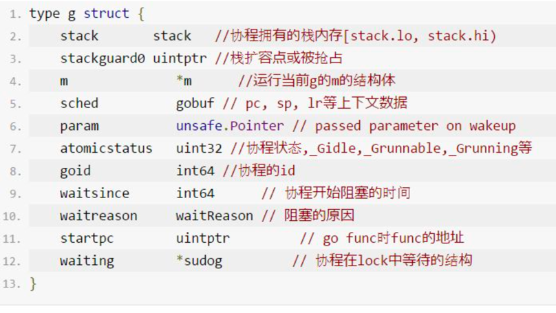

# 线程模型

线程是处理器调度和分配的基本单位，进程则作为资源拥有的基本单位。

操作系统调度器会将系统中的多个线程按照一定算法调度到物理CPU上去运行。
虽然线程比较轻量，但是在调度时也有比较大的额外开销。每个线程会都占用 1M 以上的内存空间，线程切换和恢复寄存器中的内容也需要向系统申请资源。

## 一. 体系架构
操作系统根据资源访问权限的不同，体系架构可分为用户空间和内核空间；
1. 内核空间主要操作访问CPU资源、I/O资源、内存资源等硬件资源，为上层应用程序提供最基本的基础资源，
2. 用户空间就是上层应用程序的固定活动空间，用户空间不可以直接访问资源，必须通过“系统调用”、“库函数”或“Shell脚本”来调用内核空间提供的资源。

## 二. 线程

所谓的“线程”，往往是用户态的线程user space，和操作系统本身内核态的线程（简称KSE)kernel space不一样。
	
协程跟线程是有区别的，线程由CPU调度是抢占式的，协程由用户态调度是协作式的

## 三. 线程模型分类：

用户级线程模型、内核级线程模型和两级线程模型

### 1. 内核级线程模型

大部分编程语言的线程库(如linux的pthread，Java的java.lang.Thread，C++11的std::thread等等),都是对操作系统的线程（内核级线程）的一层封装，创建出来的每个线程与一个不同的KSE静态关联.

优点：
简单，直接借助OS提供的线程能力，并且不同用户线程之间一般也不会相互影响.
在多核处理器的硬件的支持下，内核空间线程模型支持了真正的并行，当一个线程被阻塞后，允许另一个线程继续执行，所以并发能力较强

缺点：
但其创建，销毁以及多个线程之间的上下文切换等操作都是直接由OS层面亲自来做，在需要使用大量线程的场景下对OS的性能影响会很大


### 2. 用户级线程模型

优点： 这种模型的好处是线程上下文切换都发生在用户空间，避免的模态切换（mode switch），从而对于性能有积极的影响

缺点：所有的线程基于一个内核调度实体即内核线程，这意味着只有一个处理器可以被利用，
    在多处理器环境下这是不能够被接受的，本质上，用户线程只解决了并发问题，但是没有解决并行问题。
    如果线程因为 I/O 操作陷入了内核态，内核态线程阻塞等待 I/O 数据，则所有的线程都将会被阻塞，
    用户空间也可以使用非阻塞而 I/O，但是不能避免性能及复杂度问题.

### 3. 两级线程模型

#### GM模型
早期(Go1.0)的实现中并没有P的概念：Go中的调度器直接将G分配到合适的M上运行


问题：不同的G在不同的M上并发运行时可能都需向系统申请资源（如堆内存），由于资源是全局的，将会由于资源竞争造成很多系统性能损耗

解决：后面的Go（Go1.1）运行时系统加入了P，让P去管理G对象，M要想运行G必须先与一个P绑定，然后才能运行该P管理的G。
    P对象中预先申请一些系统资源（本地资源），G需要的时候先向自己的本地P申请（无需锁保护），
    如果不够用或没有再向全局申请，而且从全局拿的时候会多拿一部分，以供后面高效的使用。
    就像现在我们去政府办事情一样，先去本地政府看能搞定不，如果搞不定再去中央，从而提供办事效率。

#### GPM模型


Go语言中支撑整个scheduler实现的主要有4个重要结构，分别是M、G、P、Sched， 前三个定义在runtime.h中，Sched定义在proc.c中

1. Sched结构就是调度器，它维护有存储M和G的队列以及调度器的一些状态信息等
2. M结构是Machine，系统线程，它由操作系统管理的，goroutine就是跑在M之上的；
    M是一个很大的结构，M 结构体对象除了记录着工作线程的诸如栈的起止位置、当前正在执行的Goroutine 以及是否空闲等等状态信息之外，还通过指针维持着与 P 结构体的实例对象之间的绑定关系。
3. P结构代表一个虚拟的 Processor 处理器，它的主要用途就是用来执行goroutine的，它维护了一个goroutine队列，即runqueue。
    Processor是让我们从N:1调度到M:N调度的重要部分. 也是 context，保存 goroutine 运行所需要的上下文
4. G是goroutine实现的核心结构，主要保存 goroutine 的一些状态信息以及 CPU 的一些寄存器的值，
    例如 IP 寄存器，以便在轮到本 goroutine 执行时，CPU 知道要从哪一条指令处开始执行。

##### 特点

当G因为网络或者锁切换, 那么G和M分离, M通过调度执行新的G.

当M因为系统调用阻塞或cgo运行一段时间后, sysmon协程会将P与M分离. 由其他的M来结合P进行调度.


## 四. goroutine切换
golang调度的职责就是为需要执行的Go代码(G)寻找执行者(M)以及执行的准许和资源(P). 并没有一个调度器的实体, 调度是需要发生调度时由m执行runtime.schedule方法进行的.

调度在计算机中是分配工作所需资源的方法. linux的调度为CPU找到可运行的线程. 而Go的调度是为M(线程)找到P(内存, 执行 票据)和可运行的G.


goroutine在go代码中无处不在，go程序会根据不同的情况去调度不同的goroutine，一个goroutine在某个时刻要么在运行，要么在等待，或者死亡
goroutine的切换一般会在以下几种情况下发生：

1. 基于信号抢占式的调度，一个goroutine如果运行很长，会被踢掉
2. 发生系统调用，系统调用会陷入内核，开销不小，暂时解除当前goroutine
3. channel阻塞，当从channel读不到或者写不进的时候，会切换goroutine

### 调度流程

如果有分配到gc mark的工作需要做gc mark. local runq有就运行local的, 没有再看全局的runq是否有, 再看能否从net中poll出来, 从其他P steal一部分过来. 
实在没有就stopm。

## 五. sysmon协程
P的数量影响了同时运行go代码的协程数. 如果P被占用很久, 就会影响调度. sysmon协程的一个功能就是进行抢占.

sysmon协程是在go runtime初始化之后, 执行用户编写的代码之前, 由runtime启动的不与任何P绑定, 直接由一个M执行的协程. 类似于 linux中的执行一些系统任务的内核线程.

可认为是10ms执行一次. (初始运行间隔为20us, sysmon运行1ms后逐渐翻倍, 最终每10ms运行一次. 如果有发生过抢占成功, 则又恢复成 初始20us的运行间隔, 如此循环)

## 六. 管理员-g0

go程序中，每个M都会绑定一个叫g0的初代goroutine，它在M的创建的时候创建，g0的主要工作就是goroutine的调度、垃圾回收等。
g0和我们常规的goroutine的任务不同，g0的栈是在主线程栈上分配的，并且它的栈空间有64k，m0是runtime创建第一个线程，然后m0关联一个本地的p，
就可以运行g0了。在g0的栈上不断的调度goroutine来执行，当有新的goroutine关联p准备运行发现没有m的时候，就会去创建一个m，m再关联一个g0，
g0再去调度.

## 七. Go语言基于信号抢占式调度

在 Go 的 1.14 版本之前抢占试调度都是基于协作的，需要自己主动的让出执行，但是这样是无法处理一些无法被抢占的边缘情况。
例如：for 循环或者垃圾回收长时间占用线程，这些问题中的一部分直到 1.14 才被基于信号的抢占式调度解决。

## 八. G_M_P 源码分析
### G
当 goroutine 被调离 CPU 时，调度器负责把 CPU 寄存器的值保存在 g 对象的成员变量之中。
当 goroutine 被调度起来运行时，调度器又负责把 g 对象的成员变量所保存的寄存器值恢复到 CPU 的寄存器。

G的几种状态
```go
const (
	// G status
	
	// 刚刚被分配, 还没有初始化
	_Gidle = iota // 0

	//  表示在runqueue上, 还没有被运行，没有栈的所有权，存储在运行队列中
	_Grunnable // 1

	//  go协程可能在执行go代码, 不在runqueue上, 拥有栈的所有权，被赋予了内核线程 M 和处理器 P
	_Grunning // 2

	//  go协程在执行系统调用, 没执行go代码, 没有在runqueue上, 拥有栈的所有权,只与M绑定
	_Gsyscall // 3

	// go协程被阻塞(IO, GC, chan阻塞, 锁等). 不在runqueue上, 但是一定在某个地 方, 比如channel中, 锁排队中等.
	_Gwaiting // 4

	// _Gmoribund_unused is currently unused, but hardcoded in gdb
	// scripts.
	_Gmoribund_unused // 5

	//  协程现在没有在使用, 也许执行完, 或者在free list中, 或者正在被初始化. 可能 有stack或者没有
	_Gdead // 6

	// _Genqueue_unused is currently unused.
	_Genqueue_unused // 7

	//  栈正在复制, 此时没有go代码, 也不在runqueue上
	_Gcopystack // 8

	// _Gpreempted means this goroutine stopped itself for a
	// suspendG preemption. It is like _Gwaiting, but nothing is
	// yet responsible for ready()ing it. Some suspendG must CAS
	// the status to _Gwaiting to take responsibility for
	// ready()ing this G.
	_Gpreempted // 9

    // 与runnable, running, syscall, waiting等状态结合, 表示GC正在扫描这个G的 栈,没有执行代码
	_Gscan          = 0x1000
	_Gscanrunnable  = _Gscan + _Grunnable  // 0x1001
	_Gscanrunning   = _Gscan + _Grunning   // 0x1002
	_Gscansyscall   = _Gscan + _Gsyscall   // 0x1003
	_Gscanwaiting   = _Gscan + _Gwaiting   // 0x1004
	_Gscanpreempted = _Gscan + _Gpreempted // 0x1009
)
```
际上只需要关注下面几种就好了：

- 等待中：_ Gwaiting、_Gsyscall 和 _Gpreempted，这几个状态表示G没有在执行；
- 可运行：_Grunnable，表示G已经准备就绪，
- 运行中：_Grunning，表示G正在运行；


G结构体


```go
// runtime/runtime2.go
type g struct {
    // goroutine 使用的栈
	stack       stack   // offset known to runtime/cgo
	// 用于栈的扩张和收缩检查，抢占标志
	stackguard0 uintptr // offset known to liblink
	stackguard1 uintptr // offset known to liblink

	_panic       *_panic // innermost panic - offset known to liblink
	_defer       *_defer // innermost defer
	
    // 当前与 g 占用的线程
	m            *m      // current m; offset known to arm liblink
	
    // goroutine 的运行现场,存储 Goroutine 的调度相关的数据
	sched        gobuf
	syscallsp    uintptr        // if status==Gsyscall, syscallsp = sched.sp to use during gc
	syscallpc    uintptr        // if status==Gsyscall, syscallpc = sched.pc to use during gc
	stktopsp     uintptr        // expected sp at top of stack, to check in traceback

	// wakeup 时传入的参数
	param        unsafe.Pointer // passed parameter on wakeup
	
	// Goroutine 的状态
	atomicstatus uint32
	stackLock    uint32 // sigprof/scang lock; TODO: fold in to atomicstatus
	goid         int64
	// 指向全局队列里下一个 g
	schedlink    guintptr

    // g 被阻塞之后的近似时间
	waitsince    int64      // approx time when the g become blocked
	// g 被阻塞的原因
	waitreason   waitReason // if status==Gwaiting
	
	// 抢占调度标志。这个为 true 时，stackguard0 等于 stackpreempt
	preempt       bool // preemption signal, duplicates stackguard0 = stackpreempt
	
	// 抢占时将状态修改成 `_Gpreempted`
	preemptStop   bool // transition to _Gpreempted on preemption; otherwise, just deschedule
	//  在同步安全点收缩栈
	preemptShrink bool // shrink stack at synchronous safe point

	// asyncSafePoint is set if g is stopped at an asynchronous
	// safe point. This means there are frames on the stack
	// without precise pointer information.
	asyncSafePoint bool

	paniconfault bool // panic (instead of crash) on unexpected fault address
	gcscandone   bool // g has scanned stack; protected by _Gscan bit in status
	throwsplit   bool // must not split stack
	// activeStackChans indicates that there are unlocked channels
	// pointing into this goroutine's stack. If true, stack
	// copying needs to acquire channel locks to protect these
	// areas of the stack.
	activeStackChans bool
	// parkingOnChan indicates that the goroutine is about to
	// park on a chansend or chanrecv. Used to signal an unsafe point
	// for stack shrinking. It's a boolean value, but is updated atomically.
	parkingOnChan uint8

	raceignore     int8     // ignore race detection events
	sysblocktraced bool     // StartTrace has emitted EvGoInSyscall about this goroutine
	// syscall 返回之后的 cputicks，用来做 tracing
	sysexitticks   int64    // cputicks when syscall has returned (for tracing)
	traceseq       uint64   // trace event sequencer
	tracelastp     puintptr // last P emitted an event for this goroutine

    // 如果调用了 LockOsThread，那么这个 g 会绑定到某个 m 上
	lockedm        muintptr
	sig            uint32
	writebuf       []byte
	sigcode0       uintptr
	sigcode1       uintptr
	sigpc          uintptr

    // 创建该 goroutine 的语句的指令地址
	gopc           uintptr         // pc of go statement that created this goroutine
	ancestors      *[]ancestorInfo // ancestor information goroutine(s) that created this goroutine (only used if debug.tracebackancestors)

	// goroutine 函数的指令地址
	startpc        uintptr         // pc of goroutine function
	racectx        uintptr
	waiting        *sudog         // sudog structures this g is waiting on (that have a valid elem ptr); in lock order
	cgoCtxt        []uintptr      // cgo traceback context
	labels         unsafe.Pointer // profiler labels

    // time.Sleep 缓存的定时器
	timer          *timer         // cached timer for time.Sleep
	selectDone     uint32         // are we participating in a select and did someone win the race?

	// Per-G GC state

	// gcAssistBytes is this G's GC assist credit in terms of
	// bytes allocated. If this is positive, then the G has credit
	// to allocate gcAssistBytes bytes without assisting. If this
	// is negative, then the G must correct this by performing
	// scan work. We track this in bytes to make it fast to update
	// and check for debt in the malloc hot path. The assist ratio
	// determines how this corresponds to scan work debt.
	gcAssistBytes int64
}
```

g 结构体关联了两个比较简单的结构体，stack 表示 goroutine 运行时的栈：
```go
type stack struct {

    // 栈顶，低地址
	lo uintptr

	// 栈底，高地址
	hi uintptr
}
```

Goroutine 运行时，光有栈还不行，至少还得包括 PC，SP 等寄存器，gobuf 就保存了这些值：

```go
type gobuf struct {
	// 存储 rsp 寄存器的值
	sp   uintptr

	// 存储 ip 寄存器的值
	pc   uintptr

	// 指向 goroutine
	g    guintptr
	ctxt unsafe.Pointer

    // 保存系统调用的返回值
	ret  sys.Uintreg
	lr   uintptr
	bp   uintptr // for GOEXPERIMENT=framepointer
}
```

### M
当 M 没有工作可做的时候，在它休眠前，会“自旋”地来找工作：检查全局队列，查看 network poller，试图执行 gc 任务，或者“偷”工作.

```go
// m 代表工作线程，保存了自身使用的栈信息
type m struct {
    // 记录工作线程（也就是内核线程）使用的栈信息。在执行调度代码时需要使用
    // 执行用户 goroutine 代码时，使用用户 goroutine 自己的栈，因此调度时会发生栈的切换
	g0      *g     // goroutine with scheduling stack
	morebuf gobuf  // gobuf arg to morestack
	divmod  uint32 // div/mod denominator for arm - known to liblink

	// Fields not known to debuggers.
	procid        uint64       // for debuggers, but offset not hard-coded
	//  处理 signal 的 G
	gsignal       *g           // signal-handling g
	goSigStack    gsignalStack // Go-allocated signal handling stack
	sigmask       sigset       // storage for saved signal mask


	// 通过 tls 结构体实现 m 与工作线程的绑定
	// 这里是线程本地存储
	tls           [6]uintptr   // thread-local storage (for x86 extern register)
	mstartfn      func()


    // 指向正在运行的 goroutine 对象
	curg          *g       // current running goroutine
	caughtsig     guintptr // goroutine running during fatal signal

    // 当前工作线程绑定的 p
	p             puintptr // attached p for executing go code (nil if not executing go code)
	nextp         puintptr
	// 之前使用的P
	oldp          puintptr // the p that was attached before executing a syscall
	id            int64
	mallocing     int32
	throwing      int32
	
	// 该字段不等于空字符串的话，要保持 curg 始终在这个 m 上运行
	preemptoff    string // if != "", keep curg running on this m
	locks         int32
	dying         int32
	profilehz     int32

    // 为 true 时表示当前 m 处于自旋状态，正在从其他线程偷工作
	spinning      bool // m is out of work and is actively looking for work

	// m 正阻塞在 note 上
	blocked       bool // m is blocked on a note
	newSigstack   bool // minit on C thread called sigaltstack
	printlock     int8

	// 正在执行 cgo 调用
	incgo         bool   // m is executing a cgo call
	freeWait      uint32 // if == 0, safe to free g0 and delete m (atomic)
	fastrand      [2]uint32
	needextram    bool
	traceback     uint8
	
    // cgo 调用总计数
	ncgocall      uint64      // number of cgo calls in total
	ncgo          int32       // number of cgo calls currently in progress
	cgoCallersUse uint32      // if non-zero, cgoCallers in use temporarily
	cgoCallers    *cgoCallers // cgo traceback if crashing in cgo call
	
	// 没有 goroutine 需要运行时，工作线程睡眠在这个 park 成员上，
	// 其它线程通过这个 park 唤醒该工作线程
	park          note
	
	// 记录所有工作线程的链表
	alllink       *m // on allm
	schedlink     muintptr
	lockedg       guintptr
	createstack   [32]uintptr // stack that created this thread.
	lockedExt     uint32      // tracking for external LockOSThread
	lockedInt     uint32      // tracking for internal lockOSThread

    // 正在等待锁的下一个 m
	nextwaitm     muintptr    // next m waiting for lock
	waitunlockf   func(*g, unsafe.Pointer) bool
	waitlock      unsafe.Pointer
	waittraceev   byte
	waittraceskip int
	startingtrace bool
	syscalltick   uint32
	freelink      *m // on sched.freem

	// these are here because they are too large to be on the stack
	// of low-level NOSPLIT functions.
	libcall   libcall
	libcallpc uintptr // for cpu profiler
	libcallsp uintptr
	libcallg  guintptr
	syscall   libcall // stores syscall parameters on windows

	vdsoSP uintptr // SP for traceback while in VDSO call (0 if not in call)
	vdsoPC uintptr // PC for traceback while in VDSO call

	// preemptGen counts the number of completed preemption
	// signals. This is used to detect when a preemption is
	// requested, but fails. Accessed atomically.
	preemptGen uint32

	// Whether this is a pending preemption signal on this M.
	// Accessed atomically.
	signalPending uint32

	dlogPerM

	mOS

	// Up to 10 locks held by this m, maintained by the lock ranking code.
	locksHeldLen int
	locksHeld    [10]heldLockInfo
}
```

### P


P的状态
```go
const ( 
    // 表示P没有运行用户代码或者调度器 
    _Pidle = iota 
    // 被线程 M 持有，并且正在执行用户代码或者调度器
    _Prunning 
    // 没有执行用户代码，当前线程陷入系统调用
    _Psyscall
    // 被线程 M 持有，当前处理器由于垃圾回收 STW 被停止
    _Pgcstop 
    // 当前处理器已经不被使用
    _Pdead
)
```


```go
// p 保存 go 运行时所必须的资源
type p struct {
    // 在 allp 中的索引
	id          int32
	//   p 的状态
	status      uint32 // one of pidle/prunning/...
	link        puintptr
	
	// 调度器调用会+1
	schedtick   uint32     // incremented on every scheduler call
    // 每次系统调用时加一
	syscalltick uint32     // incremented on every system call
	sysmontick  sysmontick // last tick observed by sysmon
	
    // 指向绑定的 m，如果 p 是 idle 的话，那这个指针是 nil
	m           muintptr   // back-link to associated m (nil if idle)
	mcache      *mcache
	pcache      pageCache
	raceprocctx uintptr

	// defer 结构池
	deferpool    [5][]*_defer // pool of available defer structs of different sizes (see panic.go)
	deferpoolbuf [5][32]*_defer

	// Cache of goroutine ids, amortizes accesses to runtime·sched.goidgen.
	goidcache    uint64
	goidcacheend uint64
	
	// 本地可运行的队列，不用通过锁即可访问
	runqhead uint32
	runqtail uint32
	
    // 使用数组实现的循环队列
	runq     [256]guintptr

    // runnext 非空时，代表的是一个 runnable 状态的 G，
    // 这个 G 被 当前 G 修改为 ready 状态，相比 runq 中的 G 有更高的优先级。
    // 如果当前 G 还有剩余的可用时间，那么就应该运行这个 G
    // 运行之后，该 G 会继承当前 G 的剩余时间
	runnext guintptr  // 缓存可立即执行的 G
	
    // 运行完状态为Gdead的状态，可用于复用
	gFree struct {
		gList
		n int32
	}

	sudogcache []*sudog
	sudogbuf   [128]*sudog

	// Cache of mspan objects from the heap.
	mspancache struct {
		// We need an explicit length here because this field is used
		// in allocation codepaths where write barriers are not allowed,
		// and eliminating the write barrier/keeping it eliminated from
		// slice updates is tricky, moreso than just managing the length
		// ourselves.
		len int
		buf [128]*mspan
	}

	tracebuf traceBufPtr

	// traceSweep indicates the sweep events should be traced.
	// This is used to defer the sweep start event until a span
	// has actually been swept.
	traceSweep bool
	// traceSwept and traceReclaimed track the number of bytes
	// swept and reclaimed by sweeping in the current sweep loop.
	traceSwept, traceReclaimed uintptr

	palloc persistentAlloc // per-P to avoid mutex

	_ uint32 // Alignment for atomic fields below

	// The when field of the first entry on the timer heap.
	// This is updated using atomic functions.
	// This is 0 if the timer heap is empty.
	timer0When uint64

	// Per-P GC state
	gcAssistTime         int64    // Nanoseconds in assistAlloc
	gcFractionalMarkTime int64    // Nanoseconds in fractional mark worker (atomic)
	gcBgMarkWorker       guintptr // (atomic)
	gcMarkWorkerMode     gcMarkWorkerMode

	// gcMarkWorkerStartTime is the nanotime() at which this mark
	// worker started.
	gcMarkWorkerStartTime int64

	// gcw is this P's GC work buffer cache. The work buffer is
	// filled by write barriers, drained by mutator assists, and
	// disposed on certain GC state transitions.
	gcw gcWork

	// wbBuf is this P's GC write barrier buffer.
	//
	// TODO: Consider caching this in the running G.
	wbBuf wbBuf

	runSafePointFn uint32 // if 1, run sched.safePointFn at next safe point

	// Lock for timers. We normally access the timers while running
	// on this P, but the scheduler can also do it from a different P.
	timersLock mutex

	// Actions to take at some time. This is used to implement the
	// standard library's time package.
	// Must hold timersLock to access.
	timers []*timer

	// Number of timers in P's heap.
	// Modified using atomic instructions.
	numTimers uint32

	// Number of timerModifiedEarlier timers on P's heap.
	// This should only be modified while holding timersLock,
	// or while the timer status is in a transient state
	// such as timerModifying.
	adjustTimers uint32

	// Number of timerDeleted timers in P's heap.
	// Modified using atomic instructions.
	deletedTimers uint32

	// Race context used while executing timer functions.
	timerRaceCtx uintptr

	// preempt is set to indicate that this P should be enter the
	// scheduler ASAP (regardless of what G is running on it).
	preempt bool

	pad cpu.CacheLinePad
}
```

### schedt


```go
type schedt struct {
    ...
    lock mutex 
    // 空闲的 M 列表
    midle        muintptr  
    // 空闲的 M 列表数量
    nmidle       int32      
    // 下一个被创建的 M 的 id
    mnext        int64  
    // 能拥有的最大数量的 M  
    maxmcount    int32    
    // 空闲 p 链表
    pidle      puintptr // idle p's
    // 空闲 p 数量
    npidle     uint32
    // 处于 spinning 状态的 M 的数量
    nmspinning uint32   
    // 全局 runnable G 队列
    runq     gQueue
    runqsize int32  
    // 有效 dead G 的全局缓存.
    gFree struct {
        lock    mutex
        stack   gList // Gs with stacks
        noStack gList // Gs without stacks
        n       int32
    } 
    // sudog 结构的集中缓存
    sudoglock  mutex
    sudogcache *sudog 
    // defer 结构的池
    deferlock mutex
    deferpool [5]*_defer 
    ...
}
```

## 参考链接

1. https://studygolang.com/articles/35104
2. https://www.luozhiyun.com/archives/448

