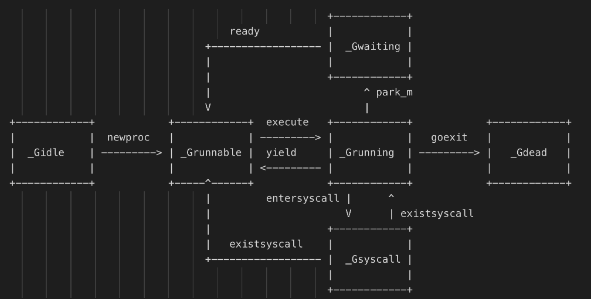
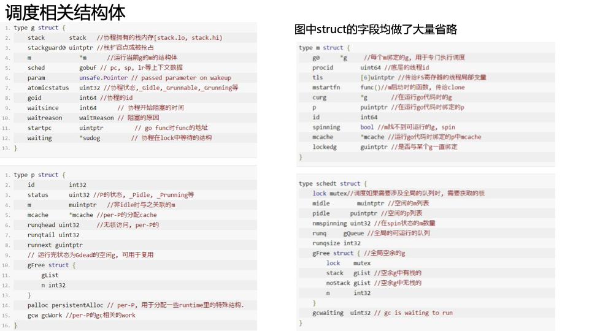

<!-- START doctoc generated TOC please keep comment here to allow auto update -->
<!-- DON'T EDIT THIS SECTION, INSTEAD RE-RUN doctoc TO UPDATE -->
**Table of Contents**  *generated with [DocToc](https://github.com/thlorenz/doctoc)*

- [线程模型](#%E7%BA%BF%E7%A8%8B%E6%A8%A1%E5%9E%8B)
  - [一. 体系架构](#%E4%B8%80-%E4%BD%93%E7%B3%BB%E6%9E%B6%E6%9E%84)
  - [二. 线程](#%E4%BA%8C-%E7%BA%BF%E7%A8%8B)
    - [协程和线程有3种映射关系](#%E5%8D%8F%E7%A8%8B%E5%92%8C%E7%BA%BF%E7%A8%8B%E6%9C%893%E7%A7%8D%E6%98%A0%E5%B0%84%E5%85%B3%E7%B3%BB)
  - [三. 线程模型分类](#%E4%B8%89-%E7%BA%BF%E7%A8%8B%E6%A8%A1%E5%9E%8B%E5%88%86%E7%B1%BB)
    - [1. 内核级线程模型](#1-%E5%86%85%E6%A0%B8%E7%BA%A7%E7%BA%BF%E7%A8%8B%E6%A8%A1%E5%9E%8B)
      - [优点](#%E4%BC%98%E7%82%B9)
      - [缺点](#%E7%BC%BA%E7%82%B9)
    - [2. 用户级线程模型](#2-%E7%94%A8%E6%88%B7%E7%BA%A7%E7%BA%BF%E7%A8%8B%E6%A8%A1%E5%9E%8B)
    - [3. 两级线程模型](#3-%E4%B8%A4%E7%BA%A7%E7%BA%BF%E7%A8%8B%E6%A8%A1%E5%9E%8B)
      - [GM 模型](#gm-%E6%A8%A1%E5%9E%8B)
      - [GPM 模型](#gpm-%E6%A8%A1%E5%9E%8B)
        - [特点](#%E7%89%B9%E7%82%B9)
      - [goroutine 和 thread的联系](#goroutine-%E5%92%8C-thread%E7%9A%84%E8%81%94%E7%B3%BB)
        - [内存占用](#%E5%86%85%E5%AD%98%E5%8D%A0%E7%94%A8)
        - [创建和销毁](#%E5%88%9B%E5%BB%BA%E5%92%8C%E9%94%80%E6%AF%81)
        - [切换成本](#%E5%88%87%E6%8D%A2%E6%88%90%E6%9C%AC)
  - [四. 调度](#%E5%9B%9B-%E8%B0%83%E5%BA%A6)
    - [调度器思想](#%E8%B0%83%E5%BA%A6%E5%99%A8%E6%80%9D%E6%83%B3)
    - [有关 P 和 M 的个数问题](#%E6%9C%89%E5%85%B3-p-%E5%92%8C-m-%E7%9A%84%E4%B8%AA%E6%95%B0%E9%97%AE%E9%A2%98)
    - [goroutine切换](#goroutine%E5%88%87%E6%8D%A2)
    - [Go语言基于信号抢占式调度](#go%E8%AF%AD%E8%A8%80%E5%9F%BA%E4%BA%8E%E4%BF%A1%E5%8F%B7%E6%8A%A2%E5%8D%A0%E5%BC%8F%E8%B0%83%E5%BA%A6)
      - [注册 sigPreempt:_SIGURG信号](#%E6%B3%A8%E5%86%8C-sigpreempt_sigurg%E4%BF%A1%E5%8F%B7)
      - [收到sigurg信号后进行抢占](#%E6%94%B6%E5%88%B0sigurg%E4%BF%A1%E5%8F%B7%E5%90%8E%E8%BF%9B%E8%A1%8C%E6%8A%A2%E5%8D%A0)
      - [发送SIGURG信号](#%E5%8F%91%E9%80%81sigurg%E4%BF%A1%E5%8F%B7)
  - [五. Go 启动时的特殊协程](#%E4%BA%94-go-%E5%90%AF%E5%8A%A8%E6%97%B6%E7%9A%84%E7%89%B9%E6%AE%8A%E5%8D%8F%E7%A8%8B)
    - [sysmon 协程](#sysmon-%E5%8D%8F%E7%A8%8B)
      - [网络轮询器监控](#%E7%BD%91%E7%BB%9C%E8%BD%AE%E8%AF%A2%E5%99%A8%E7%9B%91%E6%8E%A7)
      - [垃圾回收](#%E5%9E%83%E5%9C%BE%E5%9B%9E%E6%94%B6)
    - [管理员-g0](#%E7%AE%A1%E7%90%86%E5%91%98-g0)
    - [调度场景过程](#%E8%B0%83%E5%BA%A6%E5%9C%BA%E6%99%AF%E8%BF%87%E7%A8%8B)
      - [场景1](#%E5%9C%BA%E6%99%AF1)
      - [场景2](#%E5%9C%BA%E6%99%AF2)
      - [场景3](#%E5%9C%BA%E6%99%AF3)
      - [场景4](#%E5%9C%BA%E6%99%AF4)
      - [场景5](#%E5%9C%BA%E6%99%AF5)
      - [场景6](#%E5%9C%BA%E6%99%AF6)
      - [场景7](#%E5%9C%BA%E6%99%AF7)
      - [场景8](#%E5%9C%BA%E6%99%AF8)
      - [场景9](#%E5%9C%BA%E6%99%AF9)
      - [场景10](#%E5%9C%BA%E6%99%AF10)
      - [场景11](#%E5%9C%BA%E6%99%AF11)
      - [场景12](#%E5%9C%BA%E6%99%AF12)
  - [六. G_M_P 源码分析](#%E5%85%AD-g_m_p-%E6%BA%90%E7%A0%81%E5%88%86%E6%9E%90)
    - [G ( Go 协程)](#g--go-%E5%8D%8F%E7%A8%8B)
      - [G 的创建](#g-%E7%9A%84%E5%88%9B%E5%BB%BA)
      - [G 的运行](#g-%E7%9A%84%E8%BF%90%E8%A1%8C)
    - [M 代表一个进程中的工作线程](#m-%E4%BB%A3%E8%A1%A8%E4%B8%80%E4%B8%AA%E8%BF%9B%E7%A8%8B%E4%B8%AD%E7%9A%84%E5%B7%A5%E4%BD%9C%E7%BA%BF%E7%A8%8B)
      - [M 的创建](#m-%E7%9A%84%E5%88%9B%E5%BB%BA)
      - [M 的销毁](#m-%E7%9A%84%E9%94%80%E6%AF%81)
      - [M 的运行](#m-%E7%9A%84%E8%BF%90%E8%A1%8C)
    - [P 资源的管理者](#p-%E8%B5%84%E6%BA%90%E7%9A%84%E7%AE%A1%E7%90%86%E8%80%85)
    - [schedt 全局调度器](#schedt-%E5%85%A8%E5%B1%80%E8%B0%83%E5%BA%A6%E5%99%A8)
  - [唤醒底层实现之gopark和goready](#%E5%94%A4%E9%86%92%E5%BA%95%E5%B1%82%E5%AE%9E%E7%8E%B0%E4%B9%8Bgopark%E5%92%8Cgoready)
  - [参考链接](#%E5%8F%82%E8%80%83%E9%93%BE%E6%8E%A5)

<!-- END doctoc generated TOC please keep comment here to allow auto update -->

# 线程模型

线程是处理器调度和分配的基本单位，进程则作为资源拥有的基本单位。

操作系统调度器会将系统中的多个线程按照一定算法调度到物理CPU上去运行。

多个线程可以属于同一个进程并共享内存空间。因为多线程不需要创建新的虚拟内存空间，所以它们也不需要内存管理单元处理上下文的切换，线程之间的通信也正是基于共享的内存进行的，与重量级的进程相比，线程显得比较轻量

虽然线程比较轻量，但是在调度时也有比较大的额外开销。每个线程会都占用 1M 以上的内存空间，在切换线程时不止会消耗较多的内存，恢复寄存器中的内容还需要向操作系统申请或者销毁资源，每一次线程上下文的切换都需要消耗 ~1us 左右的时间1，但是 Go 调度器对 Goroutine 的上下文切换约为 ~0.2us，减少了 80% 的额外开销。

## 一. 体系架构
操作系统根据资源访问权限的不同，体系架构可分为用户空间和内核空间；
1. 内核空间主要操作访问CPU资源、I/O资源、内存资源等硬件资源，为上层应用程序提供最基本的基础资源，
2. 用户空间就是上层应用程序的固定活动空间，用户空间不可以直接访问资源，必须通过“系统调用”、“库函数”或“Shell脚本”来调用内核空间提供的资源。

## 二. 线程

线程分为内核态线程(简称KSE Kernel Scheduling Entity)kernel space和用户态线程user space，用户态线程需要绑定内核态线程，CPU并不能感知用户态线程的存在，它只知道它在运行1个线程，这个线程实际是内核态线程。

用户态线程实际有个名字叫协程（co-routine），为了容易区分，我们使用协程指用户态线程，使用线程指内核态线程。

User-level threads, Application-level threads, Green threads都指一样的东西，就是不受OS感知的线程。

协程跟线程是有区别的，线程由CPU调度是抢占式的，协程由用户态调度是协作式的，一个协程让出CPU后，才执行下一个协程。


### 协程和线程有3种映射关系

- N:1，N个协程绑定1个线程，优点就是协程在用户态线程即完成切换，不会陷入到内核态，这种切换非常的轻量快速。
  但也有很大的缺点，1个进程的所有协程都绑定在1个线程上:
  - 一是某个程序用不了硬件的多核加速能力，
  - 二是一旦某协程阻塞，造成线程阻塞，本进程的其他协程都无法执行了，根本就没有并发的能力了。

- 1:1，1个协程绑定1个线程，这种最容易实现。协程的调度都由CPU完成了，不存在N:1缺点，但有一个缺点:
  - 协程的创建、删除和切换的代价都由CPU完成，有点略显昂贵了。

- M:N，M个协程绑定N个线程，是N:1和1:1类型的结合，克服了以上2种模型的缺点，但实现起来最为复杂

## 三. 线程模型分类

用户级线程模型、内核级线程模型和两级线程模型

### 1. 内核级线程模型

大部分编程语言的线程库(如linux的pthread，Java的java.lang.Thread，C++11的std::thread等等),都是对操作系统的线程（内核级线程）的一层封装，创建出来的每个线程与一个不同的KSE静态关联.

#### 优点
简单，直接借助OS提供的线程能力，并且不同用户线程之间一般也不会相互影响.
在多核处理器的硬件的支持下，内核空间线程模型支持了真正的并行，当一个线程被阻塞后，允许另一个线程继续执行，所以并发能力较强

#### 缺点
但其创建，销毁以及多个线程之间的上下文切换等操作都是直接由OS层面亲自来做，在需要使用大量线程的场景下对OS的性能影响会很大


### 2. 用户级线程模型

优点： 这种模型的好处是线程上下文切换都发生在用户空间，避免的模态切换（mode switch），从而对于性能有积极的影响

缺点：所有的线程基于一个内核调度实体即内核线程，这意味着只有一个处理器可以被利用，
    在多处理器环境下这是不能够被接受的，本质上，用户线程只解决了并发问题，但是没有解决并行问题。
    如果线程因为 I/O 操作陷入了内核态，内核态线程阻塞等待 I/O 数据，则所有的线程都将会被阻塞，
    用户空间也可以使用非阻塞而 I/O，但是不能避免性能及复杂度问题.

### 3. 两级线程模型

#### GM 模型
早期(Go1.0)的实现中并没有P的概念：Go中的调度器直接将G分配到合适的M上运行


问题：不同的G在不同的M上并发运行时可能都需向系统申请资源（如堆内存），由于资源是全局的，将会由于资源竞争造成很多系统性能损耗

解决：后面的Go（Go1.1）运行时系统加入了P，让P去管理G对象，M要想运行G必须先与一个P绑定，然后才能运行该P管理的G。
    P对象中预先申请一些系统资源（本地资源），G需要的时候先向自己的本地P申请（无需锁保护），
    如果不够用或没有再向全局申请，而且从全局拿的时候会多拿一部分，以供后面高效的使用。
    就像现在我们去政府办事情一样，先去本地政府看能搞定不，如果搞不定再去中央，从而提供办事效率。

#### GPM 模型


Go语言中支撑整个scheduler实现的主要有4个重要结构，分别是M、G、P、Sched， 前三个定义在runtime.h中，Sched定义在proc.c中

1. Sched结构就是调度器: 它维护有存储M和G的队列以及调度器的一些状态信息等
2. M结构是Machine: 系统线程，它由操作系统管理的，goroutine就是跑在M之上的；
    M是一个很大的结构，M 结构体对象除了记录着工作线程的诸如栈的起止位置、当前正在执行的Goroutine 以及是否空闲等等状态信息之外，还通过指针维持着与 P 结构体的实例对象之间的绑定关系。
3. P结构代表一个虚拟的 Processor 处理器: 它的主要用途就是用来执行goroutine的，它维护了一个goroutine队列，即runqueue。
    Processor是让我们从N:1调度到M:N调度的重要部分. 也是 context，保存 goroutine 运行所需要的上下文。
4. G是goroutine实现的核心结构: 主要保存 goroutine 的一些状态信息以及 CPU 的一些寄存器的值，
    例如 IP 寄存器，以便在轮到本 goroutine 执行时，CPU 知道要从哪一条指令处开始执行。

M 虽然需要跟 P 绑定执行，但数量上并不与 P 相等。这是因为 M 会因为系统调用或者其他事情被阻塞，因此随着程序的执行，M 的数量可能增长，而 P 在没有用户干预的情况下，则会保持不变。

##### 特点

当G因为网络或者锁切换, 那么G和M分离, M通过调度执行新的G.

当M因为系统调用阻塞或cgo运行一段时间后, sysmon协程会将P与M分离. 由其他的M来结合P进行调度.


#### goroutine 和 thread的联系
说到goroutine，不得不提 thread，因为他们很像，但又不同。

这篇文章给了很好的启发，从内存占用，创建和销毁，以及切换时间三个角度来认识两者的不同。

##### 内存占用

创建一个 goroutine 栈内存消耗只有 2KB。实际运行时，可以根据需要在堆内存空间扩缩容。

创建一个 thread 需要消耗 1MB 的栈内存，而且还需要一个称为“guard page"的区域，用于和其他 thread 的栈空间进行隔离。

对于一个用 Go 构建的 HTTP Server 来说，对到来的每个请求，创建一个 goroutine 来处理事非常轻松的事情。但对于一个使用线程作为并发原语的语言构建的服务，每个请求对应一个线程实在是太浪费了，很快就会出现 OOM 错误（OutOfMermonyError）。

##### 创建和销毁

Thread 创建和销毁都有巨大的消耗，因为它直接跟操作系统打交道，是内核级。一般常见的做法是维护一个线程池。

然而，goroutine 是由 runtime 负责，创建和销毁非常容易，消耗特别小，是用户级。

##### 切换成本

Thread 是抢占式调度，在线程切换的时候，调度器必须保存/恢复所有的寄存器

> 16 general purpose registers, PC (Program Counter), SP (Stack Pointer), segment registers, 16 XMM registers, FP coprocessor state, 16 AVX registers, all MSRs etc.

而 goroutine 是协作式调度（cooperatively），当切换发生时，只需要保存/恢复3个寄存器。

> Program Counter, Stack Pointer and DX.


## 四. 调度


自顶向下是调度器的4个部分：

1. 全局队列（Global Queue）：存放等待运行的G。
2. P的本地队列：同全局队列类似，存放的也是等待运行的G，存的数量有限，不超过256个。新建G’时，G’优先加入到P的本地队列，如果队列满了，则会把本地队列中一半的G移动到全局队列。
3. P列表：所有的P都在程序启动时创建，并保存在数组中，最多有GOMAXPROCS个。
4. M：线程想运行任务就得获取P，从P的本地队列获取G，P队列为空时，M也会尝试从全局队列拿一批G放到P的本地队列，或从其他P的本地队列偷一半放到自己P的本地队列。M运行G，G执行之后，M会从P获取下一个G，不断重复下去。

Goroutine调度器和OS调度器是通过M结合起来的，每个M都代表了1个内核线程，OS调度器负责把内核线程分配到CPU的核上执行。


### 调度器思想
- 目标1：尽可能地不要让 CPU 闲着
- 目标2：尽可能地运行更多的 G （代码）
- 目标3：尽量最小化 Go 协程切换所带来的开销


调度器的有两大思想：

1. 复用线程：协程本身就是运行在一组线程之上，不需要频繁的创建、销毁线程，而是对线程的复用。在调度器中复用线程还有2个体现：
- 1 work stealing mechanism(偷窃机制): 当本线程无可运行的G时，尝试从其他线程绑定的P偷取G，而不是销毁线程。
- 2 hand over mechanism(交接机制):当本线程因为G进行系统调用阻塞时，线程释放绑定的P，把P转移给其他空闲的线程执行。

2. 利用并行：GOMAXPROCS设置P的数量，当GOMAXPROCS大于1时，就最多有GOMAXPROCS个线程处于运行状态，这些线程可能分布在多个CPU核上同时运行，使得并发利用并行。另外，GOMAXPROCS也限制了并发的程度，比如GOMAXPROCS = 核数/2，则最多利用了一半的CPU核进行并行。

调度器的两小策略：

1. 抢占：在coroutine中要等待一个协程主动让出CPU才执行下一个协程，在Go中，一个goroutine最多占用CPU 10ms，防止其他goroutine被饿死，这就是goroutine不同于coroutine的一个地方。

2. 全局G队列：在新的调度器中依然有全局G队列，但功能已经被弱化了，当M执行work stealing从其他P偷不到G时，它可以从全局G队列获取G。

### 有关 P 和 M 的个数问题
1、P 的数量：

由启动时环境变量$GOMAXPROCS或者是由runtime的方法GOMAXPROCS()决定。这意味着在程序执行的任意时刻都只有$GOMAXPROCS个goroutine在同时运行。

2、M的数量:

- go语言本身的限制：go程序启动时，会设置M的最大数量，默认10000.但是内核很难支持这么多的线程数，所以这个限制可以忽略。 
```go
func schedinit() {
    sched.maxmcount = 10000
    procs := ncpu
	
	// 该启动的P数量，默认为cpu core数
    procs := ncpu
	// 如果存在环境变量GOMAXPROCS，取环境变量的值，创建指定个数的 P
    if n, ok := atoi32(gogetenv("GOMAXPROCS")); ok && n > 0 {
        procs = n
    }
}
```
- runtime/debug中的SetMaxThreads函数，设置M的最大数量
- 一个M阻塞了，会创建新的M

### goroutine切换
golang调度的职责就是为需要执行的Go代码(G)寻找执行者(M)以及执行的准许和资源(P). 并没有一个调度器的实体, 调度是需要发生调度时由m执行runtime.schedule方法进行的.

调度在计算机中是分配工作所需资源的方法. linux的调度为CPU找到可运行的线程. 而Go的调度是为M(线程)找到P(内存, 执行 票据)和可运行的G.


goroutine在go代码中无处不在，go程序会根据不同的情况去调度不同的goroutine，一个goroutine在某个时刻要么在运行，要么在等待，或者死亡
goroutine的切换一般会在以下几种情况下发生：

1. 基于信号抢占式的调度，一个goroutine如果运行很长，会被踢掉
2. 发生系统调用，系统调用会陷入内核，开销不小，暂时解除当前goroutine
3. channel阻塞，当从channel读不到或者写不进的时候，会切换goroutine

### Go语言基于信号抢占式调度

在 Go 的 1.14 版本之前抢占试调度都是基于协作的，需要自己主动的让出执行，但是这样是无法处理一些无法被抢占的边缘情况。
例如：for 循环或者垃圾回收长时间占用线程，这些问题中的一部分直到 1.14 才被基于信号的抢占式调度解决。
原理是这样的，首先注册绑定 SIGURG 信号及处理方法runtime.doSigPreempt，sysmon会间隔性检测超时的p，然后发送信号，m收到信号后休眠执行的goroutine并且进行重新调度。


#### 注册 sigPreempt:_SIGURG信号
```go
// go1.21.5/src/runtime/proc.go
func mstartm0() {
    // ...
	initsig(false) // 初始化信号
}
```
```go
// go1.21.5/src/runtime/signal_unix.go

const sigPreempt = _SIGURG

//go:nosplit
//go:nowritebarrierrec
func initsig(preinit bool) {
    // ...

	for i := uint32(0); i < _NSIG; i++ {
		t := &sigtable[i]  
		// ...
		handlingSig[i] = 1
		setsig(i, abi.FuncPCABIInternal(sighandler)) // 注册信号对应的回调方法
	}
}

//go:nowritebarrierrec
func sighandler(sig uint32, info *siginfo, ctxt unsafe.Pointer, gp *g) {

	gsignal := getg()
	mp := gsignal.m
	c := &sigctxt{info, ctxt}

    // ..

	if sig == sigPreempt && debug.asyncpreemptoff == 0 && !delayedSignal { // 如果是抢占信号
		// Might be a preemption signal.
		doSigPreempt(gp, c)

	}

    // ...
}

// 执行抢占
func doSigPreempt(gp *g, ctxt *sigctxt) {
	// Check if this G wants to be preempted and is safe to
	// preempt.
	if wantAsyncPreempt(gp) {
		if ok, newpc := isAsyncSafePoint(gp, ctxt.sigpc(), ctxt.sigsp(), ctxt.siglr()); ok {
			// Adjust the PC and inject a call to asyncPreempt.
			ctxt.pushCall(abi.FuncPCABI0(asyncPreempt), newpc)
		}
	}

	// Acknowledge the preemption.
	gp.m.preemptGen.Add(1)
	gp.m.signalPending.Store(0)

    // ..
}
```

#### 收到sigurg信号后进行抢占
```go
func asyncPreempt()

//go:nosplit
func asyncPreempt2() {
	gp := getg()
	gp.asyncSafePoint = true
	if gp.preemptStop {
		mcall(preemptPark)
	} else {
		mcall(gopreempt_m)
	}
	gp.asyncSafePoint = false
}
```
preemptPark方法会解绑mg的关系，封存当前协程，继而重新调度runtime.schedule()获取可执行的协程，至于被抢占的协程后面会去重启。
```go
func preemptPark(gp *g) {
    // ...
	status := readgstatus(gp)
	// ...
	casGToPreemptScan(gp, _Grunning, _Gscan|_Gpreempted)
	dropg()
	casfrom_Gscanstatus(gp, _Gscan|_Gpreempted, _Gpreempted)
	schedule()
}
```


goschedImpl 把当前协程的状态从_Grunning正在执行改成 _Grunnable可执行，使用globrunqput方法把抢占的协程放到全局队列里，根据pmg的协程调度设计，globalrunq要后于本地runq被调度
```go
func gopreempt_m(gp *g) {
	if traceEnabled() {
		traceGoPreempt()
	}
	goschedImpl(gp)
}

func goschedImpl(gp *g) {
	status := readgstatus(gp)
	if status&^_Gscan != _Grunning {
		dumpgstatus(gp)
		throw("bad g status")
	}
	casgstatus(gp, _Grunning, _Grunnable)
	dropg()
	lock(&sched.lock)
	globrunqput(gp)
	unlock(&sched.lock)

	schedule()
}
```

#### 发送SIGURG信号

```go
func preemptM(mp *m) {
	// On Darwin, don't try to preempt threads during exec.
	// Issue #41702.
	if GOOS == "darwin" || GOOS == "ios" {
		execLock.rlock()
	}

	if mp.signalPending.CompareAndSwap(0, 1) {
		if GOOS == "darwin" || GOOS == "ios" {
			pendingPreemptSignals.Add(1)
		}

		// If multiple threads are preempting the same M, it may send many
		// signals to the same M such that it hardly make progress, causing
		// live-lock problem. Apparently this could happen on darwin. See
		// issue #37741.
		// Only send a signal if there isn't already one pending.
		signalM(mp, sigPreempt)
	}

	if GOOS == "darwin" || GOOS == "ios" {
		execLock.runlock()
	}
}
```


## 五. Go 启动时的特殊协程

调度器的生命周期  


### sysmon 协程
Go Runtime 在启动程序的时候，会创建一个独立的 M 作为监控线程，称为 sysmon，它是一个系统级的 daemon 线程。

P的数量影响了同时运行go代码的协程数. 如果P被占用很久, 就会影响调度. sysmon协程的一个功能就是进行抢占.


这个sysmon 独立于 GPM 之外，也就是说不需要P就可以运行，因此官方工具 go tool trace 是无法追踪分析到此线程

可认为是10ms执行一次. (初始运行间隔为20us, sysmon运行1ms后逐渐翻倍, 最终每10ms运行一次. 如果有发生过抢占成功, 则又恢复成初始20us的运行间隔, 如此循环)

```go
func sysmon() {
    // ...
	for {
		// 时间设置
		if idle == 0 { // start with 20us sleep...
			delay = 20
		} else if idle > 50 { // start doubling the sleep after 1ms...
			delay *= 2
		}
		if delay > 10*1000 { // up to 10ms
			delay = 10 * 1000
		}
		usleep(delay)
		
		now := nanotime()
		if debug.schedtrace <= 0 && (sched.gcwaiting.Load() || sched.npidle.Load() == gomaxprocs) {
			lock(&sched.lock)
			if sched.gcwaiting.Load() || sched.npidle.Load() == gomaxprocs {
				syscallWake := false
				next := timeSleepUntil()
				if next > now {
					sched.sysmonwait.Store(true)
					unlock(&sched.lock)
					// Make wake-up period small enough
					// for the sampling to be correct.
					sleep := forcegcperiod / 2
					if next-now < sleep {
						sleep = next - now
					}
					shouldRelax := sleep >= osRelaxMinNS
					if shouldRelax {
						osRelax(true)
					}
					syscallWake = notetsleep(&sched.sysmonnote, sleep)
					if shouldRelax {
						osRelax(false)
					}
					lock(&sched.lock)
					sched.sysmonwait.Store(false)
					noteclear(&sched.sysmonnote)
				}
				if syscallWake {
					idle = 0
					delay = 20
				}
			}
			unlock(&sched.lock)
		}

		lock(&sched.sysmonlock)
		// Update now in case we blocked on sysmonnote or spent a long time
		// blocked on schedlock or sysmonlock above.
		now = nanotime()

		// trigger libc interceptors if needed
		if *cgo_yield != nil {
			asmcgocall(*cgo_yield, nil)
		}
		// poll network if not polled for more than 10ms
		lastpoll := sched.lastpoll.Load()
		if netpollinited() && lastpoll != 0 && lastpoll+10*1000*1000 < now {
			// 网络轮询器监控
			
			sched.lastpoll.CompareAndSwap(lastpoll, now)
			list := netpoll(0) // non-blocking - returns list of goroutines
			if !list.empty() {
				// Need to decrement number of idle locked M's
				// (pretending that one more is running) before injectglist.
				// Otherwise it can lead to the following situation:
				// injectglist grabs all P's but before it starts M's to run the P's,
				// another M returns from syscall, finishes running its G,
				// observes that there is no work to do and no other running M's
				// and reports deadlock.
				incidlelocked(-1)
				injectglist(&list)
				incidlelocked(1)
			}
		}
        // ..
		if scavenger.sysmonWake.Load() != 0 {
			// Kick the scavenger awake if someone requested it.
			scavenger.wake()
		}
		// 系统调用和抢占长时间运行的 G
		if retake(now) != 0 {
			idle = 0
		} else {
			idle++
		}
		// 检查是否需要垃圾回收
		if t := (gcTrigger{kind: gcTriggerTime, now: now}); t.test() && forcegc.idle.Load() {
			lock(&forcegc.lock)
			forcegc.idle.Store(false)
			var list gList
			list.push(forcegc.g)
			injectglist(&list)
			unlock(&forcegc.lock)
		}
		if debug.schedtrace > 0 && lasttrace+int64(debug.schedtrace)*1000000 <= now {
			lasttrace = now
			schedtrace(debug.scheddetail > 0)
		}
		unlock(&sched.sysmonlock)
	}
}
```


#### 网络轮询器监控

从 runtime 的实现源码中可以看到, sysmon 监控线程会每隔 20us~10ms 轮询一次检查当前网络轮询器中的所有 G 距离上次 runtime.netpoll 被调用是否超过了10ms，如果当前G执行时间太长了，则通过 injectglist() 将其放入 全局运行队列 ，等待下一次的继续执行。


#### 垃圾回收
如果垃圾回收器超过两分钟没有执行的话，sysmon 监控线程也会强制进行GC

```go
// var forcegcperiod int64 = 2 * 60 * 1e9

func (t gcTrigger) test() bool {
	if !memstats.enablegc || panicking.Load() != 0 || gcphase != _GCoff {
		return false
	}
	switch t.kind {
	case gcTriggerHeap:
        // ..
	case gcTriggerTime:
		if gcController.gcPercent.Load() < 0 {
			return false
		}
		lastgc := int64(atomic.Load64(&memstats.last_gc_nanotime))
		return lastgc != 0 && t.now-lastgc > forcegcperiod
	case gcTriggerCycle:
		// ..
	}
	return true
}

```


### 管理员-g0

go程序中，每个 M 都会绑定一个叫g0的初代goroutine，它在M的创建的时候创建，g0的主要工作就是goroutine的调度(在用户的 g 和 g0之间进行切换)、垃圾回收等。

g0 和我们常规的 goroutine 的任务不同，g0的栈是在主线程栈上分配的，并且它的栈空间有64k，m0是runtime创建第一个线程，然后m0关联一个本地的p，就可以运行g0了。

在g0的栈上不断的调度goroutine来执行，当有新的goroutine关联p准备运行发现没有m的时候，就会去创建一个m，m再关联一个g0， g0再去调度.

但实际上，整个 runtime 中有两种 g0。一种是上面说的每个 M 上的 g0，还有一种是 m0 的 g0。m0, g0 都是以全局变量的方式存在。

### 调度场景过程
M 的职责就是找到一个可运行的 G，然后执行它。从大方向来讲，主要有三个过程：

- 先从本队队列中找
- 定期从全局队列中找
- 最后去别的 P 上偷


#### 场景1

p1拥有g1，m1获取p1后开始运行g1，g1使用go func()创建了g2，为了局部性g2优先加入到p1的本地队列


#### 场景2    
g1运行完成后(函数：goexit)，m上运行的goroutine切换为g0，g0负责调度时协程的切换（函数：schedule）。从p1的本地队列取g2，从g0切换到g2，并开始运行g2(函数：execute)。实现了线程m1的复用。


#### 场景3

假设每个P的本地队列只能存3个G。G2要创建了6个G，前3个G（G3, G4, G5）已经加入p1的本地队列，p1本地队列满了。

#### 场景4


G2在创建G7的时候，发现P1的本地队列已满，需要执行负载均衡(把P1中本地队列中前一半的G，还有新创建G转移到全局队列)


#### 场景5

G2创建G8时，P1的本地队列未满，所以G8会被加入到P1的本地队列。


#### 场景6
规定：在创建G时，运行的G会尝试唤醒其他空闲的P和M组合去执行


假定G2唤醒了M2，M2绑定了P2，并运行G0，但P2本地队列没有G，M2此时为自旋线程**（没有G但为运行状态的线程，不断寻找G）**。

#### 场景7
M2尝试从全局队列(简称“GQ”)取一批G放到P2的本地队列（函数：findrunnable()）。M2从全局队列取的G数量符合下面的公式：

```go
n =  min(len(GQ) / GOMAXPROCS +  1,  cap(LQ) / 2 )
```

```go
// go1.21.5/src/runtime/proc.go
// Try get a batch of G's from the global runnable queue.
// sched.lock must be held.
func globrunqget(pp *p, max int32) *g {
	assertLockHeld(&sched.lock)
    
	// 如果全局队列中没有 g 直接返回
	if sched.runqsize == 0 {
		return nil
	}

	n := sched.runqsize/gomaxprocs + 1
	if n > sched.runqsize {
		n = sched.runqsize
	}
	// 不能超过取的最大个数
	if max > 0 && n > max {
		n = max
	}
	if n > int32(len(pp.runq))/2 {
		n = int32(len(pp.runq)) / 2
	}

	sched.runqsize -= n

	// 拿到全局队列队头 g
	gp := sched.runq.pop()
	n--
	for ; n > 0; n-- { // 继续取剩下的n个全局队列放入本地队列
		gp1 := sched.runq.pop()
		runqput(pp, gp1, false)
	}
	return gp
}
```


假定我们场景中一共有4个P（GOMAXPROCS设置为4，那么我们允许最多就能用4个P来供M使用）。所以M2只从能从全局队列取1个G（即G3）移动P2本地队列，然后完成从G0到G3的切换，运行G3。


#### 场景8

假设G2一直在M1上运行，经过2轮后，M2已经把G7、G4从全局队列获取到了P2的本地队列并完成运行，全局队列和P2的本地队列都空了,如场景8图的左半部分


全局队列已经没有G，那m就要执行work stealing(偷取)：从其他有G的P哪里偷取一半G过来，放到自己的P本地队列。P2从P1的本地队列尾部取一半的G，本例中一半则只有1个G8，放到P2的本地队列并执行


#### 场景9

G1本地队列G5、G6已经被其他M偷走并运行完成，当前M1和M2分别在运行G2和G8，M3和M4没有goroutine可以运行，M3和M4处于自旋状态，它们不断寻找goroutine。


为什么要让m3和m4自旋，自旋本质是在运行，线程在运行却没有执行G，就变成了浪费CPU. 为什么不销毁现场，来节约CPU资源。因为创建和销毁CPU也会浪费时间，我们希望当有新goroutine创建时，立刻能有M运行它，如果销毁再新建就增加了时延，降低了效率。当然也考虑了过多的自旋线程是浪费CPU，所以系统中最多有GOMAXPROCS个自旋的线程(当前例子中的GOMAXPROCS=4，所以一共4个P)，多余的没事做线程会让他们休眠


#### 场景10

假定当前除了M3和M4为自旋线程，还有M5和M6为空闲的线程(没有得到P的绑定，注意我们这里最多就只能够存在4个P，所以P的数量应该永远是M>=P, 大部分都是M在抢占需要运行的P)，G8创建了G9，G8进行了阻塞的系统调用，M2和P2立即解绑，P2会执行以下判断：如果P2本地队列有G、全局队列有G或有空闲的M，P2都会立马唤醒1个M和它绑定，否则P2则会加入到空闲P列表，等待M来获取可用的p。本场景中，P2本地队列有G9，可以和其他空闲的线程M5绑定。


#### 场景11
g8创建了g9，假如g8进行了非阻塞系统调用（CGO会是这种方式，见cgocall()），m2和p2会解绑，但m2会记住p，然后g8和m2进入系统调用状态。当g8和m2退出系统调用时，会尝试获取p2，如果无法获取，则获取空闲的p，如果依然没有，g8会被记为可运行状态，并加入到全局队列。


#### 场景12

Go调度在go1.12实现了抢占，应该更精确的称为请求式抢占，那是因为go调度器的抢占和OS的线程抢占比起来很柔和，不暴力，不会说线程时间片到了，或者更高优先级的任务到了，执行抢占调度。go的抢占调度柔和到只给goroutine发送1个抢占请求，至于goroutine何时停下来，那就管不到了。抢占请求需要满足2个条件中的1个：1）G进行系统调用超过20us，2）G运行超过10ms。调度器在启动的时候会启动一个单独的线程sysmon，它负责所有的监控工作，其中1项就是抢占，发现满足抢占条件的G时，就发出抢占请

## 六. G_M_P 源码分析


源码部分主要涉及三个文件：
1. runtime/amd_64.s 涉及到进程启动以及对CPU执行指令进行控制的汇编代码，进程的初始化部分也在这里面
2. runtime/runtime2.go 这里主要是运行时中一些重要数据结构的定义，比如g、m、p以及涉及到接口、defer、panic、map、slice等核心类型
3. runtime/proc.go 一些核心方法的实现，涉及gmp调度等核心代码在这里

### G ( Go 协程)
- 当 goroutine 被调离 CPU 时，调度器负责把 CPU 寄存器的值保存在 g 对象的成员变量之中。
- 当 goroutine 被调度起来运行时，调度器又负责把 g 对象的成员变量所保存的寄存器值恢复到 CPU 的寄存器。

G的几种状态

```go
const (
	// G status
	
	// 刚刚被分配, 还没有初始化
	_Gidle = iota // 0

	//  表示在runqueue上, 还没有被运行，没有栈的所有权，存储在运行队列中
	_Grunnable // 1

	//  go协程可能在执行go代码, 不在runqueue上, 拥有栈的所有权，被赋予了内核线程 M 和处理器 P
	_Grunning // 2

	//  go协程在执行系统调用, 没执行go代码, 没有在runqueue上, 拥有栈的所有权,只与M绑定
	_Gsyscall // 3

	// go协程被阻塞(IO, GC, chan阻塞, 锁等). 不在runqueue上, 但是一定在某个地方, 比如channel中, 锁排队中等.
	_Gwaiting // 4

	// _Gmoribund_unused is currently unused, but hardcoded in gdb
	// scripts.
	_Gmoribund_unused // 5

	//  协程现在没有在使用, 也许执行完, 或者在free list中, 或者正在被初始化. 可能有stack或者没有
	_Gdead // 6

	// _Genqueue_unused is currently unused.
	_Genqueue_unused // 7

	//  栈正在复制, 此时没有go代码, 也不在runqueue上
	_Gcopystack // 8

	// _Gpreempted means this goroutine stopped itself for a
	// suspendG preemption. It is like _Gwaiting, but nothing is
	// yet responsible for ready()ing it. Some suspendG must CAS
	// the status to _Gwaiting to take responsibility for
	// ready()ing this G.
	_Gpreempted // 9

    // 与runnable, running, syscall, waiting等状态结合, 表示GC正在扫描这个G的 栈,没有执行代码
	_Gscan          = 0x1000
	_Gscanrunnable  = _Gscan + _Grunnable  // 0x1001
	_Gscanrunning   = _Gscan + _Grunning   // 0x1002
	_Gscansyscall   = _Gscan + _Gsyscall   // 0x1003
	_Gscanwaiting   = _Gscan + _Gwaiting   // 0x1004
	_Gscanpreempted = _Gscan + _Gpreempted // 0x1009
)
```
只需要关注下面几种就好了：

- 等待中：_ Gwaiting、_Gsyscall 和 _Gpreempted，这几个状态表示G没有在执行；
- 可运行：_Grunnable，表示G已经准备就绪，
- 运行中：_Grunning，表示G正在运行；


G结构体

```go
// /go1.21.5/src/runtime/runtime2.go
type g struct {
    // goroutine 使用的栈
	stack       stack   // offset known to runtime/cgo
	// 用于栈的扩张和收缩检查，抢占标志
	stackguard0 uintptr // offset known to liblink
	stackguard1 uintptr // offset known to liblink

	_panic       *_panic // innermost panic - offset known to liblink
	_defer       *_defer // innermost defer
	
    // 当前与 g 占用的线程
	m            *m      // current m; offset known to arm liblink
	
    // goroutine 的运行现场,存储 Goroutine 的调度相关的数据
	sched        gobuf
	syscallsp    uintptr        // if status==Gsyscall, syscallsp = sched.sp to user during gc
	syscallpc    uintptr        // if status==Gsyscall, syscallpc = sched.pc to user during gc
	stktopsp     uintptr        // expected sp at top of stack, to check in traceback

	// 用于做参数传递，睡眠时其他goroutine可以设置param，唤醒时该g可以读取这些param
	param        unsafe.Pointer // passed parameter on wakeup
	
	// Goroutine 的状态
	atomicstatus uint32
	stackLock    uint32 // sigprof/scang lock; TODO: fold in to atomicstatus
	goid         int64 // goroutine的唯一id
	// 指向全局队列里下一个 g
	schedlink    guintptr

    // g 被阻塞之后的近似时间
	waitsince    int64      // approx time when the g become blocked
	// g 被阻塞的原因
	waitreason   waitReason // if status==Gwaiting
	
	// 抢占调度标志。这个为 true 时，stackguard0 等于 stackpreempt
	preempt       bool // preemption signal, duplicates stackguard0 = stackpreempt
	// 抢占时将状态修改成 `_Gpreempted`
	preemptStop   bool // transition to _Gpreempted on preemption; otherwise, just deschedule
	//  在同步安全点收缩栈
	preemptShrink bool // shrink stack at synchronous safe point

	// asyncSafePoint is set if g is stopped at an asynchronous
	// safe point. This means there are frames on the stack
	// without precise pointer information.
	asyncSafePoint bool

	paniconfault bool // panic (instead of crash) on unexpected fault address
	gcscandone   bool // g has scanned stack; protected by _Gscan bit in status
	throwsplit   bool // must not split stack
	// activeStackChans indicates that there are unlocked channels
	// pointing into this goroutine's stack. If true, stack
	// copying needs to acquire channel locks to protect these
	// areas of the stack.
	activeStackChans bool
	// parkingOnChan indicates that the goroutine is about to
	// park on a chansend or chanrecv. Used to signal an unsafe point
	// for stack shrinking. It's a boolean value, but is updated atomically.
	parkingOnChan uint8

	raceignore     int8     // ignore race detection events
	sysblocktraced bool     // StartTrace has emitted EvGoInSyscall about this goroutine
	// syscall 返回之后的 cputicks，用来做 tracing
	sysexitticks   int64    // cputicks when syscall has returned (for tracing)
	traceseq       uint64   // trace event sequencer
	tracelastp     puintptr // last P emitted an event for this goroutine

    // 如果调用了 LockOsThread，那么这个 g 会绑定到某个 m 上
	lockedm        muintptr
	sig            uint32
	writebuf       []byte
	sigcode0       uintptr
	sigcode1       uintptr
	sigpc          uintptr

    // 创建该 goroutine 的语句的指令地址
	gopc           uintptr         // pc of go statement that created this goroutine
	ancestors      *[]ancestorInfo // ancestor information goroutine(s) that created this goroutine (only used if debug.tracebackancestors)

	// goroutine 函数的指令地址
	startpc        uintptr         // pc of goroutine function
	racectx        uintptr
	waiting        *sudog         // sudog structures this g is waiting on (that have a valid elem ptr); in lock order
	cgoCtxt        []uintptr      // cgo traceback context
	labels         unsafe.Pointer // profiler labels

    // time.Sleep 缓存的定时器
	timer          *timer         // cached timer for time.Sleep
	selectDone     uint32         // are we participating in a select and did someone win the race?

	// Per-G GC state

	// gcAssistBytes is this G's GC assist credit in terms of
	// bytes allocated. If this is positive, then the G has credit
	// to allocate gcAssistBytes bytes without assisting. If this
	// is negative, then the G must correct this by performing
	// scan work. We track this in bytes to make it fast to update
	// and check for debt in the malloc hot path. The assist ratio
	// determines how this corresponds to scan work debt.
	gcAssistBytes int64
}
```

g 结构体关联了两个比较简单的结构体，stack 表示 goroutine 运行时的栈：
```go
type stack struct {

    // 栈顶，低地址
	lo uintptr

	// 栈底，高地址
	hi uintptr
}
```

Goroutine 运行时，光有栈还不行，至少还得包括 PC，SP 等寄存器，gobuf 就保存了这些值：

```go
//  gobuf中保存了非常重要的上下文执行信息，
type gobuf struct {
	// 存储 rsp 寄存器的值, 永远指向栈顶位置
	sp   uintptr

	// 存储 ip 寄存器的值 , 代表代码经过编译为机器码后，当前执行的机器指令（可以理解为当前语句）
	pc   uintptr

	//  指向所保存执行上下文的goroutine
	g    guintptr
	ctxt unsafe.Pointer // gc时候使用

    
	ret  sys.Uintreg // 保存系统调用的返回值
	lr   uintptr
	bp   uintptr // for GOEXPERIMENT=framepointer 某一时刻的栈顶位置，当新函数调用时，把当前SP地址赋值给BP、SP指向新的栈顶位置
}
```

#### G 的创建

G 的创建一般有两种。第一种就是 Go 程序启动时，主线程会创建第一个 goroutune 来执行 main 函数。其次是，我们在代码中使用 go 关键字创建新的goroutine

#### G 的运行
G 的执行需要 M，而 M 的运行需要绑定 P，所以理论上同一时间处于运行状态的 G 数量等于 P 的数量。

G 的状态保存在其gobuf字段上，所以 G 可以跨 M 进行调度。

M 找到可运行的 G 后，会通过汇编函数gogo从g0栈切换到用户 G 的栈运行。

### M 代表一个进程中的工作线程
当 M 没有工作可做的时候，在它休眠前，会“自旋”地来找工作：检查全局队列，查看 network poller，试图执行 gc 任务，或者“偷”工作.


```go
// m 代表工作线程，保存了自身使用的栈信息
type m struct {
    // 记录工作线程（也就是内核线程）使用的栈信息。在执行调度代码时需要使用
    // 执行用户 goroutine 代码时，使用用户 goroutine 自己的栈，因此调度时会发生栈的切换
	g0      *g     // goroutine with scheduling stack
	morebuf gobuf  // gobuf arg to morestack
	divmod  uint32 // div/mod denominator for arm - known to liblink

	// Fields not known to debuggers.
	procid        uint64       // for debuggers, but offset not hard-coded
	//  处理 signal 的 G
	gsignal       *g           // signal-handling g
	goSigStack    gsignalStack // Go-allocated signal handling stack
	sigmask       sigset       // storage for saved signal mask


	// 通过 tls 结构体实现 m 与工作线程的绑定
	// 这里是线程本地存储
	tls           [6]uintptr   // thread-local storage (for x86 extern register)
	mstartfn      func()


    // 指向正在运行的 goroutine 对象
	curg          *g       // current running goroutine
	caughtsig     guintptr // goroutine running during fatal signal

    // 当前工作线程绑定的 p
	p             puintptr // attached p for executing go code (nil if not executing go code)
	nextp         puintptr
	// 之前使用的P
	oldp          puintptr // the p that was attached before executing a syscall
	id            int64
	mallocing     int32
	throwing      int32
	
	// 该字段不等于空字符串的话，要保持 curg 始终在这个 m 上运行
	preemptoff    string // if != "", keep curg running on this m
	locks         int32
	dying         int32
	profilehz     int32

    // 为 true 时表示当前 m 处于自旋状态，正在从其他线程偷工作
	spinning      bool // m is out of work and is actively looking for work

	// m 正阻塞在 note 上
	blocked       bool // m is blocked on a note
	newSigstack   bool // minit on C thread called sigaltstack
	printlock     int8

	// 正在执行 cgo 调用
	incgo         bool   // m is executing a cgo call
	freeWait      uint32 // if == 0, safe to free g0 and delete m (atomic)
	fastrand      [2]uint32
	needextram    bool
	traceback     uint8
	
    // cgo 调用总计数
	ncgocall      uint64      // number of cgo calls in total
	ncgo          int32       // number of cgo calls currently in progress
	cgoCallersUse uint32      // if non-zero, cgoCallers in user temporarily
	cgoCallers    *cgoCallers // cgo traceback if crashing in cgo call
	
	// 没有 goroutine 需要运行时，工作线程睡眠在这个 park 成员上，
	// 其它线程通过这个 park 唤醒该工作线程
	park          note
	
	// 记录所有工作线程的链表
	alllink       *m // on allm
	schedlink     muintptr
	lockedg       guintptr
	createstack   [32]uintptr // stack that created this thread.
	lockedExt     uint32      // tracking for external LockOSThread
	lockedInt     uint32      // tracking for internal lockOSThread

    // 正在等待锁的下一个 m
	nextwaitm     muintptr    // next m waiting for lock
	waitunlockf   func(*g, unsafe.Pointer) bool
	waitlock      unsafe.Pointer
	waittraceev   byte
	waittraceskip int
	startingtrace bool
	syscalltick   uint32
	freelink      *m // on sched.freem

	// these are here because they are too large to be on the stack
	// of low-level NOSPLIT functions.
	libcall   libcall
	libcallpc uintptr // for cpu profiler
	libcallsp uintptr
	libcallg  guintptr
	syscall   libcall // stores syscall parameters on windows

	vdsoSP uintptr // SP for traceback while in VDSO call (0 if not in call)
	vdsoPC uintptr // PC for traceback while in VDSO call

	// preemptGen counts the number of completed preemption
	// signals. This is used to detect when a preemption is
	// requested, but fails. Accessed atomically.
	preemptGen uint32

	// Whether this is a pending preemption signal on this M.
	// Accessed atomically.
	signalPending uint32

	dlogPerM

	mOS

	// Up to 10 locks held by this m, maintained by the lock ranking code.
	locksHeldLen int
	locksHeld    [10]heldLockInfo
}
```

几个比较重要的字段，包括：

- 用于执行调度的g0
- 用于信号处理的gsignal
- 线程本地存储tls
- 当前正在运行的curg
- 执行 Goroutine 时需要的本地资源p（如果没有执行，则为nil）
- 执行系统调用前上一次绑定的oldp【结束系统调用的时候，优化恢复上一次绑定的p】
  
- 表示自身状态的spinning,M的状态并没有像P和G那样有多个状态常量，M 有三种状态：运行，自旋、休眠(有些文章，将 M 的状态分为自旋和非自旋，主要从m.spinning来考虑。)

#### M 的创建
有两种场景需要创建 M：

- Go 程序启动时会创建主线程，主线程的第一个 M，即M0
- 当有新 G 创建，或者有可运行的 G，且还有空闲的 P，那么会调用 starm函数。startm函数会从 全局空闲M 队列取一个 M，和空闲的 P 绑定，执行G，如果没有空闲的M，就会通过newm创建一个


#### M 的销毁
M 不会被销毁，但当 M 找不到工作或者找不到空闲的 P 时，会通过stopm进入休眠状态。那么，什么情况下会进入休眠状态呢？

有两种情况：

第一种：没有工作可做。

当 M 绑定的 P 没有可运行的 G 且 无法从其他 P 和 全局可运行 G 列表找到可运行的G 时，M 会尝试进入自旋状态。注意，进入自旋状态的M数量有限制，处于自旋状态的M数量最多为非空闲P的数量一半。

如果 M 在自旋状态没有找到可运行的 G 或者 未能进入自旋状态，就会直接进入休眠状态。【详见下面 M 如何工作部分。】

第二种：没有空闲的P。

当 M 执行的 G，进入系统调用，M 会主动与绑定的 P 解绑，当 G 退出系统调用时，M 会找一个空闲的 P 进行绑定，进而继续执行 G，但是如果找不到空闲的 P，此时 M 也会调用stopm进入休眠。

stopm函数会将休眠的 M 放入全局的空闲队列（sched.midle），等待其他工作线程唤醒 M 时，从列表中取。


#### M 的运行
M 需要与 P 绑定才能运行，且 M 与 P 有亲和性。

当 M 执行的 G 进入系统调用，M 与 P 会进行解绑，M 会将当前的 P 记录到 m.oldp 中；当 G 退出系统调用时，M 会尝试优先绑定 m.oldp 中的 P


### P 资源的管理者


P的状态


```go
const ( 
    // 表示P没有运行用户代码或者调度器 
    _Pidle = iota 
    // 被线程 M 持有，并且正在执行用户代码或者调度器
    _Prunning 
    // 没有执行用户代码，当前线程陷入系统调用
    _Psyscall
    // 被线程 M 持有，当前处理器由于垃圾回收 STW 被停止
    _Pgcstop 
    // 当前处理器已经不被使用
    _Pdead
)
```


```go
// p 保存 go 运行时所必须的资源
type p struct {
    // 在 allp 中的索引
	id          int32
	//   p 的状态
	status      uint32 // one of pidle/prunning/...
	link        puintptr
	
	// 调度器调用会+1
	schedtick   uint32     // incremented on every scheduler call
    // 每次系统调用时加一
	syscalltick uint32     // incremented on every system call
	sysmontick  sysmontick // last tick observed by sysmon
	
    // 指向绑定的 m，如果 p 是 idle 的话，那这个指针是 nil
	m           muintptr   // back-link to associated m (nil if idle)
	mcache      *mcache
	pcache      pageCache
	raceprocctx uintptr

	// defer 结构池
	deferpool    [5][]*_defer // pool of available defer structs of different sizes (see panic.go)
	deferpoolbuf [5][32]*_defer

	// Cache of goroutine ids, amortizes accesses to runtime·sched.goidgen.
	goidcache    uint64
	goidcacheend uint64
	
	// 本地可运行的队列，不用通过锁即可访问
	runqhead uint32
	runqtail uint32
	
    // 使用数组实现的循环队列
	runq     [256]guintptr

    // runnext 非空时，代表的是一个 runnable 状态的 G，
    // 这个 G 被 当前 G 修改为 ready 状态，相比 runq 中的 G 有更高的优先级。
    // 如果当前 G 还有剩余的可用时间，那么就应该运行这个 G
    // 运行之后，该 G 会继承当前 G 的剩余时间
	runnext guintptr  // 缓存可立即执行的 G
	
    // 运行完状态为Gdead的状态，可用于复用
	gFree struct {
		gList
		n int32
	}

	sudogcache []*sudog
	sudogbuf   [128]*sudog

	// Cache of mspan objects from the heap.
	mspancache struct {
		// We need an explicit length here because this field is used
		// in allocation codepaths where write barriers are not allowed,
		// and eliminating the write barrier/keeping it eliminated from
		// slice updates is tricky, moreso than just managing the length
		// ourselves.
		len int
		buf [128]*mspan
	}

	tracebuf traceBufPtr

	// traceSweep indicates the sweep events should be traced.
	// This is used to defer the sweep start event until a span
	// has actually been swept.
	traceSweep bool
	// traceSwept and traceReclaimed track the number of bytes
	// swept and reclaimed by sweeping in the current sweep loop.
	traceSwept, traceReclaimed uintptr

	palloc persistentAlloc // per-P to avoid mutex

	_ uint32 // Alignment for atomic fields below

	// The when field of the first entry on the timer heap.
	// This is updated using atomic functions.
	// This is 0 if the timer heap is empty.
	timer0When uint64

	// Per-P GC state
	gcAssistTime         int64    // Nanoseconds in assistAlloc
	gcFractionalMarkTime int64    // Nanoseconds in fractional mark worker (atomic)
	gcBgMarkWorker       guintptr // (atomic)
	gcMarkWorkerMode     gcMarkWorkerMode

	// gcMarkWorkerStartTime is the nanotime() at which this mark
	// worker started.
	gcMarkWorkerStartTime int64

	// gcw is this P's GC work buffer cache. The work buffer is
	// filled by write barriers, drained by mutator assists, and
	// disposed on certain GC state transitions.
	gcw gcWork

	// wbBuf is this P's GC write barrier buffer.
	//
	// TODO: Consider caching this in the running G.
	wbBuf wbBuf

	runSafePointFn uint32 // if 1, run sched.safePointFn at next safe point

	// Lock for timers. We normally access the timers while running
	// on this P, but the scheduler can also do it from a different P.
	timersLock mutex

	// Actions to take at some time. This is used to implement the
	// standard library's time package.
	// Must hold timersLock to access.
	timers []*timer

	// Number of timers in P's heap.
	// Modified using atomic instructions.
	numTimers uint32

	// Number of timerModifiedEarlier timers on P's heap.
	// This should only be modified while holding timersLock,
	// or while the timer status is in a transient state
	// such as timerModifying.
	adjustTimers uint32

	// Number of timerDeleted timers in P's heap.
	// Modified using atomic instructions.
	deletedTimers uint32

	// Race context used while executing timer functions.
	timerRaceCtx uintptr

	// preempt is set to indicate that this P should be enter the
	// scheduler ASAP (regardless of what G is running on it).
	preempt bool

	pad cpu.CacheLinePad
}
```

### schedt 全局调度器


```go
type schedt struct {
    // ...
    lock mutex 
    // 空闲的m组成的链表
    midle        muintptr  
    // 空闲的 M 列表数量
    nmidle       int32      
    // 下一个被创建的 M 的 id
    mnext        int64  
    // 能拥有的最大数量的 M  
    maxmcount    int32    
    // 空闲 p 链表
    pidle      puintptr // idle p's
    // 空闲 p 数量
    npidle     uint32
    // 处于 spinning 状态的 M 的数量
    nmspinning uint32   
    // 全局 runnable G 队列
    runq     gQueue
    runqsize int32  
    // 空闲的g队列，这里面g的状态为_Gdead
    gFree struct {
        lock    mutex
        stack   gList // Gs with stacks
        noStack gList // Gs without stacks
        n       int32
    } 
    // sudog 结构的集中缓存
    sudoglock  mutex
    sudogcache *sudog 
    // defer 结构的池
    deferlock mutex
    deferpool [5]*_defer 
    // ...
}
```


## 唤醒底层实现之gopark和goready
```go
// go1.21.5/src/runtime/proc.go
func gopark(unlockf func(*g, unsafe.Pointer) bool, lock unsafe.Pointer, reason waitReason, traceReason traceBlockReason, traceskip int) {
	if reason != waitReasonSleep {
		checkTimeouts() // timeouts may expire while two goroutines keep the scheduler busy
	}
    // 获取当前的m
	mp := acquirem()
	// 当前的g
	gp := mp.curg
    // 获取当前g的状态
	status := readgstatus(gp)
	if status != _Grunning && status != _Gscanrunning {
		throw("gopark: bad g status")
	}
	mp.waitlock = lock
	mp.waitunlockf = unlockf
	gp.waitreason = reason
	mp.waitTraceBlockReason = traceReason
	mp.waitTraceSkip = traceskip
    // 释放m
	releasem(mp)
	// can't do anything that might move the G between Ms here.
	// 切换到g0栈操作
	mcall(park_m)
}
```


mcall是汇编实现，大概逻辑就是首先把上下文保存在g->sched中，然后切换到g0栈去调用传进来的函数，这里是park_m
```asm
// runtime/asm_amd64.s
TEXT runtime·mcall<ABIInternal>(SB), NOSPLIT, $0-8
	MOVQ	AX, DX	// DX = fn

	// Save state in g->sched. The caller's SP and PC are restored by gogo to
	// resume execution in the caller's frame (implicit return). The caller's BP
	// is also restored to support frame pointer unwinding.
	MOVQ	SP, BX	// hide (SP) reads from vet
	MOVQ	8(BX), BX	// caller's PC
	MOVQ	BX, (g_sched+gobuf_pc)(R14)
	LEAQ	fn+0(FP), BX	// caller's SP
	MOVQ	BX, (g_sched+gobuf_sp)(R14)
	// Get the caller's frame pointer by dereferencing BP. Storing BP as it is
	// can cause a frame pointer cycle, see CL 476235.
	MOVQ	(BP), BX // caller's BP
	MOVQ	BX, (g_sched+gobuf_bp)(R14)

	// switch to m->g0 & its stack, call fn
	MOVQ	g_m(R14), BX
	MOVQ	m_g0(BX), SI	// SI = g.m.g0
	CMPQ	SI, R14	// if g == m->g0 call badmcall
	JNE	goodm
	JMP	runtime·badmcall(SB)
goodm:
	MOVQ	R14, AX		// AX (and arg 0) = g
	MOVQ	SI, R14		// g = g.m.g0
	get_tls(CX)		// Set G in TLS
	MOVQ	R14, g(CX)
	MOVQ	(g_sched+gobuf_sp)(R14), SP	// sp = g0.sched.sp
	PUSHQ	AX	// open up space for fn's arg spill slot
	MOVQ	0(DX), R12
	CALL	R12		// fn(g)
	POPQ	AX
	JMP	runtime·badmcall2(SB)
	RET

```

```go
// park continuation on g0.
func park_m(gp *g) {
	_g_ := getg()

	if trace.enabled {
		traceGoPark(_g_.m.waittraceev, _g_.m.waittraceskip)
	}
 
    // 这个是将当前的g状态切换为等待
	casgstatus(gp, _Grunning, _Gwaiting)
 
    // 将当前的goroutine和当前的M进行解绑
	dropg()
  
    // 调用传入的回调函数
	if fn := _g_.m.waitunlockf; fn != nil {
	    // 判断是否需要等待
		ok := fn(gp, _g_.m.waitlock)
		// 重置
		_g_.m.waitunlockf = nil
		_g_.m.waitlock = nil
		// 如果不需要等待
		if !ok {
			if trace.enabled {
				traceGoUnpark(gp, 2)
			}
			// 重新切换状态 切换为运行
			casgstatus(gp, _Gwaiting, _Grunnable)
			// 将当前的go重新恢复运行
			execute(gp, true) // Schedule it back, never returns.
		}
	}
	// 如果需要等待 那么重新找一个goroutine
	schedule()
}
```

runtime.park_m 会将当前 Goroutine 的状态从 _Grunning 切换至 _Gwaiting，调用 runtime.dropg 移除线程和 Goroutine 之间的关联


```go
// Schedules gp to run on the current M.
// If inheritTime is true, gp inherits the remaining time in the
// current time slice. Otherwise, it starts a new time slice.
// Never returns.
//
// Write barriers are allowed because this is called immediately after
// acquiring a P in several places.
//
//go:yeswritebarrierrec
func execute(gp *g, inheritTime bool) {
    // 获取当前g
	_g_ := getg()

	if goroutineProfile.active {
		// Make sure that gp has had its stack written out to the goroutine
		// profile, exactly as it was when the goroutine profiler first stopped
		// the world.
		tryRecordGoroutineProfile(gp, osyield)
	}

	// Assign gp.m before entering _Grunning so running Gs have an
	// M.
	// 设置状态
	_g_.m.curg = gp
	gp.m = _g_.m
  
    // 切换可运行到运行中
	casgstatus(gp, _Grunnable, _Grunning)
	gp.waitsince = 0
	gp.preempt = false
	gp.stackguard0 = gp.stack.lo + _StackGuard
	if !inheritTime {
		_g_.m.p.ptr().schedtick++
	}

	// Check whether the profiler needs to be turned on or off.
	hz := sched.profilehz
	if _g_.m.profilehz != hz {
		setThreadCPUProfiler(hz)
	}

	if trace.enabled {
		// GoSysExit has to happen when we have a P, but before GoStart.
		// So we emit it here.
		if gp.syscallsp != 0 && gp.sysblocktraced {
			traceGoSysExit(gp.sysexitticks)
		}
		traceGoStart()
	}
    // 调用gogo函数 恢复g的上下文
	gogo(&gp.sched)
}

```

```asm
// func gogo(buf *gobuf)
// restore state from Gobuf; longjmp
TEXT runtime·gogo(SB), NOSPLIT, $0-8
	MOVQ	buf+0(FP), BX		// gobuf
	MOVQ	gobuf_g(BX), DX
	MOVQ	0(DX), CX		// make sure g != nil
	JMP	gogo<>(SB)

TEXT gogo<>(SB), NOSPLIT, $0
	get_tls(CX)
	MOVQ	DX, g(CX)
	MOVQ	DX, R14		// set the g register
	MOVQ	gobuf_sp(BX), SP	// restore SP
	MOVQ	gobuf_ret(BX), AX
	MOVQ	gobuf_ctxt(BX), DX
	MOVQ	gobuf_bp(BX), BP
	MOVQ	$0, gobuf_sp(BX)	// clear to help garbage collector
	MOVQ	$0, gobuf_ret(BX)
	MOVQ	$0, gobuf_ctxt(BX)
	MOVQ	$0, gobuf_bp(BX)
	MOVQ	gobuf_pc(BX), BX
	JMP	BX
```


```go
func goready(gp *g, traceskip int) {
	systemstack(func() {
		ready(gp, traceskip, true)
	})
}
```

```go
func ready(gp *g, traceskip int, next bool) {
    // .. 

	status := readgstatus(gp)

	// 标记G为grunnable状态
	mp := acquirem() // disable preemption because it can be holding p in a local var
	casgstatus(gp, _Gwaiting, _Grunnable)

    // 放入runq中等待调度循环消费
	runqput(mp.p.ptr(), gp, next)

    // 唤醒一个闲置的P来执行G
	wakep()
	releasem(mp)
}

```


## 参考链接

- [从源码 15.7 剖析Go语言基于信号抢占式调度](https://www.luozhiyun.com/archives/485)
- [Go调度器系列（2）宏观看调度器](https://lessisbetter.site/2019/03/26/golang-scheduler-2-macro-view/)
- [Go调度器系列（3）图解调度原理](https://lessisbetter.site/2019/04/04/golang-scheduler-3-principle-with-graph/)
- [GO GMP协程调度实现原理 5w字长文史上最全](https://www.cnblogs.com/dojo-lzz/p/16342622.html)
- [从源码角度看 Golang 的调度.md](https://github.com/0voice/Introduction-to-Golang/blob/main/%E6%96%87%E7%AB%A0/%E4%BB%8E%E6%BA%90%E7%A0%81%E8%A7%92%E5%BA%A6%E7%9C%8B%20Golang%20%E7%9A%84%E8%B0%83%E5%BA%A6.md)
- [深入理解Go调度器：M 如何找工作（三）](https://www.subond.com/post/2023-08-07_gmp_m/)

