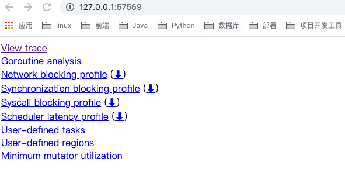
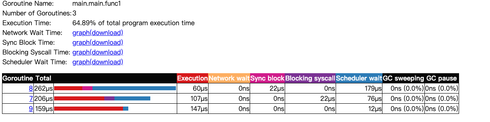
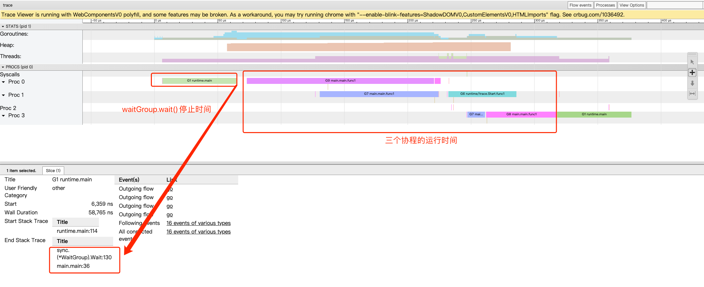

# Trace 分析goroutine的调度

## 运行后

第一行View trace（可视化整个程序的调度流程）和第二行Gorutine analysis。

### Goroutine analysis

Goroutines:
main.main.func1 N=3     
runtime.main N=1
runtime/trace.Start.func1 N=1
N=4

解析：  程序一共有5个goroutine，分别是三个for循环里启动的匿名go func()、一个trace.Start.func1和runtime.main。

### view trace 

当主goroutine中的for循环逻辑已经走完并阻塞于wg.Wait（）一段时间后，go func的goroutine才启动准备（准备资源，挂载M线程等）完毕。
那么，此时三个goroutine中获取的url都是指向的最后一次for循环的url。

