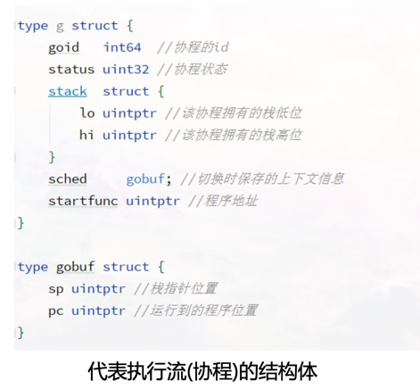

# 线程模型

线程是处理器调度和分配的基本单位，进程则作为资源拥有的基本单位

##一。体系架构
	操作系统根据资源访问权限的不同，体系架构可分为用户空间和内核空间；
		1.内核空间主要操作访问CPU资源、I/O资源、内存资源等硬件资源，为上层应用程序提供最基本的基础资源，
		2.用户空间就是上层应用程序的固定活动空间，用户空间不可以直接访问资源，必须通过“系统调用”、“库函数”或“Shell脚本”来调用内核空间提供的资源。

##二。线程
	所谓的“线程”，往往是用户态的线程user space，和操作系统本身内核态的线程（简称KSE)kernel space。
	协程跟线程是有区别的，线程由CPU调度是抢占式的，协程由用户态调度是协作式的

##三。线程模型分类：
	用户级线程模型、内核级线程模型和两级线程模型

	1. 内核级线程模型
		大部分编程语言的线程库(如linux的pthread，Java的java.lang.Thread，C++11的std::thread等等)
		都是对操作系统的线程（内核级线程）的一层封装，创建出来的每个线程与一个不同的KSE静态关联
	优点：
		现简单，直接借助OS提供的线程能力，并且不同用户线程之间一般也不会相互影响.
		在多核处理器的硬件的支持下，内核空间线程模型支持了真正的并行，当一个线程被阻塞后，允许另一个线程继续执行，所以并发能力较强
	缺点：
		但其创建，销毁以及多个线程之间的上下文切换等操作都是直接由OS层面亲自来做，在需要使用大量线程的场景下对OS的性能影响会很大

	2. 用户级线程模型
	优点： 这种模型的好处是线程上下文切换都发生在用户空间，避免的模态切换（mode switch），从而对于性能有积极的影响
	缺点：所有的线程基于一个内核调度实体即内核线程，这意味着只有一个处理器可以被利用，
		在多处理器环境下这是不能够被接受的，本质上，用户线程只解决了并发问题，但是没有解决并行问题。
		如果线程因为 I/O 操作陷入了内核态，内核态线程阻塞等待 I/O 数据，则所有的线程都将会被阻塞，
		用户空间也可以使用非阻塞而 I/O，但是不能避免性能及复杂度问题

	3. 两级线程模型
		Go语言中支撑整个scheduler实现的主要有4个重要结构，分别是M、G、P、Sched， 前三个定义在runtime.h中，Sched定义在proc.c中
		1. Sched结构就是调度器，它维护有存储M和G的队列以及调度器的一些状态信息等
		2. M结构是Machine，系统线程，它由操作系统管理的，goroutine就是跑在M之上的；
			M是一个很大的结构，里面维护小对象内存cache（mcache）、当前执行的goroutine、随机数发生器等等非常多的信息
		3. P结构是Processor，处理器，它的主要用途就是用来执行goroutine的，它维护了一个goroutine队列，即runqueue。
			Processor是让我们从N:1调度到M:N调度的重要部分
		4. G是goroutine实现的核心结构，它包含了栈，指令指针，以及其他对调度goroutine很重要的信息，例如其阻塞的channel

早期(Go1.0)的实现中并没有P的概念：Go中的调度器直接将G分配到合适的M上运行

	问题：不同的G在不同的M上并发运行时可能都需向系统申请资源（如堆内存），由于资源是全局的，将会由于资源竞争造成很多系统性能损耗
	解决：后面的Go（Go1.1）运行时系统加入了P，让P去管理G对象，M要想运行G必须先与一个P绑定，然后才能运行该P管理的G。
			P对象中预先申请一些系统资源（本地资源），G需要的时候先向自己的本地P申请（无需锁保护），
			如果不够用或没有再向全局申请，而且从全局拿的时候会多拿一部分，以供后面高效的使用。
			就像现在我们去政府办事情一样，先去本地政府看能搞定不，如果搞不定再去中央，从而提供办事效率。
##四。goroutine切换

	goroutine在go代码中无处不在，go程序会根据不同的情况去调度不同的goroutine，一个goroutine在某个时刻要么在运行，要么在等待，或者死亡
	goroutine的切换一般会在以下几种情况下发生：

	1。基于信号抢占式的调度，一个goroutine如果运行很长，会被踢掉
	2。发生系统调用，系统调用会陷入内核，开销不小，暂时解除当前goroutine
	3。channel阻塞，当从channel读不到或者写不进的时候，会切换goroutine
##五。管理员-g0
	go程序中，每个M都会绑定一个叫g0的初代goroutine，它在M的创建的时候创建，g0的主要工作就是goroutine的调度、垃圾回收等。
	g0和我们常规的goroutine的任务不同，g0的栈是在主线程栈上分配的，并且它的栈空间有64k，m0是runtime创建第一个线程，然后m0关联一个本地的p，
	就可以运行g0了。在g0的栈上不断的调度goroutine来执行，当有新的goroutine关联p准备运行发现没有m的时候，就会去创建一个m，m再关联一个g0，
	g0再去调度.
##参考链接
	https://studygolang.com/articles/35104

