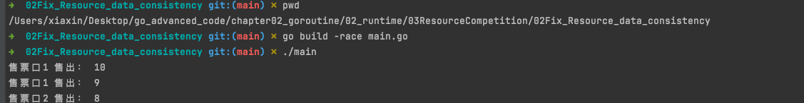

# data race 资源竞争

## 推荐做法

在较大的应用程序中，仅靠自己检查代码很难检测到数据竞争。幸运的是，Go(从V1.1开始)有一个内置的数据竞争检测器，我们可以使用它来确定应用程序里潜在的数据竞争条件

分析问题

## 解决方式
1. Mutex
2. Channel

通常，当goroutine需要相互通信时使用通道，当确保同一时间只有一个goroutine能访问代码的关键部分时使用互斥锁。
我更倾向于使用互斥锁，因为不需要goroutine之间的任何通信。只需要确保同一时间只有一个goroutine拥有共享变量的使用权，互斥锁本来就是为解决这种问题而生的

解决问题后

## 参考资料
1. [官方data race detector](https://go.dev/doc/articles/race_detector)