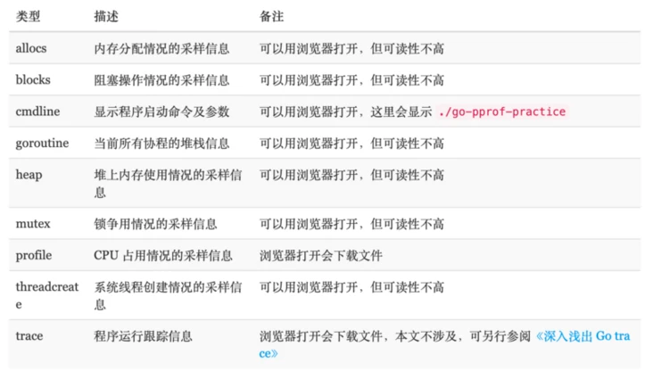

<!-- START doctoc generated TOC please keep comment here to allow auto update -->
<!-- DON'T EDIT THIS SECTION, INSTEAD RE-RUN doctoc TO UPDATE -->
**Table of Contents**  *generated with [DocToc](https://github.com/thlorenz/doctoc)*

- [Go 中监控代码性能pprof](#go-%E4%B8%AD%E7%9B%91%E6%8E%A7%E4%BB%A3%E7%A0%81%E6%80%A7%E8%83%BDpprof)
  - [展示参数](#%E5%B1%95%E7%A4%BA%E5%8F%82%E6%95%B0)
    - [源码](#%E6%BA%90%E7%A0%81)
  - [两个包：](#%E4%B8%A4%E4%B8%AA%E5%8C%85)
  - [net/http/pprof 源码分析](#nethttppprof-%E6%BA%90%E7%A0%81%E5%88%86%E6%9E%90)
    - [Profile 举例](#profile-%E4%B8%BE%E4%BE%8B)
  - [介绍：](#%E4%BB%8B%E7%BB%8D)
  - [pprof 文件分析](#pprof-%E6%96%87%E4%BB%B6%E5%88%86%E6%9E%90)
  - [第三方性能分析来分析代码包](#%E7%AC%AC%E4%B8%89%E6%96%B9%E6%80%A7%E8%83%BD%E5%88%86%E6%9E%90%E6%9D%A5%E5%88%86%E6%9E%90%E4%BB%A3%E7%A0%81%E5%8C%85)

<!-- END doctoc generated TOC please keep comment here to allow auto update -->

# Go 中监控代码性能pprof

pprof 是用于可视化和分析性能分析数据的工具

pprof 以 profile.proto 读取分析样本的集合，并生成报告以可视化并帮助分析数据（支持文本和图形报告）

profile.proto 是一个 Protocol Buffer v3 的描述文件，它描述了一组 callstack 和 symbolization 信息， 作用是表示统计分析的一组采样的调用栈，是很常见的 stacktrace 配置文件格式


## 展示参数


allocs 和 heap 采样的信息一致，不过前者是所有对象的内存分配，而 heap 则是活跃对象的内存分配


4 种类型

- CPU profiling（CPU 性能分析）：这是最常使用的一种类型。用于分析函数或方法的执行耗时；
- Memory profiling：这种类型也常使用。用于分析程序的内存占用情况；
- Block profiling：这是 Go 独有的，用于记录 goroutine 在等待共享资源花费的时间；
- Mutex profiling：与 Block profiling 类似，但是只记录因为锁竞争导致的等待或延迟。

### 源码
```go
profiles.m = map[string]*Profile{
    "goroutine":    goroutineProfile,  //显示当前所有协程的堆栈信息
    "threadcreate": threadcreateProfile, // 系统线程创建情况的采样信息
    "heap":         heapProfile,  // 堆上的内存分配情况的采样信息
    "allocs":       allocsProfile,  //内存分配情况的采样信息
    "block":        blockProfile,  //阻塞操作情况的采样信息
    "mutex":        mutexProfile,  // 锁竞争情况的采样信息
}
```


## 两个包：
1. net/http/pprof
使用场景：在线服务（一直运行着的程序）

2. runtime/pprof
使用场景：工具型应用（比如说定制化的分析小工具、集成到公司监控系统）

这两个包都是可以监控代码性能的， 只不过net/http/pprof是通过http端口方式暴露出来的，内部封装的仍然是runtime/pprof。

## net/http/pprof 源码分析
```go
//  net/http/pprof/pprof.go
func init() {
	http.HandleFunc("/debug/pprof/", Index)
	http.HandleFunc("/debug/pprof/cmdline", Cmdline)
	http.HandleFunc("/debug/pprof/profile", Profile)
	http.HandleFunc("/debug/pprof/symbol", Symbol)
	http.HandleFunc("/debug/pprof/trace", Trace)
}
```
1. 第一个路径 /debug/pprof/ 下面其实还有 5 个子路径：
- goroutine
- threadcreate
- heap
- block
- mutex

直接使用如下命令，则不需要通过点击浏览器上的链接就能进入命令行交互模式：
```go
go tool pprof http://47.93.238.9:8080/debug/pprof/profile

```

当然也是需要先后台采集一段时间的数据，再将数据文件下载到本地，最后进行分析。上述的 Url 后面还可以带上时间参数：?seconds=60，自定义 CPU Profiling 的时长。


类似的命令还有：
```shell
# 下载 cpu profile，默认从当前开始收集 30s 的 cpu 使用情况，需要等待 30s
go tool pprof http://47.93.238.9:8080/debug/pprof/profile
# wait 120s
go tool pprof http://47.93.238.9:8080/debug/pprof/profile?seconds=120     

# 下载 heap profile
go tool pprof http://47.93.238.9:8080/debug/pprof/heap

# 下载 goroutine profile
go tool pprof http://47.93.238.9:8080/debug/pprof/goroutine

# 下载 block profile
go tool pprof http://47.93.238.9:8080/debug/pprof/block

# 下载 mutex profile
go tool pprof http://47.93.238.9:8080/debug/pprof/mutex
```

### Profile 举例
```go
func Profile(w http.ResponseWriter, r *http.Request) {
    // ...
	if err := pprof.StartCPUProfile(w); err != nil {
		// StartCPUProfile failed, so no writes yet.
		serveError(w, http.StatusInternalServerError,
			fmt.Sprintf("Could not enable CPU profiling: %s", err))
		return
	}
	sleep(w, time.Duration(sec)*time.Second)
	pprof.StopCPUProfile()
}
```
这个函数也是调用runtime/pprof的StartCPUProfile(w)方法开始 CPU profiling，然后睡眠一段时间（这个时间就是采样间隔），最后调用pprof.StopCPUProfile()停止采用.

StartCPUProfile()方法传入的是http.ResponseWriter类型变量，所以采样结果直接写回到 HTTP 的客户端

## 介绍：
runtime/pprof中的程序来生成三种包含实时性数据的概要文件，分别是
1. CPU概要文件   
在默认情况下，Go语言的运行时系统会以100 Hz的的频率对CPU使用情况进行取样。
2. 内存概要文件   
内存概要文件用于保存在用户程序执行期间的内存使用情况。这里所说的内存使用情况，其实就是程序运行过程中堆内存的分配情况。
3. 程序阻塞概要文件   
程序阻塞概要文件用于保存用户程序中的Goroutine阻塞事件的记录。


## pprof 文件分析

pprof 文件是二进制的，不是给人读的，需要翻译一下，而 golang 原生就给我们提供了分析工具，直接执行下面命令即可，会生成一张很直观的 svg 图片，
直接用 chrome 就可以打开，当然也可以生成别的格式（pdf，png 都可以），可以用 go tool pprof -h 命令查看支持的输出类型
   
##  第三方性能分析来分析代码包
runtime.pprof 提供基础的运行时分析的驱动，但是这套接口使用起来还不是太方便，例如：
1. 输出数据使用 io.Writer 接口，虽然扩展性很强，但是对于实际使用不够方便，不支持写入文件。
2. 默认配置项较为复杂。

runtime/pprof使用起来有些不便，因为要重复编写打开文件，开启分析，结束分析的代码.

使用下面代码安装这个包
```go
go get github.com/pkg/profile
```
使用
```go
defer profile.Start().Stop()
```


