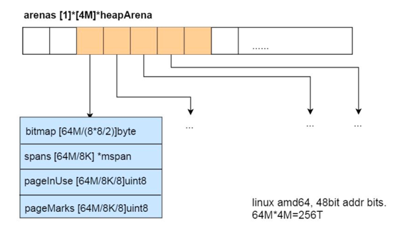
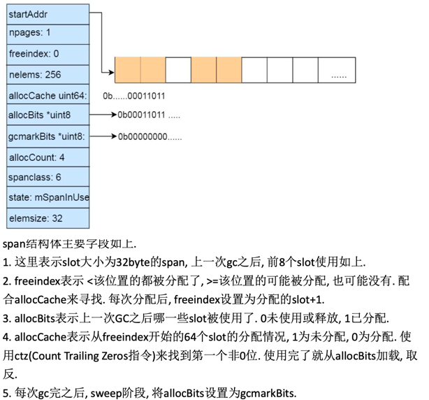
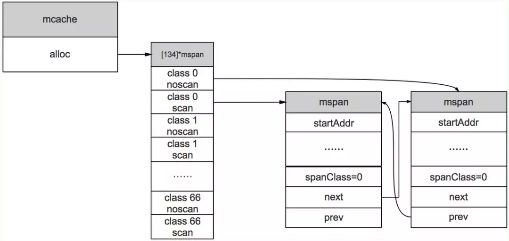

# golang内存管理

## 概述
Golang的内存分配器是基于TCMalloc实现的。Golang 的程序在启动之初，会一次性从操作系统那里申请一大块内存(初始堆内存应该是 64M 左右)作为内存池。  
这块内存空间会放在一个叫 mheap 的 struct 中管理，mheap 负责将这一整块内存切割成不同的区域(spans, bitmap ,areana)，并将其中一部分的内存切割成合适的大小，分配给用户使用。


1. arena区域就是我们所谓的堆区，Go动态分配的内存都是在这个区域，它把内存分割成 8KB大小的页，一些页组合起来称为 mspan

2. bitmap区域标识 arena区域哪些地址保存了对象，并用 4bit标志位表示对象是否包含指针、 GC标记信息。
bitmap中一个 byte大小的内存对应 arena区域中4个指针大小（指针大小为 8B ）的内存，所以 bitmap区域的大小是 512GB/(4*8B)=16GB。


3. spans区域存放 mspan（也就是一些 arena分割的页组合起来的内存管理基本单元，后文会再讲）的指针，每个指针对应一页，
所以 spans区域的大小就是 512GB/8KB*8B=512MB.创建 mspan的时候，按页填充对应的 spans区域，在回收 object时，根据地址很容易就能找到它所属的 mspan
## 内存管理的几个概念

* page 内存页，一块 8K 大小的内存空间。Go 与操作系统之间的内存申请和释放，都是以 page 为单位的。
* mheap 堆分配器，以8192byte页进行管理
* mspan 由mheap管理的页面
* mcentral 所有给定大小类的mspan集合，Central组件其实也是一个缓存，但它缓存的不是小对象内存块，而是一组一组的内存page(一个page占4k大小)
* mcache 运行时分配池，每个线程都有自己的局部内存缓存mCache，实现goroutine高并发的重要因素(分配小对象可直接从mCache中分配，不用加锁)

* arena 区域就是heap，是供分配维护的内存池，对应区域大小是512G；
* bitmap 区域是标识arena中那些地址保存了对象，及对象中是否包含了指针，其中1个byte（8bit）对应arena中4个指针大小的内存（即：2bit对应1个指针大小），对应大小16G；
* span 是页管理单元，是内存分配的基本单位，其中一个指针对应arena中1个虚拟地址页大小（8kb），对应大小512M
* sizeclass 空间规格，每个 span 都带有一个 sizeclass ，标记着该 span 中的 page 应该如何使用。使用上面的比喻，就是 sizeclass 标志着 span 是一个什么样的队伍。
* object  对象，用来存储一个变量数据内存空间，一个 span 在初始化时，会被切割成一堆等大的 object 。
    假设 object 的大小是 16B ， span 大小是 8K ，那么就会把 span 中的 page 就会被初始化 8K / 16B = 512 个 object 。
    所谓内存分配，就是分配一个 object 出去

### 1.10及以前


	arena的大小为512G, 为了方便管理把arena区域划分成一个个的page, 每个page 8KB, 一共有512GB/8KB个页
	spans区域存放指向span的指针, 表示arean中对应的Page所属的span, 所以span区域的大小为(512GB/8KB)*指针大小8byte = 512M
	bitmap主要用于GC, 用两个bit表示 arena中一个字的可用状态, 所以是 (512G/8个字节一个字)*2/8个bit每个字节=16G

### 1.11及以后:


	改成了两阶稀疏索引的方式. 内存可以超过512G, 也可以允许不连续的内存.
	mheap中的arenas字段是一个指针数组, 每个heapArena管理64M的内存.
	bitmap和spans和上面的功能一致.

## 1. 内存管理单元
mspan：Go中内存管理的基本单元，是由一片连续的 8KB的页组成的大块内存。注意，这里的页和操作系统本身的页并不是一回事，它一般是操作系统页大小的几倍。
一句话概括： mspan是一个包含起始地址、 mspan规格、页的数量等内容的双端链表。
每个 mspan按照它自身的属性 SizeClass的大小分割成若干个 object，每个 object可存储一个对象。并且会使用一个位图来标记其尚未使用的 object。
属性 SizeClass决定 object大小，而 mspan只会分配给和 object尺寸大小接近的对象，当然，对象的大小要小于 object大小
使用span机制来减少碎片. 每个span至少分配1个page(8KB), 划分成固定大小的slot, 用于分配一定大小范围的内存需求.
```go
// runtime/sizeclasses.go
// class  bytes/obj  bytes/span  objects  tail waste  max waste
//     1          8        8192     1024           0     87.50%
//     2         16        8192      512           0     43.75%
//     3         32        8192      256           0     46.88%
//     4         48        8192      170          32     31.52%
//     5         64        8192      128           0     23.44%
//     6         80        8192      102          32     19.07%
//     7         96        8192       85          32     15.95%
//     8        112        8192       73          16     13.56%
//     9        128        8192       64           0     11.72%
//    10        144        8192       56         128     11.82%
//    11        160        8192       51          32      9.73%
//    12        176        8192       46          96      9.59%
//    13        192        8192       42         128      9.25%
//    14        208        8192       39          80      8.12%
//    15        224        8192       36         128      8.15%
//    16        240        8192       34          32      6.62%
//    17        256        8192       32           0      5.86%
//    18        288        8192       28         128     12.16%
//    19        320        8192       25         192     11.80%
//    20        352        8192       23          96      9.88%
//    21        384        8192       21         128      9.51%
//    22        416        8192       19         288     10.71%
//    23        448        8192       18         128      8.37%
//    24        480        8192       17          32      6.82%
//    25        512        8192       16           0      6.05%
//    26        576        8192       14         128     12.33%
//    27        640        8192       12         512     15.48%
//    28        704        8192       11         448     13.93%
//    29        768        8192       10         512     13.94%
//    30        896        8192        9         128     15.52%
//    31       1024        8192        8           0     12.40%
//    32       1152        8192        7         128     12.41%
//    33       1280        8192        6         512     15.55%
//    34       1408       16384       11         896     14.00%
//    35       1536        8192        5         512     14.00%
//    36       1792       16384        9         256     15.57%
//    37       2048        8192        4           0     12.45%
//    38       2304       16384        7         256     12.46%
//    39       2688        8192        3         128     15.59%
//    40       3072       24576        8           0     12.47%
//    41       3200       16384        5         384      6.22%
//    42       3456       24576        7         384      8.83%
//    43       4096        8192        2           0     15.60%
//    44       4864       24576        5         256     16.65%
//    45       5376       16384        3         256     10.92%
//    46       6144       24576        4           0     12.48%
//    47       6528       32768        5         128      6.23%
//    48       6784       40960        6         256      4.36%
//    49       6912       49152        7         768      3.37%
//    50       8192        8192        1           0     15.61%
//    51       9472       57344        6         512     14.28%
//    52       9728       49152        5         512      3.64%
//    53      10240       40960        4           0      4.99%
//    54      10880       32768        3         128      6.24%
//    55      12288       24576        2           0     11.45%
//    56      13568       40960        3         256      9.99%
//    57      14336       57344        4           0      5.35%
//    58      16384       16384        1           0     12.49%
//    59      18432       73728        4           0     11.11%
//    60      19072       57344        3         128      3.57%
//    61      20480       40960        2           0      6.87%
//    62      21760       65536        3         256      6.25%
//    63      24576       24576        1           0     11.45%
//    64      27264       81920        3         128     10.00%
//    65      28672       57344        2           0      4.91%
//    66      32768       32768        1           0     12.50%
```
class0表示单独分配一个>32KB对象的span, 有67个 size, 每个size两种, 用于分配有指针和无指针对象, 所以 有67*2=134个class.

```go
//结构
// path: go/src/runtime/mheap.go
type mspan struct{
	//链表后向指针，用于将span链接起来
	next *mspan
	//链表前向指针，用于将span链接起来
	prev *mspan
	// 起始地址，也即所管理页的地址
	startAddr uintptr
	// 管理的页数
	npages uintptr
	// 块个数，表示有多少个块可供分配
	nelems uintptr
	//分配位图，每一位代表一个块是否已分配
	allocBits *gcBits
	// 已分配块的个数
	allocCount uint16
	// class表中的class ID，和Size Classs相关
	spanclass spanClass
	// class表中的对象大小，也即块大小
	elemsize uintptr
}
```


## 2. 内存管理组件
内存分配由内存分配器完成。分配器由3种组件构成： mcache, mcentral, mheap
### 1. mcache：

	每个工作线程都会绑定一个mcache，本地缓存可用的 mspan资源，这样就可以直接给Goroutine分配，因为不存在多个Goroutine竞争的情况，所以不会消耗锁资源。
```go
type mcache struct{
	alloc [numSpanClasses]*mspan
}
numSpanClasses = _NumSizeClasses << 1
```

### 2. mcentral：

	为所有 mcache提供切分好的 mspan资源。每个 central保存一种特定大小的全局 mspan列表，包括已分配出去的和未分配出去的。
	每个 mcentral对应一种 mspan，而 mspan的种类导致它分割的 object大小不同。当工作线程的 mcache中没有合适（也就是特定大小的）的 mspan时就会从 mcentral获取

```go
// 	path: /usr/local/go/src/runtime/mcentral.go
type mcentral struct {
    // 互斥锁
    lock mutex

    // 规格
    sizeclass int32

    // 尚有空闲object的mspan链表
    nonempty mSpanList

    // 没有空闲object的mspan链表，或者是已被mcache取走的msapn链表
    empty mSpanList

    // 已累计分配的对象个数
    nmalloc uint64
}
```

### 3. mheap：
	代表Go程序持有的所有堆空间，Go程序使用一个 mheap的全局对象 _mheap来管理堆内存
```go
//path: /usr/local/go/src/runtime/mheap.go
type mheap struct {
    lock mutex
    // spans: 指向mspans区域，用于映射mspan和page的关系
    spans []*mspan
    // 指向bitmap首地址，bitmap是从高地址向低地址增长的
    bitmap uintptr
    // 指示arena区首地址
    arena_start uintptr
    // 指示arena区已使用地址位置
    arena_used  uintptr
    // 指示arena区末地址
    arena_end   uintptr
    central [67*2]struct {
        mcentral mcentral
        pad [sys.CacheLineSize-unsafe.Sizeof(mcentral{})%sys.CacheLineSize]byte
    }
}
```

bitmap和arena_start指向了同一个地址，这是因为bitmap的地址是从高到低增长

内存分配流程


	变量是在栈上分配还是在堆上分配，是由逃逸分析的结果决定的。通常情况下，编译器是倾向于将变量分配到栈上的，因为它的开销小，最极端的就是"zero garbage"，
	所有的变量都会在栈上分配，这样就不会存在内存碎片，垃圾回收之类的东西。


大体上的分配流程：

1. 范围: >32KB 的对象，直接从mheap上分配

2. <=16B 且无指针(noscan)的对象使用mcache的tiny分配器分配；

3. (16B,32KB] 的对象，首先计算对象的规格大小，然后使用mcache中相应规格大小的mspan分配；

    1. 如果mcache没有相应规格大小的mspan，则向mcentral申请

    2. 如果mcentral没有相应规格大小的mspan，则向mheap申请

    3. 如果mheap中也没有合适大小的mspan， 则调用sysAlloc(mmap)向系 统申请

## 分配器


## 内存管理器初始化
在golang程序初始化时，runtime中会初始化内存管理器，调用函数 mallocinit()


## 逃逸分析

1. 发送指针或者是带有指针的值到channel里。编译时期没有办法知道哪个goroutine会受到channel中的数据。因此编译器无法确定这个数据什么时候不再被引用到。

2. 在slice中存储指针或者是带有指针的值。这种情况的一个例子是[]*string。它总会导致slice中的内容逃逸。尽管切片底层的数组还是在堆上，但是引用的数据逃逸到堆上了。

3. slice底层数组由于append操作超过了它的容量，它会重新分片内存。如果在编译时期知道切片的初始大小，则它会在栈上分配。如果切片的底层存储必须被扩展，数据在运行时才获取到。则它将在堆上分配。

4. 在接口类型上调用方法。对接口类型的方法调用是动态调用--接口的具体实现只有在运行时期才能确定。考虑一个接口类型为io.Reader的变量r。
对r.Read(b)的调用将导致r的值和byte slice b的底层数组都逃逸，因此在堆上进行分配

推荐文章：https://studygolang.com/articles/23010

