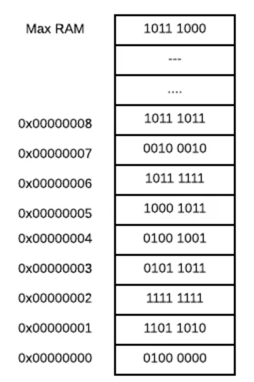
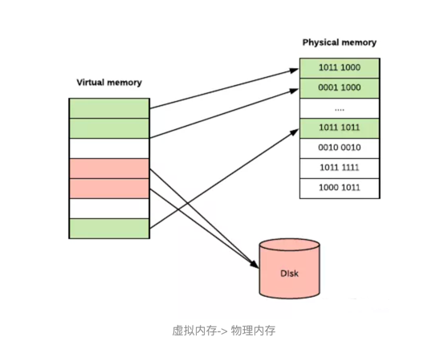

# Linux系统内存管理

## 用户空间与内核空间


现在操作系统都是采用虚拟存储器，那么对 32 位操作系统而言，它的寻址空间（虚拟存储空间）为 4G（2 的 32 次方）。
操作系统的核心是内核，独立于普通的应用程序，可以访问受保护的内存空间，也有访问底层硬件设备的所有权限。
为了保证用户进程不能直接操作内核（kernel），保证内核的安全，操心系统将虚拟空间划分为两部分，一部分为内核空间，一部分为用户空间。

针对 linux 操作系统而言，将最高的 1G 字节（从虚拟地址 0xC0000000 到 0xFFFFFFFF），供内核使用，称为内核空间，
而将较低的 3G 字节（从虚拟地址 0x00000000 到 0xBFFFFFFF），供各个进程使用，称为用户空间

## 进程地址空间


每个进程都有一个线性虚拟地址空间，地址从 0 到最大值。虚拟地址空间不需要是连续的，因此并非所有这些虚拟地址实际上都用于存储数据，并且它们不占用 RAM 或磁盘中的空间。
很酷的一点是，真实内存的同一帧可以支持属于多个进程的多个虚拟页面。通常就是这种情况，虚拟内存占用 GNU C 库代码（libc），如果使用 go build 进行编译，则默认包含该代码。
你可以通过添加 ldflags 参数来设置编译时不带 libc 的代码：
```go
go build -ldflags '-libgcc=none'
```

目标文件是直接在处理器上执行的程序的二进制表示。这些目标文件不仅包含机器代码，还包含有关应用程序的元数据，如操作系统体系结构，调试信息。
目标文件还携带应用程序数据，如全局变量或常量。通常，目标文件由以下段（section）组成，如：.text（可执行代码），.data（全局变量） 和 .rodata（全局常量） 等。

- text段包含程序指令、字面量和静态常量。
- data段是程序的工作存储器。它可以由 exec 预分配和预加载，进程可以扩展或收缩它。

Libc 手册解释是，程序可以使用 exec 系列函数和编程方式以两种主要方式进行分配。
exec  调用程序加载器来启动程序，从而为进程创建虚拟地址空间，将程序加载进内存并运行它。常用的编程方式有：

- 静态分配是在声明全局变量时发生的事情。每个全局变量定义一个固定大小的空间块。当你的程序启动时（exec 操作的一部分），该空间被分配一次，并且永远不会被释放。
- 自动分配 - 声明自动变量（例如函数参数或局部变量）时会发生自动分配。输入包含声明的复合语句时会分配自动变量的空间，并在退出该复合语句时释放。
- 动态分配 - 是一种程序确定它们在哪里运行，并存储某些信息的技术。当你需要的内存量或你需要多长时间时，你需要动态分配，这取决于程序运行之前未知的因素。

要动态分配内存，你有几个选择。其中一个选项是调用操作系统（syscall 或通过 libc）。操作系统提供各种功能，如：
- mmap/munmap - 分配/解除分配固定块内存页面。mmap 是在进程的虚拟地址空间中（堆和栈中间，称为“文件映射区域”的地方）找一块空闲的虚拟内存。
- brk/sbrk - 更改/获取数据分段大小 brk 是将数据段（.data）的最高地址指针 _enddata 往高地址推。
- madvise - 提供操作系统如何管理内存的建议。
- set_thread_area/get_thread_area - 适用于线程本地存储。


mmap,brk这两种方式分配的都是虚拟内存，没有分配物理内存。
在第一次访问已分配的虚拟地址空间的时候，发生缺页中断，操作系统负责分配物理内存，然后建立虚拟内存和物理内存之间的映射关系（一般是硬件单元MMU管理）。


我认为 Go 语言的运行时只使用 mmap、 madvise、 munmap 与 sbrk，并且它们都是在操作系统下通过汇编或者 cgo 直接调用的，也就是说它不会调用 libc。
这些内存分配是低级别的，通常程序员不使用它们。

更常见的是使用 libc 的 malloc 系列函数，当你向系统申请 n 个字节的内存时，libc 将为你分配内存。
同时，你不需要这些内存的时候，要调用 free 来释放这些内存。


## 库函数malloc
1）当开辟的空间小于 128K 时，调用 brk（）函数，malloc 的底层实现是系统调用函数 brk（），其主要移动指针 _enddata(此时的 _enddata 指的是 Linux 地址空间中堆段的末尾地址，不是数据段的末尾地址)

2）当开辟的空间大于 128K 时，mmap（）系统调用函数来在虚拟地址空间中（堆和栈中间，称为“文件映射区域”的地方）找一块空间来开辟。

## 分配算法TCMalloc


TCMalloc 相关的信息可以看这里：http://goog-perftools.sourceforge.net/doc/tcmalloc.html

由于 Go 语言不使用 malloc 来获取内存，而是直接操作系统申请（通过 mmap），它必须自己实现内存分配和释放（就像 malloc 一样）。
Go 语言的内存分配器最初基于 TCMalloc：Thread-Caching Malloc，但是现在已经有了很大的不同。

Golang运行时的内存分配算法主要源自 Google 为 C 语言开发的 TCMalloc算法，全称 Thread-CachingMalloc,即线程缓存的malloc.
核心思想就是把内存分为多级管理，从而降低锁的粒度。

它将可用的堆内存采用二级分配的方式进行管理：每个线程都会自行维护一个独立的内存池，进行内存分配时优先从该内存池中分配，
当内存池不足时才会向全局内存池申请，以避免不同线程对全局内存池的频繁竞争

TCMalloc是gperftools的一部分，除TCMalloc外，gperftools还包括heap-checker、heap-profiler和cpu-profiler。


## Go程序解析
```go
func main() {
    http.HandleFunc("/bar", func(w http.ResponseWriter, r *http.Request) {
        fmt.Fprintf(w, "Hello, %q", html.EscapeString(r.URL.Path))
    })

    http.ListenAndServe(":8080", nil)
}
```


- PID :进程Id
- %CPU:（处理器）使用百分比
- TT: 控制终端的缩写名称
- STAT: 状态代码（O，R，S，T，Z）
- TIME: 积累CPU时间
- COMMAND: 正被执行的命令的完整名称
- 虚拟内存大小(VSZ)是进程可以访问的所有内存，包括换出的内存、分配但未使用的内存和共享库中的内存.
- 驻留集大小（RSS）是进程在实际内存中的内存页数乘以内存页大小，这里不包括换出的内存页（译者注：包含共享库占用的内存）。


## 物理和虚拟内存


我们可以将物理内存看作是一个槽/单元的数组，其中槽可以容纳 8 个位信息 1。每个内存槽都有一个地址。



虚拟内存可以使用基于 CPU 体系结构和操作系统的段或页表来实现。页表更常见。

在分页虚拟内存中，我们将虚拟内存划分为块，称为页。页的大小可以根据硬件的不同而有所不同，但是页的大小通常是 4-64 KB，此外，通常还能够使用从 2MB 到 1GB 的巨大的页。
分块很有用，因为单独管理每个内存槽需要更多的内存，而且会降低计算机的性能。


为了实现分页虚拟内存，计算机通常有一个称为内存管理单元(MMU)的芯片，它位于 CPU 和内存之间。
MMU 在一个名为页表的表(它存储在内存中)中保存了从虚拟地址到物理地址的映射，其中每页包含一个页表项(PTE)。
MMU 还有一个物理缓存旁路转换缓冲(TLB)，用来存储最近从虚拟内存到物理内存的转换。

因此，假设操作系统决定将一些虚拟内存页放入磁盘，程序会尝试访问它。此过程如下所示：

1. CPU 发出访问虚拟地址的命令，MMU 在其页面表中检查它并禁止访问，因为没有为该虚拟页面分配物理 RAM。
2. 然后 MMU 向 CPU 发送页错误。
3. 然后，操作系统通过查找 RAM 的备用内存块（称为帧）并设置新的 PTE 来映射它来处理页错误。
4. 如果没有 RAM 是空闲的，它可以使用一些替换算法选择现有页面，并将其保存到磁盘（此过程称为分页）。
5. 对于一些内存管理单元，还可能出现页表入口不足的情况，在这种情况下，操作系统必须为新的映射释放一个表入口。

