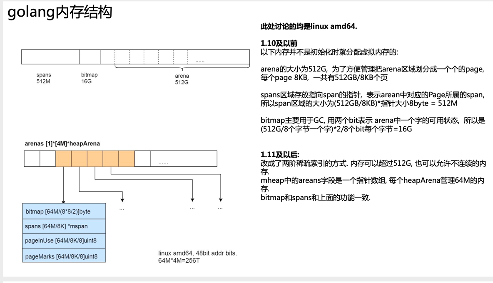
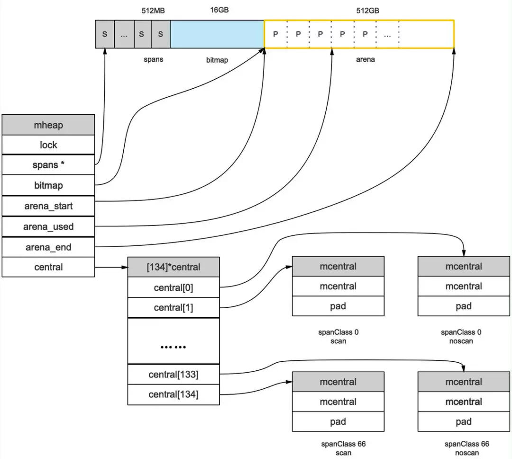

#GO内存
分配算法
    
	Golang运行时的内存分配算法主要源自 Google 为 C 语言开发的 TCMalloc算法，全称 Thread-CachingMalloc.核心思想就是把内存分为多级管理，
	从而降低锁的粒度。它将可用的堆内存采用二级分配的方式进行管理：每个线程都会自行维护一个独立的内存池，进行内存分配时优先从该内存池中分配，
    当内存池不足时才会向全局内存池申请，以避免不同线程对全局内存池的频繁竞争

	1.arena区域就是我们所谓的堆区，Go动态分配的内存都是在这个区域，它把内存分割成 8KB大小的页，一些页组合起来称为 mspan
	2.bitmap区域标识 arena区域哪些地址保存了对象，并用 4bit标志位表示对象是否包含指针、 GC标记信息。 bitmap中一个 byte大小的内存对应 arena区域中4个指针大小（指针大小为 8B ）的内存，所以 bitmap区域的大小是 512GB/(4*8B)=16GB。
	3.spans区域存放 mspan（也就是一些 arena分割的页组合起来的内存管理基本单元，后文会再讲）的指针，每个指针对应一页，
	所以 spans区域的大小就是 512GB/8KB*8B=512MB.创建 mspan的时候，按页填充对应的 spans区域，在回收 object时，根据地址很容易就能找到它所属的 mspan
#1.内存管理单元
```go
//mspan：Go中内存管理的基本单元，是由一片连续的 8KB的页组成的大块内存。注意，这里的页和操作系统本身的页并不是一回事，它一般是操作系统页大小的几倍。一句话概括： mspan是一个包含起始地址、 mspan规格、页的数量等内容的双端链表。
//每个 mspan按照它自身的属性 SizeClass的大小分割成若干个 object，每个 object可存储一个对象。并且会使用一个位图来标记其尚未使用的 object。属性 SizeClass决定 object大小，而 mspan只会分配给和 object尺寸大小接近的对象，当然，对象的大小要小于 object大小
//结构
    // path: go/src/runtime/mheap.go
    type mspan struct{
        //链表后向指针，用于将span链接起来
        next *mspan
        //链表前向指针，用于将span链接起来
        prev *mspan
        // 起始地址，也即所管理页的地址
        startAddr uintptr
        // 管理的页数
        npages uintptr
        // 块个数，表示有多少个块可供分配
        nelems uintptr
        //分配位图，每一位代表一个块是否已分配
        allocBits *gcBits
        // 已分配块的个数
        allocCount uint16
        // class表中的class ID，和Size Classs相关
        spanclass spanClass
        // class表中的对象大小，也即块大小
        elemsize uintptr
    }
```
#2.内存管理组件
内存分配由内存分配器完成。分配器由3种组件构成： mcache, mcentral, mheap
##1.mcache：
	每个工作线程都会绑定一个mcache，本地缓存可用的 mspan资源，这样就可以直接给Goroutine分配，因为不存在多个Goroutine竞争的情况，所以不会消耗锁资源。
	type mcache struct{
		alloc [numSpanClasses]*mspan
	}
	numSpanClasses = _NumSizeClasses << 1
##2。mcentral：
	为所有 mcache提供切分好的 mspan资源。每个 central保存一种特定大小的全局 mspan列表，包括已分配出去的和未分配出去的。
	每个 mcentral对应一种 mspan，而 mspan的种类导致它分割的 object大小不同。当工作线程的 mcache中没有合适（也就是特定大小的）的 mspan时就会从 mcentral获取
	/path: /usr/local/go/src/runtime/mcentral.go
```go
type mcentral struct {
    // 互斥锁
    lock mutex

    // 规格
    sizeclass int32

    // 尚有空闲object的mspan链表
    nonempty mSpanList

    // 没有空闲object的mspan链表，或者是已被mcache取走的msapn链表
    empty mSpanList

    // 已累计分配的对象个数
    nmalloc uint64
}
```
##3.mheap：
	代表Go程序持有的所有堆空间，Go程序使用一个 mheap的全局对象 _mheap来管理堆内存
```go

//path: /usr/local/go/src/runtime/mheap.go
type mheap struct{
    lock mutex
    // spans: 指向mspans区域，用于映射mspan和page的关系
    spans []*mspan
    // 指向bitmap首地址，bitmap是从高地址向低地址增长的
    bitmap uintptr
    // 指示arena区首地址
    arena_start uintptr
    // 指示arena区已使用地址位置
    arena_used  uintptr
    // 指示arena区末地址
    arena_end   uintptr
    central [67*2]struct {
        mcentral mcentral
        pad [sys.CacheLineSize-unsafe.Sizeof(mcentral{})%sys.CacheLineSize]byte
    }
}
```

		bitmap和arena_start指向了同一个地址，这是因为bitmap的地址是从高到低增长
内存分配流程

	变量是在栈上分配还是在堆上分配，是由逃逸分析的结果决定的。通常情况下，编译器是倾向于将变量分配到栈上的，因为它的开销小，最极端的就是"zero garbage"，
	所有的变量都会在栈上分配，这样就不会存在内存碎片，垃圾回收之类的东西。

	Go的内存分配器在分配对象时，根据对象的大小，分成三类：小对象（小于等于16B）、一般对象（大于16B，小于等于32KB）、大对象（大于32KB）。

	大体上的分配流程：

		1.>32KB 的对象，直接从mheap上分配；

		2.<=16B 的对象使用mcache的tiny分配器分配；

		3.(16B,32KB] 的对象，首先计算对象的规格大小，然后使用mcache中相应规格大小的mspan分配；

			a.如果mcache没有相应规格大小的mspan，则向mcentral申请

			b.如果mcentral没有相应规格大小的mspan，则向mheap申请

			c.如果mheap中也没有合适大小的mspan，则向操作系统申请

