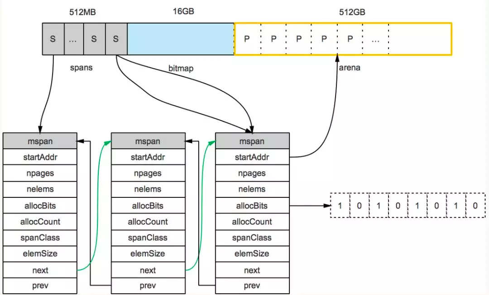

#Linux系统内存管理
##进程地址空间

一个linux进程的虚拟地址空间分布如图所示，分为内核空间和进程空间，对于一个32位操作系统来说，4GB的空间分成两部分，低地址的0~3G给用户空间，高地址的3G~4G给内核空间

##系统层面内存分配
	从操作系统角度看，进程分配内存有两种方式，分别由两个系统调用完成：brk 和 mmap (不考虑共享内存)
	
	1）brk 是将数据段（.data）的最高地址指针 _edata 往高地址推
	
	2）mmap 是在进程的虚拟地址空间中（堆和栈中间，称为“文件映射区域”的地方）找一块空闲的虚拟内存。
	
	这两种方式分配的都是虚拟内存，没有分配物理内存。在第一次访问已分配的虚拟地址空间的时候，发生缺页中断，操作系统负责分配物理内存，然后建立虚拟内存和物理内存之间的映射关系（一般是硬件单元MMU管理）。

##库函数malloc
	1）当开辟的空间小于 128K 时，调用 brk（）函数，malloc 的底层实现是系统调用函数 brk（），其主要移动指针 _enddata(此时的 _enddata 指的是 Linux 地址空间中堆段的末尾地址，不是数据段的末尾地址)
	
	2）当开辟的空间大于 128K 时，mmap（）系统调用函数来在虚拟地址空间中（堆和栈中间，称为“文件映射区域”的地方）找一块空间来开辟。


##分配算法TCMalloc

    
	Golang运行时的内存分配算法主要源自 Google 为 C 语言开发的 TCMalloc算法，全称 Thread-CachingMalloc,即线程缓存的malloc.
	核心思想就是把内存分为多级管理，从而降低锁的粒度。

	它将可用的堆内存采用二级分配的方式进行管理：每个线程都会自行维护一个独立的内存池，进行内存分配时优先从该内存池中分配，
    当内存池不足时才会向全局内存池申请，以避免不同线程对全局内存池的频繁竞争

	TCMalloc是gperftools的一部分，除TCMalloc外，gperftools还包括heap-checker、heap-profiler和cpu-profiler
#golang内存管理
##概述
	Golang的内存分配器是基于TCMalloc实现的。Golang 的程序在启动之初，会一次性从操作系统那里申请一大块内存(初始堆内存应该是 64M 左右)作为内存池。
	这块内存空间会放在一个叫 mheap 的 struct 中管理，mheap 负责将这一整块内存切割成不同的区域(spans, bitmap ,areana)，并将其中一部分的内存切割成合适的大小，分配给用户使用。


	1.arena区域就是我们所谓的堆区，Go动态分配的内存都是在这个区域，它把内存分割成 8KB大小的页，一些页组合起来称为 mspan

	2.bitmap区域标识 arena区域哪些地址保存了对象，并用 4bit标志位表示对象是否包含指针、 GC标记信息。
	bitmap中一个 byte大小的内存对应 arena区域中4个指针大小（指针大小为 8B ）的内存，所以 bitmap区域的大小是 512GB/(4*8B)=16GB。


	3.spans区域存放 mspan（也就是一些 arena分割的页组合起来的内存管理基本单元，后文会再讲）的指针，每个指针对应一页，
	所以 spans区域的大小就是 512GB/8KB*8B=512MB.创建 mspan的时候，按页填充对应的 spans区域，在回收 object时，根据地址很容易就能找到它所属的 mspan
##内存管理的几个概念

	* page 内存页，一块 8K 大小的内存空间。Go 与操作系统之间的内存申请和释放，都是以 page 为单位的。
	* mheap 堆分配器，以8192byte页进行管理
	* mspan 由mheap管理的页面
	* mcentral 所有给定大小类的mspan集合，Central组件其实也是一个缓存，但它缓存的不是小对象内存块，而是一组一组的内存page(一个page占4k大小)
	* mcache 运行时分配池，每个线程都有自己的局部内存缓存mCache，实现goroutine高并发的重要因素(分配小对象可直接从mCache中分配，不用加锁)
 
	* arena 区域就是heap，是供分配维护的内存池，对应区域大小是512G；
	* bitmap 区域是标识arena中那些地址保存了对象，及对象中是否包含了指针，其中1个byte（8bit）对应arena中4个指针大小的内存（即：2bit对应1个指针大小），对应大小16G；
	* span 是页管理单元，是内存分配的基本单位，其中一个指针对应arena中1个虚拟地址页大小（8kb），对应大小512M
	* sizeclass 空间规格，每个 span 都带有一个 sizeclass ，标记着该 span 中的 page 应该如何使用。使用上面的比喻，就是 sizeclass 标志着 span 是一个什么样的队伍。
	* object  对象，用来存储一个变量数据内存空间，一个 span 在初始化时，会被切割成一堆等大的 object 。假设 object 的大小是 16B ， span 大小是 8K ，那么就会把 span 中的 page 就会被初始化 8K / 16B = 512 个 object 。所谓内存分配，就是分配一个 object 出去


#1.内存管理单元

```go
//mspan：Go中内存管理的基本单元，是由一片连续的 8KB的页组成的大块内存。注意，这里的页和操作系统本身的页并不是一回事，它一般是操作系统页大小的几倍。
//一句话概括： mspan是一个包含起始地址、 mspan规格、页的数量等内容的双端链表。
//每个 mspan按照它自身的属性 SizeClass的大小分割成若干个 object，每个 object可存储一个对象。并且会使用一个位图来标记其尚未使用的 object。
//属性 SizeClass决定 object大小，而 mspan只会分配给和 object尺寸大小接近的对象，当然，对象的大小要小于 object大小

//结构
// path: go/src/runtime/mheap.go
type mspan struct{
	//链表后向指针，用于将span链接起来
	next *mspan
	//链表前向指针，用于将span链接起来
	prev *mspan
	// 起始地址，也即所管理页的地址
	startAddr uintptr
	// 管理的页数
	npages uintptr
	// 块个数，表示有多少个块可供分配
	nelems uintptr
	//分配位图，每一位代表一个块是否已分配
	allocBits *gcBits
	// 已分配块的个数
	allocCount uint16
	// class表中的class ID，和Size Classs相关
	spanclass spanClass
	// class表中的对象大小，也即块大小
	elemsize uintptr
}
```
#2.内存管理组件
内存分配由内存分配器完成。分配器由3种组件构成： mcache, mcentral, mheap
##1.mcache：

	每个工作线程都会绑定一个mcache，本地缓存可用的 mspan资源，这样就可以直接给Goroutine分配，因为不存在多个Goroutine竞争的情况，所以不会消耗锁资源。
```go
type mcache struct{
	alloc [numSpanClasses]*mspan
}
numSpanClasses = _NumSizeClasses << 1
```

##2.mcentral：

	为所有 mcache提供切分好的 mspan资源。每个 central保存一种特定大小的全局 mspan列表，包括已分配出去的和未分配出去的。
	每个 mcentral对应一种 mspan，而 mspan的种类导致它分割的 object大小不同。当工作线程的 mcache中没有合适（也就是特定大小的）的 mspan时就会从 mcentral获取

```go
// 	path: /usr/local/go/src/runtime/mcentral.go
type mcentral struct {
    // 互斥锁
    lock mutex

    // 规格
    sizeclass int32

    // 尚有空闲object的mspan链表
    nonempty mSpanList

    // 没有空闲object的mspan链表，或者是已被mcache取走的msapn链表
    empty mSpanList

    // 已累计分配的对象个数
    nmalloc uint64
}
```
##3.mheap：
	代表Go程序持有的所有堆空间，Go程序使用一个 mheap的全局对象 _mheap来管理堆内存
```go
//path: /usr/local/go/src/runtime/mheap.go
type mheap struct{
    lock mutex
    // spans: 指向mspans区域，用于映射mspan和page的关系
    spans []*mspan
    // 指向bitmap首地址，bitmap是从高地址向低地址增长的
    bitmap uintptr
    // 指示arena区首地址
    arena_start uintptr
    // 指示arena区已使用地址位置
    arena_used  uintptr
    // 指示arena区末地址
    arena_end   uintptr
    central [67*2]struct {
        mcentral mcentral
        pad [sys.CacheLineSize-unsafe.Sizeof(mcentral{})%sys.CacheLineSize]byte
    }
}
```

		bitmap和arena_start指向了同一个地址，这是因为bitmap的地址是从高到低增长
内存分配流程

	变量是在栈上分配还是在堆上分配，是由逃逸分析的结果决定的。通常情况下，编译器是倾向于将变量分配到栈上的，因为它的开销小，最极端的就是"zero garbage"，
	所有的变量都会在栈上分配，这样就不会存在内存碎片，垃圾回收之类的东西。

	Go的内存分配器在分配对象时，根据对象的大小，分成三类：小对象（小于等于16B）、一般对象（大于16B，小于等于32KB）、大对象（大于32KB）。

大体上的分配流程：

	1.>32KB 的对象，直接从mheap上分配；

	2.<=16B 的对象使用mcache的tiny分配器分配；

	3.(16B,32KB] 的对象，首先计算对象的规格大小，然后使用mcache中相应规格大小的mspan分配；

		a.如果mcache没有相应规格大小的mspan，则向mcentral申请

		b.如果mcentral没有相应规格大小的mspan，则向mheap申请

		c.如果mheap中也没有合适大小的mspan，则向操作系统申请

##内存管理器初始化
在golang程序初始化时，runtime中会初始化内存管理器，调用函数 mallocinit()


## 逃逸分析

	1.发送指针或者是带有指针的值到channel里。编译时期没有办法知道哪个goroutine会受到channel中的数据。因此编译器无法确定这个数据什么时候不再被引用到。

	2.在slice中存储指针或者是带有指针的值。这种情况的一个例子是[]*string。它总会导致slice中的内容逃逸。尽管切片底层的数组还是在堆上，但是引用的数据逃逸到堆上了。

	3.slice底层数组由于append操作超过了它的容量，它会重新分片内存。如果在编译时期知道切片的初始大小，则它会在栈上分配。如果切片的底层存储必须被扩展，数据在运行时才获取到。则它将在堆上分配。

	4.在接口类型上调用方法。对接口类型的方法调用是动态调用--接口的具体实现只有在运行时期才能确定。考虑一个接口类型为io.Reader的变量r。
	对r.Read(b)的调用将导致r的值和byte slice b的底层数组都逃逸，因此在堆上进行分配

推荐文章：https://studygolang.com/articles/23010

