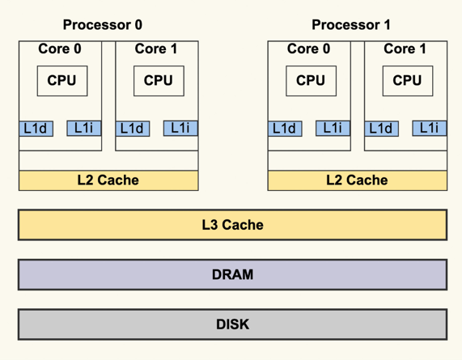
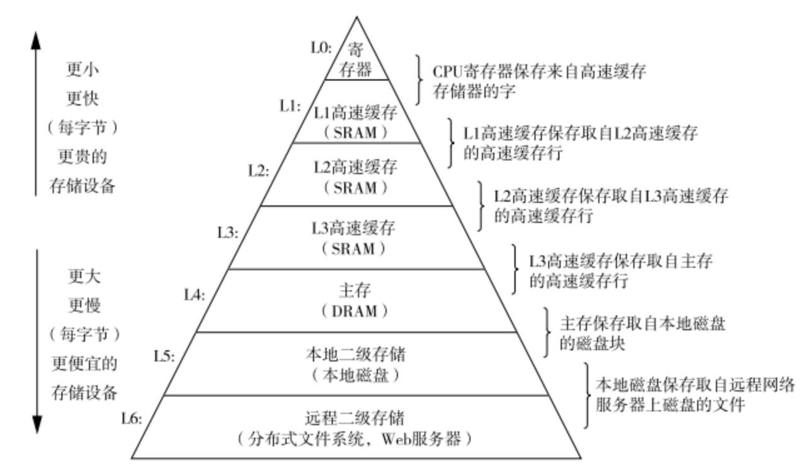
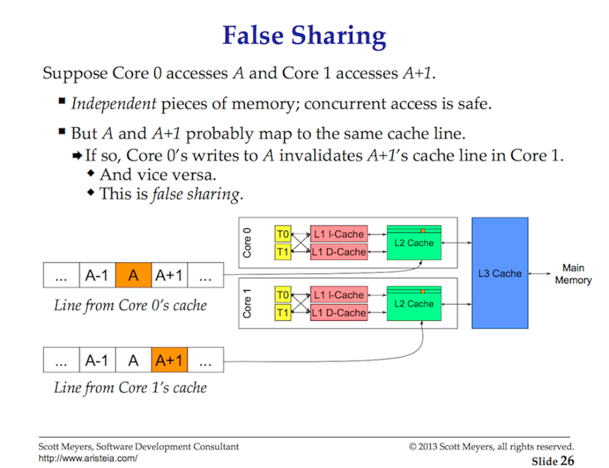
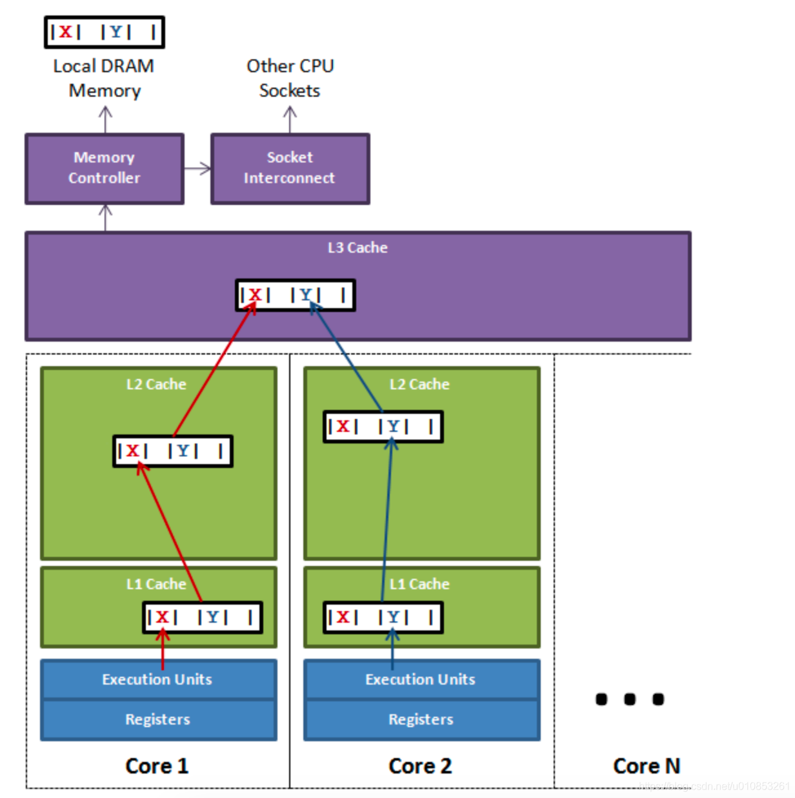

<!-- START doctoc generated TOC please keep comment here to allow auto update -->
<!-- DON'T EDIT THIS SECTION, INSTEAD RE-RUN doctoc TO UPDATE -->
**Table of Contents**  *generated with [DocToc](https://github.com/thlorenz/doctoc)*

- [缓存](#%E7%BC%93%E5%AD%98)
  - [cache 局部性原理](#cache-%E5%B1%80%E9%83%A8%E6%80%A7%E5%8E%9F%E7%90%86)
  - [缓存行（cache line）](#%E7%BC%93%E5%AD%98%E8%A1%8Ccache-line)
  - [cache 伪共享（false sharing）](#cache-%E4%BC%AA%E5%85%B1%E4%BA%ABfalse-sharing)
    - [解决伪共享问题](#%E8%A7%A3%E5%86%B3%E4%BC%AA%E5%85%B1%E4%BA%AB%E9%97%AE%E9%A2%98)
    - [CacheLinePad](#cachelinepad)
  - [参考](#%E5%8F%82%E8%80%83)

<!-- END doctoc generated TOC please keep comment here to allow auto update -->

# 缓存




对于现代处理器而言，一个实体CPU通常会有两个逻辑线程，也就是上图中的Core 0和Core 1。每个Core都有自己的L1 Cache，L1 Cache又分为dCache和iCache，对应到上图就是L1d和L1i。L1 Cache只有Core本身可以看到，其他的Core是看不到的。

同一个实体CPU中的这两个Core会共享L2 Cache，其他的实体CPU是看不到这个L2 Cache的。所有的实体CPU会共享L3 Cache。这就是典型的CPU架构。


图中是一个存储结构示意图，cpu和主存直接使用的是L3的结构。金字塔越上面，相互之间的访问速度越快但是数据量越小，越往下访问速度越慢但数据量越大。

## cache 局部性原理

局部性分为时间局部性和空间局部性

- 时间局部性是说，当前访问到的数据随后时间也可能会访问到。

- 空间局部性是指，当前访问的的地址附近的地址，之后可能会被访问到。

根据局部性原理，我们把容易访问到的数据缓存在cache中，这样可以提高数据访问速度和效率

## 缓存行（cache line）

CPU 缓存中的最小单位是缓存行（cache line）（如今，CPU 中常见的缓存行大小为 64 字节）。因此，当 CPU 从内存读取一个变量时，它会同时读取该变量附近的所有变量。

```shell
# 在 mac m1 机器是，我们可以查看此 CPU 的缓存行大小为 128 字节
➜  git_download sysctl -a |grep cachelinesize
hw.cachelinesize: 128
```

缓存系统中是以缓存行（cache line）为单位存储的。缓存行通常是 64 字节（译注：本文基于 64 字节，其他长度的如 32 字节等不适本文讨论的重点），
并且它有效地引用主内存中的一块地址。

    一个 Java 的 long 类型是 8 字节，因此在一个缓存行中可以存 8 个 long 类型的变量。
    所以，如果你访问一个 long 数组，当数组中的一个值被加载到缓存中，它会额外加载另外 7 个，以致你能非常快地遍历这个数组。
    事实上，你可以非常快速的遍历在连续的内存块中分配的任意数据结构。而如果你在数据结构中的项在内存中不是彼此相邻的（如链表），
    你将得不到免费缓存加载所带来的优势，并且在这些数据结构中的每一个项都可能会出现缓存未命中
    
    每一个缓存行都有自己的状态维护，假设一个CPU缓存行中有8个long型变量：a, b, c, d, e, f, g, h。这8个数据中的a被修改了之后又修改了b，
    那么当再次读取a的时候这个缓存行就失效了，需要重新从主内存中load
```css
ASCIIS码
1个ASCII码 = 一个字节
          
UTF-8编码
1个英文字符 标点 = 1个字节
1个中文（含繁体）标点 = 3个字节
 
Unicode编码
1个英文字符 标点 = 2个字节
1个中文（含繁体）标点 = 2个字节


Int8, 等于Byte, 占1个字节.
Int16, 等于short, 占2个字节. -32768 32767
Int32, 等于int, 占4个字节. -2147483648 2147483647
Int64, 等于long, 占8个字节. -9223372036854775808 9223372036854775807

```

## cache 伪共享（false sharing）



处理器和主存使用缓存行(cache lines)进行数据交换。缓存行是2的整数幂个连续字节，一般为32-256个字节. 最常见的缓存行大小是64个字节。

当多线程修改互相独立的变量时，如果这些变量共享同一个缓存行，就会无意中影响彼此的性能，这就是伪共享。
缓存行上的写竞争是运行在SMP系统中并行线程实现可伸缩性最重要的限制因素。有人将伪共享描述成无声的性能杀手，因为从代码中很难看清楚是否会出现伪共享。

一个缓存行是一个64 byte的内存块，它在内存和缓存系统之间进行交换。每个内核会分配它自己需要的cache副本。

当多线程并行运行，正在访问相同数据，甚至是相邻的数据单元，他们会访问相同的缓存行。任何内核上运行的任何线程能够从相同的缓存行获取各自的拷贝。

如果给一个内核，他上面的线程修改它的cache行副本，然后会通过硬件MESI机制，同一cache行的所有其他副本都会被标记为无效。
当一个线程尝试读写脏cache行，需要重新访问主存去获取新的cache行副本(大约要100~300个时钟周期)



上图中，一个运行在处理器 core1上的线程想要更新变量 X 的值，同时另外一个运行在处理器 core2 上的线程想要更新变量 Y 的值。
但是，这两个频繁改动的变量都处于同一条缓存行。两个线程就会轮番发送 RFO(Request for owner) 消息，占得此缓存行的拥有权。

- 当 core1 取得了拥有权开始更新 X，则 core2 对应的缓存行需要设为 I 状态(缓存行失效状态)。
- 当 core2 取得了拥有权开始更新 Y，则 core1 对应的缓存行需要设为 I 状态(失效态)。

轮番夺取拥有权不但带来大量的 RFO 消息，而且如果某个线程需要读此行数据时，L1 和 L2 缓存上都是失效数据，只有 L3 缓存上是同步好的数据。
读 L3 的数据非常影响性能。更坏的情况是跨槽读取，L3 都要 miss，只能从内存上加载。
表面上 X 和 Y 都是被独立线程操作的，而且两操作之间也没有任何关系。只不过它们共享了一个缓存行，但所有竞争冲突都是来源于共享.

为了让可伸缩性与线程数呈线性关系，就必须确保不会有两个线程往同一个变量或缓存行中写。
两个线程写同一个变量可以在代码中发现。为了确定互相独立的变量是否共享了同一个缓存行，就需要了解内存布局，或找个工具告诉我们。Intel VTune就是这样一个分析工具。


### 解决伪共享问题

1. 缓存填充（cache padding）：将每个变量扩展至一个完整的 cacheline，以防止多个线程访问同一个 cacheline。例如，可以在变量之间添加填充数据来分隔不同的 cacheline (假定 CPU 缓存行是 64 字节)：
```go
type Data struct {
    x int64           // 线程A更新的变量
    _ [7]int64        // 填充7个int64以对齐至64字节的cache line大小
    y int64           // 线程B更新的变量
}
```

2. 将变量分散到不同的结构体中：对于经常被多个线程更新的变量，可以考虑将它们分散到不同的结构体，避免同一结构体被多个线程同时频繁更新
3. 使用原子变量：在某些情况下，可以使用原子变量进行更新。虽然这不会彻底消除伪共享，但可以减少缓存一致性带来的开销
4. 绑定 CPU 核心（CPU Affinity）：可以将线程绑定到指定的 CPU 核心上，从而减少多个线程同时访问同一块缓存的数据的几率


### CacheLinePad

```go
// go1.23.0/src/internal/cpu/cpu.go

// CacheLinePad is used to pad structs to avoid false sharing.
type CacheLinePad struct{ _ [CacheLinePadSize]byte }

// CacheLineSize is the CPU's assumed cache line size.
// There is currently no runtime detection of the real cache line size
// so we use the constant per GOARCH CacheLinePadSize as an approximation.
var CacheLineSize uintptr = CacheLinePadSize
```

针对不同的 CPU 架构定义不同的缓存行大小。

```go
// go1.23.0/src/internal/cpu/cpu_arm64.go

// CacheLinePadSize is used to prevent false sharing of cache lines.
// We choose 128 because Apple Silicon, a.k.a. M1, has 128-byte cache line size.
// It doesn't cost much and is much more future-proof.
const CacheLinePadSize = 128
```


但是这个数据结构是定义在Go运行时internal库中，不对外暴露.

没关系，Go的扩展库golang.org/x/sys/cpu中提供了CacheLinePad的定义，我们可以直接使用。

```go
// golang.org/x/sys/cpu/cpu.go

// CacheLinePad is used to pad structs to avoid false sharing.
type CacheLinePad struct{ _ [cacheLineSize]byte }
```


实际应用
```go
type semaRoot struct {
	lock  mutex
	treap *sudog        // root of balanced tree of unique waiters.
	nwait atomic.Uint32 // Number of waiters. Read w/o the lock.
}

var semtable semTable

// Prime to not correlate with any user patterns.
const semTabSize = 251

type semTable [semTabSize]struct {
	root semaRoot
	pad  [cpu.CacheLinePadSize - unsafe.Sizeof(semaRoot{})]byte
}

```

等并发读取semTable时，由于semTable中的root是一个semaRoot结构体，semaRoot中有mutex，treap等字段，这些字段可能会被不同的CPU核心同时访问，导致伪共享问题。
为了解决伪共享问题，它增加了一个Pad字段，补齐字段的大小到CacheLineSize，这样就可以避免伪共享问题。当然这里可以确定semaRoot的大小不会超过一个CacheLineSize。

## 参考

- [What’s false sharing and how to solve it (using Golang as example)](https://medium.com/@genchilu/whats-false-sharing-and-how-to-solve-it-using-golang-as-example-ef978a305e10)
- [Go中秘而不宣的数据结构 CacheLinePad](https://colobu.com/2024/11/17/go-internal-ds-cacheline/)