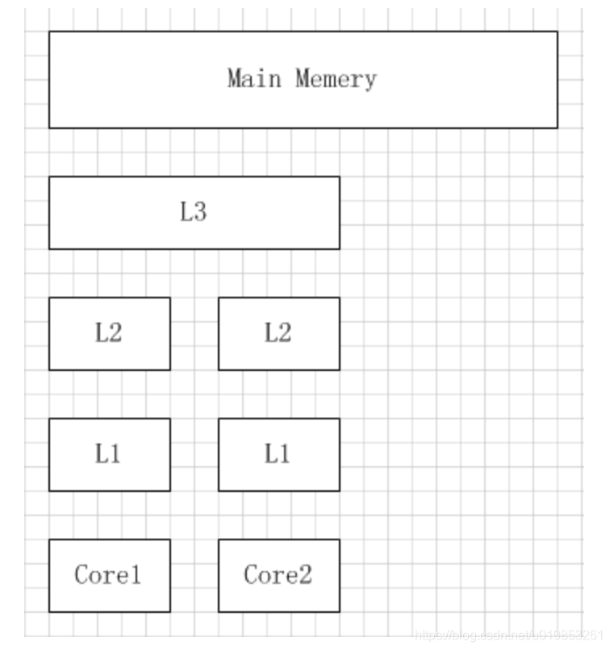

# 缓存



    图中是一个存储结构示意图，cpu和主存直接使用的是L3的结构。金字塔越上面，相互之间的访问速度越快但是数据量越小，越往下访问速度越慢但数据量越大。

    在单核CPU结构中，为了缓解CPU指令流水中cycle冲突，L1分成了指令（L1P）和数据（L1D）两部分，而L2则是指令和数据共存。
    多核CPU增设了L3三级缓存，L1和L2是CPU核自己使用，但是L3缓存是多核共享的

## cache局部性原理

局部性分为时间局部性和空间局部性

- 时间局部性是说，当前访问到的数据随后时间也可能会访问到。

- 空间局部性是指，当前访问的的地址附近的地址，之后可能会被访问到。

    根据局部性原理，我们把容易访问到的数据缓存在cache中，这样可以提高数据访问速度和效率
## 缓存行

    缓存系统中是以缓存行（cache line）为单位存储的。缓存行通常是 64 字节（译注：本文基于 64 字节，其他长度的如 32 字节等不适本文讨论的重点），
    并且它有效地引用主内存中的一块地址。一个 Java 的 long 类型是 8 字节，因此在一个缓存行中可以存 8 个 long 类型的变量。
    所以，如果你访问一个 long 数组，当数组中的一个值被加载到缓存中，它会额外加载另外 7 个，以致你能非常快地遍历这个数组。
    事实上，你可以非常快速的遍历在连续的内存块中分配的任意数据结构。而如果你在数据结构中的项在内存中不是彼此相邻的（如链表），
    你将得不到免费缓存加载所带来的优势，并且在这些数据结构中的每一个项都可能会出现缓存未命中
    
    每一个缓存行都有自己的状态维护，假设一个CPU缓存行中有8个long型变量：a, b, c, d, e, f, g, h。这8个数据中的a被修改了之后又修改了b，
    那么当再次读取a的时候这个缓存行就失效了，需要重新从主内存中load
```css
ASCIIS码
1个ASCII码 = 一个字节
          
UTF-8编码
1个英文字符 标点 = 1个字节
1个中文（含繁体）标点 = 3个字节
 
Unicode编码
1个英文字符 标点 = 2个字节
1个中文（含繁体）标点 = 2个字节


Int8, 等于Byte, 占1个字节.
Int16, 等于short, 占2个字节. -32768 32767
Int32, 等于int, 占4个字节. -2147483648 2147483647
Int64, 等于long, 占8个字节. -9223372036854775808 9223372036854775807

```

## cache伪共享


处理器和主存使用缓存行(cache lines)进行数据交换。缓存行是2的整数幂个连续字节，一般为32-256个字节. 最常见的缓存行大小是64个字节。

当多线程修改互相独立的变量时，如果这些变量共享同一个缓存行，就会无意中影响彼此的性能，这就是伪共享。
缓存行上的写竞争是运行在SMP系统中并行线程实现可伸缩性最重要的限制因素。有人将伪共享描述成无声的性能杀手，因为从代码中很难看清楚是否会出现伪共享。

一个缓存行是一个64 byte的内存块，它在内存和缓存系统之间进行交换。每个内核会分配它自己需要的cache副本。

当多线程并行运行，正在访问相同数据，甚至是相邻的数据单元，他们会访问相同的缓存行。任何内核上运行的任何线程能够从相同的缓存行获取各自的拷贝。

如果给一个内核，他上面的线程修改它的cache行副本，然后会通过硬件MESI机制，同一cache行的所有其他副本都会被标记为无效。
当一个线程尝试读写脏cache行，需要重新访问主存去获取新的cache行副本(大约要100~300个时钟周期)


上图中，一个运行在处理器 core1上的线程想要更新变量 X 的值，同时另外一个运行在处理器 core2 上的线程想要更新变量 Y 的值。
但是，这两个频繁改动的变量都处于同一条缓存行。两个线程就会轮番发送 RFO(Request for owner) 消息，占得此缓存行的拥有权。
- 当 core1 取得了拥有权开始更新 X，则 core2 对应的缓存行需要设为 I 状态(缓存行失效状态)。
- 当 core2 取得了拥有权开始更新 Y，则 core1 对应的缓存行需要设为 I 状态(失效态)。
轮番夺取拥有权不但带来大量的 RFO 消息，而且如果某个线程需要读此行数据时，L1 和 L2 缓存上都是失效数据，只有 L3 缓存上是同步好的数据。
读 L3 的数据非常影响性能。更坏的情况是跨槽读取，L3 都要 miss，只能从内存上加载。
表面上 X 和 Y 都是被独立线程操作的，而且两操作之间也没有任何关系。只不过它们共享了一个缓存行，但所有竞争冲突都是来源于共享.

为了让可伸缩性与线程数呈线性关系，就必须确保不会有两个线程往同一个变量或缓存行中写。
两个线程写同一个变量可以在代码中发现。为了确定互相独立的变量是否共享了同一个缓存行，就需要了解内存布局，或找个工具告诉我们。Intel VTune就是这样一个分析工具。
