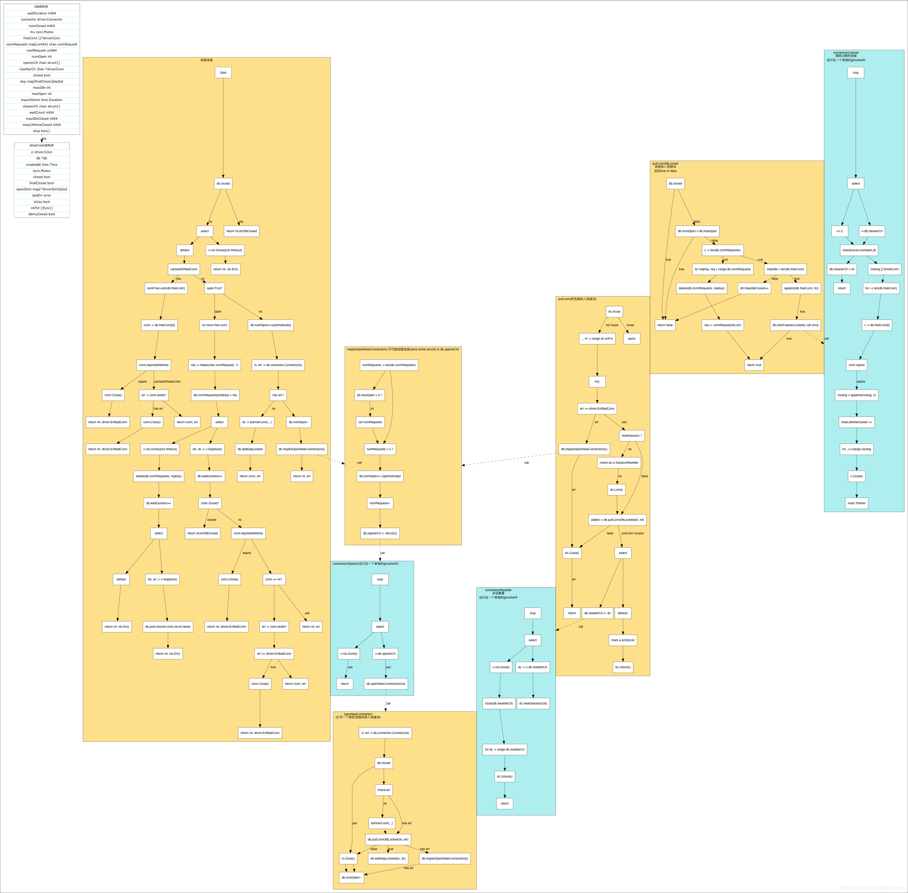
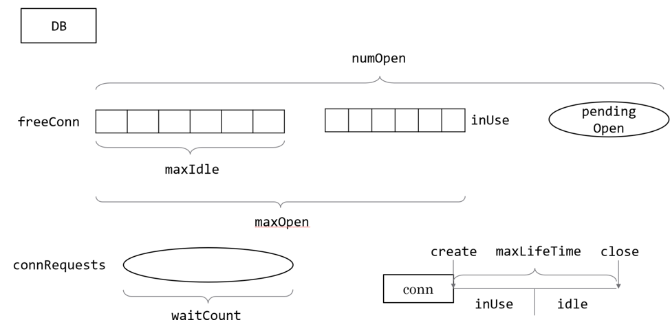
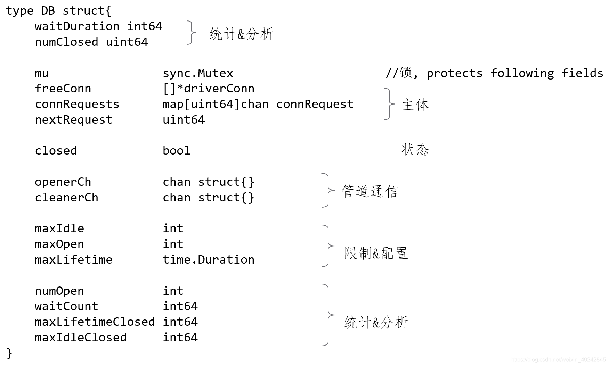
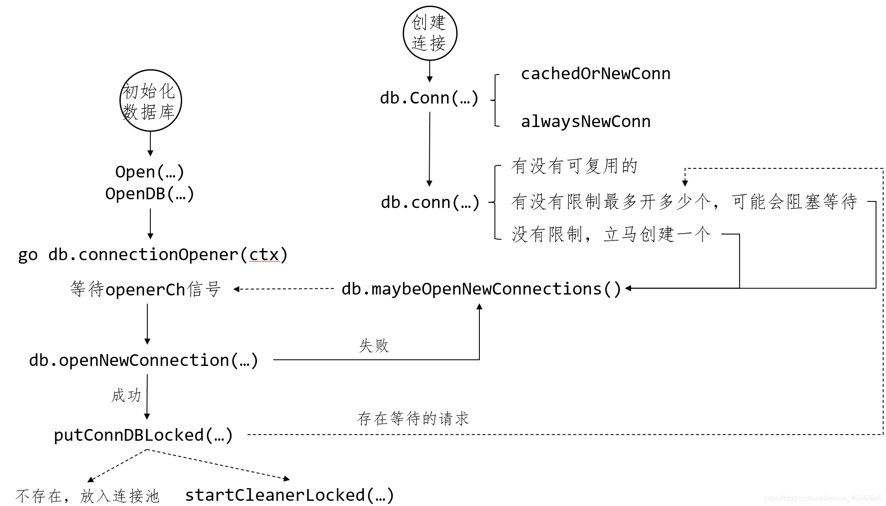
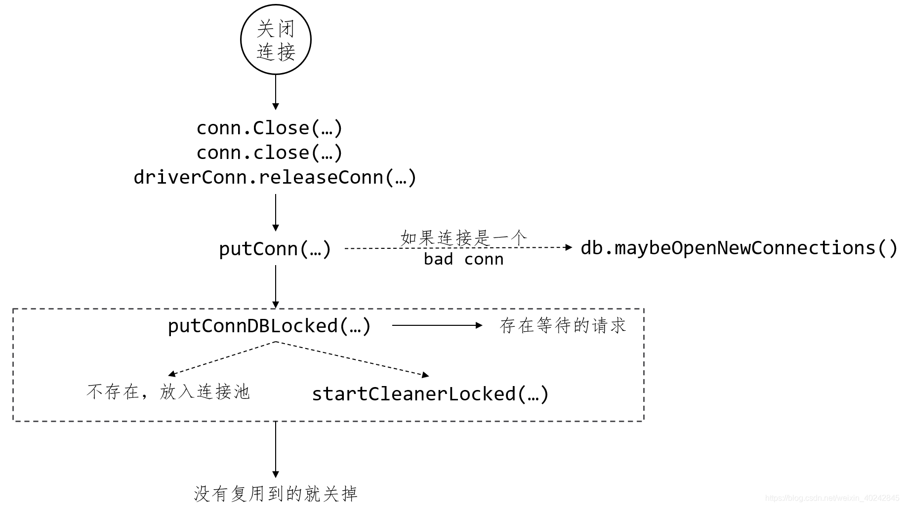

# sql源码分析



## 连接池性能测试结果
```shell
goos: darwin
goarch: arm64
pkg: github.com/Danny5487401/go_advanced_code/chapter02_goroutine/04_concurrent_pool/04_database_sql
BenchmarkConnectMySQL
BenchmarkConnectMySQL/noConnPool
BenchmarkConnectMySQL/noConnPool-8         	      10	 120167933 ns/op	    7211 B/op	      53 allocs/op
BenchmarkConnectMySQL/hasConnPool
BenchmarkConnectMySQL/hasConnPool-8        	      42	  32313283 ns/op	      88 B/op	       5 allocs/op
PASS
```
可以明显的看到有设置连接池和没有设置连接池的区别，有设置连接池的benchmark单次请求的速度比没有设置连接池的来得快很多，分配的内存也少。每次请求数据库都是TCP连接，如果不设置连接池，相当于要建立大量的TCP连接，这是很耗时的。

## 连接池问题
- 怎么取
- 怎么回收复用
- 怎么知道连接好与坏
- 怎么清理
- 怎么注册

### 重要的结构体

1. DB struct


```go
// L402
type DB struct {
    // 等待新的连接所需要的总时间，用于统计来判断这个连接池设置的好不好
	waitDuration int64 

	connector driver.Connector // 由数据库驱动实现的connector
	numClosed uint64           // 关闭的连接数

	mu           sync.Mutex // protects following fields
	freeConn     []*driverConn                // 连接池
	connRequests map[uint64]chan connRequest  // 连接请求的自增key
	nextRequest  uint64                       // 下一个连接的key
	numOpen      int                          // 打开的和正在打开的连接数,指的是正在用的+在连接池里的+将要打开的。将要打开的是不确定的，因为很有可能在创建的过程中，创建失败了(numOpen像乐观锁一样的一个逻辑统计)；
    
	openerCh          chan struct{}  // channel用于通知connectorOpenner()建立新的连接
	closed            bool           // 当前数据库是否关闭
	dep               map[finalCloser]depSet
	lastPut           map[*driverConn]string 
	maxIdle           int                    // 连接池大小，为0表示用默认的2，小于0表示不使用连接池
	maxOpen           int                    // 最大打开的连接数，包含在连接池中的闲散连接，小于等于0表示不限制
	maxLifetime       time.Duration          // 一个连接在连接池中最长的生存时间，0表示可以一直重用
    
    // channel用于通知connectorCleaner()清理连接，没有设置maxLifeTime，这个方法基本使用不到的
	cleanerCh         chan struct{}
	waitCount         int64          // 等待的连接数，如果maxIdelCount为0，waitCount就是一直为0
	maxIdleClosed     int64          // 释放连接时，因为连接池已满而被关闭的连接数
	maxLifetimeClosed int64          // 连接超过生存时间后而被关闭的连接数

	stop func() // stop cancels the connection opener and the session resetter.
}

```

2. driverConn结构体
```go
//L454
type driverConn struct {
    db        *DB
	createdAt time.Time

	sync.Mutex  // guards following
	ci          driver.Conn
	needReset   bool // The connection session should be reset before use if true.
	closed      bool // 确定连接最终都关闭后才是最终关闭
	finalClosed bool // 确定依赖都被关闭后，才会执行最后的关闭
	openStmt    map[*driverStmt]bool

	// guarded by db.mu
	inUse      bool
	onPut      []func() // code (with db.mu held) run when conn is next returned
	dbmuClosed bool     // same as closed, but guarded by db.mu, for removeClosedStmtLocked
}

```

## 流程


### 1. 引入包自动注册驱动
```go
import (
	_ "github.com/go-sql-driver/mysql" //自动执行init()函数
)
 
//1.驱动注册

drivers   = make(map[string]driver.Driver)

func Register(name string, driver driver.Driver) {
    driversMu.Lock()
    defer driversMu.Unlock()
    if driver == nil {
        panic("sql: Register driver is nil")
    }
    if _, dup := drivers[name]; dup {
        panic("sql: Register called twice for driver " + name)
    }
    drivers[name] = driver
//对外提供的注册函数，只要底层的驱动
type Driver interface {
    Open(name string) (Conn, error)
}
//mysql的init函数
func init() {
    sql.Register("mysql", &MySQLDriver{})
}

```

### 2. 初始化数据库：打开DB句柄
```go

//注册驱动时不会真正连接数据库，只有在调用Open()方法的时候才会连接
func Open(driverName, dataSourceName string) (*DB, error) {
    driversMu.RLock()
    driveri, ok := drivers[driverName]//获得已经注册过的driver
    driversMu.RUnlock()
    .......
    //先判断是否实现了driver.DriverContext的接口
    if driverCtx, ok := driveri.(driver.DriverContext); ok {
        connector, err := driverCtx.OpenConnector(dataSourceName)//得到mysql的connector
        // 调用驱动中的OpenConnector
        // func (d MySQLDriver) OpenConnector(dsn string) (driver.Connector, error) {
        //    cfg, err := ParseDSN(dsn)
        //    if err != nil {
        //        return nil, err
        //    }
        //    return &connector{
        //        cfg: cfg,
        //    }, nil
        // }
        // 实际是返回了dsn对应Config结构体指针

        if err != nil {
            return nil, err
        }
        //初始化DB结构体
        return OpenDB(connector), nil//最后通过connector参数调用OpenDB
    }
    // 这一句是在转换driver.DriverContext接口失败时执行
    // 因为go1.10之前默认是一下方法，1.10后使用driver.DriverContext接口
    // 下面是为了做兼容
    return OpenDB(dsnConnector{dsn: dataSourceName, driver: driveri}), nil
}
//这里值得注意的是，先判断底层的驱动是否实现了driver.DriverContext的接口，如果没有实现，会默认调用sql自己实现的dsnConnector，两者是有区别的，
//前者有Context的使用权，后者没有使用

func OpenDB(c driver.Connector) *DB {
    ctx, cancel := context.WithCancel(context.Background())
    db := &DB{
        connector:    c,
        openerCh:     make(chan struct{}, connectionRequestQueueSize),
        resetterCh:   make(chan *driverConn, 50),
        lastPut:      make(map[*driverConn]string),
        connRequests: make(map[uint64]chan connRequest),
        stop:         cancel,
    }

    go db.connectionOpener(ctx) //connOpener 运行在一个单独的goroutine中
    // 启动清理session的goroutine
    go db.connectionResetter(ctx)//connResetter单独运行在一个goroutine中

    return db
}
```

等待连接信号openerCh
```go
func (db *DB) connectionOpener(ctx context.Context) {
	for {
		select {
		case <-ctx.Done():
			return
		case <-db.openerCh:
			db.openNewConnection(ctx)
		}
	}
```

### 3. 执行sql语句时  获取连接
go从连接池中获取连接时有两个策略
```go
const(
    // a.请求新的连接
    alwaysNewConn connReuseStrategy = iota
    // b.从连接池中获取连接
    cachedOrNewConn
)

```

执行sql语句时
```go
// 一般查询代码
rows, err := dbt.db.Query("SELECT * FROM test")
// Query如下，包了QueryContext方法
func (db *DB) Query(query string, args ...interface{}) (*Rows, error) {
    // context.Background()是为了创建一个根上下文，以便close的时候能够将资源彻底的释放
    return db.QueryContext(context.Background(), query, args...)
}
//QueryContext方法
func (db *DB) QueryContext(ctx context.Context, query string, args ...interface{}) (*Rows, error) {
    var rows *Rows
    var err error
    // maxBadConnRetries是个静态变量为2，这里最多会执行两次从连接池中获取连接，如果在两次获取
    // 过程中获取到可用连接则直接返回
    for i := 0; i < maxBadConnRetries; i++ {
        rows, err = db.query(ctx, query, args, cachedOrNewConn)
        if err != driver.ErrBadConn {
            break
        }
    }
    // 如果两次都获取不到可用连接，则以请求获取一个新连接的方式获取并返回
    if err == driver.ErrBadConn {
        return db.query(ctx, query, args, alwaysNewConn)
    }
    return rows, err
}


// query方法如下
func (db *DB) query(ctx context.Context, query string, args []interface{}, strategy connReuseStrategy) (*Rows, error) {
    // 这里是重点，这是真正申请连接的过程
    dc, err := db.conn(ctx, strategy)
    if err != nil {
        return nil, err
    }
    // 这里是实际的查询过程，不过多介绍
    return db.queryDC(ctx, nil, dc, dc.releaseConn, query, args)
}

//上面的OpenDB步骤并不会打开连接，真正打开连接是在执行query()前，分析一下DB.conn方法
```
func (db *DB) conn(ctx context.Context, strategy connReuseStrategy) (*driverConn, error)
这个方法会分为三种情况返回连接，分别是

- 从连接池获取，复用连接
- 连接池无可用连接或不允许使用连接池，且创建的连接有数量限制的，请求就会阻塞等待创建好的连接
- 直接通过connector驱动去从数据库获取连接

#### 1. 从连接池里面直接获取
```go
// L1149
numFree := len(db.freeConn)
if strategy == cachedOrNewConn && numFree > 0 {
	conn := db.freeConn[0]
	copy(db.freeConn, db.freeConn[1:])
	db.freeConn = db.freeConn[:numFree-1]
	conn.inUse = true
	db.mu.Unlock()
	if conn.expired(lifetime) {
		conn.Close()
		return nil, driver.ErrBadConn
	}
    
	// Reset the session if required.
	if err := conn.resetSession(ctx); err == driver.ErrBadConn {
		conn.Close()
		return nil, driver.ErrBadConn
	}
    
	return conn, nil
}

```
源码注意点
```go
    conn := db.freeConn[0]
    copy(db.freeConn, db.freeConn[1:])
    db.freeConn = db.freeConn[:numFree-1]

```
相比 其他 写法
```go
conn := db.freeConn[0]
db.freeConn = db.freeConn[1:]
```

1. 第一种方式：不会破坏数组的容量，把数组元素相当于向前移动一个位置，避免了append时再次分配内存。
2. 第二种方式：会破坏数组的容量，即容量减少一个

#### 2. 没有空闲连接:阻塞等待	
```go
// sql.DB 结构体里还有另一个字段 connRequests，它用来存储当前有哪些“协程”在申请连接：
type DB struct {
    freeConn     []*driverConn
    connRequests map[uint64]chan connRequest
}

//connRequests 的 key 是一个 uint64类型，其实就是一个递增加 1 的 key；而 connRequest 表示申请一个新连接的请求：
type connRequest struct {
    conn *driverConn
    err  error
}
```

```go
//这里的 conn 正是需要的连接。
//当连接池中没有空闲连接的时候
req := make(chan connRequest, 1)
reqKey := db.nextRequestKeyLocked()
db.connRequests[reqKey] = req
//接下来，在 select 中等待超时或者从 req 这个 channel 中拿到空闲连接：
select {
    case <-ctx.Done():
    	// ..
	select {
        default:
        case ret, ok := <-req:
            if ok && ret.conn != nil {
                db.putConn(ret.conn, ret.err, false)
            }
        }
        return nil, ctx.Err()
    
    case ret, ok := <-req:
        if !ok {
            return nil, errDBClosed
        }
        return ret.conn, ret.err
}
```
这边的select分为两种情况，一种是ctx超时，另一种是req获取到连接了。

请求数据库连接的时候，通常会带上一个超时时间，避免一直等下去。
ctx超时之后，这个reqKey会从connRequests里面删除。删除的过程中，也会再检查了一下会不会刚好超时，刚好req收到连接的情况。
如果有收到，那不会直接close，相反的会留着用，放到连接池里面使用，除非连接池满了，或者不允许使用连接池。


#### 3. 没有空闲连接:直接创建新连接
```go

db.numOpen++ // optimistically
db.mu.Unlock()

ci, err := db.connector.Connect(ctx)
if err != nil {
	db.mu.Lock()
	db.numOpen-- // correct for earlier optimism
	db.maybeOpenNewConnections()
	db.mu.Unlock()
	return nil, err
}

db.mu.Lock()

dc := &driverConn{
	db:        db,
	createdAt: nowFunc(),
	ci:        ci,
	inUse:     true,
}

db.addDepLocked(dc, dc)
db.mu.Unlock()
return dc, nil

```

可能需要创建新的连接
```go
func (db *DB) maybeOpenNewConnections() {
	numRequests := len(db.connRequests)
	if db.maxOpen > 0 {
		numCanOpen := db.maxOpen - db.numOpen
		if numRequests > numCanOpen {
			numRequests = numCanOpen
		}
	}
	for numRequests > 0 {
		db.numOpen++ // optimistically
		numRequests--
		if db.closed {
			return
		}
		db.openerCh <- struct{}{}
	}
}
```

在db.openerCh收到信号后，其实调取底层的方法就是openNewConnection
```go
func (db *DB) openNewConnection(ctx context.Context) {
	// maybeOpenNewConnections has already executed db.numOpen++ before it sent
	// on db.openerCh. This function must execute db.numOpen-- if the
	// connection fails or is closed before returning.
	ci, err := db.connector.Connect(ctx)
	db.mu.Lock()
	defer db.mu.Unlock()
	if db.closed {
		if err == nil {
			ci.Close()
		}
		db.numOpen--
		return
	}
	if err != nil {
		db.numOpen--
		db.putConnDBLocked(nil, err)
		db.maybeOpenNewConnections()
		return
	}
	dc := &driverConn{
		db:         db,
		createdAt:  nowFunc(),
		returnedAt: nowFunc(),
		ci:         ci,
	}
	if db.putConnDBLocked(dc, err) {
		db.addDepLocked(dc, dc)
	} else {
		db.numOpen--
		ci.Close()
	}
}
```

两个点请注意
1. 在这边创建失败后，再次调取maybeOpenNewConnections，目的还是觉得有需要连接的阻塞的请求。
2. 另一个，获取到连接之后，会根据putConnDBLocked这个方法去决定这个连接是否被复用。如果复用则返回，如果无法复用就会关掉这个连接，不会一直放着不管的。

```go
// L1341
func (db *DB) putConnDBLocked(dc *driverConn, err error) bool {
	if db.closed {
		return false
	}
	if db.maxOpen > 0 && db.numOpen > db.maxOpen {
		return false
	}
	if c := len(db.connRequests); c > 0 {
		var req chan connRequest
		var reqKey uint64
		for reqKey, req = range db.connRequests {
			break
		}
		delete(db.connRequests, reqKey) // Remove from pending requests.
		if err == nil {
			dc.inUse = true
		}
		req <- connRequest{
			conn: dc,
			err:  err,
		}
		return true
	} else if err == nil && !db.closed {
		if db.maxIdleConnsLocked() > len(db.freeConn) {
			db.freeConn = append(db.freeConn, dc)
			db.startCleanerLocked()
			return true
		}
		db.maxIdleClosed++
	}
	return false
}

```


### 4. 连接回收到连接池


```go
func (db *DB) putConn(dc *driverConn, err error, resetSession bool)
```

1. 首先遍历dc.onPut，执行fn()

2. 如果发现该连接不可用，则调用maybeOpenNewConnections() 异步创建一个连接，并且关闭不可用的连接。

3. 如果连接成功被连接池回收，但db.resetterCh 阻塞了，则先标记连接为ErrBadConn,所以前面从连接池获取连接时每一次都会判断连接是否可用。

4. 如果连接池满了，没回放成功，则会关闭该连接

### 5. 处理过期的连接 
```go
func (db *DB) startCleanerLocked() {
	if (db.maxLifetime > 0 || db.maxIdleTime > 0) && db.numOpen > 0 && db.cleanerCh == nil {
		db.cleanerCh = make(chan struct{}, 1)
		go db.connectionCleaner(db.shortestIdleTimeLocked())
	}
}
```
```go
func (db *DB) connectionCleaner(d time.Duration) {
	const minInterval = time.Second

	if d < minInterval {
		d = minInterval
	}
	t := time.NewTimer(d)

	for {
		select {
		// 1 开定时器，每隔一段时间检测空闲连接池中的连接是否过期
		case <-t.C:
			
        // 2）如果接收到db.cleanerCh的信号，也会遍历处理超时，db.cleanerCh的buffer只有1，一般在SetConnMaxLifetime检测生命周期配置变短时发送。
		case <-db.cleanerCh: // maxLifetime was changed or db was closed.
		}

		db.mu.Lock()

		d = db.shortestIdleTimeLocked()
		if db.closed || db.numOpen == 0 || d <= 0 {
			db.cleanerCh = nil
			db.mu.Unlock()
			return
		}
        // 3）为了遍历空闲队列里面连接的公平性，做了一个巧妙的处理，一旦发现队列前面的连接过期，则会把最后一个连接放到最前面，然后从当前开始遍历。
		// 4）遍历空闲队列发现超时的连接，把超时连接一个一个追加到关闭队列中append(closing, c)，然后遍历关闭的队列，一个一个关闭
		// Go 1.16.x的优化相较于之前的版本增加了一个maxIdleTime
		closing := db.connectionCleanerRunLocked()
		db.mu.Unlock()
		for _, c := range closing {
			c.Close()
		}

		if d < minInterval {
			d = minInterval
		}
		t.Reset(d)
	}
}
```


Note:在putConnDBLocked方法里面讲到，如果放回连接池就会发起一次清理连接池空闲连接的动作，在重新设置连接最大生存时间的时候也会触发一次。
可以注意到，清理无效连接不是一初始化数据库就开一个协程等超时清理(如果是我之前就会这么干)。
虽然是之后会每过一段时间会清理一次，但数据库初始化完之后不会直接挂一个清理连接的协程。


## 参考链接
1. https://blog.csdn.net/weixin_40242845/article/details/118118362?spm=1001.2014.3001.5502

