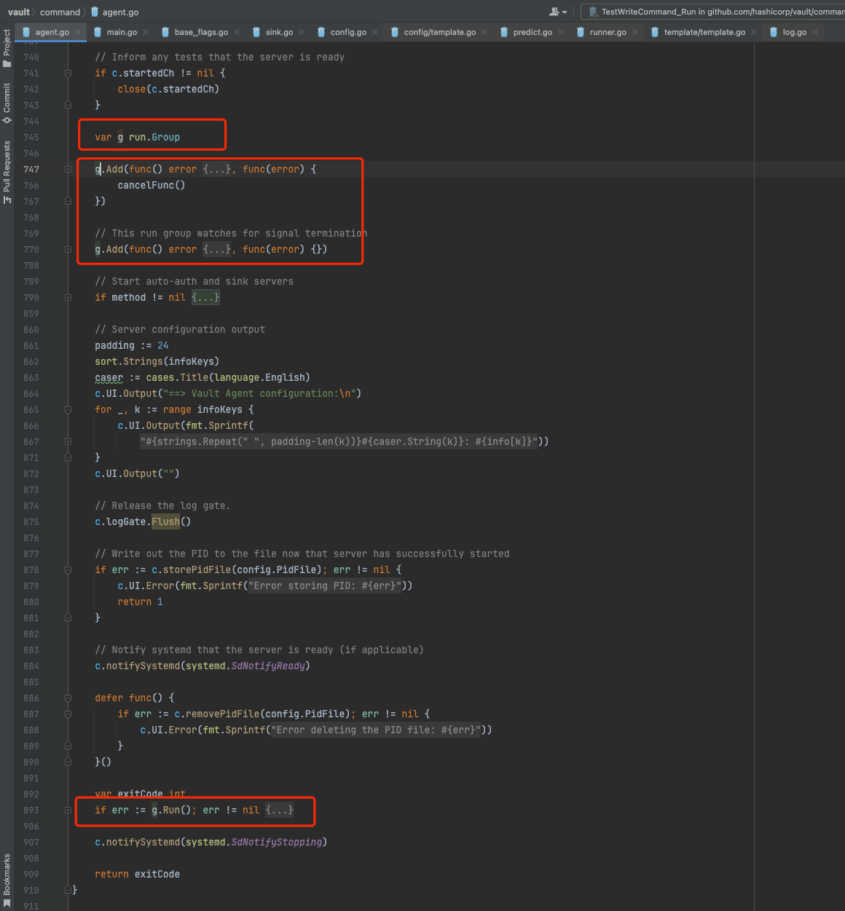

<!-- START doctoc generated TOC please keep comment here to allow auto update -->
<!-- DON'T EDIT THIS SECTION, INSTEAD RE-RUN doctoc TO UPDATE -->
**Table of Contents**  *generated with [DocToc](https://github.com/thlorenz/doctoc)*

- [oklog/run 包](#oklogrun-%E5%8C%85)
  - [官方场景视频讲解](#%E5%AE%98%E6%96%B9%E5%9C%BA%E6%99%AF%E8%A7%86%E9%A2%91%E8%AE%B2%E8%A7%A3)
  - [第三方-vault 使用](#%E7%AC%AC%E4%B8%89%E6%96%B9-vault-%E4%BD%BF%E7%94%A8)
  - [源码](#%E6%BA%90%E7%A0%81)
  - [参考](#%E5%8F%82%E8%80%83)

<!-- END doctoc generated TOC please keep comment here to allow auto update -->

# oklog/run 包

各个组件作为一个整体运行，并有序地结束


## [官方场景视频讲解](https://www.youtube.com/watch?v=LHe1Cb_Ud_M&t=945s)


假设我们有四个 Go routine 组件，如图所示，分别是运行一个状态机 sm.Run 、启动一个 HTTP 服务器、执行定时任务 cronJobs(sm) 读取状态机状态、和运行信号监听器。每个 Go routine 组件互相独立运行。


## 第三方-vault 使用




## 源码

Group 是一组 actor，通过调用 Add 方法将 actor 添加到 Group 中.
每个 actor 有两个方法：execute 和 interrupt。execute 完成 Go routine 的计算任务，interrupt 结束 Go routine 并退出。
```go
// github.com/oklog/run@v1.1.0/group.go
// Group collects actors (functions) and runs them concurrently.
// When one actor (function) returns, all actors are interrupted.
// The zero value of a Group is useful.
type Group struct {
	actors []actor
}

type actor struct {
    execute   func() error
    interrupt func(error)
}
```


添加
```go
// Add an actor (function) to the group. Each actor must be pre-emptable by an
// interrupt function. That is, if interrupt is invoked, execute should return.
// Also, it must be safe to call interrupt even after execute has returned.
//
// The first actor (function) to return interrupts all running actors.
// The error is passed to the interrupt functions, and is returned by Run.
func (g *Group) Add(execute func() error, interrupt func(error)) {
	g.actors = append(g.actors, actor{execute, interrupt})
}
```

运行

调用 Run 方法后会启动所有 Go routine（或者称为 actor），并等待第一个结束的 Go routine（无论正常退出或因为异常终止）。一旦捕获到第一个结束信号，会依次结束其他 Go routine 直到所有 Go routine 完全退出。
```go
// Run all actors (functions) concurrently.
// When the first actor returns, all others are interrupted.
// Run only returns when all actors have exited.
// Run returns the error returned by the first exiting actor.
func (g *Group) Run() error {
	if len(g.actors) == 0 {
		return nil
	}

	// Run each actor.
	errors := make(chan error, len(g.actors))
	for _, a := range g.actors {
		go func(a actor) {
			errors <- a.execute()
		}(a)
	}

	// Wait for the first actor to stop.
	err := <-errors

	// Signal all actors to stop.
	for _, a := range g.actors {
		a.interrupt(err)
	}

	// Wait for all actors to stop.
	for i := 1; i < cap(errors); i++ {
		<-errors
	}

	// Return the original error.
	return err
}


```


## 参考

1. https://www.cnblogs.com/huanggze/p/11695602.html
