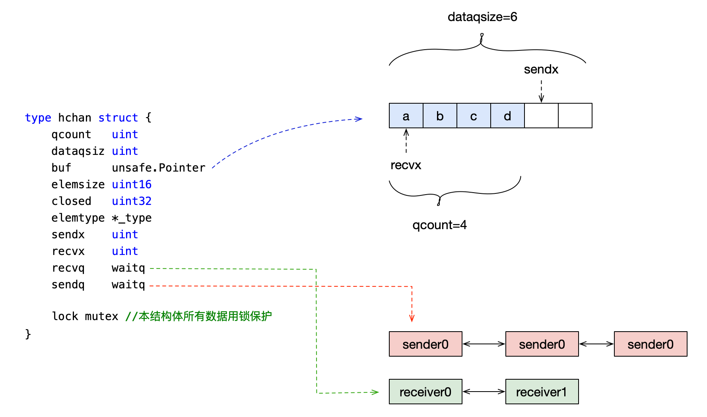
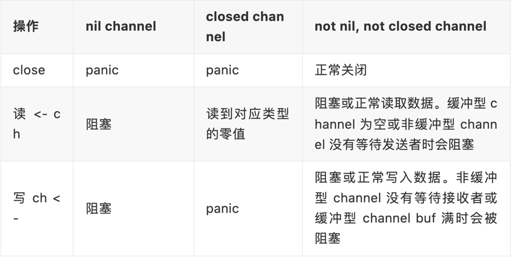

<!-- START doctoc generated TOC please keep comment here to allow auto update -->
<!-- DON'T EDIT THIS SECTION, INSTEAD RE-RUN doctoc TO UPDATE -->
**Table of Contents**  *generated with [DocToc](https://github.com/thlorenz/doctoc)*

- [channel 通道](#channel-%E9%80%9A%E9%81%93)
  - [使用场景](#%E4%BD%BF%E7%94%A8%E5%9C%BA%E6%99%AF)
  - [使用对应调用的底层函数](#%E4%BD%BF%E7%94%A8%E5%AF%B9%E5%BA%94%E8%B0%83%E7%94%A8%E7%9A%84%E5%BA%95%E5%B1%82%E5%87%BD%E6%95%B0)
  - [主要场景](#%E4%B8%BB%E8%A6%81%E5%9C%BA%E6%99%AF)
  - [数据结构](#%E6%95%B0%E6%8D%AE%E7%BB%93%E6%9E%84)
  - [一. 创建过程](#%E4%B8%80-%E5%88%9B%E5%BB%BA%E8%BF%87%E7%A8%8B)
  - [二. 写数据--分为阻塞写和非阻塞写](#%E4%BA%8C-%E5%86%99%E6%95%B0%E6%8D%AE--%E5%88%86%E4%B8%BA%E9%98%BB%E5%A1%9E%E5%86%99%E5%92%8C%E9%9D%9E%E9%98%BB%E5%A1%9E%E5%86%99)
    - [使用写法](#%E4%BD%BF%E7%94%A8%E5%86%99%E6%B3%95)
    - [对应源码](#%E5%AF%B9%E5%BA%94%E6%BA%90%E7%A0%81)
  - [三. 读数据 --分阻塞和非阻塞](#%E4%B8%89-%E8%AF%BB%E6%95%B0%E6%8D%AE---%E5%88%86%E9%98%BB%E5%A1%9E%E5%92%8C%E9%9D%9E%E9%98%BB%E5%A1%9E)
    - [使用](#%E4%BD%BF%E7%94%A8)
    - [源码](#%E6%BA%90%E7%A0%81)
  - [四. 关闭channel](#%E5%9B%9B-%E5%85%B3%E9%97%ADchannel)
    - [关闭原则](#%E5%85%B3%E9%97%AD%E5%8E%9F%E5%88%99)
    - [源码分析](#%E6%BA%90%E7%A0%81%E5%88%86%E6%9E%90)
  - [总结一下操作 channel 的结果](#%E6%80%BB%E7%BB%93%E4%B8%80%E4%B8%8B%E6%93%8D%E4%BD%9C-channel-%E7%9A%84%E7%BB%93%E6%9E%9C)
  - [参考资料](#%E5%8F%82%E8%80%83%E8%B5%84%E6%96%99)

<!-- END doctoc generated TOC please keep comment here to allow auto update -->

# channel 通道

Channel(一般简写为 chan) 管道提供了一种机制，它在两个并发执行的协程之间进行同步，并通过传递与该管道元素类型相符的值来进行通信。

## 使用场景
把channel用在数据流动的地方
1. 消息传递、消息过滤
2. 信号广播
3. 事件订阅与广播
4. 请求、响应转发
5. 任务分发
6. 结果汇总
7. 并发控制
8. 同步与异步


## 使用对应调用的底层函数
```shell
go tool compile -N -l -S chan.go
#-N表示禁用优化
#-l禁用内联
#-S打印结果
```


## 主要场景

1. channel的创建  
   

   创建channel实际上就是在内存中实例化了一个hchan的结构体，并返回一个ch指针，我们使用过程中channel在函数之间的传递都是用的这个指针，
   这就是为什么函数传递中无需使用channel的指针，而直接用channel就行了，因为channel本身就是一个指针

2. 各种场景的发送和接收
   


## 数据结构
创建一个容量为 6 的，元素为 int 型的 channel 数据结构
```go
make(chan int,6)
```


图为一个长度为6，类型为int, 两个接收者，三个发送者的channel，当前接收者准备读数据的位置为0，发送者发送数据位置为4.
- 一般情况下recvq和sendq至少有一个为空。
- 只有一个例外，那就是同一个goroutine使用select语句向channel一边写数据，一边读数据

  


主要子段:
1. buf是有缓冲的channel所特有的结构，用来存储缓存数据。是个循环链表，上图为了简单画成数组,实际是环。
2. sendx和recvx用于记录buf这个循环链表中的~发送或者接收的~index
3. lock是个互斥锁，avoid data races
4. recvq和sendq分别是接收(<-channel)或者发送(channel <- xxx)的goroutine抽象出来的结构体(sudog)的队列。是个双向链表


```go
// go1.21.5/src/runtime/chan.go
type hchan struct {
	qcount   uint           //  队列中元素个数
	dataqsiz uint           // 队列长度，eg make(chan int64, 5), dataqsiz为5
	
	// buf 指向底层循环数组，只有缓冲型的 channel 才有。
	buf      unsafe.Pointer // points to an array of dataqsiz elements 循环队列的指针
	
	elemsize uint16 //每个元素的大小
	closed   uint32 //是否关闭 0 未关闭
	elemtype *_type // element type 元素类型
	sendx    uint   // 发送者写入位置
	recvx    uint   // 接受者读数据位置
	recvq    waitq  // 接收者队列，保存正在读取channel的goroutine
	sendq    waitq  // 发送者队列，保存正在发送channel的goroutine
	lock mutex // 锁
}


type waitq struct {
	first *sudog
	last  *sudog
}
//waitq是双向链表，sudog为goroutine的封装
```
sg就是goroutine打包好的对象
```go
type sudog struct {
	// The following fields are protected by the hchan.lock of the
	// channel this sudog is blocking on. shrinkstack depends on
	// this for sudogs involved in channel ops.

	g *g

	next *sudog
	prev *sudog
	elem unsafe.Pointer // data element (may point to stack)

	// The following fields are never accessed concurrently.
	// For channels, waitlink is only accessed by g.
	// For semaphores, all fields (including the ones above)
	// are only accessed when holding a semaRoot lock.

	acquiretime int64
	releasetime int64
	ticket      uint32

	// isSelect indicates g is participating in a select, so
	// g.selectDone must be CAS'd to win the wake-up race.
	isSelect bool

	// success indicates whether communication over channel c
	// succeeded. It is true if the goroutine was awoken because a
	// value was delivered over channel c, and false if awoken
	// because c was closed.
	success bool

	parent   *sudog // semaRoot binary tree
	waitlink *sudog // g.waiting list or semaRoot
	waittail *sudog // semaRoot
	c        *hchan // channel
}
```


## 一. 创建过程
创建channel的过程实际上是初始化hchan结构。其中类型信息和缓冲区长度由make语句传入，buf的大小则与元素大小和缓冲区长度共同决定

```go
const (
	maxAlign  = 8 
	//  maxAlign-1的二进制就是111 
	// int(unsafe.Sizeof(hchan{}))取与 maxAlign-1 就是取它的低三位
	// hchanSize就得到的是8的整数倍，做对齐使用
	hchanSize = unsafe.Sizeof(hchan{}) + uintptr(-int(unsafe.Sizeof(hchan{}))&(maxAlign-1))
	debugChan = false
)
func makechan(t *chantype, size int) *hchan {
	elem := t.elem
	//...省略了检查 channel size，align 的代码
	
	// 计算需要分配的buf空间
	mem, overflow := math.MulUintptr(elem.size, uintptr(size))
	
	var c *hchan
	//创建hchan结构并分配内存
	switch {
	// 无缓冲区
	case mem == 0:
		// chan的size或者元素的size是0，不必创建buf
		c = (*hchan)(mallocgc(hchanSize, nil, true))
		c.buf = c.raceaddr()
	// 元素不含指针
	case elem.ptrdata == 0:
		// 元素不是指针，分配一块连续的内存给hchan数据结构和buf
		c = (*hchan)(mallocgc(hchanSize+mem, nil, true))
		// // 表示hchan后面在内存里紧跟着就是buf 
		c.buf = add(unsafe.Pointer(c), hchanSize)
	default:
	    // 默认场景，结构体和buffer单独分配内存
	    // 如 c := make(chan *int)
		c = new(hchan)
		// 元素包含指针，那么单独分配buf
		c.buf = mallocgc(mem, elem, true)
	}

	//元素大小
	c.elemsize = uint16(elem.size)
	//元素类型
	c.elemtype = elem
	//队列长度
	c.dataqsiz = uint(size)

	//...
	return c
}
```

分配内容函数
```go
// /Users/python/go/go1.16/src/runtime/malloc.go
func mallocgc(size uintptr, typ *_type, needzero bool) unsafe.Pointer
```

## 二. 写数据--分为阻塞写和非阻塞写
### 使用写法
 1. 阻塞写
```go
c := make(chan int64)

c <- 1
```

2. 非阻塞写
```go
c := make(chan int64)
select {
case c <- 1:
    //do something
    break
default:
    //do something
}
```
编译器会将其改为：
```go
if selectnbsend(c, v) {
    ... foo
} else {
    ... bar
}
```

注意：非阻塞写必须带上default

### 对应源码
```go
// 阻塞
func chansend1(c *hchan, elem unsafe.Pointer) {
   chansend(c, elem, true, getcallerpc())
}
// 非阻塞
func selectnbsend(c *hchan, elem unsafe.Pointer) (selected bool) {
	return chansend(c, elem, false, getcallerpc())
}
```

```go
//源码src/runtime/chan.go
func chansend(c *hchan, ep unsafe.Pointer, block bool, callerpc uintptr) bool {
	// 如果 channel 是 nil
	if c == nil {
		// 不能阻塞，直接返回 false，表示未发送成功
		if !block {
			return false
		}
		// 当前 goroutine 被挂起
		gopark(nil, nil, "chan send (nil chan)", traceEvGoStop, 2)
		throw("unreachable")
	}
	// 省略 debug 相关……
	
	// 对于不阻塞的 send，且channel 未关闭.快速检测失败场景
	// 1. channel 是非缓冲型的-->dataqsiz == 0，且等待接收队列里没有 goroutine
	// 2. channel 是缓冲型的-->dataqsiz > 0，但循环数组已经装满了元素
	if !block && c.closed == 0 && ((c.dataqsiz == 0 && c.recvq.first == nil) ||
		(c.dataqsiz > 0 && c.qcount == c.dataqsiz)) {
		return false
	}
	var t0 int64
	if blockprofilerate > 0 {
		t0 = cputicks()
	}
	
	// 锁住 channel，并发安全
	lock(&c.lock)
	// 如果 channel 关闭了
	if c.closed != 0 {
		// 解锁
		unlock(&c.lock)
		// 直接 panic
		panic(plainError("send on closed channel"))
	}
	
	// 如果能从等待接收队列 recvq 里出队一个 sudog（代表一个 goroutine），
	// 说明此时 channel 是空的，没有元素，所以才会有等待接收者。
	//这时会调用 send 函数将元素直接从发送者的栈拷贝到接收者的栈，绕过buffer,关键操作由 sendDirect 函数完成
	if sg := c.recvq.dequeue(); sg != nil {
		send(c, sg, ep, func() { unlock(&c.lock) }, 3)
		return true
	}
	
	// 对于缓冲型的 channel，如果还有缓冲空间
	if c.qcount < c.dataqsiz {
		// qp 指向 buf 的 sendx 位置
		qp := chanbuf(c, c.sendx)
		// ……
		// 将数据从 ep 处拷贝到 qp
		typedmemmove(c.elemtype, qp, ep)
		// 发送游标值加 1
		c.sendx++
		// 如果发送游标值等于容量值，游标值归 0
		if c.sendx == c.dataqsiz {
			c.sendx = 0
		}
		// 缓冲区的元素数量加一
		c.qcount++
		// 解锁
		unlock(&c.lock)
		return true
	}
	// 如果不需要阻塞，则直接返回错误
	if !block {
		unlock(&c.lock)
		return false
	}
	// channel 满了，发送方会被阻塞。接下来会构造一个 sudog
	// 获取当前 goroutine 的指针
	gp := getg()
	mysg := acquireSudog()
	mysg.releasetime = 0
	if t0 != 0 {
		mysg.releasetime = -1
	}
	mysg.elem = ep
	mysg.waitlink = nil
	mysg.g = gp
	mysg.selectdone = nil
	mysg.c = c
	gp.waiting = mysg
	gp.param = nil
	// 当前 goroutine 进入发送等待队列
	c.sendq.enqueue(mysg)
	// 当前 goroutine 被挂起
	goparkunlock(&c.lock, "chan send", traceEvGoBlockSend, 3)
	// 从这里开始被唤醒了（channel 有机会可以发送了）
	if mysg != gp.waiting {
		throw("G waiting list is corrupted")
	}
	gp.waiting = nil
	if gp.param == nil {
		if c.closed == 0 {
			throw("chansend: spurious wakeup")
		}
		// 被唤醒后，channel 关闭了。坑爹啊，panic
		panic(plainError("send on closed channel"))
	}
	gp.param = nil
	if mysg.releasetime > 0 {
		blockevent(mysg.releasetime-t0, 2)
	}
	// 去掉 mysg 上绑定的 channel
	mysg.c = nil
	releaseSudog(mysg)
	return true
}
```

```go
// send 函数处理向一个空的 channel 发送操作

// ep 指向被发送的元素，会被直接拷贝到接收的 goroutine 之后，接收的 goroutine 会被唤醒
// c 必须是空的（因为等待队列里有 goroutine，肯定是空的）
// c 必须被上锁，发送操作执行完后，会使用 unlockf 函数解锁
// sg 必须已经从等待队列里取出来了
// ep 必须是非空，并且它指向堆或调用者的栈
func send(c *hchan, sg *sudog, ep unsafe.Pointer, unlockf func(), skip int) {
	//省略一些用不到的
	// ……


	// sg.elem 指向接收到的值存放的位置，如 val <- ch，指的就是 &val
	if sg.elem != nil {
		// 直接拷贝内存（从发送者到接收者）
		sendDirect(c.elemtype, sg, ep)
		sg.elem = nil
	}
	
	//  sudog 上绑定的 goroutine
	gp := sg.g
	unlockf()
	gp.param = unsafe.Pointer(sg)
	if sg.releasetime != 0 {
		sg.releasetime = cputicks()
	}
	
	// 唤醒接收的 goroutine. skip 和打印栈相关，暂时不理会
	goready(gp, skip+1)
}
```


sendDirect 函数
```go
// 向一个非缓冲型的 channel 发送数据、从一个无元素的（非缓冲型或缓冲型为空）的 channel
// 接收数据，都会导致一个 goroutine 直接操作另一个 goroutine 的栈
// 由于 GC 假设对栈的写操作只能发生在 goroutine 正在运行中并且由当前 goroutine 来写

// 所以这里实际上违反了这个假设。可能会造成一些问题，所以需要用到写屏障来规避
func sendDirect(t *_type, sg *sudog, src unsafe.Pointer) {

	// src 在当前 goroutine 的栈上，dst 是另一个 goroutine 的栈
	// 直接进行内存"搬迁"
	// 如果目标地址的栈发生了栈收缩，当我们读出了 sg.elem 后
	// 就不能修改真正的 dst 位置的值了
	// 因此需要在读和写之前加上一个屏障
	dst := sg.elem
	typeBitsBulkBarrier(t, uintptr(dst), uintptr(src), t.size)
	// No need for cgo write barrier checks because dst is always
	// Go memory.
	memmove(dst, src, t.size)
}
```
	这里涉及到一个 goroutine 直接写另一个 goroutine 栈的操作，一般而言，不同 goroutine 的栈是各自独有的。
	而这也违反了 GC 的一些假设。为了不出问题，写的过程中增加了写屏障，保证正确地完成写操作。
	这样做的好处是减少了一次内存 copy：不用先拷贝到 channel 的 buf，直接由发送者到接收者，没有中间商赚差价，效率得以提高，完美。

## 三. 读数据 --分阻塞和非阻塞
1. 如果等待发送队列sendq不为空，且没有缓冲区，直接从sendq中取出G，把G中数据读出，最后把G唤醒，结束读取过程；
2. 如果等待发送队列sendq不为空，此时说明缓冲区已满，从缓冲区中首部读出数据，把G中数据写入缓冲区尾部，把G唤醒，结束读取过程；
3. 如果缓冲区中有数据，则从缓冲区取出数据，结束读取过程；
4. sender_process_diagram将当前goroutine加入recvq，进入睡眠，等待被写goroutine唤醒；

### 使用
1. 方式一：阻塞读和select读带default为非阻塞读
```go
c := make(chan int, 10)
<-c //阻塞读

// select读带default为非阻塞读
select{
case <-c:
    //...
    break
default:
    //...
}
```

注意：非阻塞读必须带上default

2. 方式二：带 “ok”的读
接收操作有两种写法
```go
// 一种带 “ok”，反应 channel 是否关闭；
// 一种不带 “ok”，这种写法，当接收到相应类型的零值时无法知道是真实的发送者发送过来的值，还是 channel 被关闭后，返回给接收者的默认类型的零值
c := make(chan int64, 5)
c <- 0

v, ok := <-c
fmt.Println(v, ok) // 0, true

close(c) //关闭

v, ok = <-c
fmt.Println(v, ok) // 0, false
```

### 源码
```go
// 对应源码里的这四个函数
// 1. select非阻塞读不带ok返回
func selectnbrecv(elem unsafe.Pointer, c *hchan) (selected bool) {
	selected, _ = chanrecv(c, elem, false)
	return
}
// 2. select非阻塞读带Ok返回
func selectnbrecv2(elem unsafe.Pointer, received *bool, c *hchan) (selected bool) {
   // TODO(khr): just return 2 values from this function, now that it is in Go.
  selected, *received = chanrecv(c, elem, false)
   return
}

// 3. 阻塞读不带ok返回
func chanrecv1(c *hchan, elem unsafe.Pointer) {
   chanrecv(c, elem, true)
}

// 4. 阻塞读带ok返回
func chanrecv2(c *hchan, elem unsafe.Pointer) (received bool) {
   _, received = chanrecv(c, elem, true)
   return
}
```

最终都指向了chanrecv函数，如果有接收值，val := <-c，会把接收值放到elem的地址中，如果忽略接收值直接写<-c，这时elem为nil
```go
// src/runtime/chan.go

// chanrecv 函数接收 channel c 的元素并将其写入 ep 所指向的内存地址。
// 如果 ep 是 nil，说明忽略了接收值。
// 如果 block == false，即非阻塞型接收，在没有数据可接收的情况下，返回 (false, false)
// 否则，如果 c 处于关闭状态，将 ep 指向的地址清零，返回 (true, false)
// 否则，用返回值填充 ep 指向的内存地址。返回 (true, true)
// 如果 ep 非空，则应该指向堆或者函数调用者的栈
func chanrecv(c *hchan, ep unsafe.Pointer, block bool) (selected, received bool) {
	// 省略 debug 内容 …………
	// 如果是一个 nil 的 channel
	if c == nil {
		// 如果不阻塞，直接返回 (false, false)
		if !block {
			return
		}
		// 否则，接收一个 nil 的 channel，goroutine 挂起
		gopark(nil, nil, "chan receive (nil chan)", traceEvGoStop, 2)
		// 不会执行到这里
		throw("unreachable")
	}
	
	// 在非阻塞模式下，快速检测到失败，不用获取锁，快速返回
	// 当我们观察到 channel 没准备好接收：
	// 1. 非缓冲型-->dataqsiz == 0，等待发送列队 sendq 里没有 goroutine 在等待
	// 2. 缓冲型，但 buf 里没有元素
	// 之后，又观察到 closed == 0，即 channel 未关闭。
	// 总结：非阻塞 && ((非缓冲型 && 发送队列为空) || (缓冲性 && 没有数据)) && 没有关闭
	
	// 因为 channel 不可能被重复打开，所以前一个观测的时候 channel 也是未关闭的，
	// 因此在这种情况下可以直接宣布接收失败，返回 (false, false)
	if !block && (c.dataqsiz == 0 && c.sendq.first == nil ||
		c.dataqsiz > 0 && atomic.Loaduint(&c.qcount) == 0) &&
		atomic.Load(&c.closed) == 0 {
		return
	}
	var t0 int64
	if blockprofilerate > 0 {
		t0 = cputicks()
	}
	// 加锁
	lock(&c.lock)
	// channel 已关闭，并且循环数组 buf 里没有元素，
	// 这里可以处理非缓冲型关闭 和 缓冲型关闭但 buf 无元素的情况
	// 也就是说即使是关闭状态，但在缓冲型的 channel，
	// buf 里有元素的情况下还能接收到元素
	if c.closed != 0 && c.qcount == 0 {
		if raceenabled {
			raceacquire(unsafe.Pointer(c))
		}
		// 解锁
		unlock(&c.lock)
		if ep != nil {
			// 从一个已关闭的 channel 执行接收操作，且未忽略返回值
			// 那么接收的值将是一个该类型的零值
			// typedmemclr 根据类型清理相应地址的内存
			typedmemclr(c.elemtype, ep)
		}
		// 从一个已关闭的 channel 接收，selected 会返回true
		return true, false
	}
	// 等待发送队列里有 goroutine 存在，说明 buf 是满的
	// 这有可能是：
	// 1. 非缓冲型的 channel
	// 2. 缓冲型的 channel，但 buf 满了
	// 针对 1，直接进行内存拷贝（从 sender goroutine -> receiver goroutine）
	// 针对 2，接收到循环数组头部的元素，并将发送者的元素放到循环数组尾部
	if sg := c.sendq.dequeue(); sg != nil {
		// Found a waiting sender. If buffer is size 0, receive value
		// directly from sender. Otherwise, receive from head of queue
		// and add sender's value to the tail of the queue (both map to
		// the same buffer slot because the queue is full).
		recv(c, sg, ep, func() { unlock(&c.lock) }, 3)
		return true, true
	}
	// 缓冲型，buf 里有元素，可以正常接收
	if c.qcount > 0 {
		// 直接从循环数组里找到要接收的元素
		qp := chanbuf(c, c.recvx)
		// …………
		// 代码里，没有忽略要接收的值，不是 "<- ch"，而是 "val <- ch"，ep 指向 val
		if ep != nil {
			typedmemmove(c.elemtype, ep, qp)
		}
		// 清理掉循环数组里相应位置的值
		typedmemclr(c.elemtype, qp)
		// 接收游标向前移动
		c.recvx++
		// 接收游标归零
		if c.recvx == c.dataqsiz {
			c.recvx = 0
		}
		// buf 数组里的元素个数减 1
		c.qcount--
		// 解锁
		unlock(&c.lock)
		return true, true
	}
	if !block {
		// 非阻塞接收，解锁。selected 返回 false，因为没有接收到值
		unlock(&c.lock)
		return false, false
	}
	// 接下来就是要被阻塞的情况了
	// 构造一个 sudog
	gp := getg()
	mysg := acquireSudog()
	mysg.releasetime = 0
	if t0 != 0 {
		mysg.releasetime = -1
	}
	// 待接收数据的地址保存下来
	mysg.elem = ep
	mysg.waitlink = nil
	gp.waiting = mysg
	mysg.g = gp
	mysg.selectdone = nil
	mysg.c = c
	gp.param = nil
	// 进入channel 的等待接收队列
	c.recvq.enqueue(mysg)
	// 将当前 goroutine 挂起
	goparkunlock(&c.lock, "chan receive", traceEvGoBlockRecv, 3)
	// 被唤醒了，接着从这里继续执行一些扫尾工作
	if mysg != gp.waiting {
		throw("G waiting list is corrupted")
	}
	gp.waiting = nil
	if mysg.releasetime > 0 {
		blockevent(mysg.releasetime-t0, 2)
	}
	closed := gp.param == nil
	gp.param = nil
	mysg.c = nil
	releaseSudog(mysg)
	return true, !closed
}

```

当channel缓存满了之后会发生什么?

如果有等待发送的队列，说明 channel 已经满了，要么是非缓冲型的 channel，要么是缓冲型的 channel，但 buf 满了。

调用 recv 函数
```go
func recv(c *hchan, sg *sudog, ep unsafe.Pointer, unlockf func(), skip int) {
	if c.dataqsiz == 0 {
	    // 如果是非缓冲型的 channel
		if raceenabled {
			racesync(c, sg)
		}

		// 未忽略接收的数据
		if ep != nil {
			// copy data from sender
			recvDirect(c.elemtype, sg, ep)
		}
	} else {
		// 缓冲型的 channel，但 buf 已满。
		// 将循环数组 buf 队首的元素拷贝到接收数据的地址
		// 将发送者的数据入队。实际上这时 revx 和 sendx 值相等
		// 找到接收游标
		qp := chanbuf(c, c.recvx)
		if raceenabled {
			raceacquire(qp)
			racerelease(qp)
			raceacquireg(sg.g, qp)
			racereleaseg(sg.g, qp)
		}
		// 将接收游标处的数据拷贝给接收者
		if ep != nil {
			typedmemmove(c.elemtype, ep, qp)
		}
		// 将发送者数据拷贝到 buf
		typedmemmove(c.elemtype, qp, sg.elem)

		// 更新游标值
		c.recvx++
		if c.recvx == c.dataqsiz {
			c.recvx = 0
		}
		c.sendx = c.recvx // c.sendx = (c.sendx+1) % c.dataqsiz
	}
	sg.elem = nil
	gp := sg.g
	unlockf()
	gp.param = unsafe.Pointer(sg)
	if sg.releasetime != 0 {
		sg.releasetime = cputicks()
	}

	// 唤醒发送的 goroutine。需要等到调度器的光临
	goready(gp, skip+1)
}
```

* 如果是非缓冲型的，就直接从发送者的栈拷贝到接收者的栈
```go
func recvDirect(t *_type, sg *sudog, dst unsafe.Pointer) {
	// dst is on our stack or the heap, src is on another stack.
	// The channel is locked, so src will not move during this
	// operation.
	src := sg.elem
	typeBitsBulkBarrier(t, uintptr(dst), uintptr(src), t.size)
	memmove(dst, src, t.size)
}
```
* 如果缓冲型的，缓冲型 channel，而 buf 又满了的情形。说明发送游标和接收游标重合了，因此需要先找到接收游标：
```go
// 返回循环队列里第 i 个元素的地址处
func chanbuf(c *hchan, i uint) unsafe.Pointer {
	return add(c.buf, uintptr(i)*uintptr(c.elemsize))
}
```
 将该处的元素拷贝到接收地址。然后将发送者待发送的数据拷贝到接收游标处。这样就完成了接收数据和发送数据的操作。
 接着，分别将发送游标和接收游标向前进一，如果发生“环绕”，再从 0 开始

## 四. 关闭channel

close 逻辑比较简单，对于一个 channel，recvq 和 sendq 中分别保存了阻塞的发送者和接收者。关闭 channel 后，对于等待接收者而言，会收到一个相应类型的零值。
对于等待发送者，会直接 panic。所以，在不了解 channel 还有没有接收者的情况下，不能贸然关闭 channel.
close 函数先上一把大锁，接着把所有挂在这个 channel 上的 sender 和 receiver 全都连成一个 sudog 链表，再解锁。
最后，再将所有的 sudog 全都唤醒。

### 关闭原则

一般原则上使用通道是 不允许接收方关闭通道 和 不能关闭一个有多个并发发送者的通道。
换而言之， 你只能在发送方的 goroutine 中关闭只有该发送方的通道

### 源码分析
```go
func closechan(c *hchan) {
	// 关闭一个 nil channel，panic
	if c == nil {
		panic(plainError("close of nil channel"))
	}
	// 上锁
	lock(&c.lock)
	// 如果 channel 已经关闭
	if c.closed != 0 {
		unlock(&c.lock)
		// panic
		panic(plainError("close of closed channel"))
	}
	// …………
	// 修改关闭状态
	c.closed = 1
	var glist *g
	// 将 channel 所有等待接收队列的里 sudog 释放
	for {
		// 从接收队列里出队一个 sudog
		sg := c.recvq.dequeue()
		// 出队完毕，跳出循环
		if sg == nil {
			break
		}
		// 如果 elem 不为空，说明此 receiver 未忽略接收数据
		// 给它赋一个相应类型的零值
		if sg.elem != nil {
			typedmemclr(c.elemtype, sg.elem)
			sg.elem = nil
		}
		if sg.releasetime != 0 {
			sg.releasetime = cputicks()
		}
		// 取出 goroutine
		gp := sg.g
		gp.param = nil
		if raceenabled {
			raceacquireg(gp, unsafe.Pointer(c))
		}
        // 加入队列中
        glist.push(gp)
	}
	// 将 channel 等待发送队列里的 sudog 释放
	// 如果存在，这些 goroutine 将会 panic
	for {
		// 从发送队列里出队一个 sudog
		sg := c.sendq.dequeue()
		if sg == nil {
			break
		}
		// 发送者会 panic
		sg.elem = nil
		if sg.releasetime != 0 {
			sg.releasetime = cputicks()
		}
		gp := sg.g
		gp.param = nil
		if raceenabled {
			raceacquireg(gp, unsafe.Pointer(c))
		}
        // 加入队列中
        glist.push(gp)
	}
	// 解锁
	unlock(&c.lock)
	// Ready all Gs now that we've dropped the channel lock.
	// 遍历链表
	for !glist.empty()  {
		// 取最后一个
		gp := glist.pop()
		// 向前走一步，下一个唤醒的 g
		glist = glist.schedlink.ptr()
		gp.schedlink = 0
		// 唤醒相应 goroutine
		goready(gp, 3)
	}
}
```

关闭 channel 后：

1. 对于一个 channel，recvq 和 sendq 中分别保存了阻塞的发送者和接收者。
- 对于等待接收者而言，会收到一个相应类型的零值。
- 对于等待发送者，会直接 panic。所以，在不了解 channel 还有没有接收者的情况下，不能贸然关闭 channel

2. close 函数先上一把大锁，接着把所有挂在这个 channel 上的 sender 和 receiver 全都连成一个 sudog 链表，再解锁。最后，再将所有的 sudog 全都唤醒。

3. 唤醒之后，该干嘛干嘛。
- sender 会继续执行 chansend 函数里 goparkunlock 函数之后的代码，很不幸，检测到 channel 已经关闭了，panic。
- receiver 则比较幸运，进行一些扫尾工作后，返回。这里，selected 返回 true，而返回值 received 则要根据 channel 是否关闭，返回不同的值。
  如果 channel 关闭，received 为 false，否则为 true。这我们分析的这种情况下，received 返回 false。

## 总结一下操作 channel 的结果

channels will be classified into three categories:
- nil channels.
- non-nil but closed channels.
- not-closed non-nil channels.



## 参考资料
1. [2017 understanding-channels 源码分析 PPT](https://speakerdeck.com/kavya719/understanding-channels)
2. [go 夜读 channel & select 源码分析](https://talkgo.org/t/topic/75)
