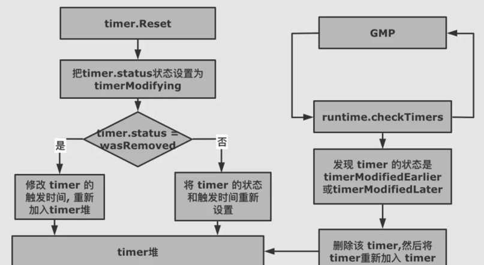

<!-- START doctoc generated TOC please keep comment here to allow auto update -->
<!-- DON'T EDIT THIS SECTION, INSTEAD RE-RUN doctoc TO UPDATE -->
**Table of Contents**  *generated with [DocToc](https://github.com/thlorenz/doctoc)*

- [Timer.Reset](#timerreset)
  - [源码](#%E6%BA%90%E7%A0%81)

<!-- END doctoc generated TOC please keep comment here to allow auto update -->

# Timer.Reset


Reset 的目的是把 timer 重新加入到 timer 堆中，重新等待被触发。不过分为两种情况：
- 被标记为 timerRemoved 的 timer，这种 timer 是已经从 timer 堆上删除了，但会重新设置被触发时间，加入到 timer 堆中
- 等待被触发的 timer，在 Reset 函数中只会修改其触发时间和状态（timerModifiedEarlier或timerModifiedLater）。
这个被修改状态的 timer 也同样会被重新加入到 timer堆上，不过是由 GMP 触发的，由 checkTimers 调用 adjusttimers 或者 runtimer 来执行的

## 源码
```go
/ resetTimer resets an inactive timer, adding it to the heap.
//go:linkname resetTimer time.resetTimer
// Reports whether the timer was modified before it was run.
func resetTimer(t *timer, when int64) bool {
	if raceenabled {
		racerelease(unsafe.Pointer(t))
	}
	return resettimer(t, when)
}

func resettimer(t *timer, when int64) bool {
    return modtimer(t, when, t.period, t.f, t.arg, t.seq)
}
```

modTimer 修改 timer
```go
func modtimer(t *timer, when, period int64, f func(interface{}, uintptr), arg interface{}, seq uintptr) bool {
    if when < 0 {
        when = maxWhen
    } 
    status := uint32(timerNoStatus)
    wasRemoved := false
    var pending bool
    var mp *m
loop:
    for {
        // 修改 timer 状态
        switch status = atomic.Load(&t.status); status {
        ...
    } 
    t.period = period
    t.f = f
    t.arg = arg
    t.seq = seq
    // 如果 timer 已被删除，那么需要重新添加到 timer 列表中
    if wasRemoved {
        t.when = when
        pp := getg().m.p.ptr()
        lock(&pp.timersLock)
        doaddtimer(pp, t)
        unlock(&pp.timersLock)
        if !atomic.Cas(&t.status, timerModifying, timerWaiting) {
            badTimer()
        }
        releasem(mp)
        wakeNetPoller(when)
    } else {

        t.nextwhen = when

        newStatus := uint32(timerModifiedLater)
        // 如果修改后的时间小于修改前的时间，将状态设置为 timerModifiedEarlier
        if when < t.when {
            newStatus = timerModifiedEarlier
        } 
        ... 
        if !atomic.Cas(&t.status, timerModifying, newStatus) {
            badTimer()
        }
        releasem(mp)

        // 如果修改时间提前，那么触发 netpoll 中断
        if newStatus == timerModifiedEarlier {
            wakeNetPoller(when)
        }
    }

    return pending
}
```
modtimer 进入到 for 循环后会根据不同的状态做状态设置以及必要字段的处理；如果是 timer 已被删除，那么需要重新添加到 timer 列表中；
如果 timer 修改后的时间小于修改前的时间，将状态设置为 timerModifiedEarlier，修改时间提前，还需要触发 netpoll 中断。