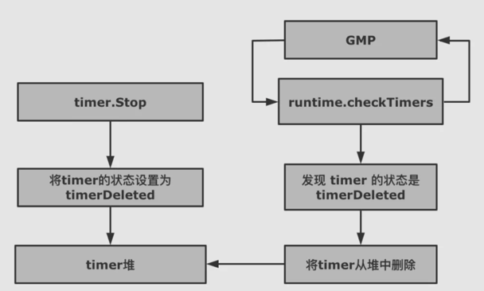

# timer.Stop

time.Stop 为了让 timer 停止，不再被触发，也就是从 timer 堆上删除。不过 timer.Stop 并不会真正的从 p 的 timer 堆上删除 timer，只会将 timer 的状态修改为 timerDeleted。然后等待 GMP 触发的 adjusttimers 或者 runtimer 来执行。

真正删除 timer 的函数有两个 dodeltimer，dodeltimer0.