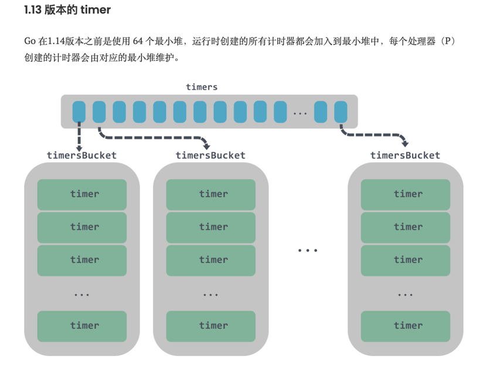
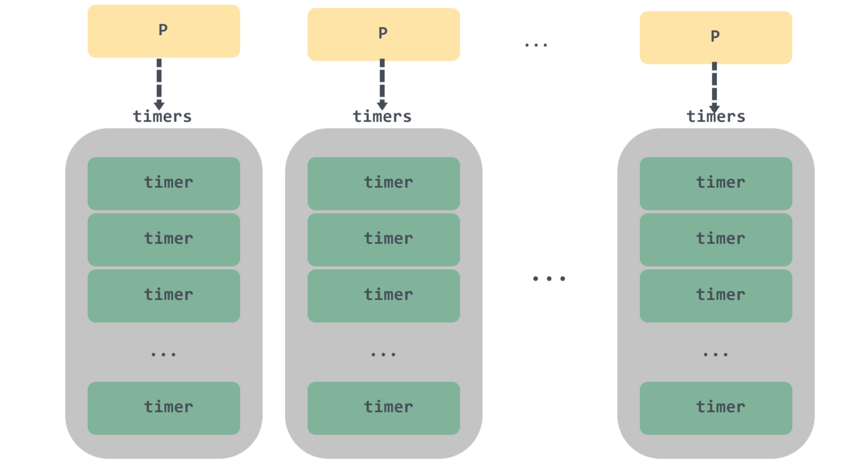
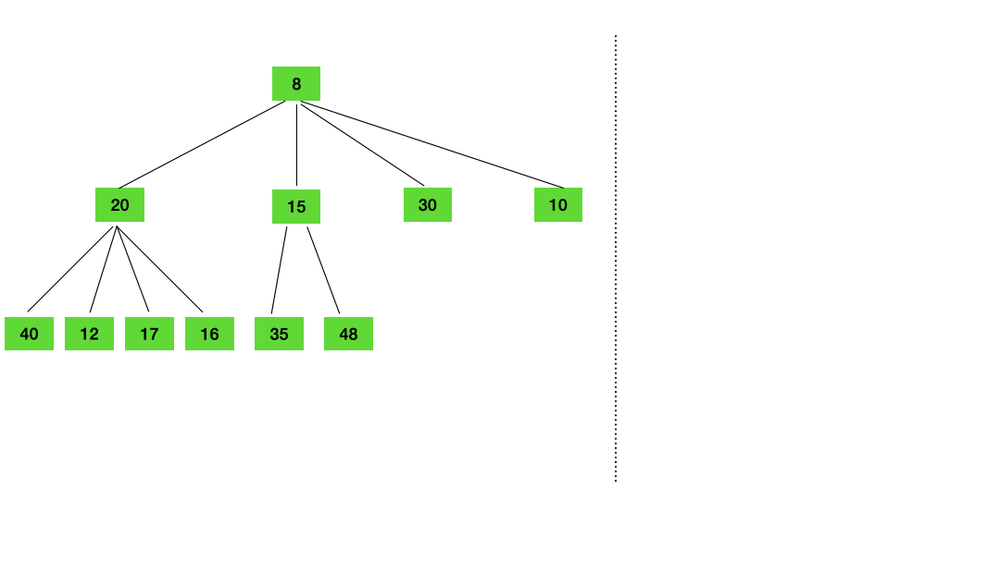
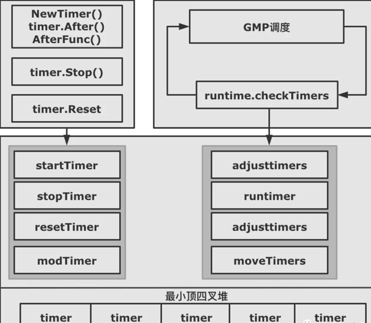
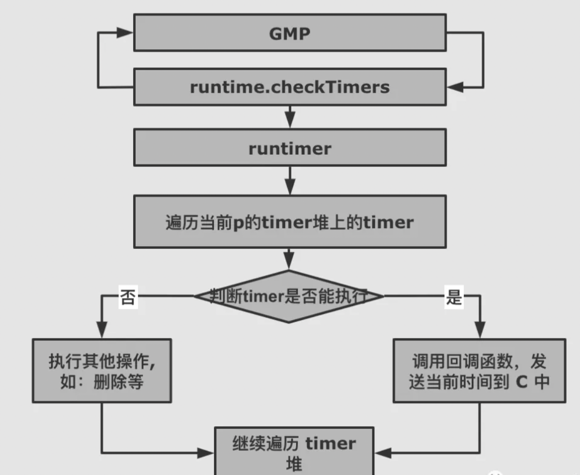

# Timer定时器源码分析

我们不管用 NewTimer, timer.After，还是 timer.AfterFun 来初始化一个 timer, 这个 timer 最终都会加入到一个全局 timer 堆中， 由 Go runtime 统一管理。

全局的 timer 堆也经历过三个阶段的重要升级。


- Go 1.9 版本之前，所有的计时器由全局唯一的四叉堆维护，协程间竞争激烈。
- Go 1.10 - 1.13，全局使用 64 个四叉堆维护全部的计时器，没有本质解决 1.9 版本之前的问题

```go
// 1.13版本 runtime.time源码
const timersLen = 64

var timers [timersLen]struct {
    timersBucket
    // padding， 防止false sharing 
    pad [sys.CacheLineSize - unsafe.Sizeof(timersBucket{})%sys.CacheLineSize]byte
}
// 获取 P 对应的 Bucket
func (t *timer) assignBucket() *timersBucket {
    id := uint8(getg().m.p.ptr().id) % timersLen
    t.tb = &timers[id].timersBucket
    return t.tb
}

type timersBucket struct {
    lock         mutex
    gp           *g
    created      bool
    sleeping     bool
    rescheduling bool
    sleepUntil   int64
    waitnote     note
    // timer 列表
    t            []*timer
}
```

通过上面的 assignBucket 方法可以知道，如果当前机器上的处理器 P 的个数超过了 64，多个处理器上的计时器就可能存储在同一个桶 timersBucket 中。

每个桶负责管理一堆这样有序的 timer，同时每个桶都会有一个对应的 timerproc 异步任务来负责不断调度这些 timer。
timerproc 会从 timersBucket 不断取堆顶元素，如果堆顶的 timer 已到期则执行，没有任务到期则 sleep，所有任务都消耗完了，那么调用 gopark 挂起，直到有新的 timer 被添加到桶中时，才会被重新唤醒。

timerproc 在 sleep 的时候会调用 notetsleepg ，继而引发entersyscallblock调用，该方法会主动调用 handoffp ，解绑 M 和 P。当下一个定时时间到来时，又会进行 M 和 P 的绑定，处理器 P 和线程 M 之间频繁的上下文切换也是 timer 的首要性能影响因素之一


- Go 1.14 版本之后，每个 P 单独维护一个四叉堆

```go
type p struct {
    ... 
    // 互斥锁
    timersLock mutex
    // 存储计时器的最小四叉堆
    timers []*timer
    // 计时器数量
    numTimers uint32
    // 处于 timerModifiedEarlier 状态的计时器数量
    adjustTimers uint32
    // 处于 timerDeleted 状态的计时器数量
    deletedTimers uint32
    ...
}
```
timer 不再使用 timerproc 异步任务来调度，而是改用调度循环或系统监控调度的时候进行触发执行，减少了线程之间上下文切换带来的性能损失，并且通过使用 netpoll 阻塞唤醒机制可以让 timer 更加及时的得到执行。c


## timer的使用

time.Timer计时器必须通过time.NewTimer、time.AfterFunc或者 time.After 函数创建。

### 初始化结构体

```go
type Timer struct {
    C <-chan Time
    r runtimeTimer
}

func NewTimer(d Duration) *Timer {
    // 初始化一个channel，用于返回
    c := make(chan Time, 1)
    t := &Timer{
        C: c,
        r: runtimeTimer{
            when: when(d),
            f:    sendTime,
            arg:  c,
        },
    }
    // 调用runtime.time的startTimer方法
    startTimer(&t.r)
    return t
}

func startTimer(*runtimeTimer)
```
NewTimer方法主要是初始化一个Timer，然后调用startTimer方法，并返回Timer。startTimer方法的真正逻辑并不在time包里面,
实际上调用的是runtime.time.startTimer方法。也就是说time.Timer只是对runtime包中timer的一层wrap。这层自身实现的最核心功能是将底层的超时回调转换为发送channel消息。
```go
func startTimer(t *timer) {
    ...
    addtimer(t)
}
```
startTimer方法会将传入的runtimeTimer转为timer，然后调用addtimer方法。
```go
type timer struct {
    // 对应处理器P的指针
    pp puintptr 
    // 定时器被唤醒的时间
    when   int64
    // 唤醒的间隔时间
    period int64
    // 唤醒时被调用的函数
    f      func(interface{}, uintptr)
    // 被调用的函数的参数
    arg    interface{} 
    seq    uintptr
    // 处于timerModifiedXX状态时用于设置when字段 
    nextwhen int64 
    // 定时器的状态
    status uint32
}
```
状态
```go
const (
    // 初始化状态
    timerNoStatus = iota

    // 等待被调用
    // timer 已在 P 的列表中
    timerWaiting

    // 表示 timer 在运行中 
    timerRunning

    // timer 已被删除 
    timerDeleted

    // timer 正在被移除 
    timerRemoving

    // timer 已被移除，并停止运行 
    timerRemoved

    // timer 被修改了 
    timerModifying

    // 被修改到了更早的时间 
    timerModifiedEarlier 

    // 被修改到了更晚的时间
    timerModifiedLater

  // 已经被修改，并且正在被移动
    timerMoving
)
```

### runtime.addtimer
```go
func addtimer(t *timer) {
    // 定时器被唤醒的时间的时间不能为负数
    if t.when < 0 {
        t.when = maxWhen
    }
    // 状态必须为初始化
    if t.status != timerNoStatus {
        throw("addtimer called with initialized timer")
    }
    // 设置为等待调度
    t.status = timerWaiting

    when := t.when
    // 获取当前 P
    pp := getg().m.p.ptr()
    lock(&pp.timersLock)
    // 清理 P 的 timer 列表头中的 timer
    cleantimers(pp)
    // 将 timer 加入到 P 的最小堆中
    doaddtimer(pp, t)
    unlock(&pp.timersLock)
    // 唤醒 netpoller 中休眠的线程
    wakeNetPoller(when)
}
```
1. addtimer 会对 timer 被唤醒的时间 when 进行校验，以及校验 status 必须是新出初始化的 timer；
2. 接着会在加锁后调用 cleantimers 对 P 中对应的 timer 列表的头节点进行清理工作，清理完后调用 doaddtimer 将 timer 加入到 P 的最小堆中，并释放锁；
3. 调用 wakeNetPoller 唤醒 netpoller 中休眠的线程。


runtime.cleantimers

```go
func cleantimers(pp *p) {
    gp := getg()
    for {
        // 调度器列表为空，直接返回
        if len(pp.timers) == 0 {
            return
        }
        // 如果当前 G 被抢占了，直接返回
        if gp.preemptStop {
            return
        }
        // 获取第一个 timer
        t := pp.timers[0]
        if t.pp.ptr() != pp {
            throw("cleantimers: bad p")
        }
        switch s := atomic.Load(&t.status); s {
        case timerDeleted:
            // 设置 timer 的状态
            if !atomic.Cas(&t.status, s, timerRemoving) {
                continue
            }
            // 删除第一个 timer
            dodeltimer0(pp)
            // 删除完毕后重置状态为 timerRemoved
            if !atomic.Cas(&t.status, timerRemoving, timerRemoved) {
                badTimer()
            }
            atomic.Xadd(&pp.deletedTimers, -1)
        // timer 被修改到了更早或更晚的时间
        case timerModifiedEarlier, timerModifiedLater:
            // 将 timer 状态设置为 timerMoving
            if !atomic.Cas(&t.status, s, timerMoving) {
                continue
            }
            // 重新设置 when 字段
            t.when = t.nextwhen
            // 在列表中删除后重新加入 
            dodeltimer0(pp)
            doaddtimer(pp, t)
            if s == timerModifiedEarlier {
                atomic.Xadd(&pp.adjustTimers, -1)
            }
            // 设置状态为 timerWaiting
            if !atomic.Cas(&t.status, timerMoving, timerWaiting) {
                badTimer()
            }
        default: 
            return
        }
    }
}
```
cleantimers 函数中使用了一个无限循环来获取头节点。
如果头节点的状态是 timerDeleted ，那么需要从 timer 列表中删除；
如果头节点的状态是 timerModifiedEarlier 或 timerModifiedLater ，表示头节点的触发的时间被修改到了更早或更晚的时间，那么就先重 timer队列中删除再重新添加。

runtime.doaddtimer

```go
func doaddtimer(pp *p, t *timer) { 
    // Timers 依赖于 netpoller
    // 所以如果 netpoller 没有启动，需要启动一下
    if netpollInited == 0 {
        netpollGenericInit()
    }
    // 校验是否早已在 timer 列表中
    if t.pp != 0 {
        throw("doaddtimer: P already set in timer")
    }
    // 设置 timer 与 P 的关联
    t.pp.set(pp)
    i := len(pp.timers)
    // 将 timer 加入到 P 的 timer 列表中
    pp.timers = append(pp.timers, t)
    // 维护 timer 在 最小堆中的位置
    siftupTimer(pp.timers, i)
    // 如果 timer 是列表中头节点，需要设置一下 timer0When
    if t == pp.timers[0] {
        atomic.Store64(&pp.timer0When, uint64(t.when))
    }
    atomic.Xadd(&pp.numTimers, 1)
}
```
doaddtimer 函数实际上很简单，主要是将 timer 与 P 设置关联关系，并将 timer 加入到 P 的 timer 列表中，并维护 timer 列表最小堆的顺序。


### runtime.wakeNetPoller
```go
func wakeNetPoller(when int64) {
    if atomic.Load64(&sched.lastpoll) == 0 {  
        pollerPollUntil := int64(atomic.Load64(&sched.pollUntil))
        // 如果计时器的触发时间小于netpoller的下一次轮询时间
        if pollerPollUntil == 0 || pollerPollUntil > when {
            // 向netpollBreakWr里面写入数据，立即中断netpoll
            netpollBreak()
        }
    }
}

func netpollBreak() {
    if atomic.Cas(&netpollWakeSig, 0, 1) {
        for {
            var b byte
            // 向 netpollBreakWr 里面写入数据
            n := write(netpollBreakWr, unsafe.Pointer(&b), 1)
            if n == 1 {
                break
            }
            if n == -_EINTR {
                continue
            }
            if n == -_EAGAIN {
                return
            }
            println("runtime: netpollBreak write failed with", -n)
            throw("runtime: netpollBreak write failed")
        }
    }
}
```
wakeNetPoller 主要是将 timer 下次调度的时间和 netpoller 的下一次轮询时间相比，如果小于的话，调用 netpollBreak 向 netpollBreakWr 里面写入数据，立即中断netpoll。


## 四叉堆原理
四叉堆其实就是四叉树，Go timer 是如何维护四叉堆的呢？
- Go runtime 调度 timer 时，触发时间更早的 timer，要减少其查询次数，尽快被触发。所以四叉树的父节点的触发时间是一定小于子节点的。
- 四叉树顾名思义最多有四个子节点，为了兼顾四叉树插、删除、重排速度，所以四个兄弟节点间并不要求其按触发早晚排序。

两张动图简单演示下 timer 的插入和删除
1. 把 timer 插入堆

插入时，兄弟节点无顺序，会与父节点进行比较

2. 把 timer 从堆中删除

删除节点20，用子节点48替代，比较兄弟节点，与最小节点10交换位置

### timer 是如何被调度的

- 调用 NewTimer，timer.After, timer.AfterFunc 生产 timer, 加入对应的 P 的堆上。
- 调用 timer.Stop, timer.Reset 改变对应的 timer 的状态。
- GMP 在调度周期内中会调用 checkTimers ，遍历该 P 的 timer 堆上的元素，根据对应 timer 的状态执行真的操作。

### timer 是如何加入到 timer 堆上的？
- 通过 NewTimer, time.After, timer.AfterFunc 初始化 timer 后，相关 timer 就会被放入到对应 p 的 timer 堆上。

- timer 已经被标记为 timerRemoved，调用了 timer.Reset(d)，这个 timer 也会重新被加入到 p 的 timer 堆上

- timer 还没到需要被执行的时间，被调用了 timer.Reset(d)，这个 timer 会被 GMP 调度探测到，先将该 timer 从 timer 堆上删除，然后重新加入到 timer 堆上

- STW 时，runtime 会释放不再使用的 p 的资源，p.destroy()->timer.moveTimers，将不再被使用的 p 的 timers 上有效的 timer
(状态是：timerWaiting，timerModifiedEarlier，timerModifiedLater) 都重新加入到一个新的 p 的 timer 上

### timer的执行流程

timer 的真正执行者是 GMP。GMP 会在每个调度周期内，通过 runtime.checkTimers 调用 timer.runtimer().
timer.runtimer 会检查该 p 的 timer 堆上的所有 timer，根据状态做不同的处理。

```go
func runtimer(pp *p, now int64) int64 {
    for {
        // 获取最小堆的第一个元素
        t := pp.timers[0]
        if t.pp.ptr() != pp {
            throw("runtimer: bad p")
        }
        // 获取 timer 状态
        switch s := atomic.Load(&t.status); s {
        // timerWaiting
        case timerWaiting:
            // 还没到时间，返回下次执行时间
            if t.when > now {
                // Not ready to run.
                return t.when
            }
            // 修改状态为 timerRunning
            if !atomic.Cas(&t.status, s, timerRunning) {
                continue
            }
            // 运行该 timer
            runOneTimer(pp, t, now)
            return 0
        // timerDeleted
        case timerDeleted:
            if !atomic.Cas(&t.status, s, timerRemoving) {
                continue
            }
            // 删除最小堆的第一个 timer
            dodeltimer0(pp)
            if !atomic.Cas(&t.status, timerRemoving, timerRemoved) {
                badTimer()
            }
            atomic.Xadd(&pp.deletedTimers, -1)
            if len(pp.timers) == 0 {
                return -1
            }
        // 需要重新移动位置的 timer
        case timerModifiedEarlier, timerModifiedLater:
            if !atomic.Cas(&t.status, s, timerMoving) {
                continue
            }
            t.when = t.nextwhen
            // 删除最小堆的第一个 timer
            dodeltimer0(pp)
            // 将该 timer 重新添加到最小堆
            doaddtimer(pp, t)
            if s == timerModifiedEarlier {
                atomic.Xadd(&pp.adjustTimers, -1)
            }
            if !atomic.Cas(&t.status, timerMoving, timerWaiting) {
                badTimer()
            }

        case timerModifying: 
            osyield()

        case timerNoStatus, timerRemoved: 
            badTimer()
        case timerRunning, timerRemoving, timerMoving: 
            badTimer()
        default:
            badTimer()
        }
    }
}
```

- 如果该 timer 处于 timerWaiting，那么判断当前的时间大于 timer 执行的时间，则调用 runOneTimer 执行；
- 如果该 timer 处于 timerDeleted，表示该 timer 是需要被删除的，那么调用 dodeltimer0 删除最小堆的第一个 timer ，并修改其状态；
- 如果该 timer 状态是 timerModifiedEarlier 、timerModifiedLater，那么表示该 timer 的执行时间被修改过，需要重新调整它在最小堆中的位置，所以先调用 dodeltimer0 删除该 timer，再调用 doaddtimer 将该 timer 重新添加到最小堆。

```go
func runOneTimer(pp *p, t *timer, now int64) {
    ... 
    // 需要被执行的函数
    f := t.f
    // 被执行函数的参数
    arg := t.arg
    seq := t.seq
    // 表示该 timer 为 ticker，需要再次触发
    if t.period > 0 { 
        // 放入堆中并调整触发时间
        delta := t.when - now
        t.when += t.period * (1 + -delta/t.period)
        siftdownTimer(pp.timers, 0)
        if !atomic.Cas(&t.status, timerRunning, timerWaiting) {
            badTimer()
        }
        updateTimer0When(pp)
    // 一次性 timer
    } else {
        // 删除该 timer.
        dodeltimer0(pp)
        if !atomic.Cas(&t.status, timerRunning, timerNoStatus) {
            badTimer()
        }
    }  
    unlock(&pp.timersLock)
    // 运行该函数
    f(arg, seq)
    lock(&pp.timersLock)
    ...
}
```
runOneTimer 会根据 period 是否大于0判断该 timer 是否需要反复执行，如果是的话需要重新调整 when 下次执行时间后重新调整该 timer 在堆中的位置。
一次性 timer 的话会执行 dodeltimer0 删除该 timer ，最后运行 timer 中的函数；


### timer 的触发

下面这里是我觉得比较有意思的地方，timer 的触发有两种：

1. 从调度循环中直接触发；

2. 另一种是Go语言的后台系统监控中会定时触发；

#### 调度循环触发
整个调度循环会有三个地方去检查是否有可执行的 timer：

1. 调用 runtime.schedule 执行调度时；
2. 调用runtime.findrunnable获取可执行函数时；
3. 调用runtime.findrunnable执行抢占时；

#### 系统监控触发
系统监控其实就是 Go 语言的守护进程，它们能够在后台监控系统的运行状态，在出现意外情况时及时响应。它会每隔一段时间检查 Go 语言运行时状态，确保没有异常发生。


## Timer 使用中的坑
确实 timer 是我们开发中比较常用的工具，但是 timer 也是最容易导致内存泄露，CPU 狂飙的杀手之一。

不过仔细分析可以发现，其实能够造成问题就两个方面：

- 错误创建很多的 timer，导致资源浪费
- 由于 Stop 时不会主动关闭 C，导致程序阻塞

### 1 错误创建很多 timer，导致资源浪费
```go
func main() {
    for {
        // xxx 一些操作
        timeout := time.After(30 * time.Second)
        select {
        case <- someDone:
            // do something
        case <-timeout:
            return
        }
    }
}
```

上面这段代码是造成 timer 异常的最常见的写法，也是我们最容易忽略的写法。

造成问题的原因其实也很简单，因为 timer.After 底层是调用的 timer.NewTimer，NewTimer 生成 timer 后，会将 timer 放入到全局的 timer 堆中。

for 会创建出来数以万计的 timer 放入到 timer 堆中，导致机器内存暴涨，同时不管 GMP 周期 checkTimers，还是插入新的 timer 都会疯狂遍历 timer 堆，导致 CPU 异常。

要注意的是，不只 time.After 会生成 timer, NewTimer，time.AfterFunc 同样也会生成 timer 加入到 timer 中，也都要防止循环调用

解决办法: 使用 time.Reset 重置 timer，重复利用 timer。

```go
func main() {
    timer := time.NewTimer(time.Second * 5)    
    for {
        timer.Reset(time.Second * 5)

        select {
        case <- someDone:
            // do something
        case <-timer.C:
            return
        }
    }
}
```
我们已经知道 time.Reset 会重新设置 timer 的触发时间，然后将 timer 重新加入到 timer 堆中，等待被触发调用。

### 2 程序阻塞，造成内存或者 goroutine 泄露
```go
func main() {
    timer1 := time.NewTimer(2 * time.Second)
    <-timer1.C
    println("done")
}
```
上面的代码可以看出来，只有等待 timer 超时 "done" 才会输出，原理很简单：程序阻塞在 <-timer1.C 上，一直等待 timer 被触发时，回调函数 time.sendTime 才会发送一个当前时间到 timer1.C 上，程序才能继续往下执行。

不过使用 timer.Stop 的时候就要特别注意了，比如：
```go
func main() {
    timer1 := time.NewTimer(2 * time.Second)
    go func() {
        timer1.Stop()
    }()
    <-timer1.C

    println("done")
}
```
程序就会一直死锁了，因为 timer1.Stop 并不会关闭 channel C，使程序一直阻塞在 timer1.C 上。

上面这个例子过于简单了，试想下如果 <- timer1.C 是阻塞在子协程中，timer 被的 Stop 方法被调用，那么子协程可能就会被永远的阻塞在那里，造成 goroutine 泄露，内存泄露。

stop正确方式
```go
func main() {
    timer1 := time.NewTimer(2 * time.Second)
    go func() {
        if !timer1.Stop() {
            <-timer1.C
        }
    }()

    select {
    case <-timer1.C:
        fmt.Println("expired")
    default:
    }
    println("done")
}
```