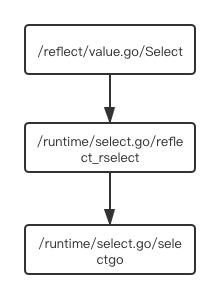
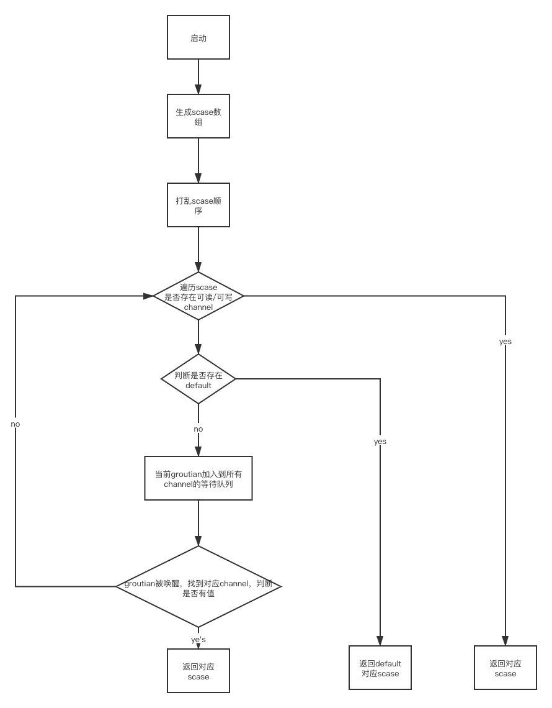

#select

## 基本使用
```go

// 阻塞读，对应channel的 chanrecv1函数
select {
    case <-c0:
        return
}

// 非阻塞读，对应channel的 selectnbrecv 函数
select {
    case <-c0:
        return
    default:
        return
}

// 多路复用
select {
    case <-c0:
        return
    case <-c1:
        return
    default:
        return
}

```
从上面的代码中可以看出select的三种机制
1. 只有一个case，并且没有default，相当于 <- c0的写法，阻塞读写数据
2. 一个case，一个default，就会直接对应channel的非阻塞读写数据
3. 有多个case，对应了真正的select多路复用机制，case随机执行

## 源码分析runtime/select.go
```go
const (
    caseNil = iota
    caseRecv
    caseSend
    caseDefault
)

type scase struct {
    c    *hchan         // channel
    elem unsafe.Pointer // 发送或者接受数据的变量地址
    kind uint16         // case类型，nil,接收，发送，default,对应上方常量
    //...
}
// 由于非 default 的 case 中都与 Channel 的发送和接收数据有关，所以在 scase 结构体中也包含一个 c 字段用于存储 case 中使用的 Channel，
//elem 是用于接收或者发送数据的变量地址、kind 表示当前 case 的种类
```


###运行时

代码执行流程：/reflect/value.go/Select -> /runtime/select.go/reflect_rselect -> /runtime/select.go/selectgo

###主要讲解两个函数
1. 第一个函数
```go
func reflect_rselect(cases []runtimeSelect) (int, bool) {
    //判断case数量
    if len(cases) == 0 {
        block()
    }

    //构建case数组
    sel := make([]scase, len(cases))

    //二倍的case长度 uint16数组
    order := make([]uint16, 2*len(cases))

    //组装case数组
    for i := range cases {
        rc := &cases[i]
        switch rc.dir {
        case selectDefault:
            sel[i] = scase{kind: caseDefault}
        case selectSend:
            sel[i] = scase{kind: caseSend, c: rc.ch, elem: rc.val}
        case selectRecv:
            sel[i] = scase{kind: caseRecv, c: rc.ch, elem: rc.val}
        }
        if raceenabled || msanenabled {
            selectsetpc(&sel[i])
        }
    }

    return selectgo(&sel[0], &order[0], len(cases))
}
```
2. 第二个函数

selectgo函数 参考图
	1、打乱数组顺序（随机获取case）
	2、锁定所有channel
	3、遍历所有channel，判断是否有可读或者可写的，如果有，解锁channel,返回对应数据
	4、否则，判断有没有default，如果有，解锁channel，返回default对应scase
	5、否则，把当前groutian添加到所有channel的等待队列里，解锁所有channel，等待被唤醒
	6、被唤醒后，再次锁定所有channel
	7、遍历所有channel，把g从channel等待队列中移除，并找到可操作的channel
	8、如果对应的scase不为空，直接返回对应的值
	9、否则循环此过程
```go

func selectgo(cas0 *scase, order0 *uint16, ncases int) (int, bool) {
    //...
    // 使用fastrandn随机算法，设置pollorder数组，后面会根据这个数组进行循环，以达到随机case
    for i := 1; i < ncases; i++ {
        j := fastrandn(uint32(i + 1))
        pollorder[i] = pollorder[j]
        pollorder[j] = uint16(i)
    }

    // 这段代码是对lockorder做一个堆排序
    // 所有的goroutian进来lockorder都是相同排序
    // 防止不同顺序的case进来时锁定channel导致死锁
    for i := 0; i < ncases; i++ {
        j := i
        // Start with the pollorder to permute cases on the same channel.
        c := scases[pollorder[i]].c
        for j > 0 && scases[lockorder[(j-1)/2]].c.sortkey() < c.sortkey() {
            k := (j - 1) / 2
            lockorder[j] = lockorder[k]
            j = k
        }
        lockorder[j] = pollorder[i]
    }
    for i := ncases - 1; i >= 0; i-- {
        o := lockorder[i]
        c := scases[o].c
        lockorder[i] = lockorder[0]
        j := 0
        for {
            k := j*2 + 1
            if k >= i {
                break
            }
            if k+1 < i && scases[lockorder[k]].c.sortkey() < scases[lockorder[k+1]].c.sortkey() {
                k++
            }
            if c.sortkey() < scases[lockorder[k]].c.sortkey() {
                lockorder[j] = lockorder[k]
                j = k
                continue
            }
            break
        }
        lockorder[j] = o
    }

    //根据lockorder的顺序
    sellock(scases, lockorder)

    var (
        gp     *g
        sg     *sudog
        c      *hchan
        k      *scase
        sglist *sudog
        sgnext *sudog
        qp     unsafe.Pointer
        nextp  **sudog
    )

loop:
    // pass 1 - look for something already waiting
    var dfli int
    var dfl *scase
    var casi int
    var cas *scase
    var recvOK bool
    //循环所有case
    for i := 0; i < ncases; i++ {
        //根据pollorder找到scases数组下标
        casi = int(pollorder[i])
        cas = &scases[casi]
        c = cas.c

        switch cas.kind {
        //如果kind为0，直接continue
        case caseNil:
            continue
        //如果kind为1，代表是接收
        case caseRecv:
            //从channel的发送队列中获取groutian，如果有，跳到recv代码块
            sg = c.sendq.dequeue()
            if sg != nil {
                goto recv
            }

            //判断channel是否为带缓冲的，并且缓冲区有值，跳到bufrecv代码块
            if c.qcount > 0 {
                goto bufrecv
            }

            //如果channel已经关闭，跳到rclose代码块
            if c.closed != 0 {
                goto rclose
            }

        //如果kind为2,代表是发送
        case caseSend:
            //send时先判断是否关闭
            //如果channel已经关闭，跳到sclose代码块
            if c.closed != 0 {
                goto sclose
            }
            //如果channel的读取队列里存在groutian,跳到send代码块
            sg = c.recvq.dequeue()
            if sg != nil {
                goto send
            }
            //如果channel为缓冲型，并且数据没满，跳转到bufsend代码块
            if c.qcount < c.dataqsiz {
                goto bufsend
            }
        //如果kind为3，执行default逻辑
        case caseDefault:
            dfli = casi
            dfl = cas
        }
    }

    //代码能走到这里，说明所有的channel都不具备读取的时机，判断是否有default
    //如果存在default，先解锁所有channel，跳转到retc代码块
    if dfl != nil {
        selunlock(scases, lockorder)
        casi = dfli
        cas = dfl
        goto retc
    }

    // 创建一个goroutian结构
    gp = getg()
    if gp.waiting != nil {
        throw("gp.waiting != nil")
    }

    //循环scases，把groutian存储到channel对应的读写队列中
    //设置gp.waiting为sudog队列
    nextp = &gp.waiting
    for _, casei := range lockorder {
        casi = int(casei)
        cas = &scases[casi]
        if cas.kind == caseNil {
            continue
        }
        c = cas.c
        //构建sudog
        sg := acquireSudog()
        sg.g = gp
        sg.isSelect = true
        // No stack splits between assigning elem and enqueuing
        // sg on gp.waiting where copystack can find it.
        sg.elem = cas.elem
        sg.releasetime = 0
        if t0 != 0 {
            sg.releasetime = -1
        }
        sg.c = c
        //gp.waiting队列添加数据
        *nextp = sg
        nextp = &sg.waitlink
        //如果kind为1，保存在channel的接收队列中
        switch cas.kind {
        case caseRecv:
            c.recvq.enqueue(sg)
        //如果kind为2，保存在channel的发送队列中
        case caseSend:
            c.sendq.enqueue(sg)
        }
    }

    // wait for someone to wake us up
    //设置goroutian的回调，如果有channel唤醒goroutian，会把对应的sudog保存到param中
    gp.param = nil

    //挂起goroutian，selparkcommit会给所有channel解锁
    gopark(selparkcommit, nil, waitReasonSelect, traceEvGoBlockSelect, 1)
    gp.activeStackChans = false

    //唤醒后先给channel加锁
    sellock(scases, lockorder)
    gp.selectDone = 0

    //唤醒groutian对应的sudog
    sg = (*sudog)(gp.param)
    gp.param = nil

    // pass 3 - dequeue from unsuccessful chans
    // otherwise they stack up on quiet channels
    // record the successful case, if any.
    // We singly-linked up the SudoGs in lock order.
    casi = -1
    cas = nil

    //sglist为所有sudog链表
    sglist = gp.waiting
    // Clear all elem before unlinking from gp.waiting.
    for sg1 := gp.waiting; sg1 != nil; sg1 = sg1.waitlink {
        sg1.isSelect = false
        sg1.elem = nil
        sg1.c = nil
    }
    gp.waiting = nil

    //循环所有case
    for _, casei := range lockorder {
        k = &scases[casei]
        if k.kind == caseNil {
            continue
        }
        if sglist.releasetime > 0 {
            k.releasetime = sglist.releasetime
        }
        //找到唤醒goroutian的sudog
        if sg == sglist {
            // sg has already been dequeued by the G that woke us up.
            casi = int(casei)
            cas = k
        } else { //从对应的读写队列中删除sudog
            c = k.c
            if k.kind == caseSend {
                c.sendq.dequeueSudoG(sglist)
            } else {
                c.recvq.dequeueSudoG(sglist)
            }
        }
        //从链表中获取下一个sudog，继续循环、删除读写队列
        sgnext = sglist.waitlink
        sglist.waitlink = nil
        releaseSudog(sglist)
        sglist = sgnext
    }

    if cas == nil {
        //如果唤醒的case为nil，从loop重新开始
        goto loop
    }

    c = cas.c

    if debugSelect {
        print("wait-return: cas0=", cas0, " c=", c, " cas=", cas, " kind=", cas.kind, "\n")
    }

    //如果是case是接收
    if cas.kind == caseRecv {
        recvOK = true
    }
    //继续锁定channel
    selunlock(scases, lockorder)

    //跳转到retc代码块
    goto retc

    //channel的缓冲区有数据时，直接从缓冲区获取数据
bufrecv:
    recvOK = true
    qp = chanbuf(c, c.recvx)
    //如果有接收值，把数据地址存入elem中
    if cas.elem != nil {
        typedmemmove(c.elemtype, cas.elem, qp)
    }
    typedmemclr(c.elemtype, qp)
    //接收索引往后挪一位或者初始化为0
    c.recvx++
    if c.recvx == c.dataqsiz {
        c.recvx = 0
    }
    //缓冲区的数据量减少一个
    c.qcount--

    //解锁所有channel
    selunlock(scases, lockorder)

    //跳转到retc代码块
    goto retc

    //channel的缓冲区有空闲位置时，把数据直接写入buffer中
bufsend:
    //设置数据到缓冲区
    typedmemmove(c.elemtype, chanbuf(c, c.sendx), cas.elem)

    //发送下标向后挪动或者初始化为0
    c.sendx++
    if c.sendx == c.dataqsiz {
        c.sendx = 0
    }

    //缓冲区中数据量加1
    c.qcount++
    //解锁channel
    selunlock(scases, lockorder)
    //跳转到retc代码区
    goto retc

    //如果发送队列中有groutian
recv:
    // can receive from sleeping sender (sg)
    // 从发送的sudog中获取数据
    // 解锁channel
    // 唤醒goroutian
    recv(c, sg, cas.elem, func() { selunlock(scases, lockorder) }, 2)
    if debugSelect {
        print("syncrecv: cas0=", cas0, " c=", c, "\n")
    }
    recvOK = true
    goto retc

    //接收时channel已关闭
rclose:
    // read at end of closed channel
    // 解锁channel
    selunlock(scases, lockorder)
    recvOK = false

    // 如果有有接收值， eg： case a := <- chan0,把数据地址赋值给elem
    if cas.elem != nil {
        typedmemclr(c.elemtype, cas.elem)
    }
    if raceenabled {
        raceacquire(c.raceaddr())
    }
    goto retc

    //发送时channel中存在接收goroutian
send:
    //把数据发送到接收的goroutian中
    //解锁channel
    //唤醒goroutian
    send(c, sg, cas.elem, func() { selunlock(scases, lockorder) }, 2)
    if debugSelect {
        print("syncsend: cas0=", cas0, " c=", c, "\n")
    }
    goto retc

    //返回
retc:
    if cas.releasetime > 0 {
        blockevent(cas.releasetime-t0, 1)
    }
    //返回对应case的下标，如果是接收，返回recvOK,channel关闭时为false
    return casi, recvOK

    //发送时channel已关闭，解锁channel，直接panic
sclose:
    // send on closed channel
    selunlock(scases, lockorder)
    panic(plainError("send on closed channel"))
}
```


