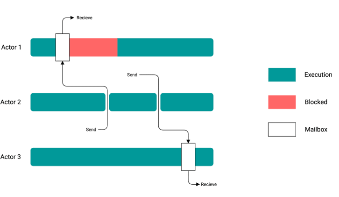
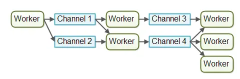

<!-- START doctoc generated TOC please keep comment here to allow auto update -->
<!-- DON'T EDIT THIS SECTION, INSTEAD RE-RUN doctoc TO UPDATE -->
**Table of Contents**  *generated with [DocToc](https://github.com/thlorenz/doctoc)*

- [消息传递(Message Passing)的并发模型](#%E6%B6%88%E6%81%AF%E4%BC%A0%E9%80%92message-passing%E7%9A%84%E5%B9%B6%E5%8F%91%E6%A8%A1%E5%9E%8B)
  - [Actor模型](#actor%E6%A8%A1%E5%9E%8B)
  - [CSP(Communicating Sequential Process) 顺序通信过程](#cspcommunicating-sequential-process-%E9%A1%BA%E5%BA%8F%E9%80%9A%E4%BF%A1%E8%BF%87%E7%A8%8B)
  - [参考](#%E5%8F%82%E8%80%83)

<!-- END doctoc generated TOC please keep comment here to allow auto update -->

# 消息传递(Message Passing)的并发模型

基于消息传递(Message Passing)的并发模型有两种：Actor模型和CSP模型. 基于消息的并发模型本质上就是：不通过共享内存进行通信;而是通过通信进行共享内存

- Actor 模型被用来解决分布式程序的问题而设计，因此它非常适合跨多台机器扩展

- CSP 模型 是依赖于一个通道channel完成两个通信实体之间协调的并发模型

一些编程语言，以及它们相应的并发机制:

- Actors Model — Erlang, Scala, Rust
- CSP — Go-lang
- 多线程 — Java, C#, C++

## Actor模型

在Actor模型中，主角是Actor，类似一种worker，Actor彼此之间直接发送消息，不需要经过什么中介，消息是异步发送和处理的

## CSP(Communicating Sequential Process) 顺序通信过程

CSP 也是一门自定义的编程语言，作者定义了输入输出语句，用于 processes 间的通信（communication）。
processes 被认为是需要输入驱动，并且产生输出，供其他 processes 消费，processes 可以是进程、线程、甚至是代码块。

输入命令是：!，用来向 processes 写入；
输出是：?，用来从 processes 读出。

鉴于Occam和Erlang都选用了CSP(来自Go FAQ)，并且效果不错，Go也选了CSP，但与前两者不同的是，Go把channel作为头等公民。

Go语言的CSP模型是由协程Goroutine与通道Channel实现：

goroutine来自协程的概念，让一组可复用的函数运行在一组线程之上，即使有协程阻塞，该线程的其他协程也可以被runtime调度，转移到其他可运行的线程上。
最关键的是，程序员看不到这些底层的细节，这就降低了编程的难度，提供了更容易的并发。

Golang，其实只用到了 CSP 的很小一部分，即理论中的 Process/Channel（对应到语言中的 goroutine/channel）：
这两个并发原语之间没有从属关系， Process 可以订阅任意个 Channel，Channel 也并不关心是哪个 Process 在利用它进行通信；
Process 围绕 Channel 进行读写，形成一套有序阻塞和可预测的并发模型。
Go语言的CSP模型是由协程Goroutine与通道Channel实现:

1. Go协程goroutine: 是一种轻量线程，它不是操作系统的线程，而是将一个操作系统线程分段使用，通过调度器实现协作式调度。
   是一种绿色线程，微线程，它与Coroutine协程也有区别，能够在发现堵塞后启动新的微线程。
2. 通道channel: 类似Unix的Pipe，用于协程之间通讯和同步。协程之间虽然解耦，但是它们和Channel有着耦合
   Goroutine 用于执行并发任务，channel 用于 goroutine 之间的同步、通信。
   Channel 分为两种：带缓冲、不带缓冲。对不带缓冲的 channel 进行的操作实际上可以看作 “同步模式”，带缓冲的则称为 “异步模式”

## 参考

- [CSP VS ACTOR模型以及GOLANG实现](https://www.freesion.com/article/9011316606/)