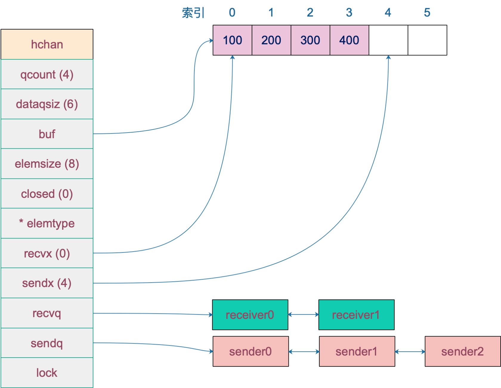
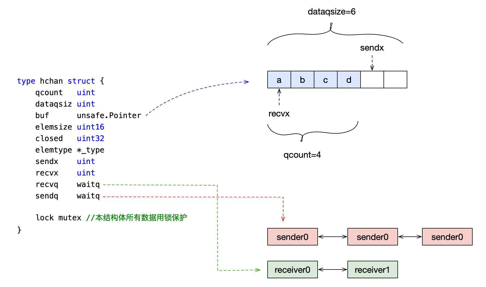
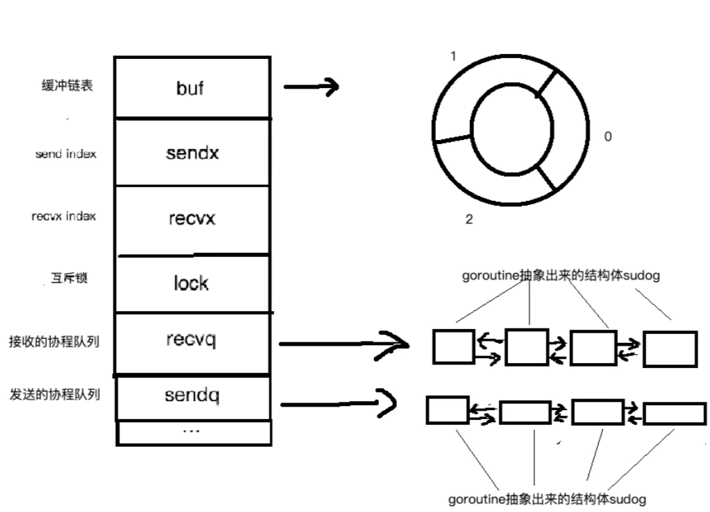

# 源码分析 

## 数据结构


	图为一个长度为6，类型为int, 两个接收者，三个发送者的channel，当前接收者准备读数据的位置为0，发送者发送数据位置为4.
	一般情况下recvq和sendq至少有一个为空。只有一个例外，那就是同一个goroutine使用select语句向channel一边写数据，一边读数据
  


	1. buf是有缓冲的channel所特有的结构，用来存储缓存数据。是个循环链表
	2. sendx和recvx用于记录buf这个循环链表中的~发送或者接收的~index
	3. lock是个互斥锁。
	4. recvq和sendq分别是接收(<-channel)或者发送(channel <- xxx)的goroutine抽象出来的结构体(sudog)的队列。是个双向链表

源码在： /runtime/chan.go 结构体是 hchan
```go
type hchan struct {
	qcount   uint           // total data in the queue 队列中元素，缓冲的元素
	dataqsiz uint           // size of the circular queue   队列长度，eg make(chan int64, 5), dataqsiz为5
	buf      unsafe.Pointer // points to an array of dataqsiz elements 数据存储环形数组
	elemsize uint16 每个元素的大小
	closed   uint32 是否关闭 0 未关闭
	elemtype *_type // element type 元素类型
	sendx    uint   // send index 发送者写入位置
	recvx    uint   // receive index 接受者读数据位置
	recvq    waitq  // list of recv waiters 接收者队列，保存正在读取channel的goroutian
	sendq    waitq  // list of send waiters 发送者队列，保存正在发送channel的goroutian
	lock mutex // 锁
}

type waitq struct {
	first *sudog
	last  *sudog
}
//waitq是双向链表，sudog为goroutine的封装
```

源码分析PPT: https://speakerdeck.com/kavya719/understanding-channels
	1.channel的创建  make_chan.jpg
		创建channel实际上就是在内存中实例化了一个hchan的结构体，并返回一个ch指针，我们使用过程中channel在函数之间的传递都是用的这个指针，
		这就是为什么函数传递中无需使用channel的指针，而直接用channel就行了，因为channel本身就是一个指针
	2.各种场景的发送和接收
		见  blocked_into_sudog.jpg
	3.goroutine的调度
	4.goroutine的阻塞和唤醒
	5.channel和goroutine在select操作下  
	
## 一.创建过程
	创建channel的过程实际上是初始化hchan结构。其中类型信息和缓冲区长度由make语句传入，buf的大小则与元素大小和缓冲区长度共同决定
	源码：runtime/chan.go
```go
	func makechan(t *chantype, size int) *hchan {
		elem := t.elem
		//...
		var c *hchan
		//创建hchan结构并分配内存
		switch {
		// 无缓冲区
		case mem == 0:
			c = (*hchan)(mallocgc(hchanSize, nil, true))
			c.buf = c.raceaddr()
		// 元素不含指针
		case elem.ptrdata == 0:
			c = (*hchan)(mallocgc(hchanSize+mem, nil, true))
			c.buf = add(unsafe.Pointer(c), hchanSize)
		default:
		 // 默认场景，结构体和buffer单独分配内存
			c = new(hchan)
			c.buf = mallocgc(mem, elem, true)
		}

		//元素大小
		c.elemsize = uint16(elem.size)
		//元素类型
		c.elemtype = elem
		//队列长度
		c.dataqsiz = uint(size)

		//...
		return c
	}
```


## 二. 写数据--分为阻塞写和非阻塞写
```go
	c := make(chan int64)
	//阻塞写
		c <- 1
	//非阻塞写
    	select {
		case c <- 1:
			//do something
			break
		default:
			//do something
		}
```

注意：非阻塞写必须带上default
	对应
```go
//阻塞
    func chansend1(c *hchan, elem unsafe.Pointer) {
       chansend(c, elem, true, getcallerpc())
    }
//非阻塞
    func selectnbsend(c *hchan, elem unsafe.Pointer) (selected bool) {
        return chansend(c, elem, false, getcallerpc())
    }
```


	// 位于 src/runtime/chan.go
```go
	func chansend(c *hchan, ep unsafe.Pointer, block bool, callerpc uintptr) bool {
		// 如果 channel 是 nil
		if c == nil {
			// 不能阻塞，直接返回 false，表示未发送成功
			if !block {
				return false
			}
			// 当前 goroutine 被挂起
			gopark(nil, nil, "chan send (nil chan)", traceEvGoStop, 2)
			throw("unreachable")
		}
		// 省略 debug 相关……
		// 对于不阻塞的 send，快速检测失败场景
		//
		// 如果 channel 未关闭且 channel 没有多余的缓冲空间。这可能是：
		// 1. channel 是非缓冲型的，且等待接收队列里没有 goroutine
		// 2. channel 是缓冲型的，但循环数组已经装满了元素
		if !block && c.closed == 0 && ((c.dataqsiz == 0 && c.recvq.first == nil) ||
			(c.dataqsiz > 0 && c.qcount == c.dataqsiz)) {
			return false
		}
		var t0 int64
		if blockprofilerate > 0 {
			t0 = cputicks()
		}
		// 锁住 channel，并发安全
		lock(&c.lock)
		// 如果 channel 关闭了
		if c.closed != 0 {
			// 解锁
			unlock(&c.lock)
			// 直接 panic
			panic(plainError("send on closed channel"))
		}
		// 如果接收队列里有 goroutine，直接将要发送的数据拷贝到接收 goroutine
		if sg := c.recvq.dequeue(); sg != nil {
			send(c, sg, ep, func() { unlock(&c.lock) }, 3)
			return true
		}
		// 对于缓冲型的 channel，如果还有缓冲空间
		if c.qcount < c.dataqsiz {
			// qp 指向 buf 的 sendx 位置
			qp := chanbuf(c, c.sendx)
			// ……
			// 将数据从 ep 处拷贝到 qp
			typedmemmove(c.elemtype, qp, ep)
			// 发送游标值加 1
			c.sendx++
			// 如果发送游标值等于容量值，游标值归 0
			if c.sendx == c.dataqsiz {
				c.sendx = 0
			}
			// 缓冲区的元素数量加一
			c.qcount++
			// 解锁
			unlock(&c.lock)
			return true
		}
		// 如果不需要阻塞，则直接返回错误
		if !block {
			unlock(&c.lock)
			return false
		}
		// channel 满了，发送方会被阻塞。接下来会构造一个 sudog
		// 获取当前 goroutine 的指针
		gp := getg()
		mysg := acquireSudog()
		mysg.releasetime = 0
		if t0 != 0 {
			mysg.releasetime = -1
		}
		mysg.elem = ep
		mysg.waitlink = nil
		mysg.g = gp
		mysg.selectdone = nil
		mysg.c = c
		gp.waiting = mysg
		gp.param = nil
		// 当前 goroutine 进入发送等待队列
		c.sendq.enqueue(mysg)
		// 当前 goroutine 被挂起
		goparkunlock(&c.lock, "chan send", traceEvGoBlockSend, 3)
		// 从这里开始被唤醒了（channel 有机会可以发送了）
		if mysg != gp.waiting {
			throw("G waiting list is corrupted")
		}
		gp.waiting = nil
		if gp.param == nil {
			if c.closed == 0 {
				throw("chansend: spurious wakeup")
			}
			// 被唤醒后，channel 关闭了。坑爹啊，panic
			panic(plainError("send on closed channel"))
		}
		gp.param = nil
		if mysg.releasetime > 0 {
			blockevent(mysg.releasetime-t0, 2)
		}
		// 去掉 mysg 上绑定的 channel
		mysg.c = nil
		releaseSudog(mysg)
		return true
	}
```

send,recv操作：
	注意：缓存链表中以上每一步的操作，都是需要加锁操作的！
	每一步的操作的细节可以细化为：
	• 第一，加锁
	• 第二，把数据从goroutine中copy到“队列”中(或者从队列中copy到goroutine中）。
	• 第三，释放锁

## 三. 读数据 --分阻塞和非阻塞
	1。如果等待发送队列sendq不为空，且没有缓冲区，直接从sendq中取出G，把G中数据读出，最后把G唤醒，结束读取过程；
	2。如果等待发送队列sendq不为空，此时说明缓冲区已满，从缓冲区中首部读出数据，把G中数据写入缓冲区尾部，把G唤醒，结束读取过程；
	3。如果缓冲区中有数据，则从缓冲区取出数据，结束读取过程；
	4。 sender_process_diagram将当前goroutine加入recvq，进入睡眠，等待被写goroutine唤醒；

	c := make(chan int, 10)
	<-c //阻塞读

	//select读带default为非阻塞读
	select{
	case <-c:
		//...
		break
	default:
		//...
	}
注意：非阻塞读必须带上default
接收操作有两种写法，
```go
//一种带 “ok”，反应 channel 是否关闭；
//一种不带 “ok”，这种写法，当接收到相应类型的零值时无法知道是真实的发送者发送过来的值，还是 channel 被关闭后，返回给接收者的默认类型的零值
c := make(chan int64, 5)
c <- 0
v, ok := <-c
fmt.Println(v, ok) // 0, true
close(c) 关闭
v, ok = <-c
fmt.Println(v, ok) // 0, false
//应源码里的这四个函数
    //1.非阻塞读不带ok返回
    func selectnbrecv(elem unsafe.Pointer, c *hchan) (selected bool) {
        selected, _ = chanrecv(c, elem, false)
        return
    }
    //2.非阻塞读带Ok返回
    func selectnbrecv2(elem unsafe.Pointer, received *bool, c *hchan) (selected bool) {
       // TODO(khr): just return 2 values from this function, now that it is in Go.
      selected, *received = chanrecv(c, elem, false)
       return
    }
    
    //3.阻塞读不带ok返回
    func chanrecv1(c *hchan, elem unsafe.Pointer) {
       chanrecv(c, elem, true)
    }
    
    //4.阻塞读带ok返回
    func chanrecv2(c *hchan, elem unsafe.Pointer) (received bool) {
       _, received = chanrecv(c, elem, true)
       return
    }
```

源码分析
	最终都指向了chanrecv函数，如果有接收值，val := <-c，会把接收值放到elem的地址中，如果忽略接收值直接写<-c，这时elem为nil
```go
	// 位于 src/runtime/chan.go
	// chanrecv 函数接收 channel c 的元素并将其写入 ep 所指向的内存地址。
	// 如果 ep 是 nil，说明忽略了接收值。
	// 如果 block == false，即非阻塞型接收，在没有数据可接收的情况下，返回 (false, false)
	// 否则，如果 c 处于关闭状态，将 ep 指向的地址清零，返回 (true, false)
	// 否则，用返回值填充 ep 指向的内存地址。返回 (true, true)
	// 如果 ep 非空，则应该指向堆或者函数调用者的栈
	func chanrecv(c *hchan, ep unsafe.Pointer, block bool) (selected, received bool) {
		// 省略 debug 内容 …………
		// 如果是一个 nil 的 channel
		if c == nil {
			// 如果不阻塞，直接返回 (false, false)
			if !block {
				return
			}
			// 否则，接收一个 nil 的 channel，goroutine 挂起
			gopark(nil, nil, "chan receive (nil chan)", traceEvGoStop, 2)
			// 不会执行到这里
			throw("unreachable")
		}
		// 在非阻塞模式下，快速检测到失败，不用获取锁，快速返回
		// 当我们观察到 channel 没准备好接收：
		// 1. 非缓冲型，等待发送列队 sendq 里没有 goroutine 在等待
		// 2. 缓冲型，但 buf 里没有元素
		// 之后，又观察到 closed == 0，即 channel 未关闭。
		// 因为 channel 不可能被重复打开，所以前一个观测的时候 channel 也是未关闭的，
		// 因此在这种情况下可以直接宣布接收失败，返回 (false, false)
		// 非阻塞 && ((非缓冲型 && 发送队列为空) || (缓冲性 && 没有数据)) && 没有关闭
		if !block && (c.dataqsiz == 0 && c.sendq.first == nil ||
			c.dataqsiz > 0 && atomic.Loaduint(&c.qcount) == 0) &&
			atomic.Load(&c.closed) == 0 {
			return
		}
		var t0 int64
		if blockprofilerate > 0 {
			t0 = cputicks()
		}
		// 加锁
		lock(&c.lock)
		// channel 已关闭，并且循环数组 buf 里没有元素
		// 这里可以处理非缓冲型关闭 和 缓冲型关闭但 buf 无元素的情况
		// 也就是说即使是关闭状态，但在缓冲型的 channel，
		// buf 里有元素的情况下还能接收到元素
		if c.closed != 0 && c.qcount == 0 {
			if raceenabled {
				raceacquire(unsafe.Pointer(c))
			}
			// 解锁
			unlock(&c.lock)
			if ep != nil {
				// 从一个已关闭的 channel 执行接收操作，且未忽略返回值
				// 那么接收的值将是一个该类型的零值
				// typedmemclr 根据类型清理相应地址的内存
				typedmemclr(c.elemtype, ep)
			}
			// 从一个已关闭的 channel 接收，selected 会返回true
			return true, false
		}
		// 等待发送队列里有 goroutine 存在，说明 buf 是满的
		// 这有可能是：
		// 1. 非缓冲型的 channel
		// 2. 缓冲型的 channel，但 buf 满了
		// 针对 1，直接进行内存拷贝（从 sender goroutine -> receiver goroutine）
		// 针对 2，接收到循环数组头部的元素，并将发送者的元素放到循环数组尾部
		if sg := c.sendq.dequeue(); sg != nil {
			// Found a waiting sender. If buffer is size 0, receive value
			// directly from sender. Otherwise, receive from head of queue
			// and add sender's value to the tail of the queue (both map to
			// the same buffer slot because the queue is full).
			recv(c, sg, ep, func() { unlock(&c.lock) }, 3)
			return true, true
		}
		// 缓冲型，buf 里有元素，可以正常接收
		if c.qcount > 0 {
			// 直接从循环数组里找到要接收的元素
			qp := chanbuf(c, c.recvx)
			// …………
			// 代码里，没有忽略要接收的值，不是 "<- ch"，而是 "val <- ch"，ep 指向 val
			if ep != nil {
				typedmemmove(c.elemtype, ep, qp)
			}
			// 清理掉循环数组里相应位置的值
			typedmemclr(c.elemtype, qp)
			// 接收游标向前移动
			c.recvx++
			// 接收游标归零
			if c.recvx == c.dataqsiz {
				c.recvx = 0
			}
			// buf 数组里的元素个数减 1
			c.qcount--
			// 解锁
			unlock(&c.lock)
			return true, true
		}
		if !block {
			// 非阻塞接收，解锁。selected 返回 false，因为没有接收到值
			unlock(&c.lock)
			return false, false
		}
		// 接下来就是要被阻塞的情况了
		// 构造一个 sudog
		gp := getg()
		mysg := acquireSudog()
		mysg.releasetime = 0
		if t0 != 0 {
			mysg.releasetime = -1
		}
		// 待接收数据的地址保存下来
		mysg.elem = ep
		mysg.waitlink = nil
		gp.waiting = mysg
		mysg.g = gp
		mysg.selectdone = nil
		mysg.c = c
		gp.param = nil
		// 进入channel 的等待接收队列
		c.recvq.enqueue(mysg)
		// 将当前 goroutine 挂起
		goparkunlock(&c.lock, "chan receive", traceEvGoBlockRecv, 3)
		// 被唤醒了，接着从这里继续执行一些扫尾工作
		if mysg != gp.waiting {
			throw("G waiting list is corrupted")
		}
		gp.waiting = nil
		if mysg.releasetime > 0 {
			blockevent(mysg.releasetime-t0, 2)
		}
		closed := gp.param == nil
		gp.param = nil
		mysg.c = nil
		releaseSudog(mysg)
		return true, !closed
	}

```

当channel缓存满了之后会发生什么?
	Go调度原理web连接：https://i6448038.github.io/2017/12/04/golang-concurrency-principle/  Go的CSP并发模型--->Go线程实现模型MPG

## 三：关闭channel
	close 逻辑比较简单，对于一个 channel，recvq 和 sendq 中分别保存了阻塞的发送者和接收者。关闭 channel 后，对于等待接收者而言，会收到一个相应类型的零值。
	对于等待发送者，会直接 panic。所以，在不了解 channel 还有没有接收者的情况下，不能贸然关闭 channel.
	close 函数先上一把大锁，接着把所有挂在这个 channel 上的 sender 和 receiver 全都连成一个 sudog 链表，再解锁。
	最后，再将所有的 sudog 全都唤醒。
关闭原则：
	一般原则上使用通道是不允许接收方关闭通道和 不能关闭一个有多个并发发送者的通道。
	换而言之， 你只能在发送方的 goroutine 中关闭只有该发送方的通道
源码分析
```go
	func closechan(c *hchan) {
		// 关闭一个 nil channel，panic
		if c == nil {
			panic(plainError("close of nil channel"))
		}
		// 上锁
		lock(&c.lock)
		// 如果 channel 已经关闭
		if c.closed != 0 {
			unlock(&c.lock)
			// panic
			panic(plainError("close of closed channel"))
		}
		// …………
		// 修改关闭状态
		c.closed = 1
		var glist *g
		// 将 channel 所有等待接收队列的里 sudog 释放
		for {
			// 从接收队列里出队一个 sudog
			sg := c.recvq.dequeue()
			// 出队完毕，跳出循环
			if sg == nil {
				break
			}
			// 如果 elem 不为空，说明此 receiver 未忽略接收数据
			// 给它赋一个相应类型的零值
			if sg.elem != nil {
				typedmemclr(c.elemtype, sg.elem)
				sg.elem = nil
			}
			if sg.releasetime != 0 {
				sg.releasetime = cputicks()
			}
			// 取出 goroutine
			gp := sg.g
			gp.param = nil
			if raceenabled {
				raceacquireg(gp, unsafe.Pointer(c))
			}
			// 相连，形成链表
			gp.schedlink.set(glist)
			glist = gp
		}
		// 将 channel 等待发送队列里的 sudog 释放
		// 如果存在，这些 goroutine 将会 panic
		for {
			// 从发送队列里出队一个 sudog
			sg := c.sendq.dequeue()
			if sg == nil {
				break
			}
			// 发送者会 panic
			sg.elem = nil
			if sg.releasetime != 0 {
				sg.releasetime = cputicks()
			}
			gp := sg.g
			gp.param = nil
			if raceenabled {
				raceacquireg(gp, unsafe.Pointer(c))
			}
			// 形成链表
			gp.schedlink.set(glist)
			glist = gp
		}
		// 解锁
		unlock(&c.lock)
		// Ready all Gs now that we've dropped the channel lock.
		// 遍历链表
		for glist != nil {
			// 取最后一个
			gp := glist
			// 向前走一步，下一个唤醒的 g
			glist = glist.schedlink.ptr()
			gp.schedlink = 0
			// 唤醒相应 goroutine
			goready(gp, 3)
		}
	}
```
*/
