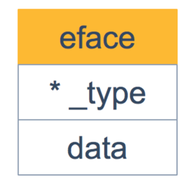
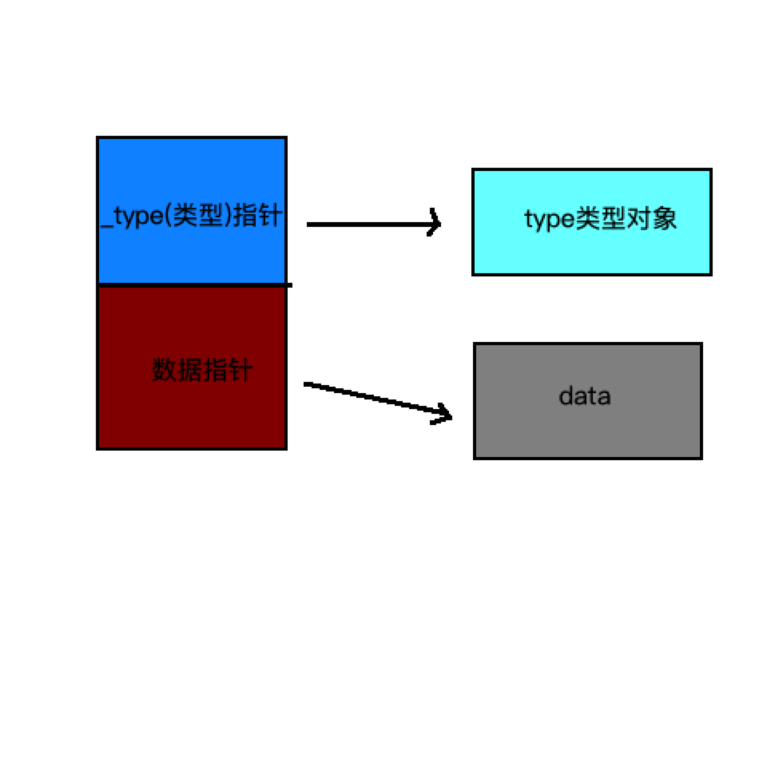
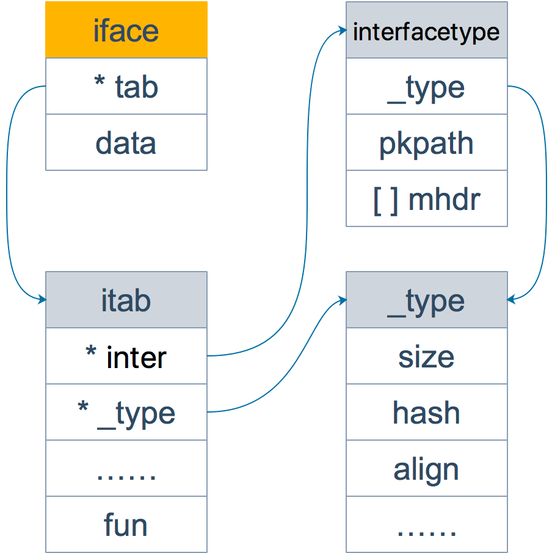

# interface 源码分析

## 背景：
接口的定义可以说是一种规范，是一组方法的集合，通常在代码设计的层面，对多个组件有共性的方法进行抽象(共性可以分为横向和纵向)引入一层中间层，
解除上游与下游的耦合关系，让代码可读性更高并不用关心方法的具体实现，同时借助接口也可以实现多态。

共性可以分为横向和纵向的
- 纵向：
    例如动物这个对象可以向下细分为狗和猫，它们有共同的行为可以跑。
- 横向
    再或者数据库的连接可以抽象为接口，可以支持mysql、oracle等

## 源码分析

interface的定义在 1.15.3 源码包runtime中,interface的定义分为两种，
- 不带方法的runtime.eface
- 带方法的runtime.iface

尽管空接口理论上可以重用 iface 数据结构(因为 iface 可以算是 eface 的一个超集)，runtime 还是选择对这两种 interface 进行区分，
主要有两个理由: 为了节省空间，以及代码清晰

### 1. runtime.eface 表示不含方法的interface{}类型




eface 主要包括类型信息和值的指针，非常好理解。其中 data 指针指向的内存包含了类型和值的信息，也就是说 data 指针指向了 eface 本身

```go
// /Users/python/go/go1.18/src/runtime/runtime2.go
type eface struct {
    _type *_type  // 表示空接口所承载的具体的实体类型
    data  unsafe.Pointer  // 指向的值
}

//_type 结构对 Go 的类型给出了完成的描述。 其定义在 (src/runtime/type.go)
type _type struct {

    size       uintptr //类型大小,占用的字节大小
    ptrdata uintptr //指针数据 size of memory prefix holding all pointers
    
    hash       uint32 // 类型 hash
	tflag      tflag // 额外的标记信息,和反射相关
    
    // 内存对齐相关
    align      uint8 // 内存对齐系数
    fieldAlign uint8 // 字段内存对齐系数
    
    // 类型的编号，有bool, slice, struct 等等
    kind uint8 //用于标记数据类型
    // function for comparing objects of this type
    // (ptr to object A, ptr to object B) -> ==?
    equal func(unsafe.Pointer, unsafe.Pointer) bool//用于判断当前类型多个对象是否相等
    str       nameOff //类型名称字符串在二进制文件段中的偏移量
    ptrToThis typeOff // 类型元信息指针在二进制文件段中的偏移量
}
```
解释
- nameOff 和 typeOff 类型是 int32 ，这两个值是链接器负责嵌入的，相对于可执行文件的元信息的偏移量。
元信息会在运行期，加载到 runtime.moduledata 结构体中 (src/runtime/symtab.go), 如果你曾经研究过 ELF 文件的内容的话，看起来会显得很熟悉。
runtime 提供了一些 helper 函数，这些函数能够帮你找到相对于 moduledata 的偏移量，比如 resolveNameOff (src/runtime/type.go) and resolveTypeOff (src/runtime/type.go):


Go 语言 map, slice, array等内置的复杂类型类型都是在 _type 字段的基础上，增加一些额外的字段来进行管理的：
```go
// /Users/python/go/go1.18/src/runtime/type.go
type arraytype struct {
    typ   _type
    elem  *_type
    slice *_type
    len   uintptr
}

type chantype struct {
    typ  _type
    elem *_type
    dir  uintptr
}

type slicetype struct {
    typ  _type
    elem *_type
}

type functype struct {
	typ      _type
	inCount  uint16
	outCount uint16
}

type ptrtype struct {
	typ  _type
	elem *_type
}

type structtype struct {
	typ     _type
	pkgPath name
	fields  []structfield
}
```
这些数据类型的结构体定义，是反射实现的基础。


### 2. runtime.iface 表示包含方法的接口

```go
type iface struct {
    tab  *itab  // tab 是接口表指针，指向类型信息  --->动态类型
    data unsafe.Pointer // 数据指针，则指向具体的数据 --> 动态值
}
```
一个 interface 就是这样一个非常简单的结构体，内部维护两个指针:
- itab,被称为动态类型。
- data数据，被称为动态值。
接口值包括动态类型和动态值。
  
虽然很简单，不过数据结构的定义已经提供了重要的信息: 由于 interface 只能持有指针，任何用 interface 包装的具体类型，都会被取其地址。

itab 是这样定义的 (src/runtime/runtime2.go),itab 是 interface 的核心:
```go
// /Users/python/go/go1.18/src/runtime/runtime2.go
type itab struct {
    inter *interfacetype // 接口静态类型, 接口的抽象表示，也就是静态的接口，不是实际的 struct
    _type *_type // 实际类型
    hash  uint32 // copy of _type.hash. Used for type switches. 和 _type 中的 hash 一样，用来类型断言
    _     [4]byte
    fun   [1]uintptr // variable sized. fun[0]==0 means _type does not implement inter. 接口实现的函数，跟接口类型保持一致
       
}
```
itab包含的是  
- 接口类型interfacetype,这只是一个包装了 _type 和额外的与 interface 相关的信息的字段
- _type这个类型是 runtime 对任意 Go 语言类型的内部表示._type 类型描述了一个“类型”的每一个方面: 类型名字，特性(e.g. 大小，对齐方式...)，某种程度上类型的行为(e.g. 比较，哈希...) 也包含在内了。
- 实现接口的方法fun,fun是可变大小,go在编译期间就会对接口实现校验检查,并将对应的方法存储fun。

你可能会觉得奇怪，为什么 fun 数组的大小为 1，要是接口定义了多个方法可怎么办？实际上，这里存储的是第一个方法的函数指针，如果有更多的方法，在它之后的内存空间里继续存储。
从汇编角度来看，通过增加地址就能获取到这些函数指针，没什么影响。顺便提一句，这些方法是按照函数名称的字典序进行排列的。

Note：这里只会列出实体类型和接口相关的方法，实体类型的其他方法并不会出现在这里。如果你学过 C++ 的话，这里可以类比虚函数的概念。

```go
type interfacetype struct {
    typ     _type
    pkgpath name  // 定义了接口的包名
    mhdr    []imethod // 表示接口所定义的函数列表，不是实际的被实现的 method
}

type nameOff int32
type typeOff int32

type imethod struct {
    name nameOff
    ityp typeOff
}
```
interfacetype 只是对于 _type 的一种包装，在其顶部空间还包装了额外的 interface 相关的元信息。 
在最近的实现中，这部分元信息一般是由一些指向相应名字的 offset 的列表和 interface 所暴露的方法的类型所组成([]imethod)。


### eface 和 iface 的转换

我们知道 任何指针都可以转换成 unsafe.Pointer, unsafe.Pointer 也可以转换成任意的指针

在使用 unsafe.Pointer 进行转换时，不会进行类型检查，只是粗暴的把类型替换，指针的地址和实际的值都不会变化。

假如使用 unsafe.Pointer 进行转换的两种数据类型差异很大，转换之后使用的时候也会出错。这也是叫 unsafe 的原因。

对于 eface 和 iface：假如 eface的类型是 Interface，那么 eface 中的 _type 字段和 iface 中的 inter 是可以通过 unsafe.Pointer 进行转换的。


## 接口类型和 nil 作比较

接口值的零值是指动态类型和动态值都为 nil。当仅且当这两部分的值都为 nil 的情况下，这个接口值就才会被认为 接口值 == nil