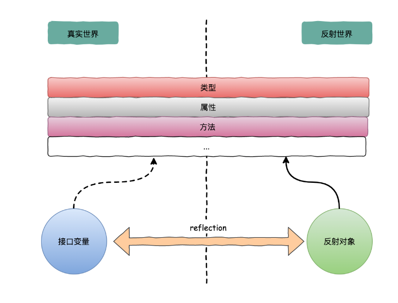
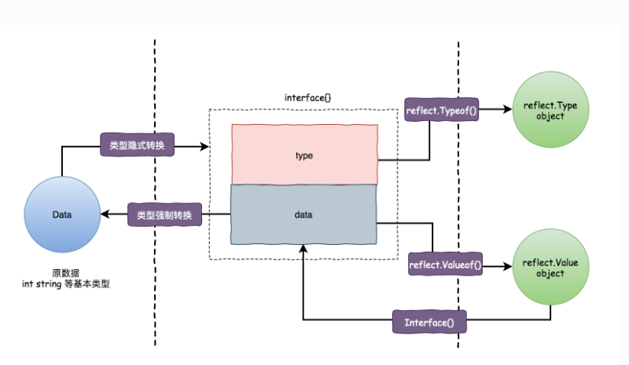

<!-- START doctoc generated TOC please keep comment here to allow auto update -->
<!-- DON'T EDIT THIS SECTION, INSTEAD RE-RUN doctoc TO UPDATE -->
**Table of Contents**  *generated with [DocToc](https://github.com/thlorenz/doctoc)*

- [反射三大定律](#%E5%8F%8D%E5%B0%84%E4%B8%89%E5%A4%A7%E5%AE%9A%E5%BE%8B)
  - [1 Reflection goes from interface value to reflection object.](#1-reflection-goes-from-interface-value-to-reflection-object)
  - [2 Reflection goes from reflection object to interface value.](#2-reflection-goes-from-reflection-object-to-interface-value)
  - [3 To modify a reflection object, the value must be settable.](#3-to-modify-a-reflection-object-the-value-must-be-settable)
  - [参考](#%E5%8F%82%E8%80%83)

<!-- END doctoc generated TOC please keep comment here to allow auto update -->

# 反射三大定律




## 1 Reflection goes from interface value to reflection object.
第一条是最基本的：反射可以从接口值得到反射对象。

为什么是从 interface{} 变量到反射对象？

当我们执行 reflect.ValueOf(1) 时，虽然看起来是获取了基本类型 int 对应的反射类型，
由于 TypeOf 和 ValueOf 两个函数接收的是 interface{} 空接口类型，而 Go 语言函数都是值传递，因此Go语言会将我们的类型隐式地转换成接口类型。

## 2 Reflection goes from reflection object to interface value.

第二条实际上和第一条是相反的机制，反射可以从反射对象获得接口值。

    它将 ValueOf的返回值通过 Interface()函数反向转变成 interface变量。

    前两条就是说 接口型变量和 反射类型对象可以相互转化，反射类型对象实际上就是指的前面说的 reflect.Type和 reflect.Value。
```go
func (v Value) Interface() (i interface{})  // 如果Value是结构体的非导出字段，调用该函数会导致panic。
```   


  
总结前两个定律


## 3 To modify a reflection object, the value must be settable.

如果需要操作一个反射变量，则其值必须可以修改。

在反射的规则里

- 不是接收变量指针创建的反射对象，是不具备『可写性』的

- 是否具备『可写性』，可使用 CanSet() 来获取得知

- 对不具备『可写性』的对象进行修改，是没有意义的，也认为是不合法的，因此会报错。
```go
func main() {
	i := 1
	v := reflect.ValueOf(i)
	fmt.Println("可写性为:", v.CanSet())
	v.SetInt(10)
}
```

```shell
$ go run reflect.go
可写性为: false
panic: reflect: reflect.Value.SetInt using unaddressable value

goroutine 1 [running]:
reflect.flag.mustBeAssignableSlow(0x14?)
/Users/python/go/go1.21.5/src/reflect/value.go:272 +0x74
reflect.flag.mustBeAssignable(...)
/Users/python/go/go1.21.5/src/reflect/value.go:259
reflect.Value.SetInt({0x100def6c0?, 0x14000072ee0?, 0x14000072f08?}, 0xa)
/Users/python/go/go1.21.5/src/reflect/value.go:2333 +0x40
main.main()
/Users/python/Downloads/git_download/go_advanced_code/chapter03_channel/05_test/main.go:12 +0xfc

```
运行上述代码会导致程序崩溃并报出 “reflect: reflect.flag.mustBeAssignable using unaddressable value” 错误，
仔细思考一下就能够发现出错的原因：由于 Go 语言的函数调用都是传值的，所以我们得到的反射对象跟最开始的变量没有任何关系，那么直接修改反射对象无法改变原始变量，程序为了防止错误就会崩溃


要让反射对象具备可写性，需要注意两点

- 创建反射对象时传入变量的指针

- 使用 Elem()函数返回指针指向的数据

```go
package main

import (
    "fmt"
    "reflect"
)

func main() {
    var name string = "Danny"
    v1 := reflect.ValueOf(&name)
    fmt.Println("v1 可写性为:", v1.CanSet()) // v1 可写性为: false

    v2 := v1.Elem()
    fmt.Println("v2 可写性为:", v2.CanSet()) // v2 可写性为: true
}
```


## 参考

- [反射三定律-王炳明](https://golang.iswbm.com/c02/c02_07.html)
- https://go.dev/blog/laws-of-reflection