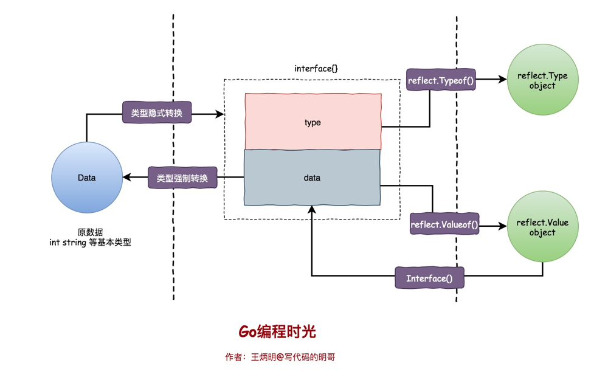
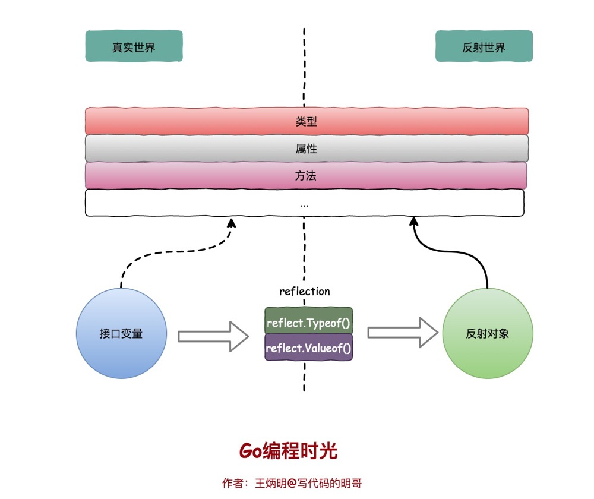
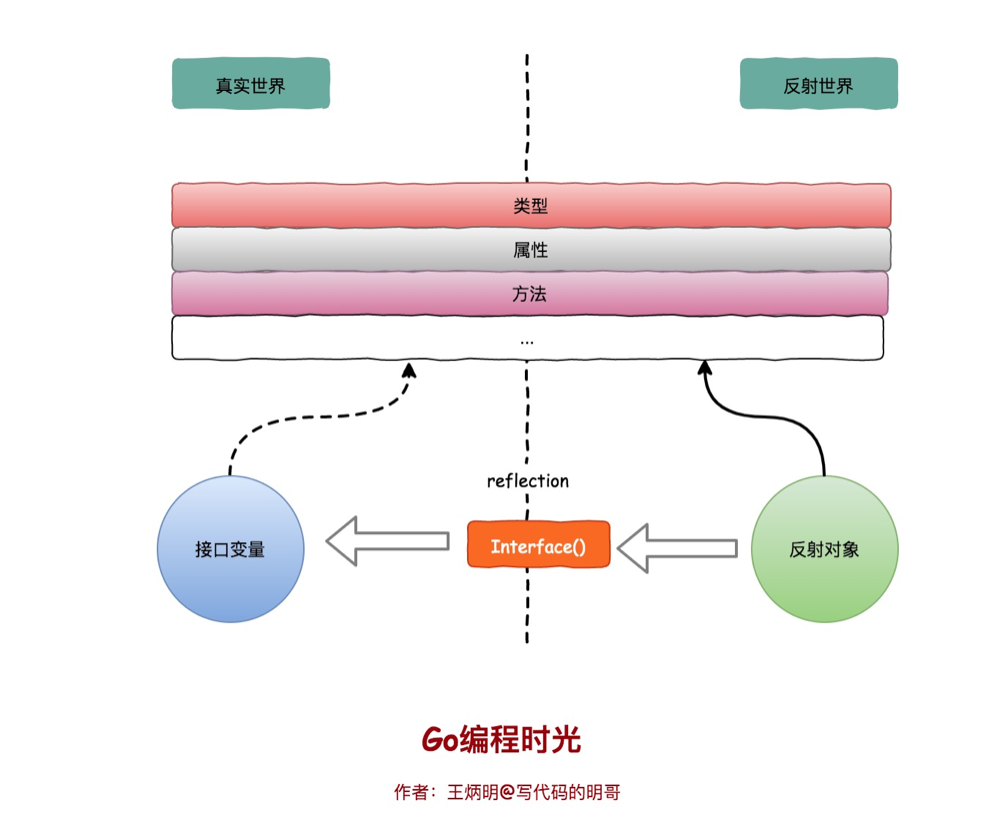

<!-- START doctoc generated TOC please keep comment here to allow auto update -->
<!-- DON'T EDIT THIS SECTION, INSTEAD RE-RUN doctoc TO UPDATE -->
**Table of Contents**  *generated with [DocToc](https://github.com/thlorenz/doctoc)*

- [三大定律](#%E4%B8%89%E5%A4%A7%E5%AE%9A%E5%BE%8B)
  - [反射三大定律代码](#%E5%8F%8D%E5%B0%84%E4%B8%89%E5%A4%A7%E5%AE%9A%E5%BE%8B%E4%BB%A3%E7%A0%81)

<!-- END doctoc generated TOC please keep comment here to allow auto update -->

# 三大定律




1. reflect.TypeOf： 直接给到了我们想要的type类型，如float64、int、各种pointer、struct 等等真实的类型


2. reflect.ValueOf：直接给到了我们想要的具体的值，如1.2345这个具体数值，或者类似&{1 "Allen.Wu" 25} 这样的结构体struct的值
   
3. 也就是说明反射可以将“接口类型变量”转换为“反射类型对象”，反射类型指的是reflect.Type和reflect.Value这两种


## [反射三大定律代码](chapter04_interface_n_reflect/02_reflect/01three_laws/main.go)

1. 第一条是最基本的：反射可以从接口值得到反射对象。

   为什么是从 interface{} 变量到反射对象？当我们执行 reflect.ValueOf(1) 时，虽然看起来是获取了基本类型 int 对应的反射类型，但是由于 reflect.TypeOf、reflect.ValueOf 两个方法的入参都是 interface{} 类型，所以在方法执行的过程中发生了类型转换

2. 第二条实际上和第一条是相反的机制，反射可以从反射对象获得接口值。

    它将 ValueOf的返回值通过 Interface()函数反向转变成 interface变量。

    前两条就是说 接口型变量和 反射类型对象可以相互转化，反射类型对象实际上就是指的前面说的 reflect.Type和 reflect.Value。
```go
func (v Value) Interface() (i interface{})  // 如果Value是结构体的非导出字段，调用该函数会导致panic。
```   

3. 第三条不太好懂：如果需要操作一个反射变量，则其值必须可以修改。

   反射变量可设置的本质是它存储了原变量本身，这样对反射变量的操作，就会反映到原变量本身；
   反之，如果反射变量不能代表原变量，那么操作了反射变量，不会对原变量产生任何影响，这会给使用者带来疑惑。所以第二种情况在语言层面是不被允许的。
```go
func main() {
	i := 1
	v := reflect.ValueOf(i)
	v.SetInt(10)
	fmt.Println(i)
}

$ go run reflect.go
panic: reflect: reflect.flag.mustBeAssignable using unaddressable value

goroutine 1 [running]:
reflect.flag.mustBeAssignableSlow(0x82, 0x1014c0)
	/usr/local/go/src/reflect/value.go:247 +0x180
reflect.flag.mustBeAssignable(...)
	/usr/local/go/src/reflect/value.go:234
reflect.Value.SetInt(0x100dc0, 0x414020, 0x82, 0x1840, 0xa, 0x0)
	/usr/local/go/src/reflect/value.go:1606 +0x40
main.main()
	/tmp/sandbox590309925/prog.go:11 +0xe0
```
运行上述代码会导致程序崩溃并报出 “reflect: reflect.flag.mustBeAssignable using unaddressable value” 错误，
仔细思考一下就能够发现出错的原因：由于 Go 语言的函数调用都是传值的，所以我们得到的反射对象跟最开始的变量没有任何关系，那么直接修改反射对象无法改变原始变量，程序为了防止错误就会崩溃
