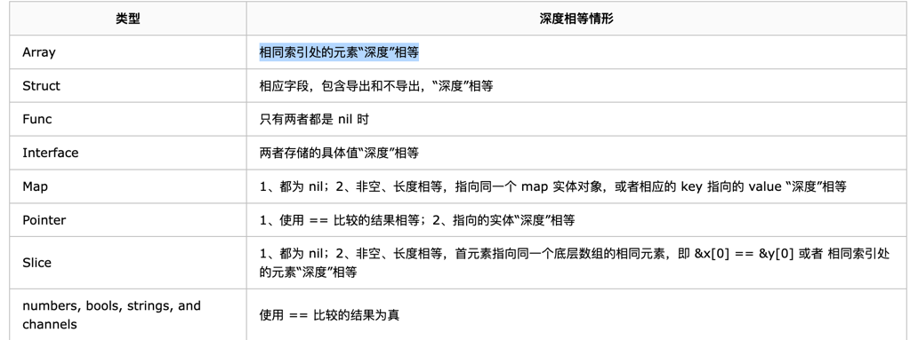

<!-- START doctoc generated TOC please keep comment here to allow auto update -->
<!-- DON'T EDIT THIS SECTION, INSTEAD RE-RUN doctoc TO UPDATE -->
**Table of Contents**  *generated with [DocToc](https://github.com/thlorenz/doctoc)*

- [reflect.DeepEqual函数：判断两个值是否一致](#reflectdeepequal%E5%87%BD%E6%95%B0%E5%88%A4%E6%96%AD%E4%B8%A4%E4%B8%AA%E5%80%BC%E6%98%AF%E5%90%A6%E4%B8%80%E8%87%B4)
  - [背景](#%E8%83%8C%E6%99%AF)
  - [使用](#%E4%BD%BF%E7%94%A8)
  - [源码](#%E6%BA%90%E7%A0%81)
  - [参考资料](#%E5%8F%82%E8%80%83%E8%B5%84%E6%96%99)

<!-- END doctoc generated TOC please keep comment here to allow auto update -->

# reflect.DeepEqual函数：判断两个值是否一致


## 背景

golang 中的数据类型可以分为以下 4 大类：

- 基本类型：整型（int/uint/int8/uint8/int16/uint16/int32/uint32/int64/uint64/byte/rune等）、浮点数（float32/float64）、复数类型（complex64/complex128）、字符串（string）。
- 复合类型（又叫聚合类型）：数组和结构体类型。
- 引用类型：切片（slice）、map、channel、指针。
  - 切片之间不允许比较。切片只能与nil值比较。 
  - map之间不允许比较。map只能与nil值比较。
- 接口类型：如error

== 操作最重要的一个前提是：两个操作数类型必须相同！类型必须相同！类型必须相同！

对于 array、slice、map、struct 等类型，想要比较两个值是否相等，不能使用==，处理起来十分麻烦，在对效率没有太大要求的情况下，reflect包中的DeepEqual函数完美的解决了比较问题


```go
// Array values are deeply equal when their corresponding elements are deeply equal.
//
// Struct values are deeply equal if their corresponding fields,
// both exported and unexported, are deeply equal.
//
// Func values are deeply equal if both are nil; otherwise they are not deeply equal.
//
// Interface values are deeply equal if they hold deeply equal concrete values.
//
// Map values are deeply equal when all of the following are true:
// they are both nil or both non-nil, they have the same length,
// and either they are the same map object or their corresponding keys
// (matched using Go equality) map to deeply equal values.
//
// Pointer values are deeply equal if they are equal using Go's == operator
// or if they point to deeply equal values.
//
// Slice values are deeply equal when all of the following are true:
// they are both nil or both non-nil, they have the same length,
// and either they point to the same initial entry of the same underlying array
// (that is, &x[0] == &y[0]) or their corresponding elements (up to length) are deeply equal.
// Note that a non-nil empty slice and a nil slice (for example, []byte{} and []byte(nil))
// are not deeply equal.
//
// Other values - numbers, bools, strings, and channels - are deeply equal
// if they are equal using Go's == operator.
//
```
一般情况下，DeepEqual 的实现只需要递归地调用 == 就可以比较两个变量是否是真的“深度”相等。

但是，有一些异常情况：
- 比如 func 类型是不可比较的类型，只有在两个 func 类型都是 nil 的情况下，才是“深度”相等；
- float 类型，由于精度的原因，也是不能使用 == 比较的；这个问题不是 golang 独有的，只要浮点数遵循 IEEE 754 标准的编程语言都有这个问题。
- 包含 func 类型或者 float 类型的 struct， interface， array 等。

对于指针而言，当两个值相等的指针就是“深度”相等，因为两者指向的内容是相等的，即使两者指向的是 func 类型或者 float 类型，这种情况下不关心指针所指向的内容。

同样，对于指向相同 slice， map 的两个变量也是“深度”相等的，不关心 slice， map 具体的内容。

对于“有环”的类型，比如循环链表，比较两者是否“深度”相等的过程中，需要对已比较的内容作一个标记，一旦发现两个指针之前比较过，立即停止比较，并判定二者是深度相等的。这样做的原因是，及时停止比较，避免陷入无限循环。

## 使用
```go
func DeepEqual(x, y interface{}) bool
```
DeepEqual 函数的参数是两个 interface，实际上也就是可以输入任意类型，输出 true 或者 false 表示输入的两个变量是否是“深度”相等。

先明白一点，如果是不同的类型，即使是底层类型相同，相应的值也相同，那么两者也不是“深度”相等。
```go
type MyInt int
type YourInt int

func main() {
	m := MyInt(1)
	y := YourInt(1)

	fmt.Println(reflect.DeepEqual(m, y)) // false
}
```
上面的代码中，m, y 底层都是 int，而且值都是 1，但是两者静态类型不同，前者是 MyInt，后者是 YourInt，因此两者不是“深度”相等。


## 源码
```go
func DeepEqual(x, y interface{}) bool {
	if x == nil || y == nil {
		return x == y
	}
	v1 := ValueOf(x)
	v2 := ValueOf(y)
	if v1.Type() != v2.Type() {
		return false
	}
	return deepValueEqual(v1, v2, make(map[visit]bool))
}
```
1. 首先查看两者是否有一个是 nil 的情况，这种情况下，只有两者都是 nil，函数才会返回 true。
2. 接着，使用反射，获取x，y 的反射对象，并且立即比较两者的类型，根据前面的内容，这里实际上是动态类型，如果类型不同，直接返回 false。

3. 最核心的内容在子函数 deepValueEqual 中
```go
func deepValueEqual(v1, v2 Value, visited map[visit]bool) bool {
	if !v1.IsValid() || !v2.IsValid() {
		return v1.IsValid() == v2.IsValid()
	}
	if v1.Type() != v2.Type() {
		return false
	}

	// We want to avoid putting more in the visited map than we need to.
	// For any possible reference cycle that might be encountered,
	// hard(v1, v2) needs to return true for at least one of the types in the cycle,
	// and it's safe and valid to get Value's internal pointer.
	hard := func(v1, v2 Value) bool {
		switch v1.Kind() {
		case Ptr:
			if v1.typ.ptrdata == 0 {
				// go:notinheap pointers can't be cyclic.
				// At least, all of our current uses of go:notinheap have
				// that property. The runtime ones aren't cyclic (and we don't use
				// DeepEqual on them anyway), and the cgo-generated ones are
				// all empty structs.
				return false
			}
			fallthrough
		case Map, Slice, Interface:
			// Nil pointers cannot be cyclic. Avoid putting them in the visited map.
			return !v1.IsNil() && !v2.IsNil()
		}
		return false
	}

	if hard(v1, v2) {
		// For a Ptr or Map value, we need to check flagIndir,
		// which we do by calling the pointer method.
		// For Slice or Interface, flagIndir is always set,
		// and using v.ptr suffices.
		ptrval := func(v Value) unsafe.Pointer {
			switch v.Kind() {
			case Ptr, Map:
				return v.pointer()
			default:
				return v.ptr
			}
		}
		addr1 := ptrval(v1)
		addr2 := ptrval(v2)
		if uintptr(addr1) > uintptr(addr2) {
			// Canonicalize order to reduce number of entries in visited.
			// Assumes non-moving garbage collector.
			addr1, addr2 = addr2, addr1
		}

		// Short circuit if references are already seen.
		typ := v1.Type()
		v := visit{addr1, addr2, typ}
		if visited[v] {
			return true
		}

		// Remember for later.
		visited[v] = true
	}

	switch v1.Kind() {
	case Array:
		for i := 0; i < v1.Len(); i++ {
			if !deepValueEqual(v1.Index(i), v2.Index(i), visited) {
				return false
			}
		}
		return true
	case Slice:
		if v1.IsNil() != v2.IsNil() {
			return false
		}
		if v1.Len() != v2.Len() {
			return false
		}
		if v1.Pointer() == v2.Pointer() {
			return true
		}
		for i := 0; i < v1.Len(); i++ {
			if !deepValueEqual(v1.Index(i), v2.Index(i), visited) {
				return false
			}
		}
		return true
	case Interface:
		if v1.IsNil() || v2.IsNil() {
			return v1.IsNil() == v2.IsNil()
		}
		return deepValueEqual(v1.Elem(), v2.Elem(), visited)
	case Ptr:
		if v1.Pointer() == v2.Pointer() {
			return true
		}
		return deepValueEqual(v1.Elem(), v2.Elem(), visited)
	case Struct:
		for i, n := 0, v1.NumField(); i < n; i++ {
			if !deepValueEqual(v1.Field(i), v2.Field(i), visited) {
				return false
			}
		}
		return true
	case Map:
		if v1.IsNil() != v2.IsNil() {
			return false
		}
		if v1.Len() != v2.Len() {
			return false
		}
		if v1.Pointer() == v2.Pointer() {
			return true
		}
		for _, k := range v1.MapKeys() {
			val1 := v1.MapIndex(k)
			val2 := v2.MapIndex(k)
			if !val1.IsValid() || !val2.IsValid() || !deepValueEqual(val1, val2, visited) {
				return false
			}
		}
		return true
	case Func:
		if v1.IsNil() && v2.IsNil() {
			return true
		}
		// Can't do better than this:
		return false
	default:
		// Normal equality suffices
		return valueInterface(v1, false) == valueInterface(v2, false)
	}
}
```

代码比较长，思路却比较简单清晰：核心是一个 switch 语句，识别输入参数的不同类型，分别递归调用 deepValueEqual 函数，
一直递归到最基本的数据类型，比较 int，string 等可以直接得出 true 或者 false，
再一层层地返回，最终得到“深度”相等的比较结果。


## 参考资料
1 [深入理解Go之==](https://darjun.github.io/2019/08/20/golang-equal/)
