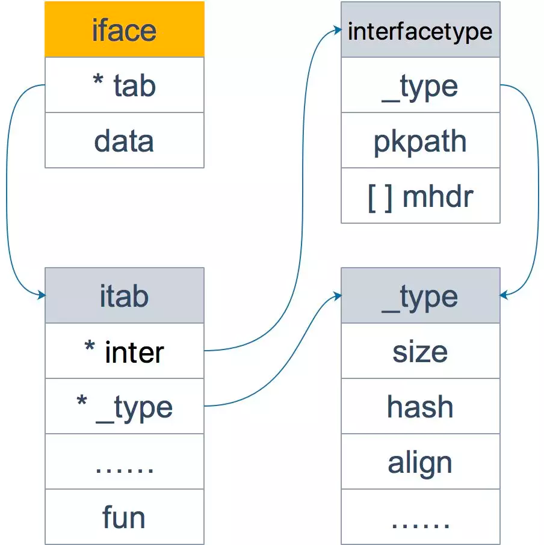
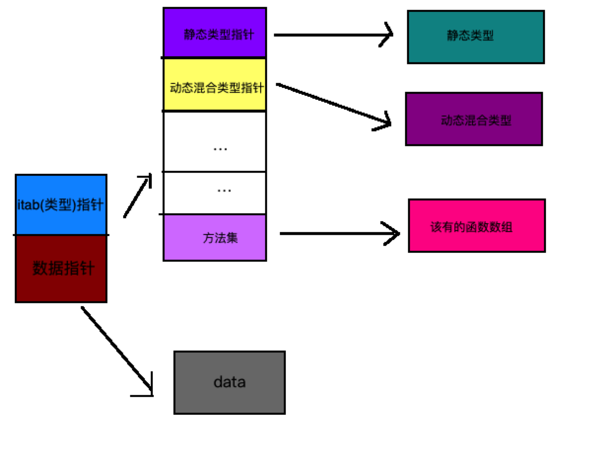
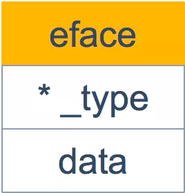
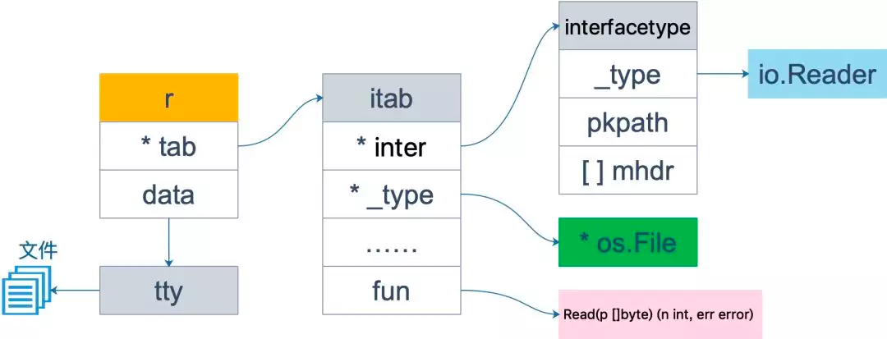
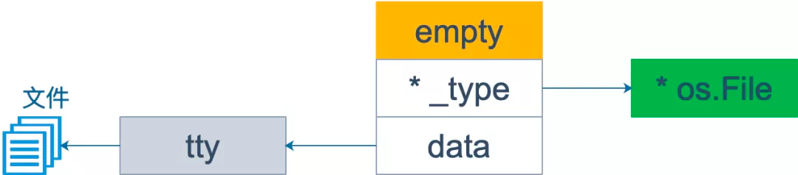

#反射
	在计算机科学中，反射是指计算机程序在运行时（Run time）可以访问、检测和修改它本身状态或行为的一种能力。用比喻来说，反射就是程序在运行的时候能够“观察”并且修改自己的行为。

##一.背景
###为什么要用反射?
1. 有时你需要编写一个函数，但是并不知道传给你的参数类型是什么，可能是没约定好；也可能是传入的类型很多，这些类型并不能统一表示。这时反射就会用的上了
2. 有时候需要根据某些条件决定调用哪个函数，比如根据用户的输入来决定。这时就需要对函数和函数的参数进行反射，在运行期间动态地执行函数。

###不建议使用反射的原因：
1。与反射相关的代码，经常是难以阅读的。在软件工程中，代码可读性也是一个非常重要的指标
2. Go 语言作为一门静态语言，编码过程中，编译器能提前发现一些类型错误，但是对于反射代码是无能为力的。
所以包含反射相关的代码，很可能会运行很久，才会出错，这时候经常是直接 panic，可能会造成严重的后果
3. 反射对性能影响还是比较大的，比正常代码运行速度慢一到两个数量级。所以，对于一个项目中处于运行效率关键位置的代码，尽量避免使用反射特性

```go
/*

反射实现原理：
	1.当向接口变量赋予一个实体类型的时候，接口会存储实体的类型信息，反射就是通过接口的类型信息实现的，反射建立在类型的基础上。
	2. Go 语言在 reflect 包里定义了各种类型，实现了反射的各种函数，通过它们可以在运行时检测类型的信息、改变类型的值

Go语言的类型:
	1.变量包括（type, value）两部分,这一点就知道为什么nil != nil了
	2. type 包括 static type和concrete type. 简单来说 static type是你在编码是看见的类型(如int、string_test)，
		concrete type是runtime系统看见的类型
	3. 类型断言能否成功，取决于变量的concrete type，而不是static type。
		因此，一个 reader变量如果它的concrete type也实现了write方法的话，它也可以被类型断言为writer

在反射的概念中， 编译时就知道变量类型的是静态类型；运行时才知道一个变量类型的叫做动态类型。
	静态类型
		//静态类型就是变量声明时的赋予的类型。比如：
		type MyInt int // int 就是静态类型

		type A struct{
			Name string_test  // string就是静态
		}
		var i *int  // *int就是静态类型
	动态类型
		//动态类型：运行时给这个变量赋值时，这个值的类型(如果值为nil的时候没有动态类型)。
		//一个变量的动态类型在运行时可能改变，这主要依赖于它的赋值（前提是这个变量是接口类型）
		var A interface{} // 静态类型interface{}
		A = 10            // 静态类型为interface{}  动态为int
		A = "String"      // 静态类型为interface{}  动态为string
		var M *int
		A = M             // A的值可以改变

		Noted:
		Go语言的反射就是建立在类型之上的，Golang的指定类型的变量的类型是静态的（也就是指定int、string这些的变量，它的type是static type），
		在创建变量的时候就已经确定，反射主要与Golang的interface类型相关（它的type是concrete type），只有interface类型才有反射一说
在Golang的实现中，每个interface变量都有一个对应pair，pair中记录了实际变量的值和类型:(value, type)
	value是实际变量值，type是实际变量的类型。一个interface{}类型的变量包含了2个指针，
	1.一个指针指向值的类型【对应concrete type】，2.另外一个指针指向实际的值【对应value】。
*/
```

##二.用到反射的包：
   官方包：sort swapper,sql convertValue ,Json反序列化
   第三方包： proto reflect,sqlx scanAll
##三.源码分析
iface 非空接口



```go
type iface struct {
	tab  *itab  // tab 是接口表指针，指向类型信息  --->动态类型
	data unsafe.Pointer // 数据指针，则指向具体的数据 --> 动态值
}

type itab struct {
    inter *interfacetype //具体类型实现的接口类型
    _type *_type  // 具体类型
    hash  uint32 // copy of _type.hash. Used for type switches.
    _     [4]byte
    fun   [1]uintptr // variable sized. fun[0]==0 means _type does not implement inter.
}

```
eface 空接口



```go
type eface struct
 {
    _type *_type

    data unsafe.Pointer
}
```

举例
```go
var r io.Reader
```
1.首先声明 r 的类型是 io.Reader，注意，这是 r 的静态类型，此时它的动态类型为 nil，并且它的动态值也是 nil。
```go
tty, err := os.OpenFile("chapter04_reflect/danny_reflect.txt", os.O_RDWR, 0)
if err != nil {
    fmt.Println("出现错误", err.Error())
}
fmt.Printf("tty是%+v\n", tty) // tty是&{file:0xc000058180}
r = tty
```

2.r=tty 这一语句，将 r 的动态类型变成 *os.File，动态值则变成非空，表示打开的文件对象。这时，r 可以用 <value,type>对来表示为： <tty, *os.File>。

此时虽然 fun 所指向的函数只有一个 Read 函数，其实 *os.File 还包含 Write 函数，也就是说 *os.File .

3.其实还实现了 io.Writer 接口。因此下面的断言语句可以执行：
```go
var w io.Writer
w = r.(io.Writer)
```
之所以用断言，而不能直接赋值，是因为 r 的静态类型是 io.Reader，并没有实现 io.Writer 接口。断言能否成功，看 r 的动态类型是否符合要求

w 也可以表示成 <tty, *os.File>，仅管它和 r 一样，但是 w 可调用的函数取决于它的静态类型 io.Writer，也就是说它只能有这样的调用形式： w.Write() 。

4.赋值
```go
 //不带函数的interface
 var empty interface{}
 empty = tty
 fmt.Printf("%T", empty) // *os.File
```

由于 empty 是一个空接口，因此所有的类型都实现了它，w 可以直接赋给它，不需要执行断言操作


###反射的基本函数
reflect 包里定义了一个接口和一个结构体，即 reflect.Type 和 reflect.Value，它们提供很多函数来获取存储在接口里的类型信息。

reflect.Type 主要提供关于类型相关的信息，所以它和 _type 关联比较紧密； 
reflect.Value 则结合 _type 和 data 两者，因此程序员可以获取甚至改变类型的值

	1. reflect.Type 是以一个接口的形式存在的
	2. reflect.Value 是以一个结构体的形式存在
	接口变量，实际上都是由一 pair 对（type 和 data）组合而成，pair 对中记录着实际变量的值和类型。也就是说在真实世界里，type 和 value 是合并在一起组成 接口变量的。
    而在反射的世界里，type 和 data 却是分开的，他们分别由 reflect.Type 和 reflect.Value 来表现

```go
//reflect/type.go
//type定义了接口，rtype实现了接口

func TypeOf(i interface{}) Type {
	eface := *(*emptyInterface)(unsafe.Pointer(&i))
	return toType(eface.typ)
}

// emptyInterface is the header for an interface{} value.
//跟eface一样，不过eface用于运行时,emptyInterface用于反射
type emptyInterface struct {
	typ  *rtype
	word unsafe.Pointer  //数据
}
```

```go
// reflect/value.go
type Value struct {
	typ *rtype
	ptr unsafe.Pointer
	flag  //元信息
}
```

