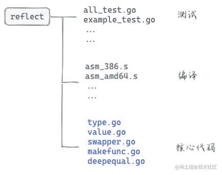

<!-- START doctoc generated TOC please keep comment here to allow auto update -->
<!-- DON'T EDIT THIS SECTION, INSTEAD RE-RUN doctoc TO UPDATE -->
**Table of Contents**  *generated with [DocToc](https://github.com/thlorenz/doctoc)*

- [反射](#%E5%8F%8D%E5%B0%84)
  - [一. 背景](#%E4%B8%80-%E8%83%8C%E6%99%AF)
    - [为什么要用反射?](#%E4%B8%BA%E4%BB%80%E4%B9%88%E8%A6%81%E7%94%A8%E5%8F%8D%E5%B0%84)
    - [不建议使用反射的原因](#%E4%B8%8D%E5%BB%BA%E8%AE%AE%E4%BD%BF%E7%94%A8%E5%8F%8D%E5%B0%84%E7%9A%84%E5%8E%9F%E5%9B%A0)
  - [二. 用到反射的包](#%E4%BA%8C-%E7%94%A8%E5%88%B0%E5%8F%8D%E5%B0%84%E7%9A%84%E5%8C%85)
  - [三. 源码分析](#%E4%B8%89-%E6%BA%90%E7%A0%81%E5%88%86%E6%9E%90)
    - [两种类型：Type 和 Value](#%E4%B8%A4%E7%A7%8D%E7%B1%BB%E5%9E%8Btype-%E5%92%8C-value)
      - [1. reflect.Type 是以一个接口的形式存在的](#1-reflecttype-%E6%98%AF%E4%BB%A5%E4%B8%80%E4%B8%AA%E6%8E%A5%E5%8F%A3%E7%9A%84%E5%BD%A2%E5%BC%8F%E5%AD%98%E5%9C%A8%E7%9A%84)
      - [2. reflect.Value 是以一个结构体的形式存在](#2-reflectvalue-%E6%98%AF%E4%BB%A5%E4%B8%80%E4%B8%AA%E7%BB%93%E6%9E%84%E4%BD%93%E7%9A%84%E5%BD%A2%E5%BC%8F%E5%AD%98%E5%9C%A8)
    - [反射的基本函数](#%E5%8F%8D%E5%B0%84%E7%9A%84%E5%9F%BA%E6%9C%AC%E5%87%BD%E6%95%B0)
      - [1. TypeOf 函数](#1-typeof-%E5%87%BD%E6%95%B0)
      - [2. ValueOf 函数](#2-valueof-%E5%87%BD%E6%95%B0)
  - [参考资料](#%E5%8F%82%E8%80%83%E8%B5%84%E6%96%99)

<!-- END doctoc generated TOC please keep comment here to allow auto update -->

# 反射

在计算机科学中，反射是指计算机程序在运行时（Run time）可以访问、检测和修改它本身状态或行为的一种能力。
用比喻来说，反射就是程序在运行的时候能够“观察”并且修改自己的行为。

## 一. 背景

### 为什么要用反射?
1. 有时你需要编写一个函数，但是并不知道传给你的参数类型是什么，可能是没约定好；也可能是传入的类型很多，这些类型并不能统一表示。这时反射就会用的上了
2. 有时候需要根据某些条件决定调用哪个函数，比如根据用户的输入来决定。这时就需要对函数和函数的参数进行反射，在运行期间动态地执行函数。

### 不建议使用反射的原因
1. 与反射相关的代码，经常是难以阅读的。在软件工程中，代码可读性也是一个非常重要的指标
2. Go 语言作为一门静态语言，编码过程中，编译器能提前发现一些类型错误，但是对于反射代码是无能为力的。
所以包含反射相关的代码，很可能会运行很久，才会出错，这时候经常是直接 panic，可能会造成严重的后果
3. 反射对性能影响还是比较大的，比正常代码运行速度慢一到两个数量级。所以，对于一个项目中处于运行效率关键位置的代码，尽量避免使用反射特性

反射实现原理：

1. 当向接口变量赋予一个实体类型的时候，接口会存储实体的类型信息，反射就是通过接口的类型信息实现的，反射建立在类型的基础上。
2. Go 语言在 reflect 包里定义了各种类型，实现了反射的各种函数，通过它们可以在运行时检测类型的信息、改变类型的值

Go语言的类型:

1. 变量包括（type, value）两部分,这一点就知道为什么nil != nil了
2. type 包括 static type和concrete type. 简单来说 static type是你在编码是看见的类型(如int、string_test)，
    concrete type是runtime系统看见的类型
3. 类型断言能否成功，取决于变量的concrete type，而不是static type。
    因此，一个 reader变量如果它的concrete type也实现了write方法的话，它也可以被类型断言为writer

在反射的概念中， 编译时就知道变量类型的是静态类型；运行时才知道一个变量类型的叫做动态类型。

1. 静态类型（即 static type），就是变量声明的时候的类型
```go
// 静态类型就是变量声明时的赋予的类型。比如：
type MyInt int // int 就是静态类型

type A struct{
   Name string  // string就是静态
}
var i *int  // *int就是静态类型
```

2. 动态类型（即 concrete type，也叫具体类型）是 程序运行时系统才能看见的类型
```go
//动态类型：运行时给这个变量赋值时，这个值的类型(如果值为nil的时候没有动态类型)。
//一个变量的动态类型在运行时可能改变，这主要依赖于它的赋值（前提是这个变量是接口类型）
var A interface{} // 静态类型interface{}
A = 10            // 静态类型为interface{}  动态为int
A = "String"      // 静态类型为interface{}  动态为string
var M *int
A = M             // A的值可以改变
```
Noted:   
Go语言的反射就是建立在类型之上的，Golang的指定类型的变量的类型是静态的（也就是指定int、string这些的变量，它的type是static type），
在创建变量的时候就已经确定，反射主要与Golang的interface类型相关（它的type是concrete type），只有interface类型才有反射一说

在Golang的实现中，每个interface变量都有一个对应pair，pair中记录了实际变量的值和类型:(value, type)，value是实际变量值，type是实际变量的类型。一个interface{}类型的变量包含了2个指针，
1. 一个指针指向值的类型【对应concrete type】，
2. 另外一个指针指向实际的值【对应value】。

## 二. 用到反射的包
- 官方包：sort swapper,sql convertValue,Json 反序列化
- 第三方包： proto reflect,sqlx scanAll


## 三. 源码分析


reflect包下内容可以大体分为三部分：测试文件、编译文件、反射核心代码.


go 中的 interface 分类两种，eface 和 iface。

简单介绍 
- eface: go 中所有的类型的数据都可以转成 eface ，对应 reflect 中的 emptyInterface
- iface: 主要用来表示实现了 interface 的数据，对应 reflect 中的 nonEmptyInterface


### 两种类型：Type 和 Value


- reflect.Type 主要提供关于类型相关的信息，所以它和 _type 关联比较紧密；
- reflect.Value 则结合 _type 和 data 两者，因此程序员可以获取甚至改变类型的值


#### 1. reflect.Type 是以一个接口的形式存在的

```go
type Type interface {
    // 所有的类型都可以调用下面这些函数
	
    // 此类型的变量对齐后所占用的字节数
	Align() int


    // 如果是 struct 的字段，对齐后占用的字节数
	FieldAlign() int

	// Method returns the i'th method in the type's method set.
	// It panics if i is not in the range [0, NumMethod()).
	//
	// For a non-interface type T or *T, the returned Method's Type and Func
	// fields describe a function whose first argument is the receiver.
	//
	// For an interface type, the returned Method's Type field gives the
	// method signature, without a receiver, and the Func field is nil.
	//
	// Only exported methods are accessible and they are sorted in
	// lexicographic order.
    // 返回类型方法集里的第 `i` (传入的参数)个方法
	Method(int) Method

	// MethodByName returns the method with that name in the type's
	// method set and a boolean indicating if the method was found.
	//
	// For a non-interface type T or *T, the returned Method's Type and Func
	// fields describe a function whose first argument is the receiver.
	//
	// For an interface type, the returned Method's Type field gives the
	// method signature, without a receiver, and the Func field is nil.
    // 通过名称获取方法
	MethodByName(string) (Method, bool)


    // 获取类型方法集里导出的方法个数
	NumMethod() int

	// Name returns the type's name within its package for a defined type.
	// For other (non-defined) types it returns the empty string.
    // 类型名称
	Name() string

	// PkgPath returns a defined type's package path, that is, the import path
	// that uniquely identifies the package, such as "encoding/base64".
	// If the type was predeclared (string, error) or not defined (*T, struct{},
	// []int, or A where A is an alias for a non-defined type), the package path
	// will be the empty string.
    // 返回类型所在的路径，如：encoding/base64
	PkgPath() string

	// 返回类型的大小，和 unsafe.Sizeof 功能类似
	Size() uintptr


    // 返回类型的字符串表示形式.
	String() string


    // 返回类型的类型值
	Kind() Kind

	
    // 类型是否实现了接口 u
	Implements(u Type) bool

	// 是否可以赋值给 u
	AssignableTo(u Type) bool

	// 是否可以类型转换成 u
	ConvertibleTo(u Type) bool

	// 类型是否可以比较
	Comparable() bool

    // 下面这些函数只有特定类型可以调用
    //如：Key, Elem 两个方法就只能是 Map 类型才能调用
	//
	//	Int*, Uint*, Float*, Complex*: Bits
	//	Array: Elem, Len
	//	Chan: ChanDir, Elem
	//	Func: In, NumIn, Out, NumOut, IsVariadic.
	//	Map: Key, Elem
	//	Ptr: Elem
	//	Slice: Elem
	//	Struct: Field, FieldByIndex, FieldByName, FieldByNameFunc, NumField

    // Bits返回类型的大小（以位为单位）
    // 如果类型的种类不是大小为或未大小为Int、Uint、Float或Complex的种类之一，则会导致panic。
	Bits() int

	
    // 返回通道的方向，只能是 chan 类型调用
	ChanDir() ChanDir

	// IsVariadic reports whether a function type's final input parameter
	// is a "..." parameter. If so, t.In(t.NumIn() - 1) returns the parameter's
	// implicit actual type []T.
	//
	// For concreteness, if t represents func(x int, y ... float64), then
	//
	//	t.NumIn() == 2
	//	t.In(0) is the reflect.Type for "int"
	//	t.In(1) is the reflect.Type for "[]float64"
	//	t.IsVariadic() == true
	//
    //  入参类型是否是可变参数，只能是 func 类型调用
    // 比如 t 是类型 func(x int, y ... float64)
    // 那么 t.IsVariadic() == true
	IsVariadic() bool


    // 返回内部子元素类型，只能由类型 Array, Chan, Map, Ptr, or Slice 调用
	Elem() Type


    // 返回结构体类型的第 i 个字段，只能是结构体类型调用
    // 如果 i 超过了总字段数，就会 panic
	Field(i int) StructField

	// FieldByIndex returns the nested field corresponding
	// to the index sequence. It is equivalent to calling Field
	// successively for each index i.
	 // 返回嵌套的结构体的字段
	FieldByIndex(index []int) StructField

	// FieldByName returns the struct field with the given name
	// and a boolean indicating if the field was found.

    // 通过字段名称获取字段
	FieldByName(name string) (StructField, bool)

	// FieldByNameFunc returns the struct field with a name
	// that satisfies the match function and a boolean indicating if
	// the field was found.
	//
	// FieldByNameFunc considers the fields in the struct itself
	// and then the fields in any embedded structs, in breadth first order,
	// stopping at the shallowest nesting depth containing one or more
	// fields satisfying the match function. If multiple fields at that depth
	// satisfy the match function, they cancel each other
	// and FieldByNameFunc returns no match.
	// This behavior mirrors Go's handling of name lookup in
	// structs containing embedded fields.
    // 返回名称符合 func 函数的字段
	FieldByNameFunc(match func(string) bool) (StructField, bool)

	// In returns the type of a function type's i'th input parameter.
    // 获取函数类型的第 i 个参数的类型
	In(i int) Type

	// 返回 map 的 key 类型，只能由类型 map 调用
	Key() Type

	// 返回 Array 的长度，只能由类型 Array 调用
	Len() int

    // 返回类型字段的数量，只能由类型 Struct 调用
	NumField() int

	// 返回函数类型的输入参数个数
	NumIn() int

	// 返回函数类型的返回值个数
	NumOut() int

	// 返回函数类型的第 i 个值的类型
	Out(i int) Type

    // 返回类型结构体的相同部分
	common() *rtype

    // 返回类型结构体的不同部分
	uncommon() *uncommonType
}
```

定义了两个数据结构uncommonType和rtype，用于存储和解析数据类型的方法信息。

1 uncommonType
```go
// /Users/python/go/go1.18/src/reflect/type.go

// reflect.uncommonType结构体用于描述一个数据类型的包名和方法信息。
type uncommonType struct {
    pkgPath nameOff  // 包路径名称偏移量 
    mcount  uint16   // 方法的数量 
    xcount  uint16   // 公共导出方法的数量 
    moff    uint32   // [mcount]method 相对本对象起始地址的偏移量 
    _       uint32   // unused 
}
```


```go
// 非接口类型的方法 
// reflect.method结构体用于描述一个方法，它是一个压缩格式的结构，每个字段的值都是一个相对偏移量。
type method struct { 
    name nameOff // 方法名称偏移量 
    mtyp typeOff // 方法类型偏移量 
    ifn  textOff // 通过接口调用时的地址偏移量
    tfn  textOff // 直接类型调用时的地址偏移量 
}

type nameOff int32 // offset to a name : 是相对程序 .rodata 节起始地址的偏移量
type typeOff int32 // offset to an *rtype : 相对程序 .rodata 节起始地址的偏移量
type textOff int32 // offset from top of text section : 是相对程序 .text 节起始地址的偏移量。

func (t *rtype) nameOff(off nameOff) name {
	return name{(*byte)(resolveNameOff(unsafe.Pointer(t), int32(off)))}
}

func (t *rtype) typeOff(off typeOff) *rtype {
	return (*rtype)(resolveTypeOff(unsafe.Pointer(t), int32(off)))
}

func (t *rtype) textOff(off textOff) unsafe.Pointer {
	return resolveTextOff(unsafe.Pointer(t), int32(off))
}
```
也就是说，假设 t 是 _type 的话，只要调用 resolveTypeOff(t, t.ptrToThis) 就可以返回 t 的一份拷贝了


2 rtype

Go是静态语言，每个变量都有自己的归属的类型，当变量被在堆上分配时，堆上的内存对象也就有了自己归属的类型。Go编译器在编译阶段就为Go应用中的每种类型建立了对应的类型信息，
这些信息体现在runtime._rtype结构体中，Go reflect包的rtype结构体等价于runtime._rtype：

```go
type rtype struct {
   size       uintptr
   ptrdata    uintptr // rtype可以包含指针的字节数
   hash       uint32  // rtype哈希值；避免哈希表中的计算
   tflag      tflag   // 额外的类型信息标识
   align      uint8   // 当前具体类型变量的内存对齐
   fieldAlign uint8   // 当前具体类型结构体字段的内存对齐
   kind       uint8   // 具体Kind的枚举值
   // 当前具体类型使用的对比方法
   // (ptr to object A, ptr to object B) -> ==?
   equal     func(unsafe.Pointer, unsafe.Pointer) bool
   gcdata    *byte   // 垃圾回收数据
   str       nameOff // 字符串格式
   ptrToThis typeOff // 指向此类型的指针的类型，可以为零
}
```

go 中的基本类型总共 26 种，在反射中也有枚举体现
```go
type Kind uint

const (
	Invalid Kind = iota  // 无效的值，通常表示空值或无效的 reflect.Value
	Bool
	Int
	Int8
	Int16
	Int32
	Int64
	Uint
	Uint8
	Uint16
	Uint32
	Uint64
	Uintptr
	Float32
	Float64
	Complex64
	Complex128
	Array
	Chan
	Func
	Interface
	Map
	Pointer
	Slice
	String
	Struct
	UnsafePointer
)
```
要注意的是，Kind 和 Type 是有区别的，Kind 表示更基础，范围更广的分类。 有一个例子来表示， iPhone （接口变量）的 Type 是手机，Kind 是电子产品。

```go
// 这两个数组类型的类型分别是[10]string和[8]int，但它们在反射世界的reflect.Type的Kind信息却都为Array。
var arr1 [10]string
var arr2 [8]int


// 两个指针类型的类型分别是*float64和*MyFoo，但它们在反射世界的reflect.Type的Kind信息却都为Pointer。
var p1 *float64
var p2 *MyFoo
```


下面是各种不同类型对应的不同结构体
```go
type arrayType struct {
    rtype
    elem  *rtype // array element type
    slice *rtype // slice type
    len   uintptr
}

type chanType struct {
    rtype
    elem *rtype  // channel element type
    dir  uintptr // channel direction (ChanDir) chan 的方向
}

type funcType struct {
    rtype
    inCount  uint16  // 输入参数
    outCount uint16 // top bit is set if last input parameter is ... 输出参数
}

type structType struct {
    rtype
    pkgPath name
    fields  []structField // sorted by offset
}

type ptrType struct {
    rtype // 指针的类型
    elem *rtype // pointer element (pointed at) type  指针指向的元素的类型（静态类型）
}

type sliceType struct {
    rtype
    elem *rtype // slice element type
}

type mapType struct {
    rtype
    key    *rtype // map key type
    elem   *rtype // map element (value) type
    bucket *rtype // internal bucket structure
    // function for hashing keys (ptr to key, seed) -> hash
    hasher     func(unsafe.Pointer, uintptr) uintptr
    keysize    uint8  // size of key slot
    valuesize  uint8  // size of value slot
    bucketsize uint16 // size of bucket
    flags      uint32
}

type interfaceType struct {
    rtype
    pkgPath name      // import path
    methods []imethod // sorted by hash
}
```


rtype实现了string()方法,满足 fmt.Stringer 接口
```go
func (t *rtype) String() string {
	s := t.nameOff(t.str).name()
	if t.tflag&tflagExtraStar != 0 {
		return s[1:]
	}
	return s
}
```

#### 2. reflect.Value 是以一个结构体的形式存在
接口变量，实际上都是由一 pair 对（type 和 data）组合而成，pair 对中记录着实际变量的值和类型。也就是说在真实世界里，type 和 value 是合并在一起组成 接口变量的。
而在反射的世界里，type 和 data 却是分开的，他们分别由 reflect.Type 和 reflect.Value 来表现

```go
// Value是Go值的反射.

// 并非所有方法都适用于所有类型的值。每种方法的文档中都注明了限制条件（如有）。
// 在调用特定于种类的方法之前，请使用种类方法找出值的种类。调用不适合该类型的方法会导致运行时panic

// 零值代表未赋值、空值
// 零值的IsValid方法返回false，其Kind方法返回Invalid，其String方法返回“<Invalid Value>”，所有其他方法都无法使用
// 大多数函数和方法从不返回无效值
// 如果有，其文档将明确说明这些条件

// 一个值可以由多个goroutine同时使用，前提是基础Go值可以同时用于等效的直接操作

// 要比较两个值，请比较接口方法的结果。在两个值上使用==不会比较它们表示的基础值
type Value struct {
   // typ保存由值表示的值的类型。
   typ *rtype

   // 指针值数据，或者，如果设置了flagIndir，则为指向数据的指针
   // 设置flagIndir或typ.pointers()为true
   // 这是非常核心的数据，可以把它理解为具体数据的内存位置所在，数据的类型表达依赖它来转换
   ptr unsafe.Pointer

   // flag是一个标志位，通过二进制的方式保存了关于值的元数据
   // 最低位是标志位！最低的五位给出了值的类型，代表Kind的枚举的二进制，一共是27个，用5位表示，其余依次如下：
   // - flagStickyRO: 代表不能导出的非嵌入字段获取，因此为只读
   // - flagEmbedRO: 代表不能导出的嵌入字段获取，因此为只读
   // - flagIndir: 代表持有指向数据的指针
   // - flagAddr: 代表CanAddr方法的返回值标记
   // - flagMethod: 代表是否为一个方法的标记
   // 剩余的高23位给出了方法值的方法编号。
   // 如果flag.Kind（）！=Func，代码可以假设flagMethod未设置。
   // 如果ifaceIndir（typ）为真，则代码可以假设设置了flagIndir。
   flag

   // 方法值表示当前的方法调用，就像接收者r调用r.Read方法。typ+val+flag的标志位描述r的话，但flag的Kind标志位表示Func（方法是函数），flag的高位表示r类型的方法列表中的方法编号
}
```
flag的枚举定义以及标志位的二进制占位分布情况

```go
type flag uintptr

const (
	flagKindWidth        = 5 //  有27个Kind类型，5位可以容纳2^5可以表示32个类型
	flagKindMask    flag = 1<<flagKindWidth - 1
	flagStickyRO    flag = 1 << 5
	flagEmbedRO     flag = 1 << 6
	flagIndir       flag = 1 << 7
	flagAddr        flag = 1 << 8
	flagMethod      flag = 1 << 9
	flagMethodShift      = 10
	flagRO          flag = flagStickyRO | flagEmbedRO
)
```


### 反射的基本函数

reflect 包里定义了一个接口和一个结构体，即 reflect.Type 和 reflect.Value，它们提供很多函数来获取存储在接口里的类型信息。


#### 1. TypeOf 函数
```go
///Users/python/go/go1.18/src/reflect/type.go
//type定义了接口，rtype实现了接口

func TypeOf(i interface{}) Type {
	eface := *(*emptyInterface)(unsafe.Pointer(&i))  // emptyInterface其实对应eface
	return toType(eface.typ)
}
func toType(t *rtype) Type {
    if t == nil {
        return nil
    }
    return t
}

// emptyInterface is the header for an interface{} value.
// 跟eface一样，不过eface用于运行时,emptyInterface用于反射
// emptyInterface 和上面提到的 eface 是一回事（字段名略有差异，字段是相同的），且在不同的源码包：前者在 reflect 包，后者在 runtime 包
type emptyInterface struct {
	typ  *rtype
	word unsafe.Pointer  //数据
}
```

runtime.eface 和 reflect.emptyInterface 是一样的，所以这里直接通过 unsafe.Pointer 转换成 emptyInterface ，然后取其中的 typ 属性。 reflect.Type 相关的操作都是基于 *rtype

举例 rtype 对接口的实现 ：Method(i int) (m Method)

```go
func (t *rtype) Method(i int) (m Method) {
	// 1.是 Interface 类型
	if t.Kind() == Interface {
		// 把 *rtype 转成 *interfaceType
		tt := (*interfaceType)(unsafe.Pointer(t))
		return tt.Method(i)
	}
	// 2. 其他类型
	
	// 获取导出的函数列表
	methods := t.exportedMethods()
	if i < 0 || i >= len(methods) {
		panic("reflect: Method index out of range")
	}
	p := methods[i]
	pname := t.nameOff(p.name)
    // 取函数的名字
	m.Name = pname.name()
	fl := flag(Func)
	mtyp := t.typeOff(p.mtyp)
	ft := (*funcType)(unsafe.Pointer(mtyp))
	// 进出参数处理
	in := make([]Type, 0, 1+len(ft.in()))
	in = append(in, t)
	for _, arg := range ft.in() {
		in = append(in, arg)
	}
	out := make([]Type, 0, len(ft.out()))
	for _, ret := range ft.out() {
		out = append(out, ret)
	}
	// 构建函数，variadic可变参数
	mt := FuncOf(in, out, ft.IsVariadic())
	m.Type = mt
	tfn := t.textOff(p.tfn)
	fn := unsafe.Pointer(&tfn)
	// 假如想使用 Method.Func 调用 Call 方法时，需要把接收者当做第一个参数传入
	m.Func = Value{mt.(*rtype), fn, fl}

	m.Index = i
	return m
}
```

#### 2. ValueOf 函数
reflect.Value 表示 interface{} 里存储的实际变量，它能提供实际变量的各种信息。相关的方法常常是需要结合类型信息和值信息。
例如，如果要提取一个结构体的字段信息，那就需要用到 _type (具体到这里是指 structType) 类型持有的关于结构体的字段信息、偏移信息，以及 *data 所指向的内容 —— 结构体的实际值。


Valueof函数
```go
func ValueOf(i interface{}) Value {
	if i == nil {
		return Value{}
	}

	// TODO: Maybe allow contents of a Value to live on the stack.
	// reflect.escapes 保证当前值逃逸到堆上
	escapes(i)

	return unpackEface(i)
}
// unpackEface converts the empty interface i to a Value.
func unpackEface(i interface{}) Value {
    //先将 i 转换成 *emptyInterface 类型
    e := (*emptyInterface)(unsafe.Pointer(&i))
    
    // 再将它的 typ 字段和 word 字段以及一个标志位字段组装成一个 Value 结构体，
    t := e.typ
    if t == nil {
        return Value{}
    }
    
    f := flag(t.Kind())
    if ifaceIndir(t) {
        f |= flagIndir
    }
    return Value{t, e.word, f}
}
```

Value 结构体定义了很多方法，通过这些方法可以直接操作 Value 字段 ptr 所指向的实际数据：
```go
// 设置切片的 len 字段，如果类型不是切片，就会panic
func (v Value) SetLen(n int)


// 设置切片的 cap 字段
func (v Value) SetCap(n int)


// 设置字典的 kv
func (v Value) SetMapIndex(key, elem Value)


// 返回切片、字符串、数组的索引 i 处的值
func (v Value) Index(i int) Value


// 根据名称获取结构体的内部字段值
func (v Value) FieldByName(name string) Value

```


举例 Value :获取 method 的 Value

```go
func (v Value) Method(i int) Value {
    if v.typ == nil {
        panic(&ValueError{"reflect.Value.Method", Invalid})
    }
    // 本身就是个 method
    if v.flag&flagMethod != 0 || uint(i) >= uint(v.typ.NumMethod()) {
        panic("reflect: Method index out of range")
    }
    if v.typ.Kind() == Interface && v.IsNil() {
        panic("reflect: Method on nil interface value")
    }
    // 加上函数相关的 flag 补码
    fl := v.flag & (flagStickyRO | flagIndir) // Clear flagEmbedRO
    fl |= flag(Func)
    fl |= flag(i)<<flagMethodShift | flagMethod
    // 这里的 type 并不是 Method 的 type, 而是方法接收者的 type
    return Value{v.typ, v.ptr, fl}
}
```

Call 方法
```go
func (v Value) Call(in []Value) []Value {
	v.mustBe(Func)
	v.mustBeExported()
	return v.call("Call", in)
}
```
call 方法接着会做一些可变参数的判断以及组合传入的参数值，然后调用 runtime.call （实际是 runtime.reflectcall


## 参考资料
- [Go 反射源码解读](https://zhuanlan.zhihu.com/p/408731140)

