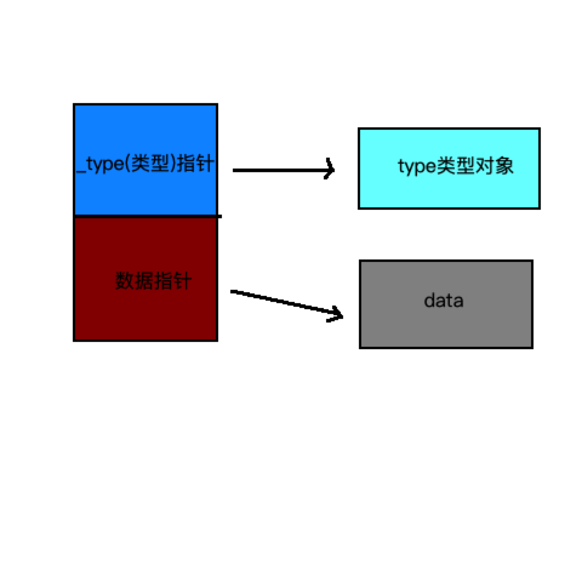
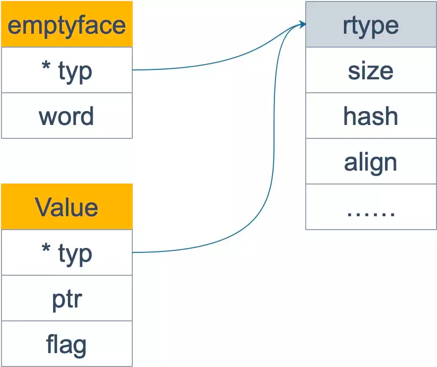

#反射
	在计算机科学中，反射是指计算机程序在运行时（Run time）可以访问、检测和修改它本身状态或行为的一种能力。用比喻来说，反射就是程序在运行的时候能够“观察”并且修改自己的行为。

##一.背景
###为什么要用反射?
1. 有时你需要编写一个函数，但是并不知道传给你的参数类型是什么，可能是没约定好；也可能是传入的类型很多，这些类型并不能统一表示。这时反射就会用的上了
2. 有时候需要根据某些条件决定调用哪个函数，比如根据用户的输入来决定。这时就需要对函数和函数的参数进行反射，在运行期间动态地执行函数。

###不建议使用反射的原因：
1。与反射相关的代码，经常是难以阅读的。在软件工程中，代码可读性也是一个非常重要的指标
2. Go 语言作为一门静态语言，编码过程中，编译器能提前发现一些类型错误，但是对于反射代码是无能为力的。
所以包含反射相关的代码，很可能会运行很久，才会出错，这时候经常是直接 panic，可能会造成严重的后果
3. 反射对性能影响还是比较大的，比正常代码运行速度慢一到两个数量级。所以，对于一个项目中处于运行效率关键位置的代码，尽量避免使用反射特性

```go
/*

反射实现原理：
	1.当向接口变量赋予一个实体类型的时候，接口会存储实体的类型信息，反射就是通过接口的类型信息实现的，反射建立在类型的基础上。
	2. Go 语言在 reflect 包里定义了各种类型，实现了反射的各种函数，通过它们可以在运行时检测类型的信息、改变类型的值

Go语言的类型:
	1.变量包括（type, value）两部分,这一点就知道为什么nil != nil了
	2. type 包括 static type和concrete type. 简单来说 static type是你在编码是看见的类型(如int、string_test)，
		concrete type是runtime系统看见的类型
	3. 类型断言能否成功，取决于变量的concrete type，而不是static type。
		因此，一个 reader变量如果它的concrete type也实现了write方法的话，它也可以被类型断言为writer

在反射的概念中， 编译时就知道变量类型的是静态类型；运行时才知道一个变量类型的叫做动态类型。
	静态类型
		//静态类型就是变量声明时的赋予的类型。比如：
		type MyInt int // int 就是静态类型

		type A struct{
			Name string_test  // string就是静态
		}
		var i *int  // *int就是静态类型
	动态类型
		//动态类型：运行时给这个变量赋值时，这个值的类型(如果值为nil的时候没有动态类型)。
		//一个变量的动态类型在运行时可能改变，这主要依赖于它的赋值（前提是这个变量是接口类型）
		var A interface{} // 静态类型interface{}
		A = 10            // 静态类型为interface{}  动态为int
		A = "String"      // 静态类型为interface{}  动态为string
		var M *int
		A = M             // A的值可以改变

		Noted:
		Go语言的反射就是建立在类型之上的，Golang的指定类型的变量的类型是静态的（也就是指定int、string这些的变量，它的type是static type），
		在创建变量的时候就已经确定，反射主要与Golang的interface类型相关（它的type是concrete type），只有interface类型才有反射一说
在Golang的实现中，每个interface变量都有一个对应pair，pair中记录了实际变量的值和类型:(value, type)
	value是实际变量值，type是实际变量的类型。一个interface{}类型的变量包含了2个指针，
	1.一个指针指向值的类型【对应concrete type】，2.另外一个指针指向实际的值【对应value】。
*/
```

##二.用到反射的包：
   官方包：sort swapper,sql convertValue ,Json反序列化
   第三方包： proto reflect,sqlx scanAll
##三.源码分析
iface 非空接口


```go
type iface struct {
	tab  *itab  // tab 是接口表指针，指向类型信息  --->动态类型
	data unsafe.Pointer // 数据指针，则指向具体的数据 --> 动态值
}

type itab struct {
    inter *interfacetype //具体类型实现的接口类型
    _type *_type  // 具体类型
    hash  uint32 // copy of _type.hash. Used for type switches.
    _     [4]byte
    fun   [1]uintptr // variable sized. fun[0]==0 means _type does not implement inter.
}

```
eface 空接口



```go
type eface struct
 {
    _type *_type

    data unsafe.Pointer
}
```

举例
```go
var r io.Reader
```
1.首先声明 r 的类型是 io.Reader，注意，这是 r 的静态类型，此时它的动态类型为 nil，并且它的动态值也是 nil。
```go
tty, err := os.OpenFile("chapter04_reflect/danny_reflect.txt", os.O_RDWR, 0)
if err != nil {
    fmt.Println("出现错误", err.Error())
}
fmt.Printf("tty是%+v\n", tty) // tty是&{file:0xc000058180}
r = tty
```

2.r=tty 这一语句，将 r 的动态类型变成 *os.File，动态值则变成非空，表示打开的文件对象。这时，r 可以用 <value,type>对来表示为： <tty, *os.File>。

此时虽然 fun 所指向的函数只有一个 Read 函数，其实 *os.File 还包含 Write 函数，也就是说 *os.File .

3.其实还实现了 io.Writer 接口。因此下面的断言语句可以执行：
```go
var w io.Writer
w = r.(io.Writer)
```
之所以用断言，而不能直接赋值，是因为 r 的静态类型是 io.Reader，并没有实现 io.Writer 接口。断言能否成功，看 r 的动态类型是否符合要求

w 也可以表示成 <tty, *os.File>，仅管它和 r 一样，但是 w 可调用的函数取决于它的静态类型 io.Writer，也就是说它只能有这样的调用形式： w.Write() 。

4.赋值
```go
 //不带函数的interface
 var empty interface{}
 empty = tty
 fmt.Printf("%T", empty) // *os.File
```

由于 empty 是一个空接口，因此所有的类型都实现了它，w 可以直接赋给它，不需要执行断言操作


###反射的基本函数
reflect 包里定义了一个接口和一个结构体，即 reflect.Type 和 reflect.Value，它们提供很多函数来获取存储在接口里的类型信息。

reflect.Type 主要提供关于类型相关的信息，所以它和 _type 关联比较紧密； 
reflect.Value 则结合 _type 和 data 两者，因此程序员可以获取甚至改变类型的值

	1. reflect.Type 是以一个接口的形式存在的
	2. reflect.Value 是以一个结构体的形式存在
	接口变量，实际上都是由一 pair 对（type 和 data）组合而成，pair 对中记录着实际变量的值和类型。也就是说在真实世界里，type 和 value 是合并在一起组成 接口变量的。
    而在反射的世界里，type 和 data 却是分开的，他们分别由 reflect.Type 和 reflect.Value 来表现

####1.type
```go
//reflect/type.go
//type定义了接口，rtype实现了接口

func TypeOf(i interface{}) Type {
	eface := *(*emptyInterface)(unsafe.Pointer(&i))
	return toType(eface.typ)
}

// emptyInterface is the header for an interface{} value.
//跟eface一样，不过eface用于运行时,emptyInterface用于反射
type emptyInterface struct {
	typ  *rtype
	word unsafe.Pointer  //数据
}
```

type接口
```go
type Type interface {
    // 所有的类型都可以调用下面这些函数


    // 此类型的变量对齐后所占用的字节数
	Align() int


    // 如果是 struct 的字段，对齐后占用的字节数
	FieldAlign() int

	// Method returns the i'th method in the type's method set.
	// It panics if i is not in the range [0, NumMethod()).
	//
	// For a non-interface type T or *T, the returned Method's Type and Func
	// fields describe a function whose first argument is the receiver.
	//
	// For an interface type, the returned Method's Type field gives the
	// method signature, without a receiver, and the Func field is nil.
	//
	// Only exported methods are accessible and they are sorted in
	// lexicographic order.
    // 返回类型方法集里的第 `i` (传入的参数)个方法
	Method(int) Method

	// MethodByName returns the method with that name in the type's
	// method set and a boolean indicating if the method was found.
	//
	// For a non-interface type T or *T, the returned Method's Type and Func
	// fields describe a function whose first argument is the receiver.
	//
	// For an interface type, the returned Method's Type field gives the
	// method signature, without a receiver, and the Func field is nil.
    // 通过名称获取方法
	MethodByName(string) (Method, bool)


    // 获取类型方法集里导出的方法个数
	NumMethod() int

	// Name returns the type's name within its package for a defined type.
	// For other (non-defined) types it returns the empty string.
    // 类型名称
	Name() string

	// PkgPath returns a defined type's package path, that is, the import path
	// that uniquely identifies the package, such as "encoding/base64".
	// If the type was predeclared (string, error) or not defined (*T, struct{},
	// []int, or A where A is an alias for a non-defined type), the package path
	// will be the empty string.
    // 返回类型所在的路径，如：encoding/base64
	PkgPath() string

	// 返回类型的大小，和 unsafe.Sizeof 功能类似
	Size() uintptr


    // 返回类型的字符串表示形式.
	String() string


    // 返回类型的类型值
	Kind() Kind

	
    // 类型是否实现了接口 u
	Implements(u Type) bool

	// 是否可以赋值给 u
	AssignableTo(u Type) bool

	// 是否可以类型转换成 u
	ConvertibleTo(u Type) bool

	// 类型是否可以比较
	Comparable() bool

    // 下面这些函数只有特定类型可以调用
    //如：Key, Elem 两个方法就只能是 Map 类型才能调用
	//
	//	Int*, Uint*, Float*, Complex*: Bits
	//	Array: Elem, Len
	//	Chan: ChanDir, Elem
	//	Func: In, NumIn, Out, NumOut, IsVariadic.
	//	Map: Key, Elem
	//	Ptr: Elem
	//	Slice: Elem
	//	Struct: Field, FieldByIndex, FieldByName, FieldByNameFunc, NumField

	// 类型所占据的位数
	Bits() int

	
    // 返回通道的方向，只能是 chan 类型调用
	ChanDir() ChanDir

	// IsVariadic reports whether a function type's final input parameter
	// is a "..." parameter. If so, t.In(t.NumIn() - 1) returns the parameter's
	// implicit actual type []T.
	//
	// For concreteness, if t represents func(x int, y ... float64), then
	//
	//	t.NumIn() == 2
	//	t.In(0) is the reflect.Type for "int"
	//	t.In(1) is the reflect.Type for "[]float64"
	//	t.IsVariadic() == true
	//
    //  入参类型是否是可变参数，只能是 func 类型调用
    // 比如 t 是类型 func(x int, y ... float64)
    // 那么 t.IsVariadic() == true
	IsVariadic() bool


    // 返回内部子元素类型，只能由类型 Array, Chan, Map, Ptr, or Slice 调用
	Elem() Type


    // 返回结构体类型的第 i 个字段，只能是结构体类型调用
    // 如果 i 超过了总字段数，就会 panic
	Field(i int) StructField

	// FieldByIndex returns the nested field corresponding
	// to the index sequence. It is equivalent to calling Field
	// successively for each index i.
	 // 返回嵌套的结构体的字段
	FieldByIndex(index []int) StructField

	// FieldByName returns the struct field with the given name
	// and a boolean indicating if the field was found.

    // 通过字段名称获取字段
	FieldByName(name string) (StructField, bool)

	// FieldByNameFunc returns the struct field with a name
	// that satisfies the match function and a boolean indicating if
	// the field was found.
	//
	// FieldByNameFunc considers the fields in the struct itself
	// and then the fields in any embedded structs, in breadth first order,
	// stopping at the shallowest nesting depth containing one or more
	// fields satisfying the match function. If multiple fields at that depth
	// satisfy the match function, they cancel each other
	// and FieldByNameFunc returns no match.
	// This behavior mirrors Go's handling of name lookup in
	// structs containing embedded fields.
    // 返回名称符合 func 函数的字段
	FieldByNameFunc(match func(string) bool) (StructField, bool)

	// In returns the type of a function type's i'th input parameter.
    // 获取函数类型的第 i 个参数的类型
	In(i int) Type

	// 返回 map 的 key 类型，只能由类型 map 调用
	Key() Type

	// 返回 Array 的长度，只能由类型 Array 调用
	Len() int

    // 返回类型字段的数量，只能由类型 Struct 调用
	NumField() int

	// 返回函数类型的输入参数个数
	NumIn() int

	// 返回函数类型的返回值个数
	NumOut() int

	// 返回函数类型的第 i 个值的类型
	Out(i int) Type

    // 返回类型结构体的相同部分
	common() *rtype

    // 返回类型结构体的不同部分
	uncommon() *uncommonType
}
```
具体实现rtype:所有的类型都会包含 rtype 这个字段,表示各种类型的公共信息；另外，不同类型包含自己的一些独特的部分。
```go
// rtype is the common implementation of most values.
// It is embedded in other struct types.
//
// rtype must be kept in sync with ../runtime/type.go:/^type._type.
type rtype struct {
	size       uintptr
	ptrdata    uintptr // number of bytes in the type that can contain pointers
	hash       uint32  // hash of type; avoids computation in hash tables
	tflag      tflag   // extra type information flags
	align      uint8   // alignment of variable with this type
	fieldAlign uint8   // alignment of struct field with this type
	kind       uint8   // enumeration for C
	// function for comparing objects of this type
	// (ptr to object A, ptr to object B) -> ==?
	equal     func(unsafe.Pointer, unsafe.Pointer) bool
	gcdata    *byte   // garbage collection data
	str       nameOff // string form
	ptrToThis typeOff // type for pointer to this type, may be zero
}
```
举例
比如下面的 arrayType 和 chanType 都包含 rytpe，而前者还包含 slice，len 等和数组相关的信息；后者则包含 dir 表示通道方向的信息。
```go
// arrayType represents a fixed array type.
type arrayType struct {
	rtype
	elem  *rtype // array element type
	slice *rtype // slice type
	len   uintptr
}

// chanType represents a channel type.
type chanType struct {
	rtype
	elem *rtype  // channel element type
	dir  uintptr // channel direction (ChanDir)
}
```
rtype实现了string()方法,满足 fmt.Stringer 接口
```go
func (t *rtype) String() string {
	s := t.nameOff(t.str).name()
	if t.tflag&tflagExtraStar != 0 {
		return s[1:]
	}
	return s
}
```

####2. value
reflect.Value 表示 interface{} 里存储的实际变量，它能提供实际变量的各种信息。相关的方法常常是需要结合类型信息和值信息。
例如，如果要提取一个结构体的字段信息，那就需要用到 _type (具体到这里是指 structType) 类型持有的关于结构体的字段信息、偏移信息，以及 *data 所指向的内容 —— 结构体的实际值。

Value结构体
```go
// reflect/value.go
type Value struct {
	typ *rtype
	ptr unsafe.Pointer
	flag  //元信息
}
```
Valueof函数
```go
func ValueOf(i interface{}) Value {
	if i == nil {
		return Value{}
	}

	// TODO: Maybe allow contents of a Value to live on the stack.
	// For now we make the contents always escape to the heap. It
	// makes life easier in a few places (see chanrecv/mapassign
	// comment below).
	escapes(i)

	return unpackEface(i)
}
// unpackEface converts the empty interface i to a Value.
func unpackEface(i interface{}) Value {
    //先将 i 转换成 *emptyInterface 类型
    e := (*emptyInterface)(unsafe.Pointer(&i))
    
    // NOTE: don't read e.word until we know whether it is really a pointer or not.
    // 再将它的 typ 字段和 word 字段以及一个标志位字段组装成一个 Value 结构体，
    t := e.typ
    if t == nil {
        return Value{}
    }
    f := flag(t.Kind())
    if ifaceIndir(t) {
        f |= flagIndir
    }
    return Value{t, e.word, f}
}
```

Value 结构体定义了很多方法，通过这些方法可以直接操作 Value 字段 ptr 所指向的实际数据：
```go
// 设置切片的 len 字段，如果类型不是切片，就会panic
func (v Value) SetLen(n int)


// 设置切片的 cap 字段
func (v Value) SetCap(n int)


// 设置字典的 kv
func (v Value) SetMapIndex(key, elem Value)


// 返回切片、字符串、数组的索引 i 处的值
func (v Value) Index(i int) Value


// 根据名称获取结构体的内部字段值
func (v Value) FieldByName(name string) Value

```

总结:


    rtye 实现了 Type 接口，是所有类型的公共部分。emptyface 结构体和 eface 其实是一个东西，
    而 rtype 其实和 _type 是一个东西，只是一些字段稍微有点差别，
    比如 emptyface 的 word 字段和 eface 的 data 字段名称不同，但是数据型是一样的。

