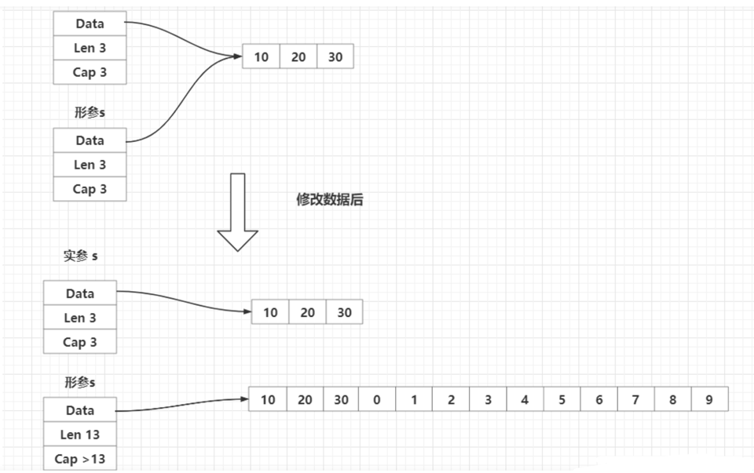
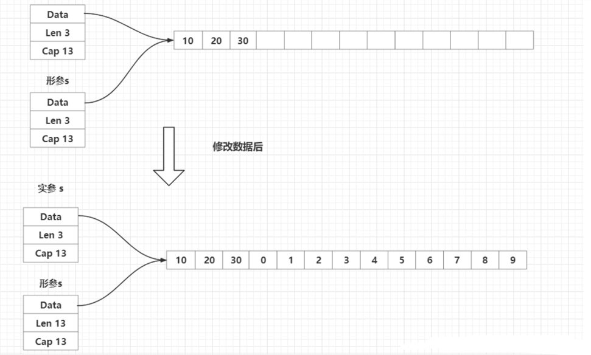

## 切片传递

切片的传递也是值传递，传递的是结构体的三个字段。
将一个切片传递给一个函数的形参后，实参和形参中的array指向的数组空间是一样的。
但是如果在函数中修改了切片，如果底层数组空间足够，就不会分配新的内存，因此就算在函数中添加了元素，形参和实参指向的数组是一样的。
但是形参的len被修改了，而实参的len还是原来的数据。
如果底层空间不足，那么就会分配新的空间，此时，形参和实参指向的底层数组也不一样了，len和cap也会不同。
在一个函数中传递切片时，如果在函数中只是修改了切片的元素，没有添加或删除元素，可以直接传入切片；
如添加或删除了元素，就要传入切片的指针或者将修改后的切片返回（就像append一样）来解决。

参考代码

1. 没有足够容量

[没有足够容量时函数中切片传递的疑惑1](chapter05_slice_n_array/02_slice_pass/01_slice_pass_confusition_without_enough_cap/main.go)

[揭秘代码](chapter05_slice_n_array/02_slice_pass/02_slice_pass_reality_without_enough_cap/main.go)

2. 有足够容量

[有足够容量时函数中切片传递的疑惑2](chapter05_slice_n_array/02_slice_pass/03_slice_pass_confusition_fix_with_enough_cap)

[揭秘代码2](chapter05_slice_n_array/02_slice_pass/04_slice_pass_confusition_with_enough_cap)
