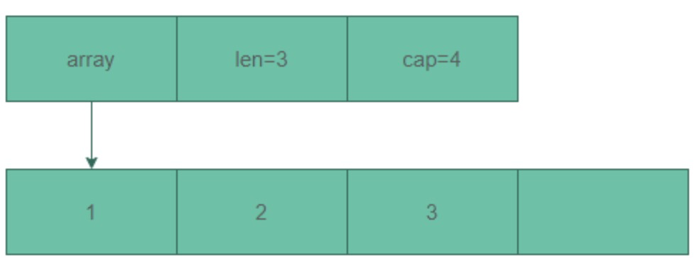

# 切片介绍

切片本身并不是动态数组或者数组指针。
它内部实现的数据结构通过指针引用底层数组，设定相关属性将数据读写操作限定在指定的区域内。切片本身是一个只读对象，其工作机制类似数组指针的一种封装。
切片（slice）是对数组一个连续片段的引用，所以切片是一个引用类型（因此更类似于 C++ 中的 Vector 类型，或者 Python 中的 list 类型）

## 源码结构


```go
// /Users/python/go/go1.18/src/runtime/slice.go
type slice struct {
    array unsafe.Pointer        // 指向数据缓冲区的指针
    len   int                   // 当前数据缓冲区使用的size
    cap   int                   // 当前缓冲区的容量
}
```

切片的结构体由3部分构成，Pointer 是指向一个数组的指针，len 代表当前切片的长度，cap 是当前切片的容量。cap 总是大于等于 len 的

看图，切片是在数组的基础上抽象了一层，底层是对数组的引用,当切片发生扩容时,底层数组发生改变，而对于上层切片来说是没有变化的

## 初始化
slice的make初始化主要通过runtime.makeslice来完成,先计算出需要的内存空间大小，然后再分配内存。
```go
func makeslice(et *_type, len, cap int) unsafe.Pointer {
	//计算需要分配的内存空间和内存是否有溢出
	mem, overflow := math.MulUintptr(et.size, uintptr(cap))
	if overflow || mem > maxAlloc || len < 0 || len > cap {
		// NOTE: Produce a 'len out of range' error instead of a
		// 'cap out of range' error when someone does make([]T, bignumber).
		// 'cap out of range' is true too, but since the cap is only being
		// supplied implicitly, saying len is clearer.
		// See golang.org/issue/4085.
		mem, overflow := math.MulUintptr(et.size, uintptr(len))
		if overflow || mem > maxAlloc || len < 0 {
			panicmakeslicelen()
		}
		panicmakeslicecap()
	}
	//分配内存
	// 小对象从当前P 的cache中空闲数据中分配
	// 大的对象 (size > 32KB) 直接从heap中分配
	// runtime/malloc.go
	return mallocgc(mem, et, true)
}
```
内存空间大小的计算公式为：
```shell
内存空间大小 = 切片中元素大小 * 容量大小
```


## 扩容
在扩容过程中,切片的地址不会被改变,改变的是切片的底层数组array,会申请一块新的内存地址替换。slice没有缩小容量的操作


