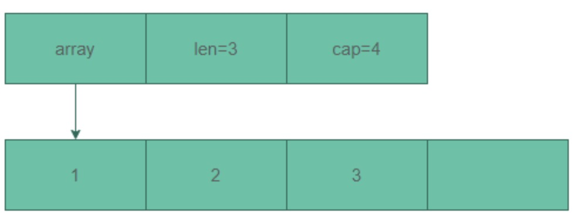

# 切片介绍

切片本身并不是动态数组或者数组指针。
它内部实现的数据结构通过指针引用底层数组，设定相关属性将数据读写操作限定在指定的区域内。切片本身是一个只读对象，其工作机制类似数组指针的一种封装。
切片（slice）是对数组一个连续片段的引用，所以切片是一个引用类型（因此更类似于 C++ 中的 Vector 类型，或者 Python 中的 list 类型）

## 源码结构

runtime/slice.go
```go
type slice struct {
	array unsafe.Pointer
	len   int
	cap   int
}
```

切片的结构体由3部分构成，Pointer 是指向一个数组的指针，len 代表当前切片的长度，cap 是当前切片的容量。cap 总是大于等于 len 的

看图，切片是在数组的基础上抽象了一层，底层是对数组的引用,当切片发生扩容时,底层数组发生改变，而对于上层切片来说是没有变化的

## 初始化
slice的make初始化主要通过runtime.makeslice来完成,先计算出需要的内存空间大小，然后再分配内存。
```go
func makeslice(et *_type, len, cap int) unsafe.Pointer {
	//计算需要分配的内存空间和内存是否有溢出
	mem, overflow := math.MulUintptr(et.size, uintptr(cap))
	if overflow || mem > maxAlloc || len < 0 || len > cap {
		// NOTE: Produce a 'len out of range' error instead of a
		// 'cap out of range' error when someone does make([]T, bignumber).
		// 'cap out of range' is true too, but since the cap is only being
		// supplied implicitly, saying len is clearer.
		// See golang.org/issue/4085.
		mem, overflow := math.MulUintptr(et.size, uintptr(len))
		if overflow || mem > maxAlloc || len < 0 {
			panicmakeslicelen()
		}
		panicmakeslicecap()
	}
	//分配内存
	return mallocgc(mem, et, true)
}
```
内存空间大小的计算公式为：
```shell
内存空间大小 = 切片中元素大小 * 容量大小
```


## 拷贝切片
拷贝切片可以用copy方法
```go
func copy(dst, src []Type) int
```
实际上copy根据数据类型，最终会调用切片的runtime.slicecopy方法。
```go
func slicecopy(toPtr unsafe.Pointer, toLen int, fmPtr unsafe.Pointer, fmLen int, width uintptr) int {
	//如果源切片和目标切片长度为0,则直接返回0
	if fmLen == 0 || toLen == 0 {
		return 0
	}

	//根据源切片和目标切片的长度，以长度最小的切片进行拷贝
	n := fmLen
	if toLen < n {
		n = toLen
	}

	if width == 0 {
		return n
	}

	//拷贝的空间大小=长度 * 元素大小
	size := uintptr(n) * width
	if size == 1 { // common case worth about 2x to do here
		// TODO: is this still worth it with new memmove impl?
		//如果拷贝的空间大小 等于1,那么直接转化赋值
		*(*byte)(toPtr) = *(*byte)(fmPtr) // known to be a byte pointer
	} else {
		//如果拷贝的空间大小 大于1,则源切片中array的数据拷贝到目标切片的array
		memmove(toPtr, fmPtr, size)
	}
	return n
}
```

从源码可以看出在切片拷贝的时候，要预先定义切片的长度再进行拷贝，否则有可能拷贝失败。

## 总结
在扩容过程中,切片的地址不会被改变,改变的是切片的底层数组array,会申请一块新的内存地址替换。slice没有缩小容量的操作


1. 如果想从 slice 中得到一块内存地址:
```go
s := make([]byte, 200)
ptr := unsafe.Pointer(&s[0])
```


构造slice:创建切片有两种形式，1. make 创建切片，空切片 2. 字面量也可以创建切片。

1. Go 的内存地址中构造一个 slice:
    

```go
var ptr unsafe.Pointer
var s1 = struct {
   addr uintptr
   len int
   cap int
}{uintptr(ptr), length, length}
s := *(*[]byte)(unsafe.Pointer(&s1))
```


2. Go 的反射中就存在一个与之对应的数据结构 SliceHeader,用它来构造一个 slice
```go
var o []byte
sliceHeader := (*reflect.SliceHeader)(unsafe.Pointer(&o))
sliceHeader.Cap = length
sliceHeader.Len = length
sliceHeader.Data = uintptr(ptr)

```

具体操作
```go
func main() {
    // 构造slice
    //方式一
    var ptr1 unsafe.Pointer
    var s1 = struct {
        addr uintptr
        len  int
        cap  int
    }{uintptr(ptr1), 3, 3}
    fmt.Printf("结构是%T,数值是%+v\n", s1, s1) // 结构是struct { addr uintptr; len int; cap int },数值是{addr:0 len:3 cap:3}
    s := *(*[]byte)(unsafe.Pointer(&s1))
    fmt.Printf("结构是%T,数值是%+v\n", s, s) // 结构是[]uint8,数值是[]

    // 方式二
    var ptr2 unsafe.Pointer
    var o []byte
    sliceHeader := (*reflect.SliceHeader)(unsafe.Pointer(&o))
    sliceHeader.Cap = 2
    sliceHeader.Len = 2
    sliceHeader.Data = uintptr(ptr2)
    fmt.Printf("结构是%T,数值是%+v\n", sliceHeader, sliceHeader) // 结构是*reflect.SliceHeader,数值是&{Data:0 Len:2 Cap:2}

}
```


