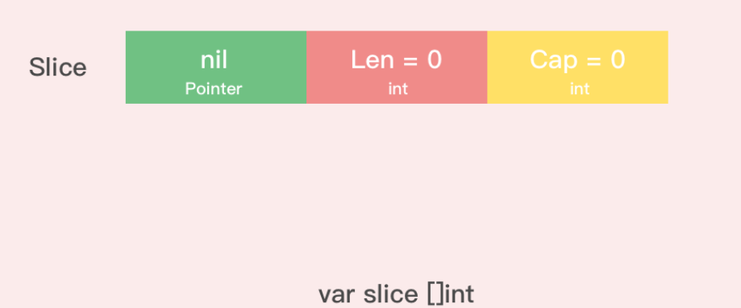
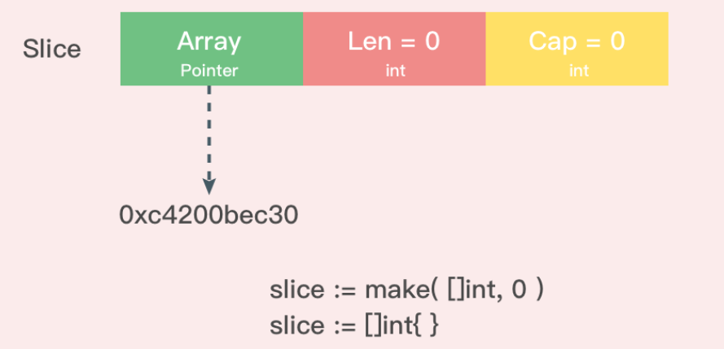

# nil 和空切片 的应用

nil slice底层指向数组的指针为nil，而empty slice底层数组指针指向一个长度为0的数组。
因此在判断一个slice是否有数据时应该使用 len(s) == 0，而不是s == nil .一般的用法是nil slice表示切片不存在，empty slice表示切片中没有元素。

## nil 切片:

```go
var slice []int
```

被用在很多标准库和内置函数中，描述一个不存在的切片的时候，就需要用到 nil 切片。
比如函数在发生异常的时候，返回的切片就是 nil 切片。nil 切片的指针指向 nil。

## 空切片:

```go
slice1 := make( []int , 0 )
slice2 := []int{ }
```

空切片一般会用来表示一个空的集合。比如数据库查询，一条结果也没有查到，那么就可以返回一个空切片


## 空切片和 nil 切片的区别:
空切片指向的地址不是nil，指向的是一个内存地址，但是它没有分配任何内存空间，即底层元素包含0个元素。


