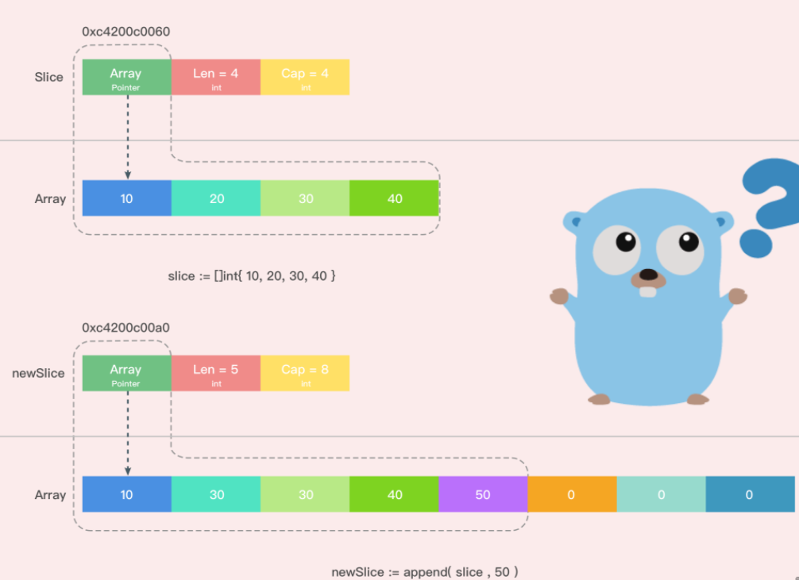

# 扩容政策

## 扩容分析


新的切片和之前的切片已经不同了，因为新的切片更改了一个值，并没有影响到原来的数组，新切片指向的数组是一个全新的数组。并且 cap 容量也发生了变化。


Go 中切片扩容的策略是这样的：

- 先计算需要的数组的大小：
  - 首先判断，如果新申请容量（cap）大于2倍的旧容量（old.cap），最终容量（newcap）就是新申请的容量（cap）
  - 否则判断，如果旧切片的长度小于1024，则最终容量(newcap)就是旧容量(old.cap)的两倍，即（newcap=doublecap）
  - 否则判断，如果旧切片长度大于等于1024，则最终容量（newcap）从旧容量（old.cap）开始循环增加原来的 1/4，即（newcap=old.cap,for {newcap += newcap/4}）直到最终容量（newcap）大于等于新申请的容量(cap)，即（newcap >= cap）
- 计算完需要的数组容量后，再计算需要的内存大小，也就是数组存放的元素的大小乘于容量。
- 最后申请内容，拷贝旧内存。


注意：扩容扩大的容量都是针对原来的容量而言的，而不是针对原来数组的长度而言的。


## 源码分析
```go
// et为切片存放的数据的类型，old为旧的slice，cap为期望的容量大小
func growslice(et *_type, old slice, cap int) slice {
	if raceenabled {
		callerpc := getcallerpc(unsafe.Pointer(&et))
		racereadrangepc(old.array, uintptr(old.len*int(et.size)), callerpc, funcPC(growslice))
	}
	if msanenabled {
		msanread(old.array, uintptr(old.len*int(et.size)))
	}

	if et.size == 0 {
		// 如果新要扩容的容量比原来的容量还要小，这代表要缩容了，那么可以直接报panic了。
		if cap < old.cap {
			panic(errorString("growslice: cap out of range"))
		}

		// 如果当前切片的大小为0，还调用了扩容方法，那么就新生成一个新的容量的切片返回。
		return slice{unsafe.Pointer(&zerobase), old.len, cap}
	}

    // 这里就是扩容的策略
	newcap := old.cap
	// doublecap为原切片的容量的两倍
	doublecap := newcap + newcap
	if cap > doublecap {
        // 期望的容量大于两边的就切片的容量，分配期望的容量大小
		newcap = cap
	} else {
        // 如果原切片的容量大小小于1024，直接分配两倍的原切片的cap大小的容量
        // 否则，则分配 1.25*原切片cap大小的容量
		if old.len < 1024 {
			newcap = doublecap
		} else {
			// Check 0 < newcap to detect overflow
			// and prevent an infinite loop.
			for 0 < newcap && newcap < cap {
				newcap += newcap / 4
			}
			// Set newcap to the requested cap when
			// the newcap calculation overflowed.
			if newcap <= 0 {
				newcap = cap
			}
		}
	}
	// 计算出新的容量的情况下，就需要准备去申请足够空间的内存，但之前还需要一系列内存对齐的计算操作：
	//	当数组中元素所占的字节大小为1、8或者2的倍数时,对应相应的内存空间计算
	// 计算新的切片的容量，长度。
	var lenmem, newlenmem, capmem uintptr
	 //*lenmem表示旧切片实际元素长度所占的内存空间大小
	 //*newlenmem表示新切片实际元素长度所占的内存空间大小
	 //*capmem表示扩容之后的容量大小
	 //*overflow是否溢出

	const ptrSize = unsafe.Sizeof((*byte)(nil))
	switch et.size {
	case 1://元素所占的字节数为1
		lenmem = uintptr(old.len)
		newlenmem = uintptr(cap)
		capmem = roundupsize(uintptr(newcap)) //向上取整分配内存
		newcap = int(capmem)
	case ptrSize: //元素所占的字节数为8个字节
		lenmem = uintptr(old.len) * ptrSize
		newlenmem = uintptr(cap) * ptrSize
		capmem = roundupsize(uintptr(newcap) * ptrSize)
		newcap = int(capmem / ptrSize)
	default:
		lenmem = uintptr(old.len) * et.size
		newlenmem = uintptr(cap) * et.size
		capmem = roundupsize(uintptr(newcap) * et.size)
		newcap = int(capmem / et.size)
	}

	// 判断非法的值，保证容量是在增加，并且容量不超过最大容量
	if cap < old.cap || uintptr(newcap) > maxSliceCap(et.size) {
		panic(errorString("growslice: cap out of range"))
	}
	//计算出需要分配的内存大小后，就会重新申请内存,然后将原来切片的元素重新赋值到新的切片中。
	var p unsafe.Pointer
	if et.kind&kindNoPointers != 0 {
		// //申请一块无类型的内存空间，在老的切片后面继续扩充容量
		p = mallocgc(capmem, nil, false)
		// 将 lenmem 这个多个 bytes 从 old.array地址 拷贝到 p 的地址处
		memmove(p, old.array, lenmem)
		// 先将 P 地址加上新的容量得到新切片容量的地址，然后将新切片容量地址后面的 capmem-newlenmem 个 bytes 这块内存初始化。
			为之后继续 append() 操作腾出空间。
		memclrNoHeapPointers(add(p, newlenmem), capmem-newlenmem)
	} else {
		// //根据元素类型申请内存空间，重新申请新的数组给新切片
		// 重新申请 capmen 这个大的内存地址，并且初始化为0值
		p = mallocgc(capmem, et, true)
		if !writeBarrier.enabled {
			// 如果还不能打开写锁，那么只能把 lenmem 大小的 bytes 字节从 old.array 拷贝到 p 的地址处
			memmove(p, old.array, lenmem)
		} else {
			// 循环拷贝老的切片的值
			for i := uintptr(0); i < lenmem; i += et.size {
				typedmemmove(et, add(p, i), add(old.array, i))
			}
		}
	}
	// 返回最终新切片，容量更新为最新扩容之后的容量
	return slice{p, old.len, newcap}
}


```