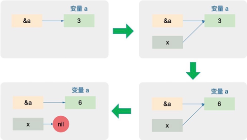

<!-- START doctoc generated TOC please keep comment here to allow auto update -->
<!-- DON'T EDIT THIS SECTION, INSTEAD RE-RUN doctoc TO UPDATE -->
**Table of Contents**  *generated with [DocToc](https://github.com/thlorenz/doctoc)*

- [指针基本操作](#%E6%8C%87%E9%92%88%E5%9F%BA%E6%9C%AC%E6%93%8D%E4%BD%9C)
  - [分类](#%E5%88%86%E7%B1%BB)

<!-- END doctoc generated TOC please keep comment here to allow auto update -->

# 指针基本操作

## 分类

分为3种

1. *类型:普通指针类型，用于传递对象地址，不能进行指针运算。
2. unsafe.Pointer:通用指针类型，用于转换不同类型的指针，不能进行指针运算，不能读取内存存储的值（必须转换到某一类型的普通指针）。
3. uintptr:用于指针运算，GC 不把 uintptr 当指针，uintptr 无法持有对象。uintptr 类型的目标会被回收。

