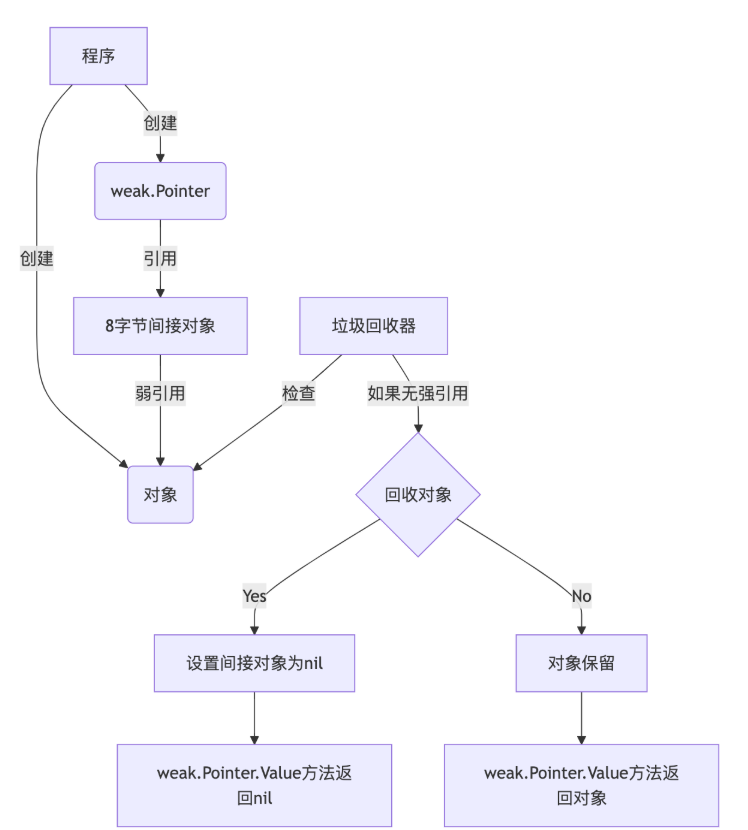
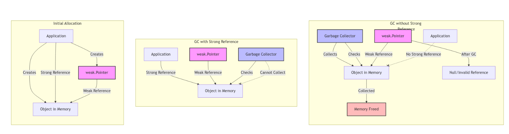

<!-- START doctoc generated TOC please keep comment here to allow auto update -->
<!-- DON'T EDIT THIS SECTION, INSTEAD RE-RUN doctoc TO UPDATE -->
**Table of Contents**  *generated with [DocToc](https://github.com/thlorenz/doctoc)*

- [弱指针](#%E5%BC%B1%E6%8C%87%E9%92%88)
  - [对比强指针](#%E5%AF%B9%E6%AF%94%E5%BC%BA%E6%8C%87%E9%92%88)
  - [使用场景](#%E4%BD%BF%E7%94%A8%E5%9C%BA%E6%99%AF)
  - [源码](#%E6%BA%90%E7%A0%81)
  - [参考](#%E5%8F%82%E8%80%83)

<!-- END doctoc generated TOC please keep comment here to allow auto update -->

# 弱指针

弱指针（或其他语言中的弱引用）允许开发人员引用内存，而不妨碍垃圾回收器回收内存。为防止出现可见的悬挂引用，弱指针在引用的内存被回收时会变为零。


弱指针可以转换为常规（“强”）指针，这样就能防止垃圾回收器回收内存，并允许对内存进行典型使用和访问。


弱指针的核心思想是允许引用内存而不阻止垃圾回收器回收它。垃圾回收器在回收对象时，会自动将所有指向该对象的弱指针设置为nil。
这确保了弱指针不会产生悬空引用(dangling pointer)。


值得注意的是，弱指针的比较基于它们最初创建时使用的指针。即使原始对象被回收，两个由相同指针创建的弱指针仍然会被认为是相等的。这个特性使得弱指针可以安全地用作map的键。

## 对比强指针

|  特性  |   强引用 (*T)    |           弱引用 (weak.Pointer[T])            |
|:----:|:-------------:|:------------------------------------------:|
| 影响 GC |    会保持对象存活    |                  不会保持对象存活                  |
|  空值  |      nil      |              nil（目标被回收或从未赋值）               |
|  访问方式    |       直接解引用        |              先调用 Value()               |


## 使用场景
> go1.24.3/src/weak/pointer.go
>  The primary use-cases for weak pointers are for implementing caches, canonicalization maps (like the unique package), and for tying together the lifetimes of separate values (for example, through a map with weak keys).
- 缓存：在不强制对象常驻内存的前提下存储它们，如果其他地方不再使用，对象就能被回收；
- 观察者模式：保存对观察者的引用，同时不阻止它们被 GC 回收；
- 规范化（Canonicalization）：确保同一对象只有一个实例，并且在不再使用时可被回收；
- 依赖关系图：在树或图等结构中避免形成引用环。


弱指针使用注意事项

- 随时检查 nil：对象可能在任意 GC 周期后被回收，Value() 结果不可缓存。
- 避免循环依赖：不要让弱指针中的对象重新持有创建它的容器，否则仍会形成强引用链。
- 性能权衡：访问弱指针需要额外调用，且频繁从 nil 状态恢复对象会导致抖动


## 源码

创建弱指针
```go
func Make[T any](ptr *T) Pointer[T] {
	// Explicitly force ptr to escape to the heap.
	ptr = abi.Escape(ptr)

	var u unsafe.Pointer
	if ptr != nil {
		u = runtime_registerWeakPointer(unsafe.Pointer(ptr))
	}
	runtime.KeepAlive(ptr)
	return Pointer[T]{u: u}
}
```

## 参考

- [Go 1.24 中的弱指针包 weak 使用](https://www.51cto.com/article/816274.html)
- [Go weak包前瞻：弱指针为内存管理带来新选择](https://tonybai.com/2024/09/23/go-weak-package-preview/)