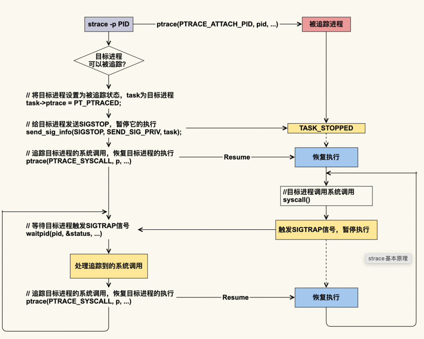
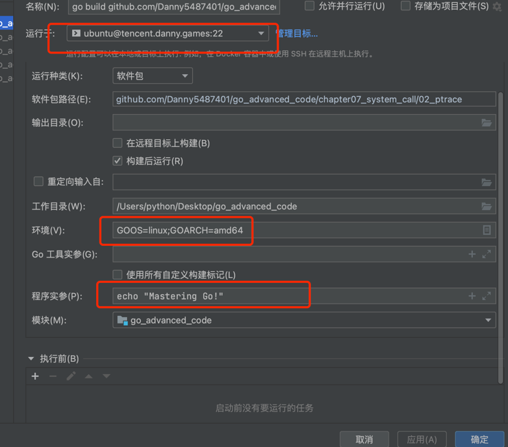

<!-- START doctoc generated TOC please keep comment here to allow auto update -->
<!-- DON'T EDIT THIS SECTION, INSTEAD RE-RUN doctoc TO UPDATE -->
**Table of Contents**  *generated with [DocToc](https://github.com/thlorenz/doctoc)*

- [strace](#strace)
  - [strace 的两种启动方式](#strace-%E7%9A%84%E4%B8%A4%E7%A7%8D%E5%90%AF%E5%8A%A8%E6%96%B9%E5%BC%8F)
  - [golang程序 goland 远程linux amd64 运行](#golang%E7%A8%8B%E5%BA%8F-goland-%E8%BF%9C%E7%A8%8Blinux-amd64-%E8%BF%90%E8%A1%8C)
  - [参考](#%E5%8F%82%E8%80%83)

<!-- END doctoc generated TOC please keep comment here to allow auto update -->

# strace 

strace 可用于追踪进程与内核的交互情况，包括系统调用，信号，进程状态等信息。

strace 常用于性能分析、问题定位等场景。

strace 基于 linux 内核特性 ptrace 开发，相当于直接 hook 了系统调用。这意味着 strace 可以追踪所有的用户进程，即使没有被追踪程序的源码，或者程序是非 debug 版本，或者程序日志不完善，都可以通过 strace 追踪到不少有用信息\


对于正在运行的进程而言，strace 可以 attach 到目标进程上，这是通过 ptrace 这个系统调用实现的（gdb 工具也是如此）。
ptrace 的 PTRACE_SYSCALL 会去追踪目标进程的系统调用；
目标进程被追踪后，每次进入 syscall，都会产生 SIGTRAP 信号并暂停执行；
追踪者通过目标进程触发的 SIGTRAP 信号，就可以知道目标进程进入了系统调用，然后追踪者会去处理该系统调用，我们用 strace 命令观察到的信息输出就是该处理的结果；
追踪者处理完该系统调用后，就会恢复目标进程的执行。被恢复的目标进程会一直执行下去，直到下一个系统调用.


目标进程每执行一次系统调用都会被打断，等 strace 处理完后，目标进程才能继续执行，这就会给目标进程带来比较明显的延迟。
因此，在生产环境中我不建议使用该命令，如果你要使用该命令来追踪生产环境的问题，那就一定要做好预案.

## strace 的两种启动方式
```shell
# 另一种是追踪已启动的进程，使用-p加上进程号
$ strace -tt -T -v -f -e trace=file -o /data/log/strace.log -s 1024 -p 23489 #查看某个进程的系统调用

# 一种是使用 strace 启动被追踪的程序，
$ strace <commond> #查看某条commond指令或进程的系统调用
```
* -tt 在每行输出的前面，显示毫秒级别的时间
* -T 显示每次系统调用所花费的时间
* -v 对于某些相关调用，把完整的环境变量，文件stat结构等打出来。
* -f 跟踪目标进程，以及目标进程创建的所有子进程
* -e 控制要跟踪的事件和跟踪行为,比如指定要跟踪的系统调用名称
* -o 把strace的输出单独写到指定的文件
* -s 当系统调用的某个参数是字符串时，最多输出指定长度的内容，默认是32个字节
* -p 指定要跟踪的进程pid, 要同时跟踪多个pid, 重复多次-p选项即可


```C
#include <unistd.h>
#include <stdio.h>
int main(){
   for(;;){
       printf("pid=%d\n", getpid());
       sleep(2);
  }
   return 0;
}
```
$ gcc -o print print.c

```shell
centos@xxxxxx:/app/gowork/stramgrpc/c$ strace ./print 
execve("./print", ["./print"], [/* 51 vars */]) = 0
.......
getpid() = 23419
fstat(1, {st_mode=S_IFCHR|0620, st_rdev=makedev(136, 0), ...}) = 0
brk(NULL) = 0x55e3343e2000
brk(0x55e334403000) = 0x55e334403000
write(1, "pid=23419\n", 10pid=23419
) = 10
nanosleep({tv_sec=2, tv_nsec=0}, 0x7ffd2a6d37f0) = 0
getpid() = 23419
write(1, "pid=23419\n", 10pid=23419
) = 10
nanosleep({tv_sec=2, tv_nsec=0}, ^Cstrace: Process 23419 detached
<detached ...>
```
strace命令是c语言实现的，基于Ptrace系统调用。

看一下c标准库的定义规则
```shell
long ptrace(int request, pid_t pid, void *addr, void *data);
```
ptrace在需要传入四个参数：
1. pid用于传入目标进程，也就是要跟性进程的pid；

2. addr和data用于传入内存地址和附加地址，通常会在系统调用结束后读取传入的参数获取系统调用结果，会因操作的不同而不同。

3. request用于选择一个符号标志，内核会根据这个标志决定要选用那个内核函数来执行，接下来介绍一下重点要使用的几个符号标志。

    - 其他的用法不过多展开，感兴趣的同学可以自己探索一下。

    - PTRACE_ATTACH发出一个请求，连接到一个进程并开始跟踪，相反，PTRACE_DETACH从该进程断开并结束跟踪。在调用该指令后，被跟踪进程会发送信号给跟踪者进程，跟踪者进程需要使用waitpid获取该信号，并进行后续的系统调用跟踪。

    - PTRACE_SYSCALL发出系统调用追踪的指令，当使用了该选项时候，被追踪的进程就会在进入系统调用之前或者结束后停下来，这时候追踪者进程可以使用waitpid系统调用时候收到被追踪者发来的通知，从而分析此时的地址空间以及系统调用相关等信息；

    - PTRACE_GETREGS和PTRACE_SETREGS用来设置和读取CPU寄存器，在x86_64的Linux上，系统调用的编号存储在orig_rax寄存器，其他参数是在rdi、rsi、rdx等寄存器，在返回时，返回值存储在rax寄存器；

    - PTRACE_TRACEME：此进程允许被其父进程跟踪(用于strace+命令形式)

简单来说有三大能力:

- 追踪系统调用
- 读写内存和寄存器
- 向被追踪程序传递信号


## golang程序 goland 远程linux amd64 运行




## 参考
- [strace命令用法详解](https://cloud.tencent.com/developer/article/1886514)
- [Linux 内核技术实战课-20 分析篇 |如何分析CPU利用率飙高问题](https://time.geekbang.org/column/article/293313)