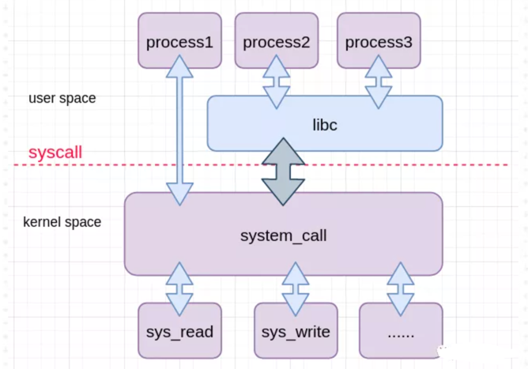

<!-- START doctoc generated TOC please keep comment here to allow auto update -->
<!-- DON'T EDIT THIS SECTION, INSTEAD RE-RUN doctoc TO UPDATE -->
**Table of Contents**  *generated with [DocToc](https://github.com/thlorenz/doctoc)*

- [系统调用](#%E7%B3%BB%E7%BB%9F%E8%B0%83%E7%94%A8)
  - [流程](#%E6%B5%81%E7%A8%8B)
  - [历史](#%E5%8E%86%E5%8F%B2)
  - [Go语言系统调用](#go%E8%AF%AD%E8%A8%80%E7%B3%BB%E7%BB%9F%E8%B0%83%E7%94%A8)
    - [案例分析 fmt.Println("hello world")](#%E6%A1%88%E4%BE%8B%E5%88%86%E6%9E%90-fmtprintlnhello-world)

<!-- END doctoc generated TOC please keep comment here to allow auto update -->

# 系统调用

系统调用是操作系统内核提供给用户空间程序的一套标准接口。

用户程序不会直接与磁盘等硬件打交道，所以不能直接对文件进行操作，所以需要内核这层"垫片"，用户程序既然要访问内核，就免不了要执行系统调用。

通过这套接口，用户态程序可以受限地访问硬件设备，从而实现申请系统资源，读写设备，创建新进程等操作。
事实上，我们常用的 C 语言标准库中不少都是对操作系统提供的系统调用的封装，比如大家耳熟能详的 printf, gets, fopen 等，就分别是对 read, write, open 这些系统调用的封装。

当要执行系统调用时候，CPU会切换到内核态，执行系统调用函数。

由于内核实现了很多的系统调用函数，所以内核需要为每个函数提供一个标识，代表要调用的内核函数，这个系统调用号在不同的内核架构也不同。

## 流程

1. 用户程序调用c库或者直接通过自身的汇编指令进行系统调用，需要传递的变量以及系统调用编号保存在cpu寄存器中

2. 进程进入内核态通过寄存器保存的系统调用编号识别系统函数并执行系统调用

3. 系统调用结束，结果以及返回值以及参数保存在寄存器，用户程序从中获取结果

## 历史

历史上，x86(-64) 上共有int 80, sysenter, syscall三种方式来实现系统调用。

1. int 80 是最传统的调用方式，其通过中断/异常来实现。系统调用是通过软中断触发的，如32位的x86，系统调用的中断号是128，
所以会通过INT 0x80指令触发软中断进入系统调用从而进入内核态，读取寄存器存储的值并在系统调用表中找到对应的系统调用并执行，由于使用软中断的形式触发系统调用开销较大，所以渐渐退出视野.
取而代之的是使用了汇编指令SYSENTER或SYSCALL的形式触发系统调用，相比软中断触发的方式减少了查询中断向量表等系列操作，提升了性能

2. sysenter 与 syscall 则都是通过引入新的寄存器组( Model-Specific Register(MSR))存放所需信息，进而实现快速跳转。
这两者之间的主要区别就是定义的厂商不一样，sysenter是 Intel 主推，后者syscall则是 AMD 的定义。
到了 64位时代，因为安腾架构（IA-64）大失败，农企终于借着 x86_64架构咸鱼翻身，搞得 Intel 只得兼容 syscall。
Linux 在 2.6 的后期开始引入 sysenter 指令，从当年遗留下来的文章来看，与老古董 int 80 比跑的确实快。
因此为了性能，我们的 Go 语言自然也是使用 syscall/sysenter 进行系统调用

## Go语言系统调用
尽管 Go 语言具有 cgo 这样的设施可以方便快捷地调用 C 函数，但是其还是自己对系统调用进行了封装，以 amd64 架构为例.

```go
// syscall/syscall_unix.go
func Syscall(trap, a1, a2, a3 uintptr) (r1, r2 uintptr, err Errno)
func Syscall6(trap, a1, a2, a3, a4, a5, a6 uintptr) (r1, r2 uintptr, err Errno)
func RawSyscall(trap, a1, a2, a3 uintptr) (r1, r2 uintptr, err Errno)
func RawSyscall6(trap, a1, a2, a3, a4, a5, a6 uintptr) (r1, r2 uintptr, err Errno)
```
其中 Syscall 对应参数不超过四个的系统调用，Syscall6 则对应参数不超过六个的系统调用

```
// asm_linux_amd64.s
#include "textflag.h"
#include "funcdata.h"

//
// System calls for AMD64, Linux
//

// func Syscall(trap int64, a1, a2, a3 uintptr) (r1, r2, err uintptr);
// Trap # in AX, args in DI SI DX R10 R8 R9, return in AX DX
// Note that this differs from "standard" ABI convention, which
// would pass 4th arg in CX, not R10.

TEXT ·Syscall(SB),NOSPLIT,$0-56
	CALL	runtime·entersyscall(SB)
	MOVQ	a1+8(FP), DI
	MOVQ	a2+16(FP), SI
	MOVQ	a3+24(FP), DX
	MOVQ	trap+0(FP), AX	// syscall entry
	SYSCALL
	CMPQ	AX, $0xfffffffffffff001
	JLS	ok
	MOVQ	$-1, r1+32(FP)
	MOVQ	$0, r2+40(FP)
	NEGQ	AX
	MOVQ	AX, err+48(FP)
	CALL	runtime·exitsyscall(SB)
	RET
ok:
	MOVQ	AX, r1+32(FP)
	MOVQ	DX, r2+40(FP)
	MOVQ	$0, err+48(FP)
	CALL	runtime·exitsyscall(SB)
	RET

// func Syscall6(trap, a1, a2, a3, a4, a5, a6 uintptr) (r1, r2, err uintptr)
TEXT ·Syscall6(SB),NOSPLIT,$0-80
	CALL	runtime·entersyscall(SB)
	MOVQ	a1+8(FP), DI
	MOVQ	a2+16(FP), SI
	MOVQ	a3+24(FP), DX
	MOVQ	a4+32(FP), R10
	MOVQ	a5+40(FP), R8
	MOVQ	a6+48(FP), R9
	MOVQ	trap+0(FP), AX	// syscall entry
	SYSCALL
	CMPQ	AX, $0xfffffffffffff001
	JLS	ok6
	MOVQ	$-1, r1+56(FP)
	MOVQ	$0, r2+64(FP)
	NEGQ	AX
	MOVQ	AX, err+72(FP)
	CALL	runtime·exitsyscall(SB)
	RET
ok6:
	MOVQ	AX, r1+56(FP)
	MOVQ	DX, r2+64(FP)
	MOVQ	$0, err+72(FP)
	CALL	runtime·exitsyscall(SB)
	RET

// func RawSyscall(trap, a1, a2, a3 uintptr) (r1, r2, err uintptr)
TEXT ·RawSyscall(SB),NOSPLIT,$0-56
	MOVQ	a1+8(FP), DI
	MOVQ	a2+16(FP), SI
	MOVQ	a3+24(FP), DX
	MOVQ	trap+0(FP), AX	// syscall entry
	SYSCALL
	CMPQ	AX, $0xfffffffffffff001
	JLS	ok1
	MOVQ	$-1, r1+32(FP)
	MOVQ	$0, r2+40(FP)
	NEGQ	AX
	MOVQ	AX, err+48(FP)
	RET
ok1:
	MOVQ	AX, r1+32(FP)
	MOVQ	DX, r2+40(FP)
	MOVQ	$0, err+48(FP)
	RET

// func RawSyscall6(trap, a1, a2, a3, a4, a5, a6 uintptr) (r1, r2, err uintptr)
TEXT ·RawSyscall6(SB),NOSPLIT,$0-80
	MOVQ	a1+8(FP), DI
	MOVQ	a2+16(FP), SI
	MOVQ	a3+24(FP), DX
	MOVQ	a4+32(FP), R10
	MOVQ	a5+40(FP), R8
	MOVQ	a6+48(FP), R9
	MOVQ	trap+0(FP), AX	// syscall entry
	SYSCALL
	CMPQ	AX, $0xfffffffffffff001
	JLS	ok2
	MOVQ	$-1, r1+56(FP)
	MOVQ	$0, r2+64(FP)
	NEGQ	AX
	MOVQ	AX, err+72(FP)
	RET
ok2:
	MOVQ	AX, r1+56(FP)
	MOVQ	DX, r2+64(FP)
	MOVQ	$0, err+72(FP)
	RET
```


Syscall 和 RawSyscall 在源代码上的区别就是有没有调用 runtime 包提供的两个函数。这意味着前者在发生阻塞时可以通知运行时并继续运行其他协 程，而后者只会卡掉整个程序。
我们在自己封装自定义调用时应当尽量使用 Syscall

### 案例分析 fmt.Println("hello world")
```go
func Println(a ...interface{}) (n int, err error) {
	return Fprintln(os.Stdout, a...)
}

Stdout = NewFile(uintptr(syscall.Stdout), "/dev/stdout")

func Fprintln(w io.Writer, a ...interface{}) (n int, err error) {
	p := newPrinter()
	p.doPrintln(a)
	n, err = w.Write(p.buf)
	p.free()
	return
}

// os/file_plan9.go
func (f *File) write(b []byte) (n int, err error) {
    if len(b) == 0 {
        return 0, nil
    }
    // 实际的write方法，就是调用syscall.Write()
    return fixCount(syscall.Write(f.fd, b))
}
```