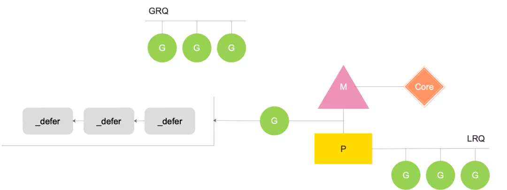
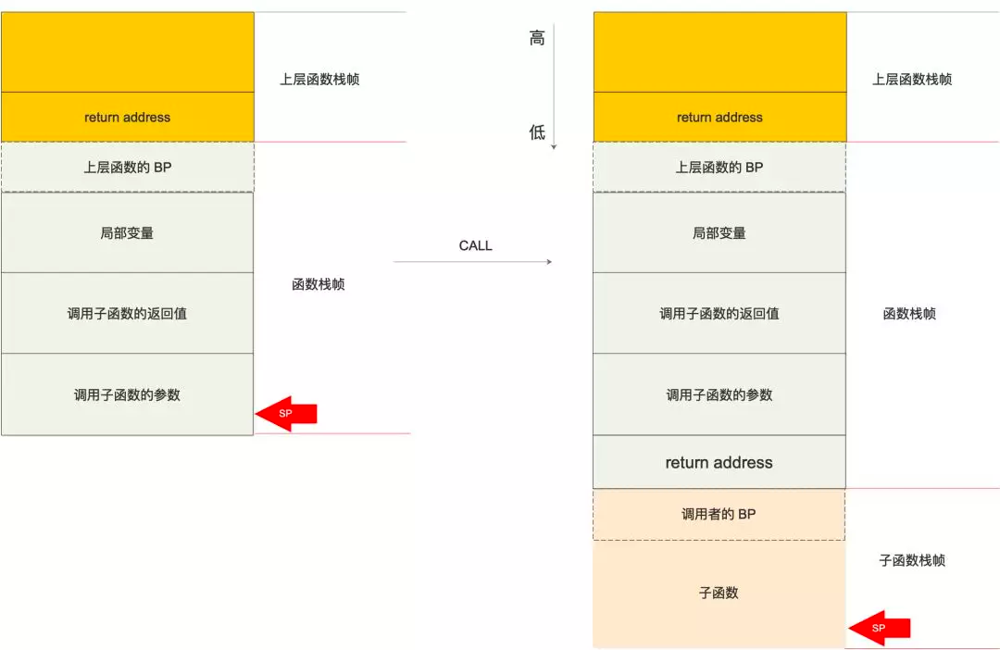

# defer 源码分析


在编译器的加持下，defer 语句会先调用 deferporc 函数，new 一个 _defer 结构体，挂到 g 上。当然，这里的 new 会优先从当前绑定的 P 的 defer pool 里取，
没取到会去全局的 defer pool 里取，实在没有的话就新建一个，很熟悉的套路。

等待函数体执行完，在 RET 指令之前（注意不是 return 之前），调用 deferreturn 函数完成 _defer 链表的遍历，执行完这条链上所有被 defered 的函数（如关闭文件、释放连接等）。
这里的问题是在 deferreturn 函数的最后，会使用 jmpdefer 跳转到之前被 defered 的函数，这时控制权转移到了用户自定义的函数。
这只是执行了一个被 defered 的函数，这条链上其他的被 defered 的函数，该如何得到执行呢？

答案就是控制权会再次交给 runtime，并再次执行 deferreturn 函数，完成 defer 链表的遍历。

## 汇编函数的声明

```shell

TEXT runtime·gogo(SB), NOSPLIT, $16-8
#1。最后两个数字表示 gogo 函数的栈帧大小为 16B，即函数的局部变量和为调用子函数准备的参数和返回值需要 16B 的栈空间；
#2。参数和返回值的大小加起来是 8B
```
## 实际上 gogo 函数的声明

```go

// func gogo(buf *gobuf)

//参数及返回值的大小是给调用者“看”的，调用者根据这个数字可以构造栈：准备好被调函数需要的参数及返回值
```


左图中，主调函数准备好调用子函数的参数及返回值，执行 CALL 指令，将返回地址压入栈顶，相当于执行了 PUSH IP，
之后，将 BP 寄存器的值入栈，相当于执行了 PUSH BP，再 jmp 到被调函数。

图中 return address 表示子函数执行完毕后，返回到上层函数中调用子函数语句的下一条要执行的指令，它属于 caller 的栈帧。
而调用者的 BP 则属于被调函数的栈帧。

子函数执行完毕后，执行 RET 指令：首先将子函数栈底部的值赋到 CPU 的 BP 寄存器中，于是 BP 指向上层函数的 BP；
再将 return address 赋到 IP 寄存器中，这时 SP 回到左图所示的位置。相当于还原了整个调用子函数的现场，像是一切都没发生过；
接着，CPU 继续执行 IP 寄存器里的下一条指令
defer构造

在构造 _defer 结构体的时候，需要将当前函数的 SP、被 defered 的函数指针保存到 _defer 结构体中。
并且会将被 defered 的函数所需要的参数 copy 到 _defer 结构体相邻的位置。最终在调用被 defered 的函数的时候，用的就是这时被 copy 的值，
相当于使用了它的一个快照，如果此参数不是指针或引用类型的话，会产生一些意料之外的 bug
