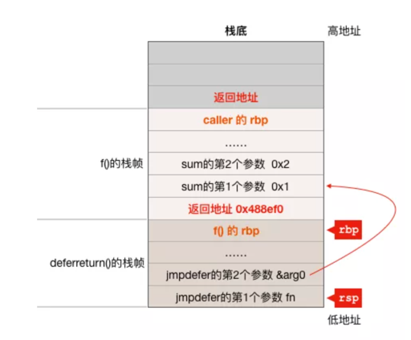

# defer 源码分析


在编译器的加持下，defer 语句会先调用 deferproc 函数，new 一个 _defer 结构体，挂到 g 上。当然，这里的 new 会优先从当前绑定的 P 的 defer pool 里取，
没取到会去全局的 defer pool 里取，实在没有的话就新建一个，很熟悉的套路。

等待函数体执行完，在 RET 指令之前（注意不是 return 之前），调用 deferreturn 函数完成 _defer 链表的遍历，执行完这条链上所有被 defered 的函数（如关闭文件、释放连接等）。
这里的问题是在 deferreturn 函数的最后，会使用 jmpdefer 跳转到之前被 defered 的函数，这时控制权转移到了用户自定义的函数。
这只是执行了一个被 defered 的函数，这条链上其他的被 defered 的函数，该如何得到执行呢？

答案就是控制权会再次交给 runtime，并再次执行 deferreturn 函数，完成 defer 链表的遍历。

## Go案例代码
```go
package main

import "fmt"

func sum(a, b int) {
    c := a + b
    fmt.Println("sum:" , c)
}

func f(a, b int) {
    defer sum(a, b)

    fmt.Printf("a: %d, b: %d\n", a, b)
}

func main() {
    a, b := 1, 2
    f(a, b)
}
```
## deferproc 函数
```go
// runtime/panic.go 
//go:nosplit
func deferproc(siz int32, fn *funcval) 
```
deferproc 函数的第一个参数 siz 是 defered 函数（比如本例中的 sum 函数）的参数以字节为单位的大小，第二个参数 funcval 是一个变长结构体：
```go
type funcval struct {
    fn uintptr
    // variable-size, fn-specific data here
}
```
在64位系统中本文例子中的 defer sum(a, b) 大致等价于
```go
deferproc(16, &funcval{sum})
```
因为 sum 函数有 2 个 int 型的参数共 16 字节，所以在调用 deferproc 函数时第一个参数为16，第二个参数 funcval 结构体对象的 fn 成员为 sum 函数的地址。


看一下 f() 函数的汇编代码
```css
0x0000000000488de0 <+0>: mov   %fs:0xfffffffffffffff8,%rcx
0x0000000000488de9 <+9>: cmp   0x10(%rcx),%rsp
0x0000000000488ded <+13>: jbe   0x488f10 <main.f+304>
0x0000000000488df3 <+19>: sub   $0x80,%rsp
0x0000000000488dfa <+26>: mov   %rbp,0x78(%rsp)
0x0000000000488dff <+31>: lea   0x78(%rsp),%rbp   # 这一条指令以及前面几条指令是函数序言，跟defer无关
0x0000000000488e04 <+36>: movl   $0x10,(%rsp)     # deferproc的第一个参数siz
0x0000000000488e0b <+43>: lea   0x39076(%rip),%rax      
0x0000000000488e12 <+50>: mov   %rax,0x8(%rsp)  # 第二个参数funcval结构体对象的地址
0x0000000000488e17 <+55>: mov   0x88(%rsp),%rax
0x0000000000488e1f <+63>: mov   %rax,0x10(%rsp)  # f()函数的第一个参数a，a = 1
0x0000000000488e24 <+68>: mov   0x90(%rsp),%rcx
0x0000000000488e2c <+76>: mov   %rcx,0x18(%rsp)  # f()函数的第二个参数b, b = 2
0x0000000000488e31 <+81>: callq   0x426c00 <runtime.deferproc>  # 调用deferproc函数
# 注意deferproc函数本来是没有返回值的，下面的test指令在检查deferproc的隐性返回值
# 这条指令是编译器专门针对deferproc函数而插入的，对其它go函数调用时编译器不会插入该指令
0x0000000000488e36 <+86>: test   %eax,%eax  
# 如果deferproc返回不为0则直接跳转到函数结尾去执行deferreturn函数
0x0000000000488e38 <+88>: jne   0x488efd <main.f+285>
0x0000000000488e3e <+94>: mov   0x88(%rsp),%rax
......
0x0000000000488ee5 <+261>: callq  0x480b20 <fmt.Fprintf>  #输出a b的值
0x0000000000488eea <+266>: nop
#调用deferreturn函数完成对sum函数的延迟调用
0x0000000000488eeb <+267>: callq   0x427490 <runtime.deferreturn>  
0x0000000000488ef0 <+272>: mov   0x78(%rsp),%rbp
0x0000000000488ef5 <+277>: add   $0x80,%rsp
0x0000000000488efc <+284>: retq
0x0000000000488efd <+285>: nop
0x0000000000488efe <+286>: callq   0x427490 <runtime.deferreturn>
0x0000000000488f03 <+291>: mov   0x78(%rsp),%rbp
0x0000000000488f08 <+296>: add   $0x80,%rsp
0x0000000000488f0f <+303>: retq  
0x0000000000488f10 <+304>: callq  0x44f300 <runtime.morestack_noctxt> #扩栈处理
0x0000000000488f15 <+309>: jmpq   0x488de0 <main.f>
```
从 f() 函数的汇编代码可以看出，在调用 runtime.deferproc 时，栈上除了保存了 deferproc 函数需要的两个参数之外，
还保存了 defered 函数所需要的参数（我们这个例子中 defered 函数是 sum 函数，它的2个参数 a 和 b 也都保存在了栈上，
它们紧邻 deferproc 函数的第二个参数），也就是说，在执行 defer 语句时，defer 后面的函数的参数已经确定了

另外需要注意的是，从 deferproc 函数的原型可以知道它并没有返回值，
但上面的汇编代码在调用了 deferproc 函数之后却检查了 rax 寄存器的值是否为0(0x0000000000488e36 <+86>: test   %eax,%eax)，
也就是说 deferproc 函数实际上会通过 rax 寄存器返回一个隐性的返回值！
```css
// Create a new deferred function fn with siz bytes of arguments.
// The compiler turns a defer statement into a call to this.
//go:nosplit
func deferproc(siz int32, fn *funcval) { // arguments of fn follow fn
    if getg().m.curg != getg() {  //用户goroutine才能使用defer
        // go code on the system stack can't defer
        throw("defer on system stack")
    }

    // the arguments of fn are in a perilous state. The stack map
    // for deferproc does not describe them. So we can't let garbage
    // collection or stack copying trigger until we've copied them out
    // to somewhere safe. The memmove below does that.
    // Until the copy completes, we can only call nosplit routines.
 
    // 对getcallersp()和getcallerpc() 函数的分析可以参考本公众号的其它文章
    sp := getcallersp() //sp = 调用deferproc之前的rsp寄存器的值
    // argp指向defer函数的第一个参数，本例为sum函数的参数a
    argp := uintptr(unsafe.Pointer(&fn)) + unsafe.Sizeof(fn)
    callerpc := getcallerpc() // deferproc函数的返回地址

    d := newdefer(siz)
    if d._panic != nil {
        throw("deferproc: d.panic != nil after newdefer")
    }
    d.fn = fn //需要延迟执行的函数
    d.pc = callerpc  //记录deferproc函数的返回地址，主要用于panic/recover
    d.sp = sp //调用deferproc之前rsp寄存器的值
 
    //把defer函数需要用到的参数拷贝到d结构体后面，下面的deferrArgs返回的是一个地址
    //deferArgs(d) = d + sizeof(d) ，newdefer返回的内存空间 >= deferArgs(d)
    switch siz {
    case 0:
        // Do nothing.
    case sys.PtrSize: //如果defered函数的参数只有指针大小则直接通过赋值来拷贝参数
        *(*uintptr)(deferArgs(d)) = *(*uintptr)(unsafe.Pointer(argp))
    default: //通过memmove拷贝defered函数的参数
        memmove(deferArgs(d), unsafe.Pointer(argp), uintptr(siz))
  }

    // deferproc returns 0 normally.
    // a deferred func that stops a panic
    // makes the deferproc return 1.
    // the code the compiler generates always
    // checks the return value and jumps to the
    // end of the function if deferproc returns != 0.
    return0()  //通过汇编指令设置rax = 0
    // No code can go here - the C return register has
    // been set and must not be clobbered.
}
```
deferproc 函数流程很清晰，它首先通过 newdefer 函数分配一个 _defer 结构体对象，
然后把需要延迟执行的函数以及该函数需要用到的参数、调用 deferproc 函数时的 rsp 寄存器的值以及 deferproc 函数的返回地址保存在  _defer 结构体对象之中，
最后通过 return0() 设置 rax 寄存器的值为 0 隐性的给调用者返回一个 0 值。

_defer 结构体的定义
```go
// runtime/runtime2.go 

// A _defer holds an entry on the list of deferred calls.
// If you add a field here, add code to clear it in freedefer.
type _defer struct {
    siz           int32  //defer函数的参数大小
    started    bool
    sp           uintptr  // sp at time of defer
    pc           uintptr  // defer语句下一条语句的地址
    fn           *funcval  //需要被延迟执行的函数
    _panic    *_panic  // panic that is running defer
    link         *_defer  //同一个goroutine所有被延迟执行的函数通过该成员链在一起形成一个链表
}
```
该结构中的 sp、pc以及 _panic 成员主要与 panic/recover 有关，
这里我们无需过多关注（ sp 成员还会被用来判断 _defer 结构体对象中保存的延迟执行函数是否应该在当前函数结束时执行)

对于本文的例子，初始化完成后的 _defer 结构体对象各成员的值大致如下
```
d.siz = 16
d.started = false
d.sp = 调用deferproc函数之前的rsp寄存器的值
d.pc = 0x0000000000488e36
d.fn = &funcval{sum}
d._panic = nil
d._defer = nil
sum函数的参数a
sum函数的参数b
```
注意，defered 函数的参数并未在 _defer 结构体中定义，它所需要的参数在内存中紧跟在 _defer 结构体对象的后面.

接着看 newdefer 是如何分配 _defer 结构体对象
```go
// Allocate a Defer, usually using per-P pool.
// Each defer must be released with freedefer.
//
// This must not grow the stack because there may be a frame without
// stack map information when this is called.
//
//go:nosplit
func newdefer(siz int32) *_defer {
    var d *_defer
    sc := deferclass(uintptr(siz))
    gp := getg()  //获取当前goroutine的g结构体对象
    if sc < uintptr(len(p{}.deferpool)) {
        pp := gp.m.p.ptr()  //与当前工作线程绑定的p
        if len(pp.deferpool[sc]) == 0 && sched.deferpool[sc] != nil {
            // Take the slow path on the system stack so
            // we don't grow newdefer's stack.
            systemstack(func() { //切换到系统栈
                lock(&sched.deferlock)
                //从全局_defer对象池拿一些到p的本地_defer对象池
                for len(pp.deferpool[sc]) < cap(pp.deferpool[sc])/2 && sched.deferpool[sc] != nil {
                    d := sched.deferpool[sc]
                    sched.deferpool[sc] = d.link
                    d.link = nil
                    pp.deferpool[sc] = append(pp.deferpool[sc], d)
                }
                unlock(&sched.deferlock)
            })
        }
        if n := len(pp.deferpool[sc]); n > 0 {
            d = pp.deferpool[sc][n-1]
            pp.deferpool[sc][n-1] = nil
            pp.deferpool[sc] = pp.deferpool[sc][:n-1]
        }
    }
    if d == nil { //如果p的缓存中没有可用的_defer结构体对象则从堆上分配
        // Allocate new defer+args.
        //因为roundupsize以及mallocgc函数都不会处理扩栈，所以需要切换到系统栈执行
        systemstack(func() {
            total := roundupsize(totaldefersize(uintptr(siz)))
            d = (*_defer)(mallocgc(total, deferType, true))
        })
        if debugCachedWork {
            // Duplicate the tail below so if there's a
            // crash in checkPut we can tell if d was just
            // allocated or came from the pool.
            d.siz = siz
            //把新分配出来的d放入当前goroutine的_defer链表头
            d.link = gp._defer
            gp._defer = d
            return d
        }
    }
    d.siz = siz
    //把新分配出来的d放入当前goroutine的_defer链表头
    d.link = gp._defer
    gp._defer = d  //把新分配出来的d放入当前goroutine的_defer链表头
    return d
}
```
newdefer 函数首先会尝试从与当前工作线程绑定的 p 的 _defer 对象池和全局对象池中获取一个满足大小要求(sizeof(_defer) + siz向上取整至16的倍数)的 _defer 结构体对象，
如果没有能够满足要求的空闲 _defer 对象则从堆上分一个，最后把分配到的对象链入当前 goroutine 的 _defer 链表的表头。

到此 defer 语句中被延迟执行的函数已经挂入当前 goroutine 的 _defer 链表，我们来简单的总结一下这个过程：

1. 编译器会把 go 代码中 defer 语句翻译成对 deferproc 函数的调用；

2. deferproc 函数通过 newdefer 函数分配一个 _defer 结构体对象并放入当前 goroutine 的 _defer 链表的表头；

3. 在 _defer 结构体对象中保存被延迟执行的函数 fn 的地址以及 fn 所需的参数；

4. 返回到调用 deferproc 的函数继续执行后面的代码。

## deferreturn 函数
```go
// runtime/panic.go 

// Run a deferred function if there is one.
// The compiler inserts a call to this at the end of any
// function which calls defer.
// If there is a deferred function, this will call runtime·jmpdefer,
// which will jump to the deferred function such that it appears
// to have been called by the caller of deferreturn at the point
// just before deferreturn was called. The effect is that deferreturn
// is called again and again until there are no more deferred functions.
// Cannot split the stack because we reuse the caller's frame to
// call the deferred function.

// The single argument isn't actually used - it just has its address
// taken so it can be matched against pending defers.
//go:nosplit
func deferreturn(arg0 uintptr) {
    gp := getg()  //获取当前goroutine对应的g结构体对象
    d := gp._defer //defer函数链表
    if d == nil {
        //没有需要执行的函数直接返回，deferreturn和deferproc是配对使用的
        //为什么这里d可能为nil？因为deferreturn其实是一个递归调用，这个是递归结束条件之一
        return
    }
    sp := getcallersp()  //获取调用deferreturn时的栈顶位置
    if d.sp != sp {  //递归结束条件之二
        //如果保存在_defer对象中的sp值与调用deferretuen时的栈顶位置不一样，直接返回
       //因为sp不一样表示d代表的是在其他函数中通过defer注册的延迟调用函数，比如:
       //a()->b()->c()它们都通过defer注册了延迟函数，那么当c()执行完时只能执行在c中注册的函数
        return
    }

    // Moving arguments around.
    //
    // Everything called after this point must be recursively
    // nosplit because the garbage collector won't know the form
    // of the arguments until the jmpdefer can flip the PC over to
    // fn.
   //把保存在_defer对象中的fn函数需要用到的参数拷贝到栈上，准备调用fn
   //注意fn的参数放在了调用调用者的栈帧中，而不是此函数的栈帧中
    switch d.siz {
        case 0:
            // Do nothing.
        case sys.PtrSize:
            *(*uintptr)(unsafe.Pointer(&arg0)) = *(*uintptr)(deferArgs(d))
        default:
            memmove(unsafe.Pointer(&arg0), deferArgs(d), uintptr(d.siz))
    }
    fn := d.fn
    d.fn = nil
    gp._defer = d.link //使gp._defer指向下一个_defer结构体对象
   //因为需要调用的函数d.fn已经保存在了fn变量中，它的参数也已经拷贝到了栈上，所以释放_defer结构体对象
    freedefer(d)
    jmpdefer(fn, uintptr(unsafe.Pointer(&arg0)))  //调用fn
}
```
deferreturn 函数主要流程为：

1. 通过当前 goroutine 对应的 g 结构体对象的 _defer 链表判断是否有需要执行的 defered 函数，如果没有（g._defer == nil 或则 defered 函数不是在 deferreturn 的 caller 函数中注册的函数）则直接返回；
2. 从 _defer 对象中把 defered 函数需要的参数拷贝到栈上； 
3. 释放 _defer 结构体对象；
4. 通过 jmpdefer 函数调用 defered 函数（比如本文的sum函数）。

deferreturn 函数虽然比较简单，但有2点需要注意：

1. 代码中的两个提前return的条件：d == nil 和 d.sp != sp。
其中 d == nil 在判断是否有 defered 函数需要执行，可能有些读者会有疑问，deferreturn 明明是与 deferproc 配套使用的，这里怎么会是nil呢？
这个是因为deferreturn 函数其实是被递归调用的，每次调用它只会执行一个 defered 函数，比如本文使用的例子在 f() 函数中注册了一个 defered 函数(sum函数)，
所以 deferreturn 函数会被调用两次，第一次进入时会去执行 sum 函数，第二次进入时 d 为 nil 就直接返回了；
另外一个条件 d.sp != sp 在判断 d 对象所包装的 defered 函数现在是否应该被执行，比如有函数调用链a()->b()->c()，
即 a 函数调用了 b 函数，b 函数又调用了 c 函数，它们都通过 defer 注册了延迟函数，那么当 c() 执行完时只能执行在 c 中注册的函数，
而不能执行 a 函数和 b 函数注册的 defered 函数；

2. defered 函数的参数并不是放在 deferreturn 函数的栈帧中的，比如前面的例子，f() 调用 deferreturn 函数，
所以 deferreturn 函数通过 memmove 把 sum 函数的两个参数 copy 到了 f() 函数的栈中，
结合前面 f() 函数的汇编代码，可知在调用 jmpdefer 函数之前，f() 以及 deferreturn() 函数的栈帧大致如下：



## jmpdefer 函数
```
// runtime/asm_amd64.s
           
// func jmpdefer(fv *funcval, argp uintptr)
// argp is a caller SP.
// called from deferreturn.
// 1. pop the caller
// 2. sub 5 bytes from the callers return
// 3. jmp to the argument
TEXT runtime·jmpdefer(SB), NOSPLIT, $0-16
    MOVQ  fv+0(FP), DX  # 把jmpdefer的第一个参数也就是结构体对象fn的地址放入DX寄存器，之后的代码就可以通过DX寄存器访问到fn.fn从而拿到 sum 函数的地址。
    MOVQ  argp+8(FP), BX  # caller sp ,把jmpdefer的第二个参数放入 BX 寄存器，该参数是一个指针，它指向 sum 函数的第一个参数
    LEAQ  -8(BX), SP  # caller sp after CALL BX - 8所指的位置是 deferreturn 函数执行完后的返回地址 0x488ef0，所以这条指令的作用是让 SP 寄存器指向 deferreturn 函数的返回地址所在的栈内存单元
    MOVQ  -8(SP), BP  # restore BP as if deferreturn returned (harmless if framepointers not in use)  调整 BP 寄存器的值，因为此时 SP - 8 的位置存放的是 f() 函数的 rbp 寄存器的值，所以这条指令在调整 rbp 寄存器的值使其指向 f() 函数的栈帧的适当位置
    SUBQ  $5, (SP)  # return to CALL again
    MOVQ  0(DX), BX 
    JMP  BX  # but first run the deferred function
```


## 汇编函数的声明

```shell

TEXT runtime·gogo(SB), NOSPLIT, $16-8
#1. 最后两个数字表示 gogo 函数的栈帧大小为 16B，即函数的局部变量和为调用子函数准备的参数和返回值需要 16B 的栈空间；
#2. 参数和返回值的大小加起来是 8B
```
## 实际上 gogo 函数的声明

```go

// func gogo(buf *gobuf)

//参数及返回值的大小是给调用者“看”的，调用者根据这个数字可以构造栈：准备好被调函数需要的参数及返回值
```


左图中，主调函数准备好调用子函数的参数及返回值，执行 CALL 指令，将返回地址压入栈顶，相当于执行了 PUSH IP，
之后，将 BP 寄存器的值入栈，相当于执行了 PUSH BP，再 jmp 到被调函数。

图中 return address 表示子函数执行完毕后，返回到上层函数中调用子函数语句的下一条要执行的指令，它属于 caller 的栈帧。
而调用者的 BP 则属于被调函数的栈帧。

子函数执行完毕后，执行 RET 指令：首先将子函数栈底部的值赋到 CPU 的 BP 寄存器中，于是 BP 指向上层函数的 BP；
再将 return address 赋到 IP 寄存器中，这时 SP 回到左图所示的位置。相当于还原了整个调用子函数的现场，像是一切都没发生过；
接着，CPU 继续执行 IP 寄存器里的下一条指令
defer构造

在构造 _defer 结构体的时候，需要将当前函数的 SP、被 defered 的函数指针保存到 _defer 结构体中。
并且会将被 defered 的函数所需要的参数 copy 到 _defer 结构体相邻的位置。最终在调用被 defered 的函数的时候，用的就是这时被 copy 的值，
相当于使用了它的一个快照，如果此参数不是指针或引用类型的话，会产生一些意料之外的 bug
