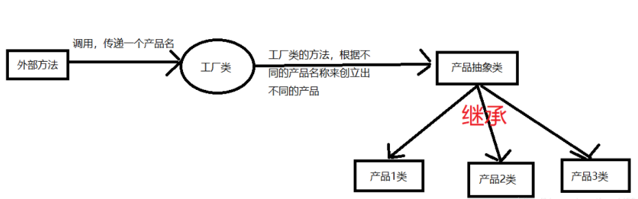
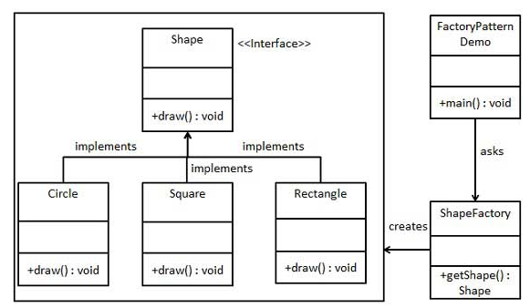

<!-- START doctoc generated TOC please keep comment here to allow auto update -->
<!-- DON'T EDIT THIS SECTION, INSTEAD RE-RUN doctoc TO UPDATE -->
**Table of Contents**  *generated with [DocToc](https://github.com/thlorenz/doctoc)*

- [静态工厂模式](#%E9%9D%99%E6%80%81%E5%B7%A5%E5%8E%82%E6%A8%A1%E5%BC%8F)
  - [优点(简单)](#%E4%BC%98%E7%82%B9%E7%AE%80%E5%8D%95)
  - [缺点(过多容易臃肿)](#%E7%BC%BA%E7%82%B9%E8%BF%87%E5%A4%9A%E5%AE%B9%E6%98%93%E8%87%83%E8%82%BF)
  - [使用场景：](#%E4%BD%BF%E7%94%A8%E5%9C%BA%E6%99%AF)
  - [案例](#%E6%A1%88%E4%BE%8B)

<!-- END doctoc generated TOC please keep comment here to allow auto update -->

# 静态工厂模式

简单工厂模式: 专门定义一个类来负责创建其他类的实例，被创建的实例通常都具有共同的父类.

意图：定义一个创建对象的接口，让其子类自己决定实例化哪一个工厂类，工厂模式使其创建过程延迟到子类进行。

主要解决：主要解决接口选择的问题。

何时使用：我们明确地计划不同条件下创建不同实例时。

如何解决：让其子类实现工厂接口，返回的也是一个抽象的产品。

关键代码：创建过程在其子类执行。

应用实例： 1、您需要一辆汽车，可以直接从工厂里面提货，而不用去管这辆汽车是怎么做出来的，以及这个汽车里面的具体实现。 2、Hibernate 换数据库只需换方言和驱动就可以。

## 优点(简单)
1. 一个调用者想创建一个对象，只要知道其名称就可以了。
2. 扩展性高，如果想增加一个产品，只要扩展一个工厂类就可以。 
3. 屏蔽产品的具体实现，调用者只关心产品的接口。

## 缺点(过多容易臃肿)
每次增加一个产品时，都需要增加一个具体类和对象实现工厂，使得系统中类的个数成倍增加，在一定程度上增加了系统的复杂度，同时也增加了系统具体类的依赖。

## 使用场景：
1. 日志记录器：记录可能记录到本地硬盘、系统事件、远程服务器等，用户可以选择记录日志到什么地方。 
2. 数据库访问，当用户不知道最后系统采用哪一类数据库，以及数据库可能有变化时。 
3. 设计一个连接服务器的框架，需要三个协议，"POP3"、"IMAP"、"HTTP"，可以把这三个作为产品类，共同实现一个接口。

注意事项：作为一种创建类模式，在任何需要生成复杂对象的地方，都可以使用工厂方法模式。有一点需要注意的地方就是复杂对象适合使用工厂模式，而简单对象，特别是只需要通过 new 就可以完成创建的对象，无需使用工厂模式。如果使用工厂模式，就需要引入一个工厂类，会增加系统的复杂度

## [案例](chapter09_design_pattern/01_construction/01_factory/01_StaticFactoryMethod/main_test.go)

go 语言没有构造函数一说，所以一般会定义NewXXX函数来初始化相关类。
NewXXX 函数返回接口时就是简单工厂模式，也就是说Golang的一般推荐做法就是简单工厂。
