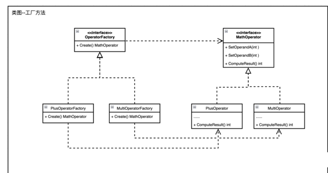

<!-- START doctoc generated TOC please keep comment here to allow auto update -->
<!-- DON'T EDIT THIS SECTION, INSTEAD RE-RUN doctoc TO UPDATE -->
**Table of Contents**  *generated with [DocToc](https://github.com/thlorenz/doctoc)*

- [工厂方法模式](#%E5%B7%A5%E5%8E%82%E6%96%B9%E6%B3%95%E6%A8%A1%E5%BC%8F)
  - [案例](#%E6%A1%88%E4%BE%8B)
  - [源码参考：k8s](#%E6%BA%90%E7%A0%81%E5%8F%82%E8%80%83k8s)
  - [优点](#%E4%BC%98%E7%82%B9)
  - [缺点](#%E7%BC%BA%E7%82%B9)

<!-- END doctoc generated TOC please keep comment here to allow auto update -->


# 工厂方法模式

工厂方法模式（Factory Method Pattern）又叫作多态性工厂模式，指的是定义一个创建对象的接口，但由实现这个接口的工厂类来决定实例化哪个产品类，工厂方法把类的实例化推迟到子类中进行。

在工厂方法模式中，不再由单一的工厂类生产产品，而是由工厂类的子类实现具体产品的创建。因此，当增加一个产品时，只需增加一个相应的工厂类的子类, 以解决简单工厂生产太多产品时导致其内部代码臃肿（switch … case分支过多）的问题。


Go中 不存在继承 所以使用匿名组合来实现。


## [案例](chapter09_design_pattern/01_construction/01_factory/02_factory_mode/factorymethod_test.go)



## 源码参考：k8s
```go
// k8s.io/kubectl/pkg/cmd/util/factory.go

type Factory interface {
	genericclioptions.RESTClientGetter
	DynamicClient() (dynamic.Interface, error)
	KubernetesClientSet() (*kubernetes.Clientset, error)
	RESTClient() (*restclient.RESTClient, error)
	NewBuilder() *resource.Builder
	ClientForMapping(mapping *meta.RESTMapping) (resource.RESTClient, error)
	UnstructuredClientForMapping(mapping *meta.RESTMapping) (resource.RESTClient, error)
	Validator(validate bool) (validation.Schema, error)
	OpenAPISchema() (openapi.Resources, error)
}

```

```go
// pkg/kubectl/cmd/cmd.go 生成工厂--->f := cmdutil.NewFactory(matchVersionKubeConfigFlags)
func NewFactory(clientGetter genericclioptions.RESTClientGetter) Factory {
	f := &factoryImpl{
		clientGetter: clientGetter,
	}
	return f
}

```

## 优点 
- 灵活性增强，对于新产品的创建，只需多写一个相应的工厂类。
- 典型的解耦框架。高层模块只需要知道产品的抽象类，无须关心其他实现类，满足迪米特法则、依赖倒置原则和里氏替换原则

## 缺点

- 类的个数容易过多，增加复杂度。
- 增加了系统的抽象性和理解难度。
- 只能生产一种产品，此弊端可使用抽象工厂模式解决。