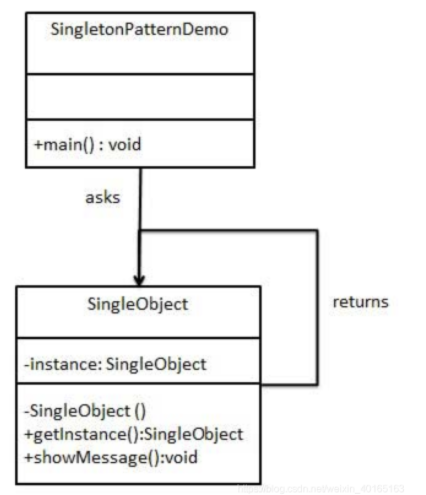

# 单例模式
在程序的运行中只产生一个实例。

## 意图
保证一个类仅有一个实例，并提供一个访问它的全局访问点。

## 主要解决
一个全局使用的类频繁地创建与销毁。

## 何时使用
当您想控制实例数目，节省系统资源的时候。

## 如何解决

判断系统是否已经有这个单例，如果有则返回，如果没有则创建。

### 关键代码：构造函数是私有的。

## 使用场景
1. 要求生产唯一序列号。
2. WEB 中的计数器，不用每次刷新都在数据库里加一次，用单例先缓存起来。
3. 创建的一个对象需要消耗的资源过多，比如 I/O 与数据库的连接等

## 优点
在内存里只有一个实例，减少了内存的开销，尤其是频繁的创建和销毁实例（比如管理学院首页页面缓存）。
避免对资源的多重占用（比如写文件操作）。

## 缺点：
没有接口，不能继承，与单一职责原则冲突，一个类应该只关心内部逻辑，而不关心外面怎么样来实例化。

## 分类：
有懒汉式和饿汉式


## 标准库实现
结构体定义
```go
//strings/replace.go
type Replacer struct {
    once   sync.Once // 控制 r replacer 替换算法初始化
    r      replacer
    oldnew []string
}
```
```go

//线程安全且支持规则复用
func NewReplacer(oldnew ...string) *Replacer {
        //****
    return &Replacer{oldnew: append([]string(nil), oldnew...)} //没有创建算法
}
//当我们使用 strings.NewReplacer 创建 strings.Replacer 时，这里采用惰性算法，并没有在这时进行 build 解析替换规则并创建对应算法实例，
func (r *Replacer) Replace(s string) string {
    r.once.Do(r.buildOnce) //初始化
    return r.r.Replace(s)
}

func (r *Replacer) WriteString(w io.Writer, s string) (n int, err error) {
    r.once.Do(r.buildOnce) //初始化
    return r.r.WriteString(w, s)
}
//而是在执行替换时( Replacer.Replace 和 Replacer.WriteString)进行的
//初始化算法
func (r *Replacer) buildOnce() {
    r.r = r.build()
    r.oldnew = nil
}

func (b *Replacer) build() replacer {
    //....
}

```


