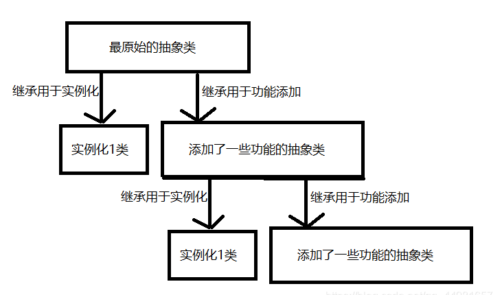
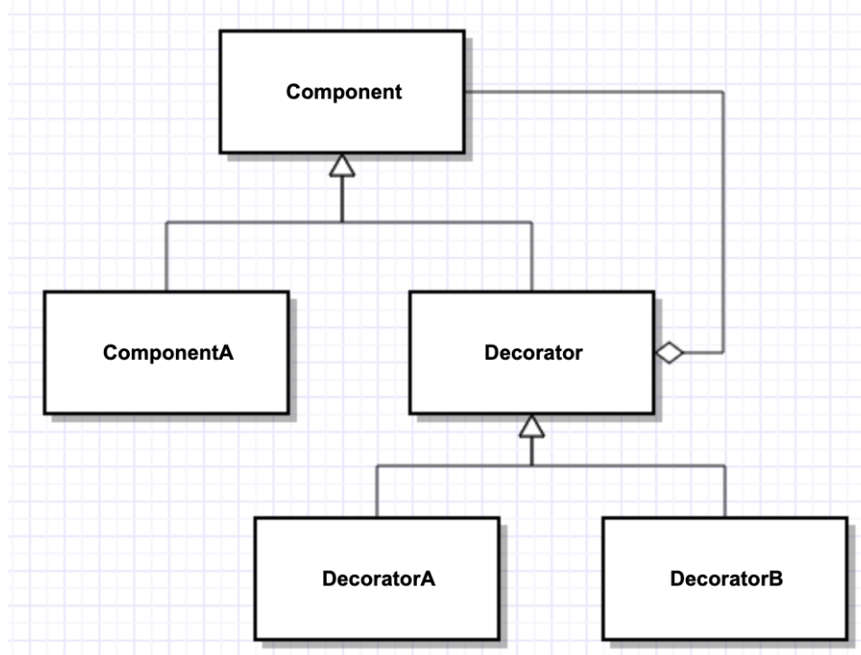
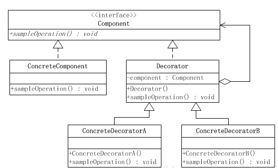
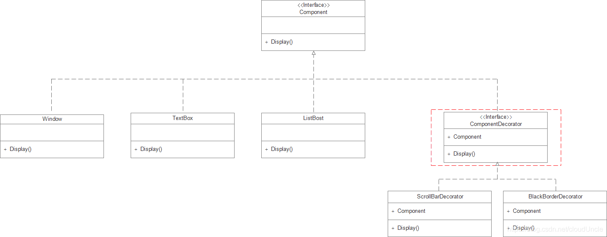

#装饰模式：
一种动态地往一个类中添加新的行为的设计模式.




从上图中得知主要包含四个角色，抽象构件 Component，具体构件 ConcreteComponent，抽象装饰类 Decorator，具体装饰类 ConcreteComponent

优点：
1. 可以通过一种动态的方式来扩展一个对象的功能
2. 可以使用多个具体装饰类来装饰同一对象，增加其功能
3. 具体组件类与具体装饰类可以独立变化，符合“开闭原则”

缺点：
1. 对于多次装饰的对象，易于出错，排错也很困难
2. 对于产生很多具体装饰类 ，增加系统的复杂度以及理解成本

##使用场景：
1.需要给一个对象增加功能，这些功能可以动态地撤销，例如：在不影响其他对象的情况下，动态、透明的方式给单个对象添加职责，处理那些可以撤销的职责
2.需要给一批兄弟类增加或者改装功能

##举例


1. Component(抽象构建)：具体构建和抽象装饰类的基类，声明了在具体构建中实现的业务方法，UML类图中的Component
2. ConcreteComponent(具体构建)：抽象构建的子类，用于定义具体的构建对象，实现了在抽象构建中声明的方法，装饰器可以给它增加额外的职责(方法)，UML类图中的Window、TextBox、ListBox
3. Decorator(抽象装饰类)：也是抽象构建类的子类，用于给具体构建增加职责，但是具体职责在其子类中实现，UML类图中的ComponentDecorator
4. ConcreteDecorator(具体装饰类)：抽象装饰类的子类，负责向构建添加新的职责，UML类图中的ScrollBarDecorator、BlackBorderDecorator


##装饰器在第三方应用->Grpc源码分析
google.golang.org/grpc@v1.39.0/clientconn.go调用newCCResolverWrapper
gRPC的ClientConn通过调用ccResolverWrapper来进行域名解析，而具体的解析过程则由开发者自己决定。在解析完毕后，将解析的结果返回给ccResolverWrapper

Resolver称为解析器
gRPC提供的是插件式的Resolver功能，他会根据用户传入的aaa:///bbb-project/ccc-srv，选择一个能够解析aaa的Resolver，并进行解析，得到ip:port列表

分析：

    首先创建一个resolver接口，并设计一些具体的resolver实现类
```go
// Builder creates a resolver that will be used to watch name resolution updates.
type Builder interface {
	// Build creates a new resolver for the given target.
	//
	// gRPC dial calls Build synchronously, and fails if the returned error is
	// not nil.
	Build(target Target, cc ClientConn, opts BuildOptions) (Resolver, error)
	// Scheme returns the scheme supported by this resolver.
	// Scheme is defined at https://github.com/grpc/grpc/blob/master/doc/naming.md.
	Scheme() string
}

```
创建解析器
```go
// ccResolverWrapper is a wrapper on top of cc for resolvers.
// It implements resolver.ClientConn interface.
type ccResolverWrapper struct {
    cc         *ClientConn
    resolverMu sync.Mutex
    resolver   resolver.Resolver
    done       *grpcsync.Event
    curState   resolver.State

    incomingMu sync.Mutex // Synchronizes all the incoming calls.
}
func (ccr *ccResolverWrapper) resolveNow(o resolver.ResolveNowOptions) {
    ccr.resolverMu.Lock()
    if !ccr.done.HasFired() {
        ccr.resolver.ResolveNow(o)
    }
    ccr.resolverMu.Unlock()
}

//这是一个resolver的包装器，里面包含了真正的resolver。
//当我们的gRPC需要调用ResolverNow方法的时候，他只需要调用resolverWrapper中的Resolve()方法，在这个方法中来调用真正的resoleNow()逻辑
func newCCResolverWrapper(cc *ClientConn, rb resolver.Builder) (*ccResolverWrapper, error) {
    ccr := &ccResolverWrapper{
        cc:   cc,
        done: grpcsync.NewEvent(),
    }

  // 根据传入的Builder，创建resolver，并放入wrapper中
  ccr.resolver, err = rb.Build(cc.parsedTarget, ccr, rbo)
    return ccr, nil
}
```

```go
//可以使用dns,passthrough,unix,默认使用passthrough解析器
func (*passthroughBuilder) Build(target resolver.Target, cc resolver.ClientConn, opts resolver.BuildOptions) (resolver.Resolver, error) {
    r := &passthroughResolver{
        target: target,
        cc:     cc,
    }
  // 创建Resolver的时候，进行第一次的解析
    r.start()
    return r, nil
}

// 对于passthroughResolver来说，正如他的名字，直接将参数作为结果返回
func (r *passthroughResolver) start() {
    r.cc.UpdateState(resolver.State{Addresses: []resolver.Address{{Addr: r.target.Endpoint}}})
}
func (*passthroughBuilder) Scheme() string {
    return scheme
}

func init() {
    resolver.Register(&passthroughBuilder{})
}
```

总结：

    ResolverWrapper会将这个请求交给真正的Resolver，由真正的Resolver来处理域名解析。
    解析完毕后，Resolver会将结果保存在ResolverWrapper中，ResolverWrapper再将这个结果返回给ClientConn


