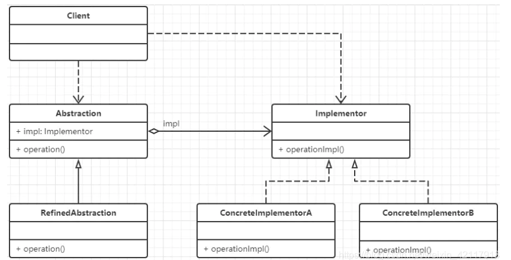
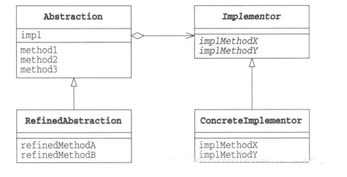
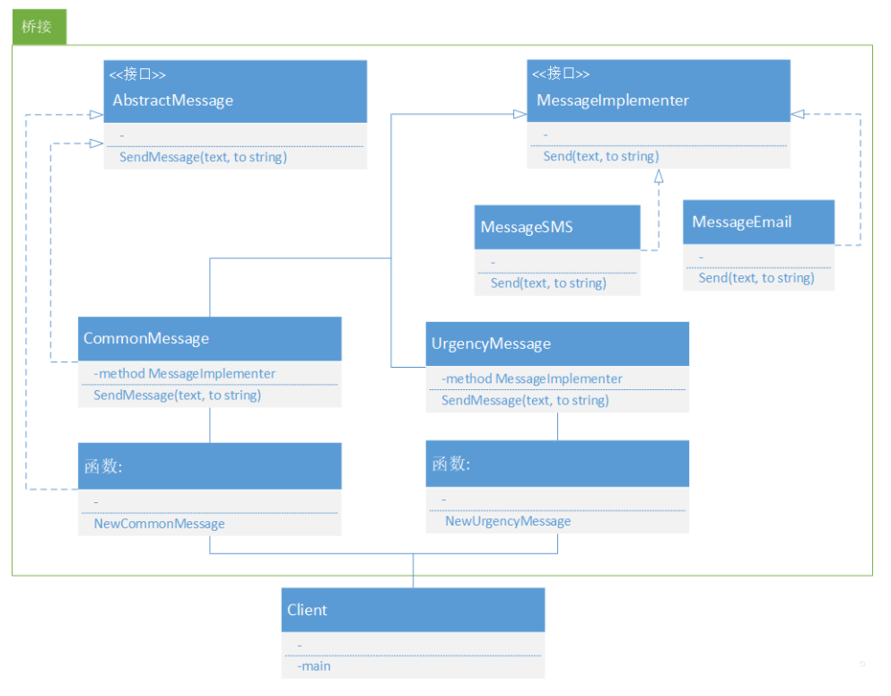

# 桥接模式：
    将事务的多个纬度都抽象出来以解耦抽象与实际之间的绑定关系，使抽象和实际向着不同纬度改变

## 生活场景

1. 在现实生活中，我们画画的时候常常会用到两种或多种类型的笔，比如毛笔和蜡笔。假设我们需要大、中、小三种类型的画笔来绘制12种不同的颜色，
   - 如果我们使用蜡笔，那么我们需要准备3*12=36支蜡笔；
   - 但是如果我们使用毛笔的话，只需要3种型号的毛笔，外加12个颜料盒即可，涉及的对象个数仅为3+12=15。
   - 如果新增一种画笔，并且同样需要12种颜色，那么蜡笔需要增加12支，而毛笔却只需要新增1支。

我们来分析一下以上场景：
   - 在蜡笔中，颜色和型号两个不同的变化维度耦合在一起，导致无论对任何一个维度进行扩展，都势必会影响另外一个维度
   - 在毛笔中，颜色和型号实现了分离，增加新的颜色或者型号都对另外一个维度没有任何影响

2. 操作系统(linux,windows)和应用程序(qq.wechat,kugou)

## 四个概念

- Abstraction（抽象类）：用于定义抽象类的接口，它一般是抽象类而不是接口，其中定义了一个Implementor（实现类接口）类型的对象并可以维护该对象，
    它与Implementor之间具有关联关系，它既可以包含抽象业务方法，也可以包含具体业务方法。
    
- RefinedAbstraction（扩充抽象类）：扩充由Abstraction定义的接口，通常情况下它不再是抽象类而是具体类，它实现了在Abstraction中声明的抽象业务方法，
    在RefinedAbstraction中可以调用在Implementor中定义的业务方法。
    
- Implementor（实现类接口）：定义实现类的接口，这个接口不一定要与Abstraction的接口完全一致，事实上这两个接口可以完全不同，
    一般而言，Implementor接口仅提供基本操作，而Abstraction定义的接口可能会做更多更复杂的操作。Implementor接口对这些基本操作进行了声明，而具体实现交给其子类。
    通过关联关系，在Abstraction中不仅拥有自己的方法，还可以调用到Implementor中定义的方法，使用关联关系来替代继承关系。
    
- ConcreteImplementor（具体实现类）：具体实现Implementor接口，在不同的ConcreteImplementor中提供基本操作的不同实现，
    在程序运行时，ConcreteImplementor对象将替换其父类对象，提供给抽象类具体的业务操作方法

意图：
    
    将抽象部分与实现部分分离，使他们都可以独立的变化。

主要解决：
    
    在有多种可能会变化的情况下，用继承会造成类爆炸问题，扩展起来不灵活。

何时使用：

    实现系统可能有多个角度分类，每一种角度都可能变化。

如何解决：
    
    把这种多角度分类分离出来，让他们独立变化，减少他们之间的耦合。

关键代码：
    
    抽象类依赖实现类。

优点：
    
    抽象和实现的分离、优秀的扩展能力、实现细节与客户透明

缺点：
    
    桥接模式的引用会增加系统的理解与设计难度，由于聚合关联关系建立在抽象层，要求开发者针对抽象进行设计与编程。

使用场景：

    对于两个独立变化的纬度，使用桥接模式在适合不过了。
## 做法

在使用桥接模式时，首先应该识别出一个类所具有的两个独立变化的维度，将它们设计为两个独立的继承等级结构，为两个维度都提供抽象层，并建立抽象耦合。
通常情况下，将具有两个独立变化维度的类的一些普通业务方法和与之关系最密切的维度设计为“抽象类”层次结构（抽象部分），而将另一个维度设计为“实现类”层次结构（实现部分）

### 案例

一.定义Implementor实现类接口及具体实现类

    消息：紧急消息和普通消息

二. 定义Abstraction抽象类及RefinedAbstraction扩充抽象类
    
    发送方式：email邮件和sms短信

三. 定义工厂方法生产具体的消息