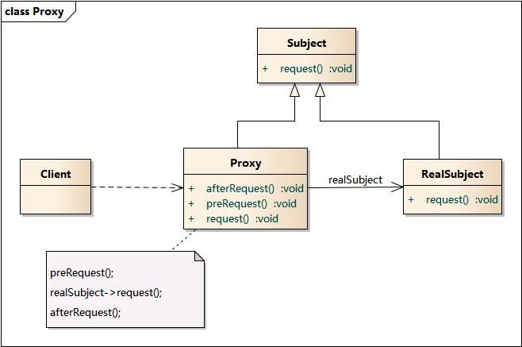

#代理模式

    代理模式（Proxy Pattern）指为其他对象提供一种代理，以控制对这个对象的访问

##生活场景
    比如你喜欢一个妹子， 不好意思跟人家开口， 这时候你可能就通过她舍友来表达你的爱慕了

##三个角色

    Client 就是上面那个段子中的你， 你是行为的主导者。
    Subject 是代理人和被代理的抽象接口
    RealSubject 被代理的对象， 也就是上面的妹子
    Proxy 代理者， 对应上面的妹子室友
