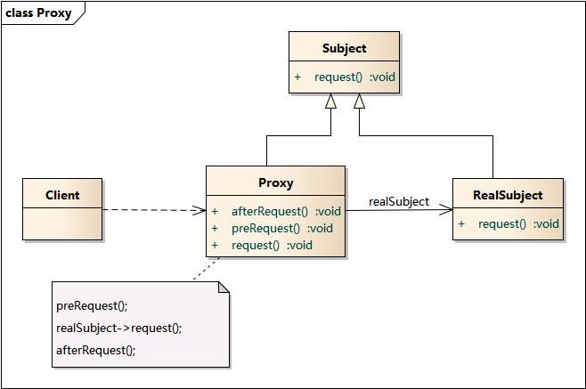

<!-- START doctoc generated TOC please keep comment here to allow auto update -->
<!-- DON'T EDIT THIS SECTION, INSTEAD RE-RUN doctoc TO UPDATE -->
**Table of Contents**  *generated with [DocToc](https://github.com/thlorenz/doctoc)*

- [代理模式](#%E4%BB%A3%E7%90%86%E6%A8%A1%E5%BC%8F)
  - [场景](#%E5%9C%BA%E6%99%AF)
  - [优点](#%E4%BC%98%E7%82%B9)
  - [缺点](#%E7%BC%BA%E7%82%B9)
  - [三个角色](#%E4%B8%89%E4%B8%AA%E8%A7%92%E8%89%B2)
  - [代码案例](#%E4%BB%A3%E7%A0%81%E6%A1%88%E4%BE%8B)

<!-- END doctoc generated TOC please keep comment here to allow auto update -->

# 代理模式

代理模式（Proxy Pattern）指为其他对象提供一种代理，以控制对这个对象的访问。

比如你喜欢一个妹子， 不好意思跟人家开口， 这时候你可能就通过她舍友来表达你的爱慕了

## 场景
1. 远程代理。
2. 虚拟代理。
3. Copy-on-Write 代理。
4. 保护（Protect or Access）代理。
5. Cache代理。
6. 防火墙（Firewall）代理。
7. 同步化（Synchronization）代理。
8. 智能引用（Smart Reference）代理。

## 优点
- 代理模式为其他对象提供一种代理以控制对一个对象的访问。是一种对象结构型模式。
- 职责清晰。
- 高扩展性。
- 智能化。

## 缺点
- 由于在客户端和真实主题之间增加了代理对象，因此有些类型的代理模式可能会造成请求的处理速度变慢。
- 实现代理模式需要额外的工作，有些代理模式的实现非常复杂
- 
## 三个角色

- Client 就是上面那个段子中的你， 你是行为的主导者。
- Subject 是代理人和被代理的抽象接口
- RealSubject 被代理的对象， 也就是上面的妹子
- Proxy 代理者， 对应上面的妹子室友

## 代码案例
Nginx 这样的 Web 服务器可充当应用程序服务器的代理：

- 提供了对应用程序服务器的受控访问权限。
- 可限制速度。
- 可缓存请求。
