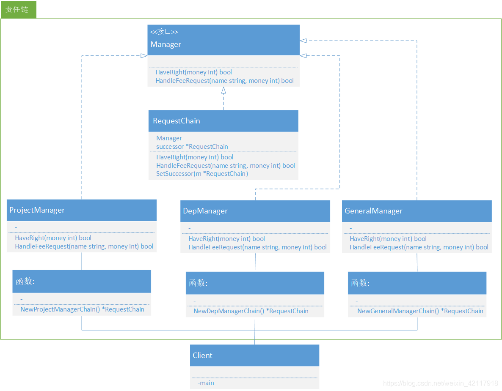
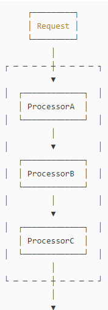
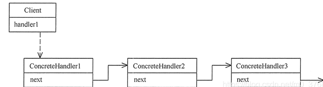

<!-- START doctoc generated TOC please keep comment here to allow auto update -->
<!-- DON'T EDIT THIS SECTION, INSTEAD RE-RUN doctoc TO UPDATE -->
**Table of Contents**  *generated with [DocToc](https://github.com/thlorenz/doctoc)*

- [责任链模式](#%E8%B4%A3%E4%BB%BB%E9%93%BE%E6%A8%A1%E5%BC%8F)
  - [意图：避免请求发送者与接受者耦合在一起，让多个对象都有可能接收请求，将这些对象连接成一条链，并且沿着这条链传递请求，直到有对象处理它为止。](#%E6%84%8F%E5%9B%BE%E9%81%BF%E5%85%8D%E8%AF%B7%E6%B1%82%E5%8F%91%E9%80%81%E8%80%85%E4%B8%8E%E6%8E%A5%E5%8F%97%E8%80%85%E8%80%A6%E5%90%88%E5%9C%A8%E4%B8%80%E8%B5%B7%E8%AE%A9%E5%A4%9A%E4%B8%AA%E5%AF%B9%E8%B1%A1%E9%83%BD%E6%9C%89%E5%8F%AF%E8%83%BD%E6%8E%A5%E6%94%B6%E8%AF%B7%E6%B1%82%E5%B0%86%E8%BF%99%E4%BA%9B%E5%AF%B9%E8%B1%A1%E8%BF%9E%E6%8E%A5%E6%88%90%E4%B8%80%E6%9D%A1%E9%93%BE%E5%B9%B6%E4%B8%94%E6%B2%BF%E7%9D%80%E8%BF%99%E6%9D%A1%E9%93%BE%E4%BC%A0%E9%80%92%E8%AF%B7%E6%B1%82%E7%9B%B4%E5%88%B0%E6%9C%89%E5%AF%B9%E8%B1%A1%E5%A4%84%E7%90%86%E5%AE%83%E4%B8%BA%E6%AD%A2)
  - [主要解决：职责链上的处理者负责处理请求，客户只需要将请求发送到职责链上即可，无须关心请求的处理细节和请求的传递，所以职责链将请求的发送者和请求的处理者解偶了。](#%E4%B8%BB%E8%A6%81%E8%A7%A3%E5%86%B3%E8%81%8C%E8%B4%A3%E9%93%BE%E4%B8%8A%E7%9A%84%E5%A4%84%E7%90%86%E8%80%85%E8%B4%9F%E8%B4%A3%E5%A4%84%E7%90%86%E8%AF%B7%E6%B1%82%E5%AE%A2%E6%88%B7%E5%8F%AA%E9%9C%80%E8%A6%81%E5%B0%86%E8%AF%B7%E6%B1%82%E5%8F%91%E9%80%81%E5%88%B0%E8%81%8C%E8%B4%A3%E9%93%BE%E4%B8%8A%E5%8D%B3%E5%8F%AF%E6%97%A0%E9%A1%BB%E5%85%B3%E5%BF%83%E8%AF%B7%E6%B1%82%E7%9A%84%E5%A4%84%E7%90%86%E7%BB%86%E8%8A%82%E5%92%8C%E8%AF%B7%E6%B1%82%E7%9A%84%E4%BC%A0%E9%80%92%E6%89%80%E4%BB%A5%E8%81%8C%E8%B4%A3%E9%93%BE%E5%B0%86%E8%AF%B7%E6%B1%82%E7%9A%84%E5%8F%91%E9%80%81%E8%80%85%E5%92%8C%E8%AF%B7%E6%B1%82%E7%9A%84%E5%A4%84%E7%90%86%E8%80%85%E8%A7%A3%E5%81%B6%E4%BA%86)
  - [何时使用：在处理消息的时候以过滤很多道。](#%E4%BD%95%E6%97%B6%E4%BD%BF%E7%94%A8%E5%9C%A8%E5%A4%84%E7%90%86%E6%B6%88%E6%81%AF%E7%9A%84%E6%97%B6%E5%80%99%E4%BB%A5%E8%BF%87%E6%BB%A4%E5%BE%88%E5%A4%9A%E9%81%93)
  - [如何解决：拦截的类都实现统一接口。](#%E5%A6%82%E4%BD%95%E8%A7%A3%E5%86%B3%E6%8B%A6%E6%88%AA%E7%9A%84%E7%B1%BB%E9%83%BD%E5%AE%9E%E7%8E%B0%E7%BB%9F%E4%B8%80%E6%8E%A5%E5%8F%A3)
  - [优点：](#%E4%BC%98%E7%82%B9)
  - [缺点：](#%E7%BC%BA%E7%82%B9)
  - [使用场景：](#%E4%BD%BF%E7%94%A8%E5%9C%BA%E6%99%AF)
  - [应用实例](#%E5%BA%94%E7%94%A8%E5%AE%9E%E4%BE%8B)

<!-- END doctoc generated TOC please keep comment here to allow auto update -->

# 责任链模式

一种处理请求的模式，它让多个处理器都有机会处理该请求，直到其中某个处理成功为止。责任链模式把多个处理器串成链，然后让请求在链上传递

## 意图：避免请求发送者与接受者耦合在一起，让多个对象都有可能接收请求，将这些对象连接成一条链，并且沿着这条链传递请求，直到有对象处理它为止。

## 主要解决：职责链上的处理者负责处理请求，客户只需要将请求发送到职责链上即可，无须关心请求的处理细节和请求的传递，所以职责链将请求的发送者和请求的处理者解偶了。

## 何时使用：在处理消息的时候以过滤很多道。

## 如何解决：拦截的类都实现统一接口。

## 优点：

1. 降低耦合度。它将请求的发送者和接收者解耦。
2. 简化了对象。使得对象不需要知道链的结构。
3. 增强给对象指派职责的灵活性。通过改变链内的成员或者调动它们的次序，允许动态地新增或者删除责任。
4. 增加新的请求处理类很方便。
5. 
## 缺点：

1. 不能保证请求一定被接收。
2. 系统性能将受到一定影响，而且在进行代码调试时不太方便，可能会造成循环调用。
3. 可能不容易观察运行时的特征，有碍于除错。

## 使用场景：

1. 有多个对象可以处理同一个请求，具体哪个对象处理该请求由运行时刻自动确定。
2. 在不明确指定接受者的情况下，向多个对象中的一个提交请求。
3. 可动态指定一组对象处理请求。

## 应用实例
1. 红楼梦中的"击鼓传花"。 
2. JS 中的事件冒泡。 
3. JAVA WEB 中 Apache Tomcat 对 Encoding 的处理，Struts2 的拦截器，jsp servlet 的 Filter。

