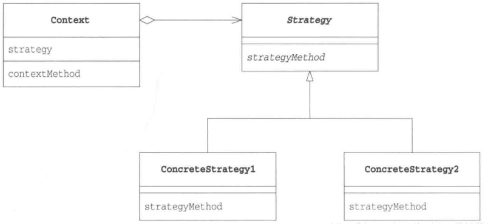

<!-- START doctoc generated TOC please keep comment here to allow auto update -->
<!-- DON'T EDIT THIS SECTION, INSTEAD RE-RUN doctoc TO UPDATE -->
**Table of Contents**  *generated with [DocToc](https://github.com/thlorenz/doctoc)*

- [策略模式（Strategy Pattern）,又叫作政策模式（Policy Pattern）](#%E7%AD%96%E7%95%A5%E6%A8%A1%E5%BC%8Fstrategy-pattern%E5%8F%88%E5%8F%AB%E4%BD%9C%E6%94%BF%E7%AD%96%E6%A8%A1%E5%BC%8Fpolicy-pattern)
  - [场景](#%E5%9C%BA%E6%99%AF)

<!-- END doctoc generated TOC please keep comment here to allow auto update -->

# 策略模式（Strategy Pattern）,又叫作政策模式（Policy Pattern）

> Define a family of algorithms, encapsulate each one, and make them interchangeable. Strategy lets the algorithm vary independently from clients that use it.

翻译成中文就是：定义一族算法类，将每个算法分别封装起来，让它们可以互相替换。策略模式可以使算法的变化独立于使用它们的客户端（这里的客户端代指使用算法的代码）。

## 场景

在我们写的程序中，大多有if else的条件语句基本上都适合Strategy 模式，但是if else 条件的情况是不变的，则不适合此模式，例如一周7天。